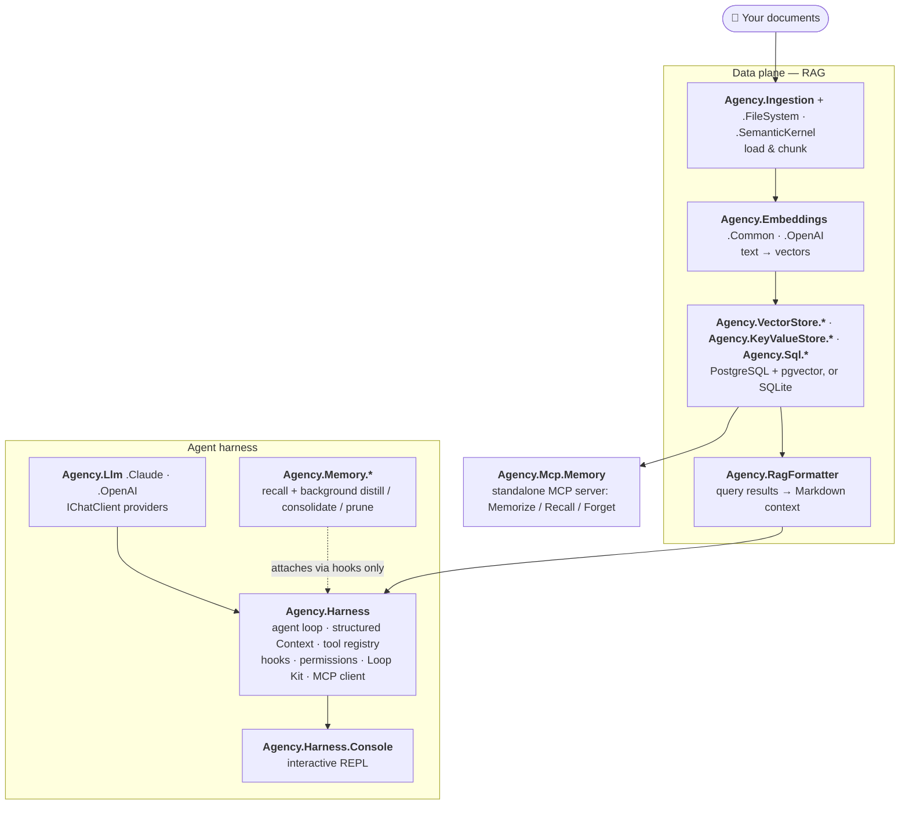

# Agency

**Build AI agents in C# that remember, finish the job, and stay observable — not amnesiac chatbots that stop the moment they *feel* done.**

[](https://github.com/emreaydinceren/Agency.NET/actions/workflows/ci.yaml)
[](https://codecov.io/gh/emreaydinceren/Agency.NET)
[](https://www.nuget.org/packages/AgencyDotNet.Harness)
[](https://www.nuget.org/packages/AgencyDotNet.Harness)
[](LICENSE)
[](https://dotnet.microsoft.com/)
[](https://emreaydinceren.github.io/Agency.NET/)

Agency is the **C#-native answer to the Python-first agent frameworks** (LangChain, LlamaIndex, AutoGen): a layered toolkit for **RAG pipelines and autonomous agents** on .NET 10 — no Python sidecar, no control flow buried under five layers of magic. The mental model is one line: **`AGENT = LLM + HARNESS`**. The LLM does the thinking; the harness — prompting, tools, memory, permissions, and the *"is it actually done?"* check — is everything else, and it's what Agency gives you.

> **Status:** Pre-1.0, under active development. Interfaces are stabilizing but may still shift between minor versions — pin package versions if you depend on this.

---

## ⚡ Try it in 60 seconds

**One command. No Docker, no database, no cloud account.** Point Agency at any OpenAI-compatible model — a local [LM Studio](https://lmstudio.ai/) or [Ollama](https://ollama.com/) (no API key needed), or a cloud endpoint — and you're chatting with a real, tool-using agent:

```powershell
git clone https://github.com/emreaydinceren/Agency.NET
cd Agency.NET/src
.\RunConsole.ps1
```

That's the whole setup. 🤖 `RunConsole.ps1` is a friendly guide: it asks three quick questions — *where your model lives, which model, and an API key if you need one* — then builds the console and drops you straight into the REPL. Just press **Enter** to take the smart defaults; it even **auto-detects** a local LM Studio or Ollama already running on your machine.

> 💡 **All you need is the [.NET 10 SDK](https://dotnet.microsoft.com/download) and an LLM endpoint.** Want the agent to reach GitHub too? The script can wire up the official GitHub MCP server when you have Docker and a token — completely optional, and the console runs great without it.

---

## 📦 Or drop it into your own app

```bash
dotnet add package AgencyDotNet.Harness
dotnet add package AgencyDotNet.Llm.Claude   # or AgencyDotNet.Llm.OpenAI — also covers LM Studio & Ollama
```

```csharp
IChatClient chat = new ClaudeClient(new LlmClientOptions { ClientType = "Claude", ApiKey = apiKey }).CreateChatClient();
var tools = new ToolContext { Registry = new ToolRegistry([new ReadFileTool(), new ExecutePowershellTool()]) };
var agent = new Agent(chat, model: "claude-sonnet-4-5", clientType: "Claude");

Context ctx = Agent.CreateContext("List the .cs files under ./src", tools);
await foreach (AgentEvent ev in agent.ChatAsync("List the .cs files under ./src", ctx))
{
    if (ev is ToolInvokedEvent t) Console.WriteLine($"[tool] {t.ToolName}");
    if (ev is AgentResultEvent r) Console.WriteLine($"{r.Status}: {r.FinalText}");
}
```

```text
[tool] execute_powershell
Success: Agent.cs, ChatSession.cs, LoopRunner.cs, SystemPromptBuilder.cs, …
```

That's the whole loop: the model thinks, calls a real tool, observes the result, and answers — streamed to you as typed `AgentEvent`s. Full `using` directives, multi-turn `ChatSession`, retrieval grounding, hooks, and MCP wiring are in the [Quick start](#quick-start) below.

## What makes Agency different

Most frameworks give you a loop and a tool registry. Agency is about the 80% that decides whether you can leave an agent running unattended:

- 🛡️ **"Done" means verifiably done** — an independent **Goalkeeper** model checks the transcript against your plain-language goal after every turn, under a hard code-enforced turn/cost/token ceiling. Not "the model went quiet." ([deep dive](docs/Loop%20Kit%20-%20Driving%20an%20Agent%20Until%20the%20Job%20Is%20Actually%20Done.md))
- 🧠 **Memory that compounds** — crash-safe, user-partitioned CoALA memory attached purely via hooks: recall is near-free on the hot path; distillation and consolidation run in the background. ([deep dive](docs/How%20Agency%20Gives%20AI%20Agents%20Memory.md))
- 🔎 **Semantic search that knows its place** — you curate the documents; the model gets exactly one read-only, scope-locked `semantic_search` tool over them. ([deep dive](docs/Projects%20-%20Ingestion%20and%20Semantic%20Search%20for%20Agent.md))
- ⚙️ Plus: an allow/deny/rewrite **permission gate** at the tool boundary, **OpenTelemetry on every layer**, **MCP in both directions**, and deterministic tests (`TimeProvider` injected everywhere).

> 📚 **Docs:** the [published documentation site](https://emreaydinceren.github.io/Agency.NET/) has a searchable API reference generated from the XML doc comments, plus every deep dive below — or browse in-repo starting at the [documentation portal](docs/Home.md) · trace one full agent turn in the interactive [Code Walkthrough](docs/walkthrough/code-walkthrough.html) (open it locally, or [on the site](https://emreaydinceren.github.io/Agency.NET/docs/walkthrough/code-walkthrough.html) — GitHub only shows the source) · new to agents? read the [Console User Manual](docs/Agent%20Console%20User%20Manual.md).

---

## Why Agency

AI agents are easy to demo and hard to ship. The 20% that wins a hackathon is the model; the 80% that decides whether a deployed agent is trustworthy is the *harness* around it — and that 80% is what Agency is about. Treat this repository as a worked study in building that harness well: each subsystem is a deliberate answer to a real production problem, and the [deep-dive docs](docs/Home.md) explain every decision in two passes — a plain-English tour and an implementation walkthrough with `file:line` references and the alternatives that were rejected.

**The hard problems, and the deliberate answer to each:**

| The problem you actually hit in production | The design decision |
| --- | --- |
| A model grades its own work generously and declares victory while the build is still red. | "Done" is decided by an **independent Goalkeeper** running in code the worker can't reach or skip — never by the model simply falling silent. |
| "Keep going until done" becomes an infinite loop or a runaway bill. | A **hard, code-enforced ceiling** (turn count + USD + token budgets) the model cannot argue past. *Soft where it reasons, hard where it gates.* |
| Adding memory makes every turn slow because the agent re-reads everything. | The **hot path is sacred**: recall is an O(1) gated check; all distillation and consolidation is pushed to a background cold path the user never waits on. |
| A crash mid-write corrupts memory or double-counts what was learned. | **Watermarked, idempotent** distillation — an interrupted job re-derives its exact turn window on restart and resumes without duplicating or skipping. |
| One user's data bleeds into another user's recall. | `UserId` is the **only hard partition**; sessions are a soft ranking signal. Cross-session reach is a feature; cross-user reach is impossible by construction. |
| A new capability means forking the core agent loop. | Every extension is a **hook**, wired by dependency inversion — `Agent.cs` holds no reference to memory, permissions, or Loop Kit, so each is opt-in with *zero* hot-path cost when off. |
| You can't tell what the agent did, what it spent, or why it stopped. | **OpenTelemetry on every layer** — SQL, embeddings, LLM calls, tool calls, and loop verdicts emit traces and metrics through named sources, with worker vs. referee spend tagged apart. |
| The tests "work on my machine" but sleep for five minutes to exercise a timeout. | Time is injected (`TimeProvider`), LLM clients are faked, and tests are categorized — the system is **deterministically testable**, idle triggers and timeouts included. |

The .NET ecosystem has a real gap. Most production-grade RAG and agent tooling lives in Python; the C# alternatives are usually thin wrappers around Python services, or abstraction-first frameworks where the actual control flow disappears under five layers of indirection.

Agency takes a different engineering stance:

- **Explicit over magical.** The agent loop is a `while` loop you can read and step through. ReAct (think → act → observe) is visible C#, not behaviour buried under attributes.
- **Hard guarantees where it counts.** Permissions are a deterministic veto at the tool boundary, not a polite request in a prompt. "Done" is decided by an independent check the model can't talk its way past, not by the model falling silent.
- **Layered, not monolithic.** Embeddings, storage, LLM providers, ingestion, memory, MCP, and the harness are each a separate package behind an interface. Take what you need; ignore the rest. Memory off? Zero hot-path overhead.
- **Production-shaped from day one.** OpenTelemetry on every operation — SQL query, embedding call, LLM request, agent turn, tool call, loop verdict. Tests categorized. Package versions centralized. No hidden globals.
- **Modern .NET.** Built on .NET 10, the official Anthropic and OpenAI SDKs, the official MCP C# SDK, and Semantic Kernel where it earns its place (semantic chunking).

If you've ever wanted a *readable* reference implementation of a memory-augmented RAG + agent stack in idiomatic C#, this is meant to be that.

---

## Three headline capabilities

The bullets from the top of the page, in full — the things that turn a demo into something you can leave running unattended.

### 🧠 Memory that compounds

A stateless LLM is *an amnesiac with a tool belt* — it starts every session from zero, burning tokens rediscovering facts it already learned. Agency closes the **memory wall** with a full read/write memory pipeline built on the **CoALA** four-pillar model (Working, Semantic, Procedural, Episodic) — and it attaches to the agent loop through *hooks*, so the loop itself never knows memory exists.

- **The hot path stays sacred.** Recall is a gated, near-zero-cost read — it only pays for a vector search when something actually changed since the last look. All the expensive work (fact distillation, episode synthesis, consolidation) happens on a **background cold path**, after the user already has their answer.
- **Capture is system-owned.** The agent has *no* "save this" tool — it can only signal timing. A background **distiller** decides what's worth remembering, distils raw turns into facts and episodes, and writes them crash-safely (watermarked, idempotent).
- **Memory stays clean, not a trash heap.** A **Consolidator** (itself a sub-agent built on the same harness) merges duplicates and reconciles contradictions in natural language; a mechanical **Hygiene Sweeper** prunes stale, low-value records on a schedule.
- **Recall is smarter than cosine similarity.** A two-stage over-fetch + re-rank blends similarity, recency, importance, and session match — so a high-importance fact from last month can correctly outrank a fresh-but-trivial one.
- **Secure by partition.** Every record is partitioned by `UserId`; one user's store is structurally invisible to another. Sessions are a *soft* ranking signal, so an agent can recall its own earlier work without leaking across users.

The result: the 10th task is easier than the first. Work creates memory; memory improves future work.

> **The design call — and the primitives behind it.** The whole subsystem is organized around one commitment: keep the expensive, judgment-heavy work out of the model's hands *and* off the latency path. Three concrete decisions implement it. **(1) Capture is system-owned** — the agent gets no "save" tool, only a timing signal; a background distiller decides what to keep, so the model can't bloat the store with self-serving recall. **(2) The hot path never blocks on memory** — writes are dropped into a per-session `Channel<DistillationJob>` drained by an event-driven background service, and the inactivity trigger uses an injected `TimeProvider.CreateTimer` so tests drive expiry with a `FakeTimeProvider` instead of really sleeping. **(3) The harness doesn't even reference memory** — `MemoryHookFactory` speaks in `Func<…>` callbacks and is wired via `IPostConfigureOptions<AgentOptions>` (so it composes *after* the host's own hooks without clobbering them); `Agency.Harness` therefore has a zero-dependency relationship to every `Agency.Memory.*` package, and a single config flag collapses the whole stack to a null-hook fast path. Crash-safety then falls out of one persisted watermark that makes re-running a distill job a no-op. ([Full reasoning →](docs/How%20Agency%20Gives%20AI%20Agents%20Memory.md))

### 🛡️ Loop Kit — "done" means *verifiably* done

*"The agent said it's done"* is the most expensive lie in agent engineering. A model grading its own homework grades generously — it will cheerfully announce success while the build is still red. Most frameworks stop on *structural* conditions (the model stopped asking for tools, or it hit a turn cap), neither of which means **the task is finished**.

**Loop Kit** takes the "are we done?" decision away from the worker and hands it to an independent referee:

- **The Goalkeeper.** After *every* turn, a separate, cheap model reads the transcript and answers one yes/no question against your plain-language goal condition (e.g. *"`dotnet build` shows 0 errors and `dotnet test` exits 0, both shown in the conversation"*). It runs in driver code the worker can't reach, reorder, or skip.
- **Self-correcting.** If the verdict is **Continue**, its reason — *"build still failing: 3 errors in Foo.cs"* — becomes the next turn's directive. The worker is told exactly what's still missing.
- **A hard ceiling you can trust unattended.** Every loop is bounded by a code-enforced `MaxTurns` (default 12) plus optional USD and token budgets. The model cannot argue its way past a counter, so "keep going until done" can't become a runaway bill.
- **Zero tax when unused.** Nothing loops unless a goal is armed. Ask *"what's the capital of France?"* and it's a single ordinary turn at zero extra cost.

The difference is *"I edited some files"* versus *"the build is green and I proved it."*

> **The design call — and why it stays small.** The load-bearing idea is one distinction: *soft* (model-driven, flexible, skippable) versus *hard* (code-driven, rigid, unskippable). Planning is soft — a bad plan costs one wasted turn. The done-check is hard — a skipped one ships broken work silently — so it lives in the driver as a literal `turn >= MaxTurns` counter the model can't reach. Three details make it trustworthy: the Goalkeeper runs on a **separate `IChatClient`** (the tests hand the worker and the judge two different fakes precisely to prove independence); an unparseable verdict **fails toward Continue**, so a misread referee costs one extra turn but never ships early; and the per-loop timeout uses an injected `TimeProvider`, so even "wait for the wall clock" is deterministically testable. Why a *separate, cheap* model at all? Because generating proof (running the build, doing the diff) is expensive and stays with the worker, while *reading* that proof is cheap — which is the only reason a check can afford to run after every single turn. The whole feature is one tool pair, one driver, and a small verdict type; `Agent.cs` is untouched. *Compose, don't fork.* ([Full reasoning →](docs/Loop%20Kit%20-%20Driving%20an%20Agent%20Until%20the%20Job%20Is%20Actually%20Done.md))

### 🔎 Semantic search that knows its place

An agent that can't read *your* files is guessing — it only knows the public internet, never your handbook, your runbooks, or the design doc you wrote this morning. Agency closes that gap with a **scoped vector store and exactly one read-only tool over it**, so the agent answers from your sources, pulls only what's relevant, and only ever sees what it's allowed to.

- **The human curates; the model only reads.** Ingestion and project membership are *host* actions, driven by REPL commands (`/add-file`, `/add-folder`, `/projects-load`). The LLM is handed a single read-only `semantic_search` verb — it can never ingest, delete, reorganise, or widen its own reach.
- **Three scopes, unioned on every read.** Every chunk lives in exactly one of **global** (always on), **session** (this conversation only), or **project** (a named box you load and unload on demand). A single search automatically unions all three you currently have access to — you never tell it where to look.
- **`user_id` is the only hard wall.** Scopes organise *your own* knowledge; they aren't security boundaries. The real partition is the user, enforced as a mandatory `AND user_id = @uid` in the SQL — cross-scope reach is a feature, cross-user reach is impossible by construction.
- **The model is told what exists before it asks.** A cheap document *inventory* — just the titles in scope — is pushed into the system prompt each turn (`- [project:handbook] onboarding.md`). The model sees the shelf labels for free, then decides whether the expensive *search* is worth pulling.
- **Search matches meaning, not letters.** Documents are chunked on paragraph boundaries (with overlap so meaning survives the seams), embedded into vectors, and ranked by pure cosine distance — so "forgot my password" finds "reset your credentials" with zero shared words.

> **The design call — and why it's safe by construction.** The load-bearing idea is a division of dangerous verbs: the *human* owns every write, the *model* holds exactly one read that is both read-only **and** scope-locked. `UserId`, `SessionId`, and the loaded-project list come from the host's own session state, never from anything the model said — so it chooses the *query*, never the *scope*. Two details make it fall out cleanly: a chunk's "applies everywhere" scope is a literal `"*"` sentinel rather than SQL `NULL` (because `NULL` never compares equal to `NULL`, a global row would be invisible to a plain `=`), which keeps the entire three-scope union three readable equality clauses; and the whole data plane is **opt-in behind one config key** (`Embedding:BaseUrl`) and decoupled from memory — absent the key, there's no embedder, no store, no tool, zero overhead. The push/pull split is the efficiency trick: telling the model what exists is cheap and happens every turn; actually searching is expensive and happens only when the model decides it's worth it. ([Full reasoning →](docs/Projects%20-%20Ingestion%20and%20Semantic%20Search%20for%20Agent.md))

---

## Non-goals — what I deliberately didn't build

Scope is a design decision too. Several things were left out **on purpose**, each for a reason — naming them is more honest than implying the system does everything:

- **No agent-facing "save this memory" tool.** Letting the model choose what to persist invites self-serving recall and store bloat. Capture is system-owned; the agent only signals *timing*, and a background distiller decides what's worth keeping.
- **The Goalkeeper never calls tools.** It judges *only* the transcript the worker already produced. Generating evidence is expensive and stays with the worker; *reading* it is cheap — which is the entire reason an independent check can run after every turn. A tool-using judge is a different system (Planner-Worker-Judge), not this one.
- **Loop Kit runs one turn at a time.** Guaranteed parallel fan-out was left out by choice; it's the escalation path, not the default. Most jobs don't need concurrency, and concurrency you don't need is just risk and non-determinism you have to debug later.
- **An armed goal is in-memory only (V1).** It doesn't survive a process restart yet. The `Verdict` type already serializes (`[JsonDerivedType]`), so persistence is a clean V2 increment — but shipping the in-memory cut first kept the first version small and honest.
- **The shell denylist is not a sandbox.** `BlockListHooks.Dangerous` is a substring guardrail, explicitly labelled defense-in-depth, *not* a security boundary. I'd rather state the limitation than imply a safety guarantee the code doesn't make.
- **Procedural memory isn't wired into recall yet.** Of CoALA's four pillars, v1 ships Working, Semantic, and Episodic; Skills-as-recalled-memory is deliberately deferred rather than half-built.

---

## Features

Grouped by what they're for — the production guarantees that are genuinely hard come first; the commodity data-plane pieces every RAG stack has come last.

### Production guarantees (the parts that are hard)

- **Explicit, debuggable agent loop** — a readable think → act → observe loop driven by a structured `Context`, composable `StopConditions`, and a stream of typed `AgentEvent`s. No control flow hidden under attributes; an interactive REPL ships in the box.
- **Loop Kit — verifiable completion** — drive an agent turn-after-turn until an independent **Goalkeeper** confirms the job meets a checkable bar, bounded by a hard turn/cost/token ceiling. Opt-in via `AddAgencyLoop`; armed by the model with `enable_goalkeeper` or by the host with a `GoalSpec`.
- **Deterministic testability** — time is injected via `TimeProvider` (so timeouts and idle triggers are tested with a `FakeTimeProvider`, not real sleeps), LLM clients are faked, and tests are split by `[Trait("Category", "Functional")]` so CI stays fast and offline.
- **OpenTelemetry on every layer** — every SQL query, embedding call, vector op, LLM request, agent turn, tool call, loop verdict, and ingestion run emits traces and metrics through named `ActivitySource` / `Meter` instances, with worker vs. referee spend tagged apart.
- **Governance at the tool boundary** — lifecycle hooks (`OnSessionStarted`, `OnPreIteration`, `OnPreToolUse`, `OnPostToolUse`, `OnAssistantTurn`, `OnStop`, `OnSessionEnd`) let you intercept the loop. `OnPreToolUse` can **Allow**, **Deny** (with a reason), or **Rewrite** a call's arguments before it runs; `Compose` chains hooks with most-restrictive-wins. Pre-built hooks ship for command denylisting and audit logging — and the entire memory pipeline attaches through this one seam.
- **Crash-safe, partitioned memory** — opt-in CoALA-model memory: gated retrieval on the hot path, background distillation/consolidation/hygiene on the cold path, watermarked idempotent writes, composite re-ranking, and `UserId`-partitioned isolation. One flag turns it off and the harness behaves byte-for-byte as if memory never existed.

### Agent capabilities

- **Scoped semantic search over your documents** — ingest files and folders from the REPL (`/add-file`, `/add-folder`) into **global / session / project** scopes, then load and unload named projects on demand (`/projects-load`). The model gets one read-only `semantic_search` tool that unions every accessible scope behind a hard `user_id` partition, plus a per-turn document *inventory* in the system prompt so it knows what's available before it asks. Opt-in behind a single `Embedding:BaseUrl` config key.
- **Budget & token guardrails** — stop the loop on step count, no-more-tool-calls, accumulated USD cost, or total tokens. Compose any combination with `StopConditions.Any(...)`.
- **Stateful, structured context** — context is assembled from typed sub-contexts (query, temporal, environmental, user, knowledge, memory) rather than a raw prompt string. Domain facts and recalled memories are re-injected into the system prompt on **every** loop iteration, so grounding never drifts out of the window.
- **Multi-turn sessions with per-turn timeouts** — `ChatSession` / `Agent.ChatAsync` preserve conversation history across turns; `AgentOptions.TurnTimeoutSeconds` bounds each turn.
- **Built-in tools + pluggable registry** — `read_file`, `write_file`, `execute_powershell`, and a `subagent_tool` ship out of the box behind a name-keyed `ToolRegistry` with per-tool enable/disable.
- **MCP in both directions** — the harness is an MCP **client** (`McpClientPool` connects to external stdio/HTTP MCP servers and exposes their tools to the agent) *and* ships an MCP **server** (`Agency.Mcp.Memory` — `Memorize` / `Recall` / `Forget` / `ListGlobalKeys`, scoped by user/session, grouped by domain, filterable by tags). Consume any MCP server; expose Agency's scoped memory to any MCP-aware host.

### Data plane (RAG & storage)

- **RAG pipeline** — ingestion, chunking, embedding, vector retrieval, and Markdown formatting for context injection.
- **Pluggable vector stores** — PostgreSQL with `pgvector` + HNSW, or SQLite with an in-process cosine UDF.
- **Pluggable KV stores** — same backends, for metadata filtering and scoped agent memory.
- **Two first-class LLM providers** — Anthropic Claude and OpenAI (also covers any OpenAI-compatible endpoint, including LM Studio and Ollama).

## Quick start

> The **agent, hooks, and MCP** snippets below (steps 3–6) are verified against the current public API — their constructor signatures and method names match the source. The **ingestion** (step 2), **memory**, and **Loop Kit** wiring snippets show the intended shape only; verify their type names and constructors against the current source before copying them. The runnable reference host is `src/Harness/Agency.Harness.Console` (launch it with `.\RunConsole.ps1`).

### 1. Install

```bash
dotnet add package AgencyDotNet.Harness
dotnet add package AgencyDotNet.Llm.Claude              # or AgencyDotNet.Llm.OpenAI
dotnet add package AgencyDotNet.Embeddings.OpenAI
dotnet add package AgencyDotNet.VectorStore.Sql.Sqlite  # or .Postgres
dotnet add package AgencyDotNet.Ingestion.SemanticKernel
```

### 2. Ingest documents

```csharp
using Agency.Ingestion;
using Agency.Ingestion.FileSystem;
using Agency.Ingestion.SemanticKernel;
using Agency.Embeddings.OpenAI;
using Agency.VectorStore.Sql.Sqlite;

var embedder = new OpenAIEmbeddingGenerator(apiKey, "text-embedding-3-small");
var store    = new SqliteVectorStore("Data Source=agency.db");
var chunker  = new SemanticKernelChunker(maxTokens: 512);

var pipeline = new DefaultIngestionPipeline<string>(
    loader:   new DirectoryLoader("./docs"),
    chunker:  chunker,
    embedder: embedder,
    store:    store);

await pipeline.RunAsync();
```

### 3. Run an agent

The agent takes an `IChatClient` (from `Microsoft.Extensions.AI`), a model id, and a structured `Context`. Use `ClaudeClient` / `OpenAIClient` to build the `IChatClient`, `Agent.CreateContext(...)` to assemble the typed context, and consume the `AgentEvent` stream:

```csharp
using Agency.Harness;
using Agency.Harness.Contexts;
using Agency.Harness.Tools;
using Agency.Llm.Claude;
using Agency.Llm.Common;
using Microsoft.Extensions.AI;

// 1. Build an IChatClient for your provider.
IChatClient chat = new ClaudeClient(new LlmClientOptions
{
    ClientType = "Claude",
    ApiKey     = anthropicApiKey,
}).CreateChatClient();

// 2. Register the tools the agent may call.
var registry = new ToolRegistry([new ReadFileTool(), new ExecutePowershellTool()]);
var tools    = new ToolContext { Registry = registry };

// 3. Create the agent and a context that seeds the conversation.
var agent = new Agent(chat, model: "claude-sonnet-4-5", clientType: "Claude");
Context ctx = Agent.CreateContext("List the .cs files under ./src", tools);

// 4. Drive the loop. RunAsync is internal; ChatAsync is the public per-turn entry point.
await foreach (AgentEvent ev in agent.ChatAsync("List the .cs files under ./src", ctx))
{
    switch (ev)
    {
        case ToolInvokedEvent t:
            Console.WriteLine($"[tool] {t.ToolName}");
            break;
        case AgentResultEvent r:
            Console.WriteLine($"{r.Status}: {r.FinalText}");
            break;
    }
}
```

For multi-turn conversations, prefer `ChatSession`, which owns the `Context` and preserves history across calls:

```csharp
var session = new ChatSession(agent, new AgentOptions { TurnTimeoutSeconds = 120 }, tools);

await foreach (AgentEvent ev in session.SendAsync("What changed in the last commit?"))
{
    // render events...
}
// History is retained; the next SendAsync continues the same conversation.
await foreach (AgentEvent ev in session.SendAsync("Now summarize it in one line."))
{
    // ...
}
```

### 4. Add grounding from retrieval

`Context` is assembled from typed sub-contexts rather than a raw system-prompt string. Retrieved documents and domain facts go into `KnowledgeContext.Facts`, which `SystemPromptBuilder` re-injects into the system prompt on **every** iteration:

```csharp
using Agency.Harness.Contexts;
using Agency.RagFormatter;

var question = "How do I configure the SQLite vector store?";
var hits     = await store.SearchAsync(await embedder.EmbedAsync(question), topK: 5);
string grounded = hits.ToMarkdownTable();

Context ctx = Agent.CreateContext(question, tools) with
{
    Knowledge = new KnowledgeContext { Facts = [grounded] },
};
```

### 5. Govern tool use with hooks

`OnPreToolUse` can allow, block, or rewrite a tool call before it runs. Ship-ready hooks cover the common cases, and `Compose` chains them (most-restrictive-wins for the pre-tool decision):

```csharp
using Agency.Harness.Hooks;

// Block known-dangerous shell patterns and log every tool call.
AgentHooks hooks = BlockListHooks.Dangerous.Compose(AuditHooks.ForLogger(logger));

var agent = new Agent(chat, model: "claude-sonnet-4-5", clientType: "Claude", hooks: hooks);
```

> `BlockListHooks.Dangerous` is a simple case-insensitive substring denylist (`rm -rf`, `drop table`, `format c:`, `del /f /s`) scoped to shell tools — a convenience guardrail, not a hardened security boundary. Treat it as defense-in-depth, not a sandbox.

### 6. Connect external MCP servers

The harness is itself an MCP client. `McpClientPool` connects to one or more external MCP servers and surfaces their tools as ordinary `ITool`s you can drop into the registry:

```csharp
using Agency.Harness.Tools;

await using McpClientPool pool = await McpClientPool.CreateAsync(new McpClientOptions
{
    Servers =
    [
        new McpServerConfig
        {
            Name      = "filesystem",
            Transport = McpTransportKind.Stdio,
            Command   = "npx",
            Arguments = ["-y", "@modelcontextprotocol/server-filesystem", "/tmp"],
        },
    ],
});

var registry = new ToolRegistry([new ReadFileTool(), .. pool.Tools]);
```

### 7. Drive an agent to a verifiable finish with Loop Kit

Loop Kit is opt-in DI. Register it, point the Goalkeeper at a *different* (cheaper) model than the worker, and arm a goal — the loop runs the worker turn after turn until the Goalkeeper confirms the condition or a hard ceiling stops it:

```csharp
// Wiring (shape only — verify against current source).
builder.Services.AddAgencyLoop(builder.Configuration);   // binds the "Loop" section

// A GoalSpec is the finish line plus the safety ceilings.
var goal = new GoalSpec
{
    Condition   = "dotnet build shows 0 errors AND dotnet test exits 0, both shown in the transcript",
    MaxTurns    = 12,        // hard, code-enforced ceiling
    TokenBudget = 500_000,   // optional independent exit
};
```

`LoopOptions` sets the defaults (`GoalkeeperClientName`, `GoalkeeperModel`, `MaxTurns`, `Budget`, `TokenBudget`, `WallClockSeconds`, `GoalkeeperRubric`); an armed `GoalSpec` overrides the per-cap values for its run. The model can also arm a goal itself mid-turn by calling the `enable_goalkeeper` tool (pre-approved when a loop Skill is active). When no goal is armed, the loop is behaviourally identical to a plain `ChatSession`.

### 8. Turn on compounding memory

Memory is a stack of opt-in background services. The console host gates the whole thing behind one flag (shape from `Program.cs`):

```csharp
if (builder.Configuration.GetValue<bool>("Memory:Enabled"))
{
    builder.Services.AddAgencyEmbeddingsOpenAI(...);              // embeddings
    builder.Services.AddAgencyMemoryPostgres(connectionString);  // store + schema init
    builder.Services.AddAgencyDistillerLlm(distillerClient, model); // background scribe (no-think)
    builder.Services.AddAgencyMemory();                          // hooks + distiller + timer + channels
    builder.Services.AddAgencyConsolidator(o => o.Model = model);
    builder.Services.AddAgencyHygiene();
}
```

When the flag is `false`, none of these services register, the baseline hooks stay null, and the harness behaves byte-for-byte as if memory never existed.

### 9. Try the REPL — and search your own documents

The quickest way in is the **`.\RunConsole.ps1`** quickstart from [Try it in 60 seconds](#-try-it-in-60-seconds) above — it configures your LLM and launches the console for you. Prefer to wire it up yourself? Run the project directly:

```bash
dotnet run --project src/Harness/Agency.Harness.Console
```

> 🚀 **New to AI agents or just want to *use* the console?** The [Agent Console — Beginner's User Manual](docs/Agent%20Console%20User%20Manual.md) is a gentle, plain-language walkthrough of starting the app, chatting, slash commands, permissions, and feeding it your own documents — no prior AI knowledge assumed.

With `Embedding:BaseUrl` configured (see below), the REPL gains the ingestion and project commands. You curate the knowledge; the agent searches it through its read-only `semantic_search` tool:

```text
/add-folder ./handbook        # pick a glob + scope (e.g. a project named "handbook"); chunks + embeds every file
/projects-load handbook       # add the handbook box to this session's search union
/projects-list                # show every project with a loaded/available badge

> How many vacation days do new hires get?
# the agent sees "[project:handbook] onboarding.md" in its inventory,
# calls semantic_search, and answers grounded in your policy — not a guess.
```

The minimal config to switch the whole data plane on (absent `Embedding:BaseUrl`, none of it loads):

```json
{
  "Embedding":  { "BaseUrl": "http://your-embedding-server/v1", "ModelId": "your-model", "Dimensions": 1024 },
  "VectorStore": { "Provider": "sqlite" },
  "Ingestion":  { "ChunkSize": 512, "ChunkOverlap": 64, "SearchPattern": "*.md" },
  "Retrieval":  { "TopK": 5 },
  "ConnectionStrings": { "VectorStoreSqlite": "Data Source=agency-vectorstore.db" }
}
```

## Architecture

Lower layers know nothing about higher ones; every box is a separate NuGet package behind an interface. Memory attaches to the harness **only through hooks** — the agent loop holds no reference to it.



## Packages

| Package | Purpose |
| --- | --- |
| `AgencyDotNet.Common` | `Dataset`, `IColumnMetadata`; zero-dependency shared types |
| `AgencyDotNet.Embeddings.Common` | `IEmbeddingGenerator` interface |
| `AgencyDotNet.Embeddings.OpenAI` | OpenAI-compatible embedding generator |
| `AgencyDotNet.VectorStore.Common` | `IVectorStore`, `Query`, `SearchHit<T>` |
| `AgencyDotNet.VectorStore.Sql.Postgres` | pgvector + HNSW backend |
| `AgencyDotNet.VectorStore.Sql.Sqlite` | SQLite + in-process cosine UDF |
| `AgencyDotNet.KeyValueStore.Common` | `IKVStore`, JSON metadata helpers |
| `AgencyDotNet.KeyValueStore.Sql.Postgres` | PostgreSQL KV backend |
| `AgencyDotNet.KeyValueStore.Sql.Sqlite` | SQLite KV backend |
| `AgencyDotNet.Sql.Common` | `SqlRunnerBase`: OTel + execution skeleton |
| `AgencyDotNet.Sql.Postgres` | PostgreSQL runner + `vectorize()` macro |
| `AgencyDotNet.Sql.Sqlite` | SQLite runner + `vectorize()` macro |
| `AgencyDotNet.RagFormatter` | `Dataset.ToMarkdownTable()` for context injection |
| `AgencyDotNet.Ingestion` | Abstractions + `DefaultIngestionPipeline<T>` |
| `AgencyDotNet.Ingestion.FileSystem` | File and directory loaders |
| `AgencyDotNet.Ingestion.SemanticKernel` | SK `TextChunker`-based splitter |
| `AgencyDotNet.Llm.Common` | `IModelProvider`, tool types |
| `AgencyDotNet.Llm.Claude` | Anthropic Claude provider |
| `AgencyDotNet.Llm.OpenAI` | OpenAI / OpenAI-compatible provider |
| `AgencyDotNet.Harness` | Agent loop, structured `Context`, `StopConditions`, lifecycle `AgentHooks`, `ToolRegistry` + built-in tools, `McpClientPool` (MCP client), **Loop Kit** (`GoalSpec` / Goalkeeper / `AddAgencyLoop`), `AgentEvent` stream |
| `AgencyDotNet.Harness.Console` | Multi-turn interactive REPL |
| `AgencyDotNet.Memory.Common` | Memory `Record`, `IMemoryStore`, ranking, events, `MemoryHookFactory` |
| `AgencyDotNet.Memory.Retrieval` | Read path: retrieval gate + over-fetch + composite re-rank |
| `AgencyDotNet.Memory.Distiller` | Write path + `AddAgencyMemory` DI wiring |
| `AgencyDotNet.Memory.Consolidator` | Merge/Update/Delete maintenance sub-agent |
| `AgencyDotNet.Memory.Hygiene` | TTL + low-importance garbage collection |
| `AgencyDotNet.Memory.Sql.Postgres` · `AgencyDotNet.Memory.Sql.Sqlite` | Memory persistence backends |
| `AgencyDotNet.Mcp.Memory` | MCP server: scoped `Memorize` / `Recall` / `Forget` / `ListGlobalKeys` |

## Observability

Every library exposes a named `ActivitySource` and `Meter`. Wire them into your OpenTelemetry pipeline to get distributed traces and metrics on every operation:

```csharp
builder.Services.AddOpenTelemetry()
    .WithTracing(t => t
        .AddSource("Agency.*")
        .AddOtlpExporter())
    .WithMetrics(m => m
        .AddMeter("Agency.*")
        .AddOtlpExporter());
```

The agent loop (`ActivitySource`/`Meter` named `Agency.Harness.Agent`) emits these instruments, tagged with `agent.model` and `agent.client_type`:

| Instrument | Name |
| --- | --- |
| Counter | `agent.turns` |
| Counter | `agent.errors` |
| Counter | `agent.tool.calls` (adds `agent.tool.name`, `agent.tool.error`) |
| Counter | `agent.tokens` (adds `agent.token.type` = `input`/`output`) |
| Histogram | `agent.turn.duration` (ms) |

Loop Kit emits its own instruments under `Agency.Harness.Loop`, with a `role` tag separating worker spend from goalkeeper spend:

| Instrument | Name |
| --- | --- |
| Counter | `loop.runs` (adds `outcome`) |
| Counter | `loop.turns` |
| Counter | `loop.verdicts` (adds `verdict` = `continue`/`done`) |
| Counter | `loop.tokens` (adds `role` = `worker`/`goalkeeper`, `model`, `client_type`, `token.type`) |
| Histogram | `loop.run.duration` / `loop.turn.duration` (ms) |

## Testing

```bash
# Unit tests — fast, no external dependencies
dotnet test src/Agency.slnx --filter "Category!=Functional"

# Functional tests — require a running LLM endpoint (e.g. LM Studio on localhost)
dotnet test --filter "Category=Functional"
```

Functional tests are tagged `[Trait("Category", "Functional")]` so CI excludes them by default and they run on demand. Time-dependent behaviour (turn timeouts, the memory inactivity trigger, the hygiene sweeper) is tested with an injected `FakeTimeProvider` rather than real delays, so the suite stays fast and deterministic.

## Using the MCP memory server

`Agency.Mcp.Memory` is a stdio MCP server. Point any MCP client at it to get four memory tools backed by an `IKVStore` (SQLite or PostgreSQL):

| Tool | Purpose |
| --- | --- |
| `Memorize` | Store a value under a composite `{domain}\|{key}`, scoped to a user/session, with optional tags. |
| `Recall` | Retrieve entries filtered by scope, domain, key, and/or tags. |
| `Forget` | Delete the entry identified by `{domain}\|{key}` within a scope. |
| `ListGlobalKeys` | Index distinct keys and tags grouped by domain for a user's global (session-wide) scope. |

Memory is not a flat key-value bag: every entry is partitioned by a `MemoryScope(UserId, SessionId)`, grouped by `Domain`, identified by `Key`, and filterable by `Tags`. A `null` `SessionId` denotes a user-wide (global) scope, which `ListGlobalKeys` targets so an agent can discover what's persisted before issuing a targeted `Recall`.

Example client config (Claude Desktop / Cline format):

```json
{
  "mcpServers": {
    "agency-memory": {
      "command": "dotnet",
      "args": ["run", "--project", "path/to/Agency.Mcp.Memory"]
    }
  }
}
```

The agent harness can also **consume** any MCP server (including this one) via `McpClientPool` — see step 6 of the Quick start.

## Roadmap

Agency targets `net10.0` exclusively; older runtimes (.NET 8, .NET 9, .NET Framework) are not supported, and there is no plan to multi-target. .NET 10 is the current LTS release, and single-TFM keeps `Directory.Build.props` free of `#if NET8_0_OR_GREATER`-style branching so every project can use the newest C# language surface — primary constructors, collection expressions, file-scoped namespaces — without a compatibility shim holding it back. It also keeps the dependency graph on its newest footing: `Microsoft.Extensions.AI` and the official Anthropic and OpenAI SDKs move fast, and tracking one current runtime avoids pinning the harness to an older BCL just to preserve support for a version most of the ecosystem has already moved past.

The next increments are the forward problems that actually matter for long-running agents — not provider wrappers:

- [ ] **Persist an armed Loop Kit goal across `--resume`** — the `Verdict` `[JsonDerivedType]` seam is already in place; this lights it up.
- [ ] **Transcript compaction** for loops that outgrow the context window on multi-hour runs.
- [ ] **Procedural memory** — promote Skills into a fourth recalled pillar, completing the CoALA model.
- [ ] **SQLite parity for the memory store** — the read/write pipeline is Postgres-first today; `IMemoryStore` is already backend-neutral.
- [ ] Additional vector backends (Qdrant, Weaviate) behind the existing `IVectorStore`.

## Contributing

Issues and PRs welcome. See [`CONTRIBUTING.md`](CONTRIBUTING.md) for build/test steps, coding
style, and the PR process — including why functional/LLM tests don't run in public CI. For
non-trivial changes, open an issue first so we can talk through the design before code gets written.

## License

Apache License 2.0 — see [LICENSE](LICENSE).

## Author

Built by [Emre Aydinceren](https://github.com/emreaydinceren).
