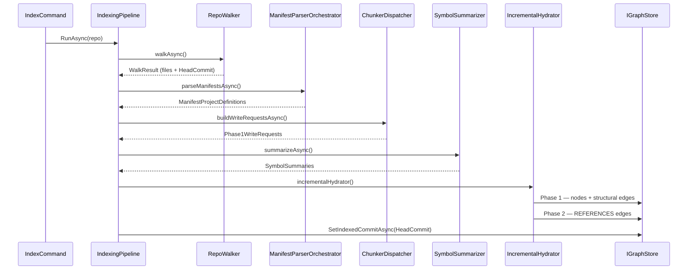
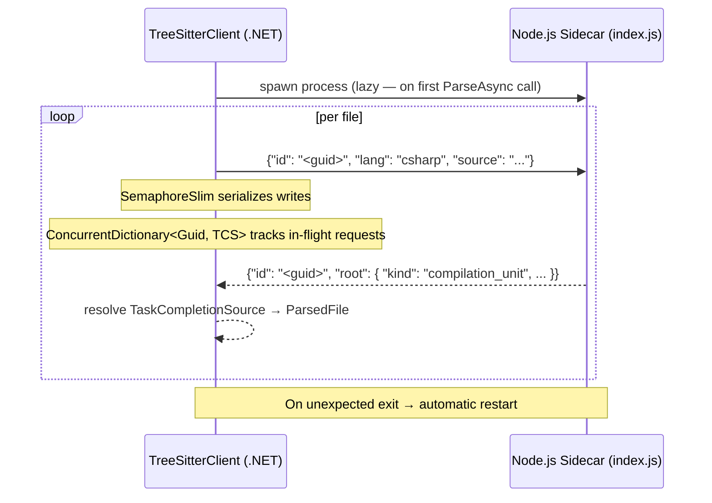
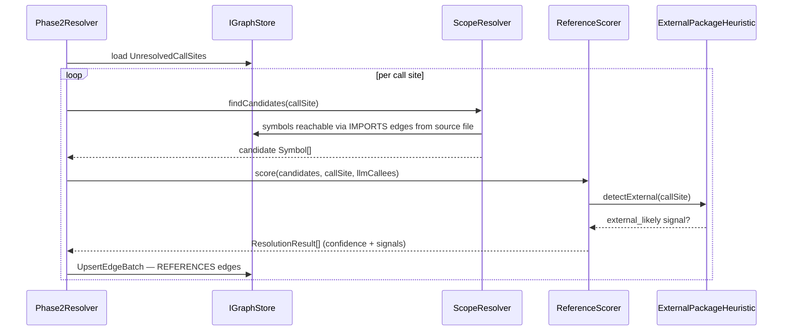
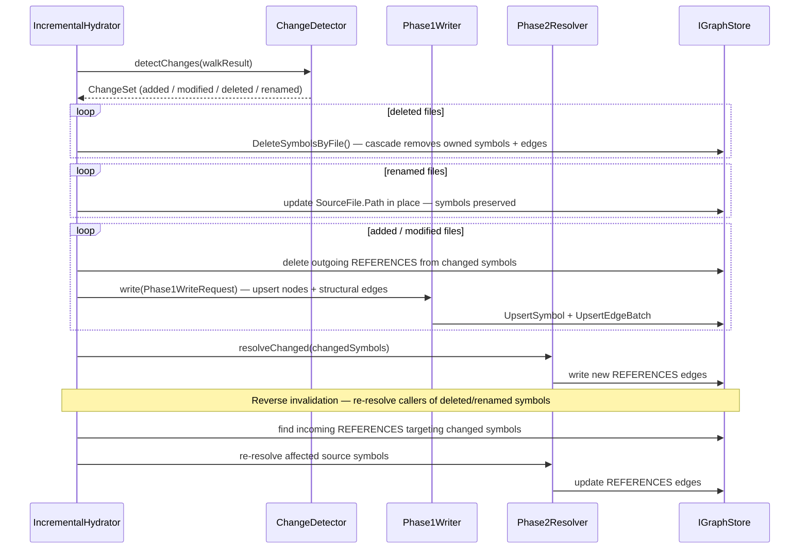
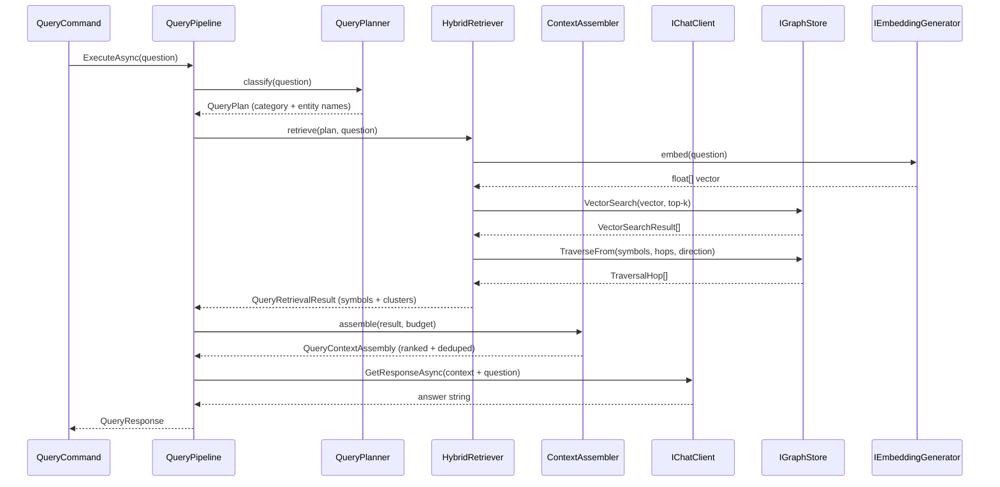

# Agency.GraphRAG.Code — How Indexing and Querying Work

#graphrag #walkthrough #indexing #querying

This document walks through the complete lifecycle of a question like *"How does authentication work in this repo?"* — from raw source files on disk to a synthesized LLM answer.

---

## Big Picture

The GraphRAG.Code system is a classic two-phase pipeline design: first build a complete symbol table (so all nodes exist), then resolve cross-file references. This mirrors how compilers work — you can't link what you haven't declared. The five-query-type taxonomy (Local/Subsystem/Global/Impact/Dependency) maps cleanly onto retrieval strategies, avoiding the common mistake of using vector search for graph-shaped questions like "what calls X?".

The system has two main pipelines that run in sequence:

```
 SOURCE FILES
      │
      ▼
┌─────────────────────────────────────────┐
│          INDEXING PIPELINE              │
│  1. Repo Walker (git diff)              │
│  2. Manifest Parser                     │
│  3. Tree-sitter Parser (AST)            │
│  4. Chunker (symbol extraction)         │
│  5. Summarizer (LLM + embeddings)       │
│  6. Phase 1 Writer (nodes + structure)  │
│  7. Phase 2 Resolver (call edges)       │
│  8. Cluster Worker (Leiden + summaries) │
└────────────────────┬────────────────────┘
                     │  writes to
                     ▼
               IGraphStore
          (SQLite or Postgres)
                     │  reads from
                     ▼
┌─────────────────────────────────────────┐
│           QUERY PIPELINE                │
│  1. Query Planner (classify question)   │
│  2. Hybrid Retriever (vector + graph)   │
│  3. Context Assembler (rank + dedupe)   │
│  4. LLM Synthesis (answer generation)   │
└─────────────────────────────────────────┘
```

---

## Entry Point — CLI

**Project:** `Agency.GraphRAG.Code.Cli`

The CLI is built with Spectre.Console. `Program.cs` calls `CliApplication.BuildApplication()` which registers two commands:

| Command | Class | Settings |
|---|---|---|
| `graphrag-code index <repo>` | `IndexCommand : Command<IndexSettings>` | `--store` (sqlite/postgres), `--connection` |
| `graphrag-code query <question>` | `QueryCommand : AsyncCommand<QuerySettings>` | `--store`, `--connection`, `--top-k` |

Both commands construct a `CliInvocation` record, build a `IHost` via `Host.CreateApplicationBuilder()`, call `services.AddCodeIndex(...)` (`CodeIndexServiceCollectionExtensions`), then resolve and run either `IndexingPipeline` or `QueryPipeline` from the DI container.

**File:** `src/GraphRAG.Code/Agency.GraphRAG.Code.Cli/CliApplication.cs`

**DI registration:** `src/GraphRAG.Code/Agency.GraphRAG.Code/DependencyInjection/CodeIndexServiceCollectionExtensions.cs`  
— `AddCodeIndex()` is the single registration point for every service in both pipelines. The store implementation (`SqliteGraphStore` / `PostgresGraphStore`) is selected here via `CodeIndexStore` enum and loaded by assembly name through reflection to keep the core project free of storage dependencies.

---

## Orchestrator — IndexingPipeline

**Class:** `Agency.GraphRAG.Code.Pipeline.IndexingPipeline`  
**File:** `src/GraphRAG.Code/Agency.GraphRAG.Code/Pipeline/IndexingPipeline.cs`

`IndexingPipeline.RunAsync(Repo)` is the top-level coordinator. It calls each stage in order via injected delegates:

```
walkAsync              → RepoWalker
parseManifestsAsync    → ManifestParserOrchestrator
buildWriteRequestsAsync → (chunker + tree-sitter stage, wired as delegate)
summarizeAsync         → (SymbolSummarizer stage, wired as delegate)
detectChangesAsync     → ChangeDetector
incrementalHydrator    → IncrementalHydrator  (calls Phase1Writer + Phase2Resolver)
SetIndexedCommitAsync  → IGraphStore
```

The pipeline is constructed in `AddCodeIndex()` with all delegates wired up. This design lets each stage be replaced or stubbed independently in tests.



---

## Part 1: Indexing Pipeline

### Step 1 — Repo Walker

**Class:** `Agency.GraphRAG.Code.Walker.RepoWalker`  
**File:** `src/GraphRAG.Code/Agency.GraphRAG.Code/Walker/RepoWalker.cs`  
**Supporting:** `GitProcessRunner` (shells out to git), `LanguageDetector` (extension + shebang heuristic), `Language` enum

**What it does:** Determines which files need (re)processing without scanning the filesystem.

- **First index:** runs `git ls-files` to enumerate every tracked file. `.gitignore` is respected automatically because git itself enforces it.
- **Incremental index:** runs `git diff <lastIndexedCommit> HEAD --name-status -M` to get only the files that changed — added (`A`), modified (`M`), deleted (`D`), or renamed (`R`).
- Detects the language of each file by extension, with a shebang/heuristic fallback.
- Returns a `WalkResult` — list of `WalkedFile` records (path, language, `WalkedFileStatus`) and `HeadCommit` SHA.
- The last successfully indexed commit SHA is stored on a `Repo` node in the graph. If the indexer crashes mid-run, the next run re-processes the same diff — operations are idempotent.

> **V1 constraint:** only committed code is indexed. Users must commit or stash before re-indexing. Working-tree overlay is a V2 feature.

---

### Step 2 — Manifest Parser

**Orchestrator:** `Agency.GraphRAG.Code.Manifest.ManifestParserOrchestrator`  
**File:** `src/GraphRAG.Code/Agency.GraphRAG.Code/Manifest/ManifestParserOrchestrator.cs`  
**Interface:** `IManifestParser` — each language parser implements this  
**Implementations:**

| Class | File | Language |
|---|---|---|
| `CSharpManifestParser` | `Manifest/CSharpManifestParser.cs` | `*.csproj`, `Directory.Packages.props` |
| `NpmManifestParser` | `Manifest/NpmManifestParser.cs` | `package.json`, lockfiles |
| `PythonManifestParser` | `Manifest/PythonManifestParser.cs` | `pyproject.toml`, `requirements.txt` |

Adapters (`CSharpManifestParserAdapter`, `NpmManifestParserAdapter`, `PythonManifestParserAdapter`) wrap each parser to normalize the output into `ManifestProjectDefinition` records — these are defined as private inner classes in `CodeIndexServiceCollectionExtensions`.

**What it does:** Establishes project boundaries and the first-party / third-party divide.

| Language | Files read |
|---|---|
| C# | `*.csproj`, `*.sln`, `Directory.Packages.props` |
| TypeScript/JS | `package.json` + `package-lock.json` / `yarn.lock` / `pnpm-lock.yaml` |
| Python | `pyproject.toml` + `poetry.lock` / `uv.lock`, fallback to `requirements.txt` |

**What gets extracted:**

- Each manifest becomes a `Project` node in the graph
- Direct dependencies become `ExternalPackage` nodes with their resolved versions (from lockfile when available)
- Intra-repo references (`<ProjectReference>` in C#, npm workspaces, Python path deps) become edges between `Project` nodes

**Key rule:** third-party packages are tracked as opaque nodes — the indexer does not recurse into `node_modules`, `~/.nuget`, or `site-packages`. This keeps the index bounded and build-independent.

---

### Step 3 — Tree-sitter Parser (AST)

**Project:** `Agency.GraphRAG.Code.TreeSitter`  
**Class:** `Agency.GraphRAG.Code.TreeSitter.TreeSitterClient`  
**File:** `src/GraphRAG.Code/Agency.GraphRAG.Code.TreeSitter/TreeSitterClient.cs`  
**Supporting:** `AstNode` (immutable record tree), `AstTraversal` (depth-first search helpers), `SourceRange`, `ParsedFile`

**What it does:** Converts raw source text into a structured Abstract Syntax Tree (AST).

Tree-sitter runs **out-of-process** as a Node.js sidecar (`tools/treesitter-sidecar/index.js`). The .NET side communicates with it via a JSON-line protocol over stdin/stdout:

```
.NET sends:  { "id": "<guid>", "lang": "csharp", "source": "..." }
Sidecar returns: { "id": "<guid>", "root": { "kind": "compilation_unit", ... } }
```

`TreeSitterClient` manages the sidecar process lifecycle: lazy start on first `ParseAsync` call, request correlation by GUID via `ConcurrentDictionary<Guid, TaskCompletionSource<ParsedFile>>`, write serialization via `SemaphoreSlim`, and automatic process restart on unexpected exit.

**Why out-of-process?** Grammar updates (new language features, bug fixes) are decoupled from the .NET build. No native bindings to maintain.

The .NET side communicates with it over a JSON-line protocol:



The output is a tree of `AstNode` records — each carries:

- `Kind` — node type (e.g., `"method_declaration"`)
- `Text` — leaf text when applicable
- `Range` — zero-based start/end line+column (`SourceRange`)
- `Children` — `IReadOnlyList<AstNode>`
- `FieldName` — tree-sitter field name (e.g., `"name"`)

---

### Step 4 — Chunker

**Dispatcher:** `Agency.GraphRAG.Code.Chunker.ChunkerDispatcher`  
**File:** `src/GraphRAG.Code/Agency.GraphRAG.Code/Chunker/ChunkerDispatcher.cs`  
**Interface:** `IChunker` — each language chunker implements this  
**Implementations:**

| Class | File | Language |
|---|---|---|
| `CSharpChunker` | `Chunker/CSharpChunker.cs` | C# |
| `TypeScriptChunker` | `Chunker/TypeScriptChunker.cs` | TypeScript / TSX / JS / JSX |
| `PythonChunker` | `Chunker/PythonChunker.cs` | Python |

**Supporting:** `Chunk` (output record), `ChunkBuilder`, `ChunkerInput`, `ChunkerOptions`, `ChunkGranularity`, `ChunkSourceRange`, `ImportReference`

**What it does:** Receives a `ParsedFile` (AST root), walks it, and emits `Chunk` records — semantically meaningful blocks at these levels:

| Level | Examples |
|---|---|
| Top-level | namespaces, modules, files |
| Type-level | classes, structs, interfaces, enums |
| Member-level | methods, functions, properties |
| Statement-level | only when a single member is too large to embed |

Each `Chunk` carries a **stable ID** computed from `hash(filePath + symbolName + signature)`. A renamed file preserves existing IDs; a signature change forces a new hash — intentional, as signature changes invalidate prior reference resolution.

The chunker also captures **call sites** — every identifier that looks like a method or function invocation — and stages them in `UnresolvedCallSites` for Phase 2. It does not attempt to resolve them yet.

---

### Step 5 — Summarizer

**Class:** `Agency.GraphRAG.Code.Summarizer.SymbolSummarizer`  
**File:** `src/GraphRAG.Code/Agency.GraphRAG.Code/Summarizer/SymbolSummarizer.cs`  
**Supporting:**

| Class | Role |
|---|---|
| `SummarizationOrder` | Sorts chunks so interfaces/abstracts come before implementations |
| `SummarizationPromptBuilder` | Builds LLM prompts per symbol kind and tier |
| `ModelTierSelector` | Maps symbol kind → model tier (strong / cheap / cheapest) |
| `SummaryCache` | Keyed by `Chunk.ContentHash`; returns cached `SymbolSummary` on hit |
| `SymbolSummary` | Output record: one-liner, detailed summary, probable call targets, embedding |

**Dependencies:** `IChatClient` (Microsoft.Extensions.AI) for LLM calls, `IEmbeddingGenerator` (`Agency.Embeddings.Common`) for embedding generation

**What it does:** For each `Chunk`, produces a `SymbolSummary` then embeds the one-liner for vector search.

**Interface-first ordering (`SummarizationOrder`):** interfaces and abstract classes are summarized *before* their implementations. A bad summary on `IRepository` contaminates retrieval for every concrete repository that depends on it.

**Tiered models (`ModelTierSelector`):**

| Symbol type | Model tier |
|---|---|
| Interfaces, abstract classes, public APIs | Stronger |
| Concrete implementations, internal helpers | Cheaper |
| One-line embedding summaries | Cheapest |

**Cost mitigations:**
- `SummaryCache` keyed by content hash — unchanged code is never re-summarized
- Only classes and public methods are summarized by default; private leaf summarization is lazy (on first query), configurable via `SummarizerOptions`

---

### Step 6 — Phase 1 Writer (Definitions Pass)

**Class:** `Agency.GraphRAG.Code.Hydration.Phase1Writer`  
**File:** `src/GraphRAG.Code/Agency.GraphRAG.Code/Hydration/Phase1Writer.cs`  
**Supporting:** `Phase1WriteRequest` (input DTO), `HydrationIds` (stable ID computation)

**What it does:** Accepts a `Phase1WriteRequest` (file + its chunks + summaries) and writes all nodes and structural edges to `IGraphStore` in a single transactional batch per file.

Writes:
- `SourceFile`, `Symbol`, `Module` nodes
- `CONTAINS` edges (file → symbol)
- `DEFINES` edges (class → method)
- `IMPORTS` edges where the target is already a known `SourceFile` or `ExternalPackage`
- Stages `UnresolvedCallSite` rows for each captured call site

At the end of Phase 1, **every node that will exist for this run is in the graph**. Cross-file references are still pending in the `UnresolvedCallSites` staging table.

---

### Step 7 — Phase 2 Resolver (Resolution Pass)

**Class:** `Agency.GraphRAG.Code.Hydration.Phase2Resolver`  
**File:** `src/GraphRAG.Code/Agency.GraphRAG.Code/Hydration/Phase2Resolver.cs`  
**Supporting:**

| Class | Namespace | Role |
|---|---|---|
| `ScopeResolver` | `Agency.GraphRAG.Code.References` | Finds candidate `Symbol` nodes reachable from a call site's file via `IMPORTS` edges |
| `ReferenceScorer` | `Agency.GraphRAG.Code.References` | Assigns `confidence` and `Signal[]` to each candidate |
| `ExternalPackageHeuristic` | `Agency.GraphRAG.Code.References` | Detects `external_likely` calls via namespace-prefix matching against known `ExternalPackage` names |
| `ResolutionResult` | `Agency.GraphRAG.Code.References` | Output: target `Symbol` id, confidence, signals |
| `Signal` (enum) | `Agency.GraphRAG.Code.Domain` | `NameMatch`, `LlmExtraction`, `ExternalLikely`, `Unresolved` |

**What it does:** Pulls all staged `UnresolvedCallSite` rows and resolves them into `REFERENCES` edges.

For each pending call site:

1. `ScopeResolver` looks up candidate `Symbol` nodes by name, filtered to symbols reachable via the source file's `IMPORTS` edges
2. `ReferenceScorer` scores each candidate:

| Signal | Meaning |
|---|---|
| `name_match` | Identifier resolved to one or more in-scope `Symbol` nodes |
| `llm_extraction` | The summarizer's probable-callees list named this target |
| `external_likely` | LLM named a callee with no name match, but surrounding imports reference a known `ExternalPackage` |
| `unresolved` | LLM named a callee with no match and no plausible external package |

3. Writes `REFERENCES` edges with `confidence` (0–1) and `signals` JSON array



**Confidence rules:**
- Exact name + signature match → high
- Name match only → medium
- Multiple matches → edges split at low confidence across all candidates
- LLM agrees with name match → confidence boost

**Incremental hydration:** coordinated by `IncrementalHydrator` (`Hydration/IncrementalHydrator.cs`):
1. Delete `REFERENCES` edges *from* changed symbols (forward invalidation)
2. Re-resolve outgoing call sites for changed symbols
3. Find edges *targeting* changed/removed symbols from other files, re-run their target lookups (reverse invalidation — V1: pragmatic, triggers only on deletion, rename, or visibility change)



---

### Step 8 — Cluster Worker (Background)

**Class:** `Agency.GraphRAG.Code.Cluster.ClusterWorker`  
**File:** `src/GraphRAG.Code/Agency.GraphRAG.Code/Cluster/ClusterWorker.cs`  
**Supporting:**

| Class | Role |
|---|---|
| `TwoPassClusterer` | Orchestrates the two-pass Leiden process |
| `LeidenRunner` | Minimal in-process Leiden partitioner |
| `EdgeWeighter` | Applies namespace/project multipliers to edge weights |
| `HierarchicalProjectSeeder` | Seeds initial partition by project before Leiden |
| `UtilityNodeDetector` | Identifies God Objects by degree percentile + cluster-spread entropy + naming conventions |
| `ClusterSummarizer` | Calls LLM per community, produces `Cluster` node with summary, embedding, coherence score, and type classification |
| `ClusterTuningInstrumentation` | Emits metrics for tuning boundary parameters |
| `ClusterOptions` | Configuration: `utilityDegreePercentile`, `namespaceWeightMultiplier`, `projectBoundaryMode`, etc. |

**What it does:** Partitions the symbol graph into communities and generates an LLM summary per community. Runs nightly (or on-demand), not inline with the main indexing pipeline.

**Boundary-aware Leiden (via `EdgeWeighter` + `HierarchicalProjectSeeder`):**

1. `HierarchicalProjectSeeder` seeds initial partitions per `Project` node
2. `EdgeWeighter` multiplies weights: intra-namespace ×1.5, inter-project ×0.5, base = `REFERENCES.confidence`
3. Trial Leiden run (`LeidenRunner`)
4. `UtilityNodeDetector` flags God Objects (degree ≥ 99th percentile AND high caller-cluster entropy AND optionally in `*.Common`/`*.Shared`/etc.)
5. Remove utility-node edges from the modularity computation
6. Final Leiden run on the cleaned edge set
7. Assign utility nodes to a dedicated "Infrastructure/Shared" cluster post-hoc

**Cluster summarization (`ClusterSummarizer`):** for each community, the LLM produces:
- A subsystem summary (stored as `Cluster.Summary`)
- An embedding of that summary (for vector retrieval of clusters)
- A coherence score (1–5)
- A type classification: `business` / `infrastructure` / `mixed` (`ClusterType` enum in `Domain/ClusterType.cs`)

The `business`/`infrastructure` classification drives query-time pruning: global queries lead with `business` clusters, aggregate `infrastructure` clusters into a footer.

---

## Data Model (What Gets Stored)

**Abstraction:** `Agency.GraphRAG.Code.Storage.IGraphStore`  
**File:** `src/GraphRAG.Code/Agency.GraphRAG.Code/Storage/IGraphStore.cs`

**Implementations:**

| Class | Project | Backend | Default? |
|---|---|---|---|
| `SqliteGraphStore` | `Agency.GraphRAG.Code.Sqlite` | SQLite + sqlite-vec + FTS5 | Yes |
| `PostgresGraphStore` | `Agency.GraphRAG.Code.Postgres` | PostgreSQL + pgvector + pg_trgm | No |

Schema migrations are managed by FluentMigrator:  
- SQLite: `M0001_InitialSchema`, `M0002_FtsAndVec` in `Agency.GraphRAG.Code.Sqlite/Migrations/`  
- Postgres: `M0001_InitialSchema`, `M0002_IndexesAndExtensions` in `Agency.GraphRAG.Code.Postgres/Migrations/`

**Domain model** (all in `Agency.GraphRAG.Code.Domain`):

`Repo`, `Project`, `ExternalPackage`, `SourceFile`, `Module`, `Symbol` (`SymbolKind` enum), `Edge` (`EdgeKind` enum), `Cluster` (`ClusterType` enum), `UnresolvedCallSite`, `Signal` (enum)

**Entity tables:** `repos`, `projects`, `external_packages`, `files`, `modules`, `symbols`, `clusters`

**Single polymorphic edges table:**

| Column | What it holds |
|---|---|
| `source_id` / `source_kind` | Origin entity (symbol, file, project, …) |
| `target_id` / `target_kind` | Target entity |
| `edge_kind` | `contains`, `depends_on`, `imports`, `references`, `defines`, `member_of` |
| `confidence` | 0–1, meaningful on `references` and weak `member_of` |
| `signals` | JSON array: `name_match`, `llm_extraction`, `external_likely`, `unresolved` |
| `properties` | JSON for edge-kind-specific fields (e.g., `member_of.kind` = `primary` / `utility`) |

**IGraphStore operations:** `UpsertSymbol`, `UpsertEdgeBatch`, `DeleteSymbolsByFile`, `VectorSearch` (returns `VectorSearchResult`), `TraverseFrom` (returns `TraversalHop[]`, accepts `TraversalRequest` + `TraversalDirection`), `ApplyClusterAssignments`, `SetIndexedCommitAsync`, `InitializeSchemaAsync`

---

## Part 2: Query Pipeline

### Entry Point

**Class:** `Agency.GraphRAG.Code.Query.QueryPipeline`  
**File:** `src/GraphRAG.Code/Agency.GraphRAG.Code/Query/QueryPipeline.cs`

`QueryPipeline.ExecuteAsync(question)` orchestrates the four query steps in order, returning a `QueryResponse` (with `Answer` string). It is resolved from DI by `QueryCommand` in the CLI.

**Query options:** `QueryOptions` (`Query/QueryOptions.cs`) — `CheapestModel`, `AnswerModel`, `ContextTokenBudget` (default 600 tokens)



---

### Step 1 — Query Planner

**Classes:** `QueryPlanner` + `QueryClassifier`  
**Files:** `src/GraphRAG.Code/Agency.GraphRAG.Code/Query/QueryPlanner.cs`, `Query/QueryClassifier.cs`  
**Supporting:** `QueryCategory` (enum), `QueryPlan` (output: category + parsed entity names)

**What it does:** Classifies the question into a `QueryCategory` and builds a `QueryPlan`.

| Category | Example | Retrieval strategy |
|---|---|---|
| `Local` | "What does `UserService.Authenticate` do?" | Vector search + 1-hop graph expansion |
| `Subsystem` | "How does auth work?" | Cluster summaries + symbol drill-down |
| `Global` | "Give me a tour of this codebase" | `business` cluster summaries; `infrastructure` in footer |
| `Impact` | "What calls `UserService.Authenticate`?" | Graph traversal from named symbol only |
| `Dependency` | "What uses the Stripe package?" | `depends_on` + `imports` traversal; `external_likely` signal |

---

### Step 2 — Hybrid Retriever

**Class:** `Agency.GraphRAG.Code.Query.HybridRetriever`  
**File:** `src/GraphRAG.Code/Agency.GraphRAG.Code/Query/HybridRetriever.cs`  
**Supporting:** `QueryRetrievalResult`, `QuerySymbolResult`, `QueryClusterResult`  
**Interfaces it uses:** `IGraphStore` (vector search + traversal), `IClusterQuerySource` (fetch `Cluster` nodes by id), `IEmbeddingGenerator` (embed the question)

**What it does:** Fetches relevant symbols and cluster context using the strategy in `QueryPlan`.

**For `Local` and `Subsystem` queries:**

1. Embed the question via `IEmbeddingGenerator`
2. `IGraphStore.VectorSearch` over `symbols.embedding` → top-k `VectorSearchResult` records
3. `IGraphStore.TraverseFrom` — 1–2 hops along `references`, `contains`, `imports` edges (confidence-filtered) — implemented as a recursive CTE
4. `IClusterQuerySource.GetClustersAsync` — fetch `Cluster` summaries for each retrieved symbol's community

On Postgres, steps 2 and 3 can be combined into a single query. On SQLite, they run separately and are joined by the application layer.

**For `Impact` queries:** call `TraverseFrom` with `TraversalDirection.Incoming` on the named symbol — no vector search needed.

**For `Dependency` queries:** traverse `depends_on` and `imports` edges from the named package; filter by `external_likely` signal for framework-call discovery.

---

### Step 3 — Context Assembler

**Class:** `Agency.GraphRAG.Code.Query.ContextAssembler`  
**File:** `src/GraphRAG.Code/Agency.GraphRAG.Code/Query/ContextAssembler.cs`  
**Supporting:** `QueryContextAssembly` (output), `ISymbolTextProvider` (loads raw source text for a `Symbol`)

**What it does:** Takes `QueryRetrievalResult` and structures it into a `QueryContextAssembly` for the LLM within the `ContextTokenBudget`.

- **Deduplicates** chunks reached via multiple retrieval paths
- **Orders** by relevance score + structural locality (same file/class kept together)
- **Truncates** to fit `QueryOptions.ContextTokenBudget`
- **Layered structure:** cluster summaries (orientation) → symbol summaries (mid-level) → raw code via `ISymbolTextProvider` (specifics)

---

### Step 4 — LLM Synthesis

Executed inside `QueryPipeline.ExecuteAsync` after `ContextAssembler` — calls `IChatClient.GetResponseAsync` with the assembled context and a system prompt.

The system prompt tells the LLM:
- The context came from a fuzzy, build-independent index — not a compiler
- `REFERENCES` edges with `unresolved` or low-confidence signals may be incorrect
- Uncertainty should be flagged explicitly when reference confidence is low

**Returns:** `QueryResponse.Answer` (string) written to stdout by `QueryCommand`

---

## End-to-End Example

**Question:** *"How does authentication work in this repo?"*

1. `QueryCommand` → `QueryPipeline.ExecuteAsync("How does authentication work in this repo?")`
2. `QueryPlanner` (`QueryClassifier`) → `QueryCategory.Subsystem`; `QueryPlan` identifies "auth" as the subsystem keyword
3. `HybridRetriever`:
   - `IEmbeddingGenerator` embeds the question
   - `IGraphStore.VectorSearch` finds: `AuthController.Login`, `JwtService.GenerateToken`, `IUserRepository.FindByEmail`, …
   - `IGraphStore.TraverseFrom` (1-hop) adds: `ITokenValidator`, `RefreshTokenStore`, `PasswordHasher`
   - `IClusterQuerySource.GetClustersAsync` returns the `"JWT Authentication & Session Management"` cluster summary
4. `ContextAssembler`:
   - Leads with cluster summary: *"This cluster owns JWT issuance, token refresh, and session invalidation…"*
   - Follows with `Symbol.Summary` for top-k symbols
   - Appends raw bodies via `ISymbolTextProvider` for 2–3 most relevant methods
5. `IChatClient.GetResponseAsync` → `QueryResponse.Answer` → printed to stdout

---

## Fresh Index vs. Incremental Index

| Scenario | What runs |
|---|---|
| **First index** | All 8 steps, all files |
| **Incremental index** | `RepoWalker` scopes to changed files via git diff; `ChangeDetector` classifies changes; `IncrementalHydrator` runs Phase1Writer + Phase2Resolver only for changed files; `ClusterWorker` runs on schedule |
| **Manifest-only change** | `ManifestParserOrchestrator` re-parses the changed manifest and reconciles `Project` edges only |
| **File deleted** | `IGraphStore.DeleteSymbolsByFile` — `SourceFile` node removed, owned `Symbol` nodes cascade-deleted, dangling edges cleaned |
| **File renamed** | `SourceFile.Path` updated in place; `Symbol` nodes and their edges preserved (`RenamedFileChange` in `ChangeSet`) |

---

## Project Map

```
Agency.GraphRAG.Code.Cli/           CLI entry point (Program, CliApplication, IndexCommand, QueryCommand)
Agency.GraphRAG.Code/               Core pipeline
  ├── Pipeline/                     IndexingPipeline (orchestrator)
  ├── Walker/                       RepoWalker, GitProcessRunner, LanguageDetector
  ├── Manifest/                     ManifestParserOrchestrator, CSharpManifestParser,
  │                                 NpmManifestParser, PythonManifestParser
  ├── Chunker/                      ChunkerDispatcher, CSharpChunker, TypeScriptChunker, PythonChunker
  ├── Summarizer/                   SymbolSummarizer, SummarizationOrder, ModelTierSelector, SummaryCache
  ├── Hydration/                    Phase1Writer, Phase2Resolver, IncrementalHydrator
  ├── References/                   ScopeResolver, ReferenceScorer, ExternalPackageHeuristic
  ├── Cluster/                      ClusterWorker, TwoPassClusterer, LeidenRunner, EdgeWeighter,
  │                                 HierarchicalProjectSeeder, UtilityNodeDetector, ClusterSummarizer
  ├── Query/                        QueryPipeline, QueryPlanner, QueryClassifier,
  │                                 HybridRetriever, ContextAssembler
  ├── Storage/                      IGraphStore (abstraction only)
  ├── Domain/                       Repo, Project, Symbol, Edge, Cluster, UnresolvedCallSite, Signal, …
  ├── ChangeDetector/               ChangeDetector, ChangeSet
  ├── Agentic/                      CodeIndexCapability (ICodeIndex), CodeIndexAgentTool
  └── DependencyInjection/          CodeIndexServiceCollectionExtensions, CodeIndexOptions
Agency.GraphRAG.Code.TreeSitter/    TreeSitterClient, AstNode, AstTraversal, ParsedFile
Agency.GraphRAG.Code.Sqlite/        SqliteGraphStore, SqliteMigrationRunner, M0001/M0002
Agency.GraphRAG.Code.Postgres/      PostgresGraphStore, PostgresMigrationRunner, M0001/M0002
```

---

## See Also

- [Design Overview](Agency.GraphRAG.Code.Overview.md) — architecture diagram and system layers
- [Indexing Pipeline](Agency.GraphRAG.Code.Indexing.md) — full indexing detail
- [Graph Hydration](Agency.GraphRAG.Code.Hydration.md) — two-phase reference resolution
- [Clustering](Agency.GraphRAG.Code.Clustering.md) — Leiden algorithm and boundary-aware clustering
- [Query Pipeline](Agency.GraphRAG.Code.Querying.md) — query types and hybrid retrieval
- [Storage & Schema](Agency.GraphRAG.Code.Storage.md) — IGraphStore abstraction, schema, and signal taxonomy
- [Tree-sitter](Agency.GraphRAG.Code.TreeSitter.md) — AST parsing sidecar
- [Design Decisions](Agency.GraphRAG.Code.Design.md) — tradeoffs, V1 scope, and V2 roadmap
