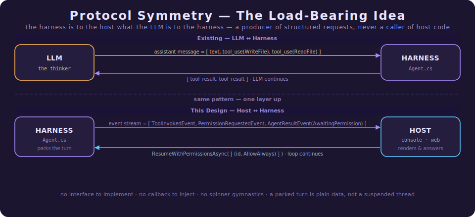
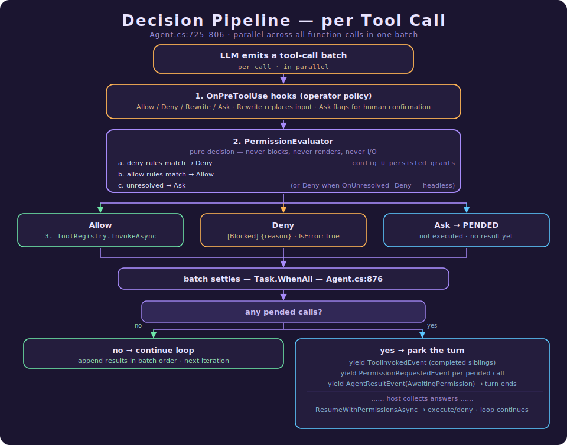
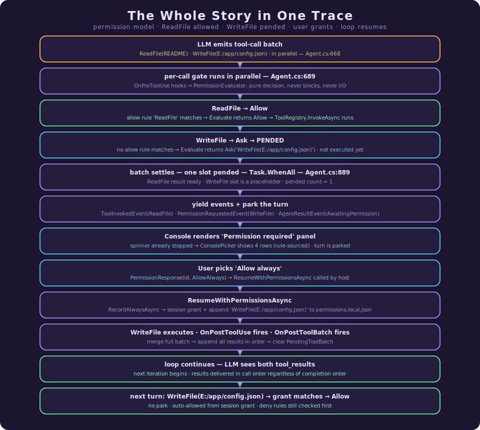

# Consent at the Tool Boundary: The Permission Model

> **What this document is.** The single, self-contained reference for Agency's permission model — the
> layer that decides whether a tool call the agent wants to make is actually allowed to run, and what
> happens when nobody has decided yet. It is written in **two parts**: **Part I** is a gentle,
> code-free tour for newcomers (plain English, analogies, no symbols); **Part II** is the
> implementation deep dive for engineers about to read or change the code (real symbols, `file:line`
> references, and the six core design principles). The two cover the same system at different depths — read Part I
> to understand *what* and *why*, Part II for *how*. This document is the successor to the former
> *Permission Model Design Document*; where that draft said *"Proposed,"* this describes what actually
> shipped — including one mechanism (active-skill pre-approval, §11) the original design predated. For
> the consent layer's sibling — the *operator-policy* layer it sits beside — see
> [How Hooks Work](How%20Hooks%20Work.md).

For an engineer building an agent harness, the hardest shift after "give it memory" is "give it a
conscience." A capable agent with a tool belt will cheerfully run `Remove-Item -Recurse`, write to
`E:/secrets/`, or `git push --force` — because from the model's point of view those are just function
calls. Something has to stand between *the model wants to* and *the machine does*. This document is
about that something.

---

# Part I · The Gentle Tour

> **Which part is this?** The code-free introduction. No C#, no file paths — just the ideas and why
> they're shaped the way they are. If you're evaluating Agency, onboarding, or explaining the feature
> to someone, start here. Ready for the implementation? Skip to [Part II](#part-ii--the-implementation-deep-dive).

Agency is an open-source .NET framework for building AI agents. An agent is a program that calls a
language model in a loop, lets it use **tools** (read a file, run a shell command, call an API), and
feeds the results back until the job is done.

The permission model is the part that answers one question, every single time the agent reaches for a
tool:

> "The agent wants to do this. Is that okay?"

### If you only remember four ideas

**1. Every action passes two sign-offs.**
First, *operator policy* — rules baked in by whoever deployed the agent. Then, *user consent* — the
person actually sitting in the session. Think of a secure building: the security desk enforces the
company's rules, but you still have to be buzzed in by the resident you're visiting. Both must be
satisfied.

**2. If nobody has decided, the agent asks — it doesn't guess.**
Unknown actions are never run silently. An action with no matching rule is surfaced to the person in
the chair. "Allow" rules exist to *reduce how often you're asked*, not to quietly unlock tools. When in
doubt, the safe default is to pause and ask.

**3. "Asking" is a clean pause, not a frozen program.**
When the agent needs permission, the turn **parks**: it stops at a tidy resting point and hands back a
plain "I need approval for this" message. Nothing is hung or spinning in the background waiting on a
human. The host (the console, a web page, whatever) shows the request, gets an answer, and tells the
agent to *resume* — and it picks up exactly where it left off. Picture a waiter who brings everything
that's ready, sets the one uncertain dish aside, and comes back to it once you've confirmed.

**4. "Yes, always" is remembered.**
For any request you can answer four ways: allow once, allow always, deny once, deny always. The two
"always" answers are written down so you're never asked that same thing again. Allow-always turns a
prompt into a standing rule; deny-always turns it into a standing block.

### Why an agent needs this at all

A language model doesn't actually *do* anything — it *asks* for things. It says "please run this
command" and stops. The harness around it is what turns that request into a real effect on a real
machine. That gap is the only place where "the model decided to" becomes "the disk changed" — so it's
exactly the place to put a gate.

Without that gate, an agent is like a brilliant but over-eager intern who will absolutely run the
production database wipe you vaguely gestured at. The permission model is the moment of "wait — are you
sure?" that a good colleague gives you before doing something irreversible.

### The two gatekeepers, in plain terms

- **Operator policy (hooks).** Rules the *deployer* sets. "Never let this agent touch the secrets
  folder." "Always make a human confirm a force-push." These travel with the deployment and the person
  in the chair can't loosen them. Importantly, a policy can *escalate*: it can take a call that would
  otherwise be fine and insist a human confirm it anyway.
- **User consent (permissions).** The judgment of the *person running the session right now*. This is
  the layer that pops the "Allow this?" question and remembers your "always" answers.

One rule governs everything when these two disagree: **a "no" always wins.** A deny can never be
overridden by an allow, by a user's "yes," or by anything else. The system fails safe.

### What "parking" really means

This is the one idea worth slowing down on, because it's what makes the whole thing feel smooth instead
of clunky.

When the agent asks for several tools at once and one of them needs approval, Agency doesn't freeze the
whole batch. It:

1. runs the actions that *are* already allowed,
2. sets the uncertain one aside,
3. and ends the turn cleanly with a "here's what I need approval for" note.

At that point the program isn't busy. It's *resting* — holding a neat little record of "here's what I
finished and here's what I'm waiting on." When you answer, it does the approved action, stitches the
results back together in order, and continues as if it had never paused.

Why care? Because a clean pause is **data you can save**. Later, Agency plans to let a paused turn
survive a restart — or even move to another machine — because the paused state is just a record, not a
suspended program clinging to memory. The smooth pause and the future durability are the same design
choice.

### One example, start to finish

The agent is helping you set up a project and decides to do two things at once: read your `README` and
write a new `config.json`.

- Reading the README is on the allow list, so it just happens.
- Writing `config.json` matches no rule — so that one **parks**. The turn ends with: "I read the
  README. I'd like to write `config.json` — approve?"
- The console shows a little panel: the tool, the file, and the rule it would remember. You pick
  **Allow always.**
- Agency writes the file, *and* records a standing rule: "writing this file is fine from now on." It
  stitches both results together and the agent carries on.
- Next time the agent wants to write that same file, there's no pause at all — your earlier "always" is
  now a rule.

You were asked exactly once. The model never saw any of the machinery — from its side, it just asked
for two tools and got two results. That's the whole point: **the agent moves freely where you've said
yes, stops precisely where you haven't, and never runs the thing nobody approved.**

### Why it matters

- **Trust.** You can hand an agent real tools without handing it a blank cheque.
- **Less nagging over time.** "Always" answers mean the prompts fade as the agent learns your
  boundaries, instead of pestering you on every run.
- **Safe automation.** In unattended runs (CI, scripts) the same system can be told "if it's not
  explicitly allowed, refuse" — so nothing dangerous slips through just because no human was watching.
- **Built for what's next.** Because a paused turn is plain saved data, the same model carries straight
  into web and multi-machine setups without being rebuilt.

In one sentence: **Agency turns an agent from "a tool belt that does whatever the model says" into "a
collaborator that asks before it acts — once."**

---

# Part II · The Implementation Deep Dive

> **Which part is this?** The code-anchored companion — real types, `file:line` references, and the
> precise precedence rules. It is a strict superset of Part I: same system, full depth. Everything Part
> I described in plain English is grounded here in the actual implementation.

## What Makes Agency's Permission Model Different

**Agency** treats user consent as a *first-class event in the agent's own response stream*, not as a
sideways callback the host has to wire up. When a tool call has no answer in the rules, the turn
**parks** — it stops cleanly, mid-batch, and hands the host a structured "I need permission" event.
The host renders it however it likes, collects an answer, and *resumes* the turn. The headline ideas,
each unpacked below:

**1. Two layers, one pipeline: operator policy, then user consent.**
Hooks (`OnPreToolUse`) are **operator policy** — code the deployer wired in. Permissions are **user
consent** — the person driving the session. They run in a fixed order (hooks first, evaluator
second) and compose into a single per-call verdict. Neither replaces the other.

**2. Safe by default: unmatched calls ask, they don't run.**
Allow rules exist to *reduce prompting*, not to *enable tools*. A call that matches no rule is
surfaced to the user — never silently executed. The only way to skip the question is to say so, once
or always.

**3. Asking is a stream event, not an awaited callback.**
The harness is to the host what the LLM is to the harness: a producer of structured requests, never
a caller of host code. An unresolved call yields a `PermissionRequestedEvent` and the turn ends with
`AgentResultStatus.AwaitingPermission`. The host answers via `ResumeWithPermissionsAsync`. There is
no interface to implement, no prompt service to inject.

**4. A parked turn is plain data, not a suspended thread.**
The pending batch lives on `Context` as a serializable record (`PendingToolBatch`). Nothing is
blocked on a human; no `TaskCompletionSource` is held open at human timescale. This is the design's
quiet superpower: when the planned blob-persistence project lands, parked turns become durable and
resumable on any process **with no change to this contract**.

**5. Deny always wins.**
Across both layers and every answer, the precedence is fixed: **deny > ask > allow**. A deny rule can
never be overridden by an allow rule, a user "allow," or a hook escalation. Fail-safe is the default
in every ambiguous case.

**6. Persistence is best-effort and last-writer-wins.**
"Always" answers append to a per-machine `permissions.local.json` under a momentary exclusive file
lock. No merge logic, no database. If the write loses a race, the in-memory session grant still
holds — persistence never blocks consent.

### Why these choices matter for a production harness

* **One integration channel.** A host already loops over `AgentEvent`s. Permission asks are *another
  case in that loop* — not a second, out-of-band prompt service that fights the host's render
  cycle. The console proves it: handling permissions added zero new harness-facing types.
* **The roadmap falls out for free.** Because a parked turn is data on `Context` and not a blocked
  `await`, the future stateless-web host and the blob-checkpoint project both work without a second
  mechanism. The event model is the end-state contract from day one.
* **Operator escalation cannot be silently cleared.** A hook can *escalate* an otherwise-allowed call
  to "ask the user" (`PreToolUseDecision.Ask`). No allow rule and no persisted grant can suppress
  that — only a deny can outrank it. Security policy beats convenience config, always.
* **Headless safety is a config flag, not a special path.** `OnUnresolved: Deny` makes unresolved
  calls fail closed with a deterministic `[Blocked]` reason — the same machinery, one switch, so CI
  never parks a turn nobody will answer.

---

## 1. The Core Problem: Why Gate Tool Calls At All?

An LLM does not "run" anything. It *emits a request* — `tool_use(WriteFile, {path, content})` — and
stops. The harness is what turns that request into a side effect on the real machine. That seam is the
only place where "the model decided to" becomes "the disk changed."

Before this feature, Agency had exactly one gate at that seam: the `OnPreToolUse` hook. Hooks are
powerful, but they are **operator policy** — rules baked in by whoever *deployed* the agent. There was
no layer representing the person *driving the session*. Nothing paused to ask:

> "The agent wants to run `Remove-Item -Recurse E:\`. Allow it?"

The permission model is that missing layer. Critically, it is **not** built on hooks — it is a
separate `PermissionEvaluator` that runs *after* hooks and *before* the tool registry, so the two
concerns stay cleanly separated (operator vs. user) while folding into a single decision.

---

## 2. The Two-Layer Pipeline

Every tool call the model emits flows through two gates, in order. Keeping them distinct is the whole
design:

| Layer | Question it answers | Who owns it | Where |
|---|---|---|---|
| **`OnPreToolUse` hooks** | "Does *operator policy* permit this?" | The deployer (code/external handlers) | `Agent.cs:699` |
| **`PermissionEvaluator`** | "Has the *user* consented to this?" | The person driving the session | `Agent.cs:748` |

The reference model is deliberately Claude-Code-shaped, so the syntax and semantics are familiar:

| Claude Code / Agent SDK | Agency equivalent |
| --- | --- |
| `PreToolUse` hooks | `OnPreToolUse` hooks |
| Hook `permissionDecision: "ask"` | `PreToolUseDecision.Ask(Reason)` (§10) |
| Deny rules (`permissions.deny`) | `Permissions:Deny` + persisted deny grants |
| Allow rules (`permissions.allow`) | `Permissions:Allow` + persisted allow grants |
| `control_request` in the message stream | `PermissionRequestedEvent` in the event stream |
| `control_response` from the client | `ChatSession.ResumeWithPermissionsAsync(...)` |
| `updatedPermissions` → `settings.local.json` | "Always" answers → `permissions.local.json` |

Permission *modes* (`acceptEdits`, `bypassPermissions`, `plan`) are deliberately out of scope. The
only global switch is `Permissions:Enabled`.

### 2.1 The protocol symmetry (the load-bearing idea)

The design applies the LLM↔harness protocol *one layer up*. The LLM never calls into the harness — it
returns structured requests and stops; the harness executes them and continues. **Symmetrically, the
harness never calls into the host** — it yields structured permission requests and parks; the host
answers them and resumes:



> If you remember one sentence from this document, make it this:
>
> **The harness is to the host what the LLM is to the harness — a producer of structured requests,
> never a caller of host code.**

That single decision (events, not an injected `IPermissionPrompt` callback awaited mid-turn) is why
the console host needed no spinner gymnastics, why a future web host needs no `TaskCompletionSource`
registry, and why durable parked turns are a *serialization* problem rather than a *re-architecture*
problem. The trade-off accepted: parking a turn mid-batch touches the core loop's semantics (held
results, a resume entry point) — more work than inserting one `await`. §6 is where that work lives.

---

## 3. The Decision Pipeline, End to End

Here is the whole pipeline for one tool call. The two gates fold into a single verdict; the verdict
decides whether the call runs now, is blocked, or pends the turn.



**The combined per-call order** (as implemented in `Agent.cs:725-806`). This is the authoritative
precedence list — note steps 2 and 3, which are *stronger* than the original design doc because the
gate now also consults the active skill:

1. **Hook `Deny`** → blocked immediately; the evaluator is never consulted (`Agent.cs:704`).
2. **Rule `Deny`** → blocked, even if a hook returned `Ask` — *deny always wins* (`Agent.cs:750`).
3. **Active-skill pre-approval** → if the tool is in the active skill's `allowed-tools` list and no
   deny rule fired, execute it — this even clears a hook `Ask` (§11) (`Agent.cs:761`).
4. **Hook `Ask`** → pends with `Source = Hook`, *even when an allow rule matches* — operator
   escalation cannot be cleared by config (`Agent.cs:765`).
5. **Rule `Allow`** → executes (`Agent.cs:787`).
6. **Unresolved** → pends with `Source = UnresolvedRule` (or denies under `OnUnresolved: Deny`)
   (`Agent.cs:777`).

The one rule that governs the whole table: **deny > ask > allow.**

### 3.1 The insertion point

The gate lives inside the per-call lambda of the loop's tool-execution stage
(`Agent.RunIterationsAsync`, `Agent.cs:689-806`) — **after** the `OnPreToolUse` block (so it evaluates
*post-`Rewrite`* input, i.e. what will actually execute) and **before** `ToolRegistry.InvokeAsync`.
`Agent` gains one optional constructor parameter, `IPermissionEvaluator? permissions = null`
(`Agent.cs:90`), stored as `_permissions`. When it is null the rules layer is absent and behavior is
unchanged — **unless a hook returns `Ask`**, because park/resume is agent machinery and works without
an evaluator (§10). Permissions are opt-in by construction.

`★ Insight — the gate's entry condition is a cheap short-circuit.` The whole permission block is
guarded by `if (hookAsk || _permissions != null || ctx.ActiveSkillState.AllowedTools.Count > 0)`
(`Agent.cs:744`). When no evaluator is wired, no hook asked, and no skill is active, the call skips
straight to invocation — zero overhead, exactly as the memory subsystem skips its hooks when memory is
off. Optionality is enforced at the branch, not bolted on.

---

## 4. The Type Tour

The contracts split cleanly by audience: **public** types are what a host consumes; everything else is
**internal** with `[InternalsVisibleTo("Agency.Harness.Test")]`, per the repo convention.

Core types live in `src/Harness/Agency.Harness/Permissions/`; the event types join the existing
`AgentEvents.cs` family.

| File | Type(s) | Visibility |
|---|---|---|
| `AgentEvents.cs` | `PermissionRequestedEvent`, `PermissionRequestSource`, `AgentResultStatus.AwaitingPermission` | public |
| `Hooks/PreToolUseDecision.cs` | `PreToolUseDecision.Ask(string? Reason)` | public |
| `Permissions/PermissionResponse.cs` | `PermissionResponse`, `PermissionResponseKind` | public |
| `Permissions/IPermissionEvaluator.cs` | `IPermissionEvaluator` | public |
| `Permissions/PermissionDecision.cs` | `PermissionDecision` + nested `Allow`/`Deny`/`Ask` | public |
| `Permissions/PermissionRule.cs` | `PermissionRule` | internal |
| `Permissions/PermissionsOptions.cs` | `PermissionsOptions`, `UnresolvedBehavior` | internal |
| `Permissions/PermissionsOptionsValidator.cs` | `PermissionsOptionsValidator` | internal |
| `Permissions/PermissionEvaluator.cs` | `PermissionEvaluator` | internal sealed |
| `Permissions/PermissionsFileStore.cs` | `PermissionsFileStore` | internal sealed |
| `Permissions/PermissionServiceCollectionExtensions.cs` | `AddAgencyPermissions` | public static |
| `Contexts/Context.cs` | `PendingToolBatch`, `PendingToolCall` | internal |

### 4.1 The decision and the answer

The evaluator returns a closed `PermissionDecision` union (`PermissionDecision.cs`), mirroring the
nested-record style of `PreToolUseDecision`:

```csharp
public abstract record PermissionDecision
{
    public sealed record Allow : PermissionDecision;
    public sealed record Deny(string Reason) : PermissionDecision;
    // No rule matched; KeyValue is for display, ProposedRule is what an "always" answer persists.
    public sealed record Ask(string? KeyValue, string ProposedRule) : PermissionDecision;
    public static PermissionDecision Allowed { get; } = new Allow();
    private PermissionDecision() { }
}
```

The host's answer is a `PermissionResponse` (`PermissionResponse.cs`) — one per request, echoing the
`RequestId`:

```csharp
public sealed record PermissionResponse(Guid RequestId, PermissionResponseKind Kind, string? Message = null);

public enum PermissionResponseKind { AllowOnce, AllowAlways, DenyOnce, DenyAlways }
```

The `Message` is the steering channel: on a deny it is fed back to the LLM
(`"use the dev database instead"`), so the model can adjust and retry rather than just hitting a wall.

### 4.2 The evaluator interface

`IPermissionEvaluator` (`IPermissionEvaluator.cs`) is deliberately tiny — two members:

```csharp
public interface IPermissionEvaluator
{
    // Pure decision — never blocks, never renders, never talks to the user.
    PermissionDecision Evaluate(string toolName, JsonElement input);

    // Records an "always" answer: adds a session grant and appends to the local rules file.
    Task RecordAlwaysAsync(string proposedRule, bool deny, CancellationToken ct);
}
```

`Evaluate` is **synchronous** — rule matching is in-memory regex work. The only I/O
(`RecordAlwaysAsync`) happens on the resume path, never on the hot evaluation path. The evaluator
builds the `ProposedRule` string itself so that *rule-syntax knowledge stays in one place*; hosts only
render and answer.

---

## 5. Rule Syntax & The Evaluator Algorithm

### 5.1 Grammar

```text
rule          := tool-pattern | tool-pattern "(" input-pattern ")"
tool-pattern  := identifier with optional '*' wildcards   e.g. ReadFile, mcp__gitea__list_*
input-pattern := any text with '*' wildcards              e.g. git status*, E:/secrets/**
```

- A **bare rule** (`ReadFile`) matches any invocation of that tool, regardless of input.
- A **parameterized rule** (`ExecutePowershell(git status*)`) matches only when the extracted *key
  value* (§5.3) matches the pattern.
- `*` matches any character sequence **including path separators**. `**` is accepted but treated
  **identically to `*`** — a documented simplification, *not* gitignore semantics (§13, risk 2).
- Matching is `OrdinalIgnoreCase` (sane on Windows, consistent with `HookMatcher`).
- Before matching, the candidate value is normalized `\` → `/`, so `WriteFile(E:/secrets/**)` matches
  `E:\secrets\key.txt` (`PermissionRule.cs:94`).
- MCP tools need no special handling: they register under their `mcp__server__tool` names in the
  normal `ToolRegistry`, so `mcp__gitea__list_*` is just a tool-pattern wildcard.

**Compilation** (`PermissionRule.cs:153`): each pattern is translated *once, at parse time* into an
anchored, compiled regex. The trick is small and worth seeing:

```csharp
string escaped   = Regex.Escape(pattern);              // '*' becomes '\*', everything else literal
string regexBody = Regex.Replace(escaped, @"(\\\*)+", ".*");  // runs of '\*' → a single '.*'
string anchored  = $"^{regexBody}$";
return new Regex(anchored, RegexOptions.IgnoreCase | RegexOptions.Compiled, TimeSpan.FromMilliseconds(250));
```

The 250 ms match timeout is a defensive guard (mirrors `HookMatcher`); a timeout is treated as
*no match* (`PermissionRule.cs:167`), which is fail-safe. Malformed rules throw `FormatException` from
`Parse` and are caught at startup by `PermissionsOptionsValidator` (§12).

### 5.2 The algorithm

`Evaluate` (`PermissionEvaluator.cs:75`) is five steps, exactly as the design specifies:

```text
Evaluate(toolName, input):
  1. if !options.Enabled                         -> Allow            (kill switch)
  2. keyValue = ExtractKeyValue(toolName, input) // map -> convention -> null
  3. if any deny rule matches  [configDeny ∪ grantedDeny]   -> Deny("Permission rule '{raw}' denies this call.")
  4. if any allow rule matches [configAllow ∪ grantedAllow] -> Allow
  5. unresolved:
        OnUnresolved == Deny  -> Deny("No permission rule allows this call.")   // headless/CI
        OnUnresolved == Ask   -> Ask(keyValue, BuildProposedRule(toolName, keyValue))
```

`★ Insight — lock-free reads where it counts.` Config rule lists are immutable after construction and
read **without locking** (`PermissionEvaluator.cs:35-36`). Only the *granted* lists — mutated when a
user answers "always" — sit behind a `Lock`, and even then the matcher takes a quick snapshot copy
rather than holding the lock across the regex sweep (`PermissionEvaluator.cs:180-184`). Because
`Evaluate` runs inside the *parallel* tool-batch tasks, this matters: the common path (config rules,
no grants) is contention-free.

### 5.3 Which input field does the pattern match?

A parameterized rule matches against one extracted *key value*. Resolution order
(`PermissionEvaluator.cs:138`):

1. **Config map**, `ToolInputKeys`, merged over built-in defaults:

   | Tool | Key field |
   | --- | --- |
   | `ExecutePowershell` | `command` |
   | `ReadFile` | `path` |
   | `WriteFile` | `path` |

   > Note the built-in file tools use the property **`path`**, not `file_path`
   > (`ReadFileTool.cs` / `WriteFileTool.cs`).

2. **Convention fallback** for unmapped tools: the first *present string property* among `command`,
   `path`, `file_path`, `url` (`PermissionEvaluator.cs:18`).
3. **No key value found** → bare-tool rules still match; parameterized rules **never** match, so the
   call falls through to `Ask` — fail-safe (`PermissionRule.cs:88`).

This keeps rules Claude-syntax-clean (the field name is never embedded in the rule), gives zero-config
behavior for the built-in tools, and offers `ToolInputKeys` as the escape hatch for MCP tools
(`"mcp__gitea__get_file_contents": "filepath"`).

The **proposed rule** an "always" answer would persist is built by the evaluator
(`PermissionEvaluator.cs:198`): `ToolName(exactKeyValue)` when a key value exists, else bare
`ToolName`. It is an *exact* match — wildcard widening ("allow all `git *`") is a deliberate
future-UI concern, not something the harness guesses.

---

## 6. The Turn Lifecycle: Park and Resume

This is the heart of the feature — the mechanism that lets a turn *stop cleanly* for a human and
*continue exactly where it left off*. It is also the part that touches the core loop, so it is worth
understanding precisely.

### 6.1 Parking a batch

When a call is pended (by a hook `Ask` or an evaluator `Ask`), it does **not** execute: no
`InvokeAsync`, no `FunctionResultContent`, no `OnPostToolUse`. Instead the lambda records a
`PendingToolCall` into a pre-sized, per-index slot array so the parallel tasks never contend
(`Agent.cs:687`, `Agent.cs:772`). Allowed and rule-denied siblings run to completion in parallel,
exactly as before.

After `Task.WhenAll` settles the batch (`Agent.cs:876`), if any slot is filled (`Agent.cs:889`):

1. Yield `ToolInvokedEvent`s for the **completed siblings only** — the host sees what already ran
   (`Agent.cs:893`).
2. Yield one `PermissionRequestedEvent` per pended call, *all of them*, in batch order — enabling
   consolidated rendering like "3 actions need approval" (`Agent.cs:902`).
3. Store the parked state on `Context.PendingToolBatch` — completed sibling results, the pending
   calls, and the sibling `ToolInvokedEvent`s (so resume can reconstruct the full batch for
   `OnPostToolBatch`) (`Agent.cs:929`).
4. Yield `AgentResultEvent(AwaitingPermission, FinalText: null, …)` and **end the enumerable**
   (`Agent.cs:937`).
5. **Do not** append any result messages and **do not** fire `OnPostToolBatch` — the batch is
   incomplete.

### 6.2 The message-ordering invariant (why parking is safe)

Here is the subtle correctness argument. In the LLM protocol, an assistant `tool_use` message *must*
be answered by a `tool_result` for **every** call in the batch — a partial answer is a malformed
conversation for every provider. The loop already honored this by appending result messages
**all-or-nothing, in batch order, only when the batch is complete** (`Agent.cs:967-970`).

Parking simply *holds that append* until the batch truly completes on resume. While parked, the
conversation rests in the **same legal intermediate state the LLM protocol itself uses between
`tool_use` and `tool_result`**: an assistant message awaiting its results. Nothing illegal is ever
written to history. That is what makes "stop mid-batch and come back later" sound rather than hacky.

### 6.3 Resuming

`ChatSession.ResumeWithPermissionsAsync(responses, ct)` (`ChatSession.cs:148`) delegates to
`Agent.ResumeAsync` (`Agent.cs:340`), which **validates eagerly** (before the first yield):

- No parked turn → `InvalidOperationException` (`Agent.cs:348`).
- Exactly one response per pending `RequestId`; no unknowns, no duplicates, none missing →
  `ArgumentException` otherwise (`Agent.cs:357-380`).

Then `ExecutePendingBatchAsync` (`Agent.cs:419`) runs steps 3–6 of the algorithm:

```text
3. for each AllowAlways / DenyAlways response:
      await evaluator.RecordAlwaysAsync(proposedRule, deny: kind == DenyAlways)
4. for each pending call (parallel, same as a normal batch):
      AllowOnce | AllowAlways -> InvokeAsync(toolName, input)   // hooks already ran pre-park
                                 then OnPostToolUse
      DenyOnce  | DenyAlways  -> "[Blocked] {user reason}" result, IsError: true
      yield ToolInvokedEvent per call
5. merge resumed results into the held batch by BatchIndex;
   fire OnPostToolBatch with the FULL reconstructed batch
6. append ALL result messages in batch order; clear Context.PendingToolBatch
7. continue the standard loop from the next iteration (may park again)
```

`★ Insight — one shared loop body, so the two paths cannot drift.` Both `RunAsync` and `ResumeAsync`
funnel into the *same* private `RunIterationsAsync` (`Agent.cs:563`). Resume executes the held batch,
then re-enters that shared loop. So a continued turn behaves byte-for-byte like a fresh one — and can
park *again* if the next iteration triggers new asks. The console and `AgentTool` both loop on this
("resume until the status is no longer `AwaitingPermission`").

**Two invariants the resume path guards carefully:**

- `OnPreToolUse` hooks are **not** re-run on resume — they ran before parking, and their `Rewrite`
  output is exactly what was pended and stored. Re-running would double-apply policy (`Agent.cs:457`).
- The input executed on approval is the **post-`Rewrite`** input captured at park time
  (`PendingToolCall.Input`, `Context.cs:42`) — what the user actually saw and approved.

### 6.4 Abandonment — a new message while parked

What if the user, instead of answering, just types a new message? `ChatSession.SendAsync` checks for a
parked batch first (`ChatSession.cs:112`) and **implicitly denies all pending calls** with the reason
`"The user did not respond to the permission request."`, completing the batch (steps 5–6) before
processing the new message. This matches Claude Code's UX (new input cancels pending requests) and
**guarantees the conversation never wedges**. `Reset()` clears any pending batch along with history.

### 6.5 Cancellation, timeouts, and what's in memory

A parked turn runs *no code*, so:

- **Timeouts can't fire while parked.** `TurnTimeoutSeconds` is applied per `ChatAsync`/`ResumeAsync`
  invocation via a linked CTS (`Agent.cs:212-218`); a parked turn is between invocations. Resume gets
  a fresh timeout.
- **Ctrl+C mid-park is a host concern.** Nothing is executing; there is nothing to cancel. The host
  abandons via `SendAsync` or `Reset()` (the console does exactly this when the user escapes the
  picker, `ConsoleChatSession.cs:285`).
- **The parked state is in-memory in v1.** `PendingToolBatch` lives on `Context`
  (`Context.cs:137`) — the same object that holds conversation history. A process restart loses a
  parked turn exactly as it loses the conversation: no regression, no new durability promise.

`★ Insight — the persistence project is already designed for.` `PendingToolBatch` and
`PendingToolCall` are plain data — strings, `Guid`, `JsonElement`, arrays (`Context.cs:12-46`). When
the planned harness state-persistence project serializes `Context`, the parked turn *rides along*. At
that point a parked turn survives restarts and resumes **on any process or instance** — the
stateless-web answer falls out of this design rather than requiring a second mechanism. The one extra
requirement it places on that project: completed siblings' results are part of the checkpoint, so
resume never re-executes side-effectful tools (idempotency).

---

## 7. The Contract Back to the LLM

Denials reuse the existing `[Blocked] {reason}` / `IsError: true` shape that hook denies already
produce (`Agent.cs:706`, `Agent.cs:753`), so the model sees **one consistent denial contract**
regardless of source:

| Source | Reason fed to the LLM |
| --- | --- |
| Rule deny | `Permission rule 'WriteFile(E:/secrets/**)' denies this call.` (raw rule text) |
| User deny, no message | `[Blocked] The user denied permission for this tool call.` |
| User deny with message | `[Blocked] The user denied permission for this tool call: {message}` |
| Abandoned (new message while parked) | `The user did not respond to the permission request.` |
| Headless unresolved | `No permission rule allows this call.` |

The deny-with-message path is what lets the user *steer* rather than merely block — the model can read
the reason and try a different approach.

---

## 8. Host Integration: The Whole Contract

A host integrates by handling **two things** in the event loop it already has — there is nothing to
implement, register, or inject:

1. `PermissionRequestedEvent` — collect them (there may be several per turn).
2. `AgentResultEvent` with `Status == AwaitingPermission` — the turn has parked. Render the collected
   requests, gather one `PermissionResponse` each, call `ResumeWithPermissionsAsync`, and iterate the
   returned stream exactly like a `SendAsync` stream (it can park again).

Rendering, ordering, "approve all" batching, and answer UX are entirely host-owned.

### 8.1 The console host

The console is the reference implementation, and it is striking how little it took
(`ConsoleChatSession.cs`):

- **The park loop** (`ConsoleChatSession.cs:273-297`): process the stream; while it parked, collect
  answers and resume; repeat until not parked or the user cancels.
- **`ProcessStreamAsync`** (`ConsoleChatSession.cs:381`) reports `Parked: true` when the stream ends
  with `AwaitingPermission`. Because the turn ended *naturally* (the enumerable completed), there is
  **no spinner stop/start gymnastics** — the spinner already stopped (`ConsoleChatSession.cs:430`).
- **`CollectPermissionResponses`** (`ConsoleChatSession.cs:465`) renders a bordered panel per request
  (tool, key value or truncated JSON, proposed rule, and the hook reason when `Source == Hook`),
  then shows a `ConsolePicker`. On a deny it optionally reads one free-text line for the model. The
  REPL's input reader is idle between turns, so there is no input contention.

`★ Insight — the picker rows encode a security rule.` For a `Source == Hook` request the console shows
**three** rows — *Allow once / Deny once / Deny always* — deliberately **hiding "Allow always"**
(`ConsoleChatSession.cs:503`). A persisted allow rule cannot suppress a recurring hook ask (§10), so
offering it would be a lie. Rule-sourced requests get all four rows. A host that ignored `Source`
would merely show a misleading option — it could never *weaken* security, because the harness rejects
the suppression regardless.

> Compared with the rejected callback design, the console got *simpler*: no `ConsolePermissionPrompt`
> class, no mid-turn spinner choreography, and prompts render in natural stream order *after* the
> batch's tool panels.

### 8.2 Headless / CI

Set `OnUnresolved: "Deny"` (or `Enabled: false` to disable the layer entirely): unresolved calls fail
closed with a deterministic `[Blocked]` reason instead of parking a turn nobody will resume. The
doc-level contract is blunt: **a host that leaves `OnUnresolved: Ask` must handle
`AwaitingPermission`**, or it will park sessions forever. Abandonment-on-`SendAsync` (§6.4) is the
safety net for interactive hosts that forget.

### 8.3 The web host (future)

A thin browser client over a server-side session: `PermissionRequestedEvent`s and the
`AwaitingPermission` result are pushed to the browser (SSE/SignalR) like every other event; the answer
POST calls `ResumeWithPermissionsAsync`. Because the turn is *parked data* — not a suspended `await` —
there is no pending continuation to protect, no `TaskCompletionSource` registry, no request affinity
to a blocked call. Multi-session hosts register one `IPermissionEvaluator` *per session* (the
evaluator holds session grants); the console registers it as a singleton because one process is one
session.

---

## 9. Sub-Agents: Auto-Deny

A child agent (`AgentTool`, `Tools/AgentTool.cs`) runs *inside one of the parent's tool tasks*. If the
child parked waiting for a human, the parent's batch could never settle — a deadlock. The v1 policy is
clean and strict: **`AgentTool` is the child's host, and it auto-denies.**

It consumes the child's event stream; whenever the child parks, it answers *every* pending request
`DenyOnce` with the message `"Sub-agents cannot request permission; grant a rule to the parent session
instead."` and resumes, looping until the child reaches a terminal status (`AgentTool.cs:73-117`).

The consequence is a sensible mental model: **child agents operate on rules only.** Config allow/deny
plus grants the parent's user already recorded apply to children; anything unresolved is denied. Deep
agent trees therefore degrade to rules-only rather than prompting from a context where no human is
watching. (Future work: cascading park — forward child requests up the parent's stream — is explicitly
out of scope, §13 risk 6.)

---

## 10. Hook Escalation: `PreToolUseDecision.Ask`

The existing hook-decision union gains a fourth variant (`PreToolUseDecision.cs:24`), mirroring Claude
Code's `permissionDecision: "ask"`:

```csharp
public sealed record Ask(string? Reason) : PreToolUseDecision;
```

This lets **operator policy demand user confirmation** even for a call the rules would allow — "I'll
let the user decide whether to run this `git push`." The semantics are precise and security-first:

- **Configured hooks** map external handler output `{ "decision": "ask", "reason": "..." }` to
  `Ask(reason)` (`HookRegistry.cs:261`).
- **Aggregation precedence** across multiple matching handlers is **`Deny > Ask > Rewrite > Allow`**
  (`HookRegistry.cs:216-242`). Deny-wins is preserved; ask outranks silence. When several handlers
  return `Ask`, the first non-null reason is kept.
- **A deny rule still denies** a hook-`Ask`-flagged call (deny beats ask, `Agent.cs:750`). An allow
  rule does **not** clear it — operator escalation cannot be overridden by config (`Agent.cs:765`).
  The flagged call pends with `Source = Hook` and the hook's reason on the event.
- **Hook asks recur by design.** Persisting an *allow* rule cannot suppress a future hook `Ask` —
  rules cannot override the operator. `DenyAlways` *does* work (the persisted deny rule wins before
  the ask matters). This is exactly why hosts hide "Allow always" for `Source == Hook` (§8.1).
- **Without an evaluator**, hook asks still pend — park/resume lives in `Agent`, not the evaluator
  (`Agent.cs:796`). In that case `KeyValue` is null and `ProposedRule` is the bare tool name; "always"
  answers are accepted but recorded nowhere, so a hooks-only host should offer only the *once*
  answers.

> Adding a variant to the closed union deliberately breaks exhaustive `switch`es over
> `PreToolUseDecision` — a compile-time signal that every consumer must consider the new case.

---

## 11. Active-Skill Pre-Approval (Beyond the Design Doc)

This mechanism does not appear in the original design document — it was added when the **Skills**
feature shipped, and it is wired directly into the same permission gate. It is the most important
"as-built vs. as-designed" difference, so it gets its own section.

**The idea.** When the user invokes a skill (via the `skill` meta-tool), that skill may declare an
`allowed-tools` list. For the remainder of *that turn*, those tools are **pre-approved** — the user
loading the skill *is* the grant. The state lives in `ActiveSkillState` (`Skills/ActiveSkillState.cs`),
owned by `Context`:

- When the `skill` tool returns successfully, the loop records the invoked skill's `allowed-tools`
  into `ctx.ActiveSkillState` (`Agent.cs:855-866`).
- The active-skill window is **bounded to a single turn**: `ChatAsync` clears it at the start of every
  new user message (`Agent.cs:204`, `ActiveSkillState.Clear()`).

**Where it sits in the precedence order** (step 3 of §3, `Agent.cs:761`): *after* the deny check but
*before* both hook-`Ask` pending and the allow check. Concretely:

- A **deny rule still wins** over a skill pre-approval — a skill cannot un-deny a forbidden tool
  (deny is checked first, `Agent.cs:750`).
- But skill pre-approval **clears a hook `Ask`** (`Agent.cs:761-764`, and again in the no-evaluator
  path at `Agent.cs:792`). The reasoning: the user *explicitly loaded a skill that declared this tool
  as safe*, which is a stronger and more deliberate signal than a generic hook escalation.

`★ Insight — pre-approval lives in the gate, not in the rules.` Active-skill approval is intentionally
*not* a persisted rule. It is ephemeral turn state, checked inline. That keeps skill grants from
silently accumulating in `permissions.local.json`, and it keeps the rule store meaning exactly one
thing: durable user policy. Two different lifetimes (one turn vs. forever) stay in two different
places.

---

## 12. Configuration, Persistence & Wiring

### 12.1 The `Permissions` section (`appsettings.json`)

```json
"Permissions": {
  "Enabled": true,
  "Allow": [ "ReadFile" ],
  "Deny":  [],
  "OnUnresolved": "Ask",
  "ToolInputKeys": {},
  "LocalRulesPath": null
}
```

- `Enabled: false` short-circuits the evaluator to Allow (ops kill switch, `PermissionEvaluator.cs:78`).
- `OnUnresolved: "Deny"` makes unresolved calls fail closed — for CI and unattended runs (§8.2).
- `LocalRulesPath: null` → default `permissions.local.json` next to the app
  (`PermissionEvaluator.cs:63`).
- Malformed rules **fail fast at startup** via `PermissionsOptionsValidator.Validate`
  (`PermissionServiceCollectionExtensions.cs:33`), consistent with `HooksOptionsValidator`.

A subtlety worth noting: `ToolInputKeys` is forced to `OrdinalIgnoreCase` even when the configuration
binder replaces the dictionary instance during binding — the property setter rebuilds it with the
right comparer (`PermissionsOptions.cs:32-36`).

### 12.2 `permissions.local.json` (user grants)

```json
{ "Allow": [ "ExecutePowershell(git status)", "ReadFile(E:/Repos/Agency/**)" ],
  "Deny":  [ "WriteFile(E:/secrets/**)" ] }
```

- Loaded **directly** by the evaluator ctor via `PermissionsFileStore.Load()` — *not* through
  `IConfiguration` (`PermissionEvaluator.cs:69`). This keeps load and write-back symmetrical in one
  class and sidesteps configuration-reload semantics entirely.
- Malformed entries are **logged and skipped** — a corrupt machine-written file must never brick
  startup (`PermissionsFileStore.cs:223`).
- It is in `.gitignore` (per-machine, like Claude Code's `settings.local.json`).

### 12.3 Persistence: exclusive lock, no merge

`PermissionsFileStore.Append` (`PermissionsFileStore.cs:90`) is deliberately humble:

1. Open `FileMode.OpenOrCreate, FileShare.None` — an exclusive handle (`PermissionsFileStore.cs:123`).
2. On `IOException` (sharing violation): wait ~50 ms, retry; give up after 10 attempts, logging a
   warning and swallowing — the session grant still holds, so persistence is best-effort
   (`PermissionsFileStore.cs:92-116`).
3. Under the handle: read-modify-write the JSON, skipping the append if the rule is already present
   (`PermissionsFileStore.cs:171`).

Across processes, **last writer wins** — accepted by design, no merging. Intra-process callers are
serialized by the single-flight resume path.

### 12.4 DI wiring

```csharp
// PermissionServiceCollectionExtensions.cs
services.AddOptions<PermissionsOptions>().Bind(config.GetSection("Permissions"));
services.AddSingleton<IPermissionEvaluator>(sp =>
{
    var options = sp.GetRequiredService<IOptions<PermissionsOptions>>().Value;
    PermissionsOptionsValidator.Validate(options);     // fail fast on malformed rules
    return new PermissionEvaluator(options, sp.GetService<ILogger<PermissionEvaluator>>());
});
```

- `Program.cs:84` calls `builder.Services.AddAgencyPermissions(builder.Configuration)` — and nothing
  else; there is no prompt service to register.
- `AgentFactory` takes an optional `IPermissionEvaluator?` and passes it to every `Agent` it
  constructs (`AgentFactory.cs:19`, `AgentFactory.cs:45`). If `AddAgencyPermissions` is never called,
  the agent receives no evaluator and the harness behaves exactly as today.

---

## 13. Risks, Limitations & Future Work

1. **Single-key prefix matching is shallow for shell commands.** `ExecutePowershell(git status*)`
   happily matches `git status; Remove-Item -Recurse E:\`. This is the same documented weakness as
   Claude Code's Bash prefix rules. Deny rules and asking remain the backstop — state this plainly to
   users.
2. **`**` is cosmetic.** Both `*` and `**` match across path separators. A future tightening (`*` stops
   at `/`) would silently change rule behavior — call it out in any such change.
3. **A parked turn is in-memory until the persistence project lands.** Process restart loses it —
   together with the conversation it belongs to, so it is not a *new* class of loss. §6.5 defines what
   the blob checkpoint must include (completed sibling results → idempotent resume).
4. **Session grants survive `/clear` only if the evaluator does.** In the console the evaluator is a
   process singleton, so grants outlive `Reset()`. Acceptable; worth a line in user docs.
5. **Hook `Rewrite` runs before evaluation.** A trusted hook can rewrite an input *into* an allowed
   pattern. Hooks are operator-trusted by definition; evaluating the post-rewrite input (what actually
   executes) is the correct choice. Hooks are deliberately not re-run on resume (§6.3).
6. **Sub-agents cannot ask in v1.** `AgentTool` auto-denies (§9); deep trees degrade to rules-only.
   Future work: cascading park.
7. **Identical pended calls are not deduplicated.** Two identical `WriteFile` calls in one batch yield
   two requests; one `AllowAlways` does not auto-answer the other *within the same park* (it will
   prevent future parks). The harness keeps the contract strict: one response per `RequestId`.
8. **`permissions.local.json` is trusted input.** Anything that can write the file can self-grant. Same
   trust model as appsettings; do not point `LocalRulesPath` at a world-writable location.
9. **Hosts that enable Ask must handle `AwaitingPermission`.** An unaware host parks sessions forever.
   Mitigations: `OnUnresolved: Deny` for headless (§8.2); abandonment-on-`SendAsync` (§6.4).
10. **Hook asks recur by design.** "Allow always" cannot suppress a future hook `Ask` (§10);
    `DenyAlways` does. Hosts must adapt rendering (`Source == Hook` → no *Allow always*).

**Out of scope (future):** permission modes (acceptEdits/bypass/plan), rule widening in the answer UX,
per-directory scoping, an explicit `Ask` rule list, audit logging of decisions (compose with
`AuditHooks` instead), cascading park for sub-agents, and durable parked turns via the planned
state-persistence project.

---

## 14. Behavioral Guarantees (What the Tests Lock Down)

The permission layer's contract is pinned by unit tests in `Agency.Harness.Test` (internals are
visible via `AssemblyInfo.cs`). This section is migrated from the original design's test plan — it
doubles as a precise statement of *guaranteed behavior*, so treat each bullet as a property the system
promises, not merely a test that happens to exist.

**Rule parsing & matching (`PermissionRuleTests`).**
- Parse: bare names; parameterized rules; malformed input (`Tool(`, empty, `()` only) → `FormatException`;
  `TryParse` returns false rather than throwing.
- Match: command prefixes (`git status*` matches `git status --short` but not `git stash`); path globs
  with `\`→`/` normalization and case-insensitivity; tool wildcards (`mcp__gitea__list_*` matches
  `mcp__gitea__list_branches`, not `mcp__gitea__create_branch`); a bare rule matches any input
  including a null key value; a parameterized rule **never** matches a null key value (fail-safe).

**Evaluator algorithm (`PermissionEvaluatorTests`).**
- Deny beats allow for the same call; allow wins over Ask; unresolved → `Ask` with the correct
  `KeyValue`/`ProposedRule`; `OnUnresolved = Deny` → `Deny`; `Enabled = false` → `Allow`.
- Key extraction: the `ToolInputKeys` map wins; convention fallback order is honored; when no key is
  found, parameterized rules are skipped but bare rules still apply.
- `RecordAlwaysAsync`: adds a session grant (a subsequent `Evaluate` resolves without Ask); appends to
  a temp-path local file; a recorded deny grant beats a config allow rule.
- Local-file load: grants are seeded at construction; malformed entries are skipped without throwing.

**Park / resume (agent-level, with a fake LLM client and fake tools).**
- **Park:** a batch of 3 calls (1 allowed, 1 rule-denied, 1 unresolved) → 2 `ToolInvokedEvent`s, 1
  `PermissionRequestedEvent`, terminal `AwaitingPermission`; **no** Tool-role messages appended;
  `OnPostToolBatch` not fired; the unresolved tool never invoked.
- **Resume allow:** `AllowOnce` → the tool runs with the **post-`Rewrite`** input captured at park
  time; `OnPostToolUse` fires; the full batch's results append in batch order; `OnPostToolBatch` fires
  once with the full batch; the loop continues to the next LLM call.
- **Resume deny:** `DenyOnce` with a message → `[Blocked] The user denied…: {message}`, `IsError: true`,
  tool not invoked.
- **Always:** `AllowAlways` → grant recorded and file appended; an identical call in the *next* batch
  resolves without parking.
- **Validation:** resume with a missing / unknown / duplicate `RequestId` → `ArgumentException`; resume
  with no parked turn → `InvalidOperationException`.
- **Abandonment:** `SendAsync` while parked → every pending call gets the abandoned `[Blocked]` reason,
  the batch completes, and the new user message is processed in the same call.
- **Multiple asks:** 2 unresolved calls → 2 `PermissionRequestedEvent`s before one `AwaitingPermission`;
  mixed answers resolve independently.
- **Hook ask:** a hook `Ask` + a matching allow rule → the call still pends with `Source = Hook` and the
  hook's reason; hook `Ask` + a deny rule → denied without parking; hook `Ask` under
  `OnUnresolved = Deny` → denied with the hook reason; aggregation — one handler `Deny` + one `Ask` →
  `Deny`; `AllowAlways` on a hook-sourced request → grant recorded, but the identical call pends again
  next batch (recurrence).
- **No evaluator:** an `Agent` built without permissions behaves byte-for-byte as before (regression
  guard); a hook `Ask` with no evaluator still pends with `Source = Hook` (park/resume is owned by the
  agent, not the evaluator).

**Persistence (`PermissionsFileStoreTests`).**
- Appending to a missing file creates it with the correct shape.
- Appending while another stream holds an exclusive handle retries with backoff and succeeds after
  release.
- A duplicate-rule append is a no-op.

**Sub-agent (`AgentTool`).**
- A child agent that hits an unresolved call → the parent's tool result contains the sub-agent deny
  message; the parent batch settles; the parent turn does **not** park.

---

## 15. The Whole Story in One Trace

To tie it all together, here is one tool call's life through the actual code:



The user was asked exactly once. The model never saw the machinery — only a `tool_result`. The next
identical write sails through because the grant the user gave is now a rule. That is the entire point:
**the agent acts freely where the user has said yes, pauses precisely where they haven't, and never
runs the thing nobody approved.**

---

## Final Takeaway

If you want the shortest possible summary:

> Agency gates every tool call through two ordered layers — operator hooks, then user consent — and
> when no one has decided yet, it **parks the turn as a stream event** instead of blocking on a
> callback. Deny always wins; unmatched calls ask; "always" answers persist; and because a parked
> turn is plain data on `Context`, the whole thing is durable-by-design the day persistence lands.

Or, in one sentence:

**Agency turns an agent from "a tool belt that does whatever the model says" into "a collaborator that
asks before it acts — once."**
