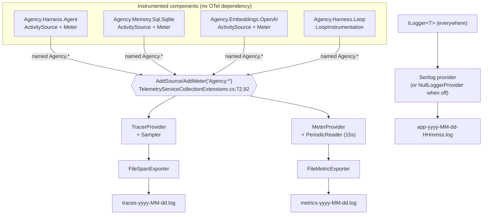

# Governance & Actionable Insights through Observability

> **What this document is.** The single, self-contained reference for Agency's *observability* layer —
> the seam where work the agent actually did (a turn, a tool call, a database query, a loop run)
> becomes a **trace**, a **metric**, and a **log line** you can later read, slice, and act on. It is
> written in **two parts**: **Part I** is a gentle, code-free tour (plain English, analogies, no
> symbols); **Part II** is the implementation deep dive for engineers about to read or change the code
> (real types, `file:line` references, and the design principles behind them). The two cover the same
> system at different depths — read Part I for *what* and *why*, Part II for *how*.
>
> This doc is the close sibling of two others. [The Capability Layer](The%20Capability%20Layer%20-%20Tools%2C%20MCP%2C%20and%20Progressive%20Disclosure.md)
> is the boundary where a tool call becomes an effect; this document is how that effect (and every
> other) becomes a *record*. [Consent at the Tool Boundary](Consent%20at%20the%20Tool%20Boundary%20-%20The%20Permission%20Model.md)
> decides whether a call runs; this layer reports what happened either way. Where those leave off, this
> picks up — and unlike them, it spans the *whole* solution, not just the harness.

An agent that does work silently is an agent you cannot govern. You cannot answer "which model is
costing us money," "how often does the goalkeeper say *continue*," "is the vector search slow because
of the database or the embedder," or "did that tool call actually fail" — unless every one of those
events left a record on the way past. **Observability is the layer that makes the agent's behaviour
legible: to an operator deciding policy, to an engineer chasing a regression, and to a finance owner
counting tokens.** This document is about how Agency emits that record uniformly across sixteen-odd
components, subscribes to it with a single wildcard, and writes it somewhere you can read — all on
OpenTelemetry, and all without a single component knowing where its data ends up.

---

# Part I · The Gentle Tour

> **Which part is this?** The code-free introduction. No C#, no file paths — just the ideas and why
> they're shaped the way they are. Ready for the implementation? Skip to
> [Part II](#part-ii--the-implementation-deep-dive).

Agency is an open-source .NET framework for building AI agents. An agent is a program that calls a
language model in a loop, lets it use tools, and feeds the results back until the job is done. The
observability layer answers a different question from the tool and permission layers. They ask *"may
this happen?"* and *"what runs?"*. Observability asks, after the fact:

> "What just happened — and can I prove it, measure it, and act on it?"

### If you only remember five ideas

**1. Three kinds of record, one vocabulary.**
Everything the system emits is one of three shapes. A **trace** is a timeline — "this turn took 4
seconds, and inside it this tool call took 800ms." A **metric** is a running tally — "1,240 turns so
far, 90% successful." A **log** is a human-readable note — "MCP server X was unreachable." Traces tell
you *where time and failures went*, metrics tell you *how much and how often*, logs tell you *what, in
words*. Every component speaks all three through the same standard library (OpenTelemetry), so they
compose instead of each inventing its own.

**2. Components opt in by *naming themselves*, not by registering.**
Each part of Agency — the agent loop, the memory store, the SQL runner, the embedder, the loop kit —
names its own little broadcast channel `Agency.<something>`. The host, at the very edge, says one
thing: *"subscribe me to everything called `Agency.*`."* Add a new library tomorrow, name its channel
`Agency.MyThing`, and it shows up in the logs with zero host changes. The naming convention **is** the
subscription.

**3. Every record is tagged, and the tags are the point.**
A raw count of "turns" is nearly useless. A count of turns *tagged by model and by outcome* lets you
ask "what's the success rate of the cheap model versus the strong one?" The tags — `model`,
`client_type`, `outcome`, `verdict`, `token.type` — are the dimensions you slice along later. Choosing
them well is the difference between data you *have* and insight you can *act on*.

**4. The components don't know where their data goes.**
A memory store emits "search took 12ms" into thin air. It has no idea a file is being written, or a
dashboard updated, or nothing at all listening. The decision of *where it lands* — a file today, a
cloud collector tomorrow — is made once, by the host, far away from the code doing the work. That
separation is what lets the same instrumented code run in a test, on a laptop, and in production
untouched.

**5. Observability is also a governance dial.**
The same wiring that exports data also *governs* it. You can turn any of the three signals off
entirely. You can sample only a fraction of traces to control cost. You can raise the log level so
only warnings survive. And in the test environment the whole thing is deliberately tamed so runs stay
byte-for-byte reproducible. Seeing everything is a choice with a price, and the layer is built to let
the operator set that price.

### The three signals, in plain terms

Picture a delivery company.

- **A trace is the parcel's journey** — picked up at 9:00, sorted at 9:40, on the van at 10:15,
  delivered at 11:02. If it arrived late, the journey shows you *which leg* was slow. In Agency a
  trace is one agent turn, and its "legs" are the tool calls and database queries nested inside it.
- **A metric is the depot's daily board** — "1,240 parcels handled, 96% on time, average 3 hours." It
  doesn't track any single parcel; it's the rolled-up tally you watch to spot trends. In Agency that's
  "turns," "tokens," "errors," "loop runs by outcome."
- **A log is the dispatcher's notebook** — "10:30, van 4 broke down on Route 9." Words, for a human,
  when something needs explaining. In Agency that's Serilog writing "couldn't reach the embeddings
  endpoint."

You need all three. Metrics tell you *something* is wrong (error rate jumped). Traces tell you *where*
(the embedding leg). Logs tell you *what* (the endpoint refused the connection).

### One example, start to finish

The agent runs one turn that reads a file and then searches memory.

- As the turn begins, a **trace** span opens — `Agent.ChatAsync` — tagged with the model and provider.
- Inside it, the file read and the memory search each open their own nested span, so the trace becomes
  a little tree: the turn, and its children.
- The memory search, deep in the SQLite store, also bumps a **metric** — "one more search, and it took
  12ms" — tagged with nothing the store had to be told; it just records what it knows.
- The turn finishes. The agent bumps its own metrics: one more turn, plus the tokens the model used,
  tagged input versus output, tagged by model.
- If anything had thrown, a **log** line would have captured it in words, and the span would be marked
  failed.
- None of these components addressed a file or a server. They emitted into the standard library. The
  host — wired up once, at startup — caught everything named `Agency.*` and wrote the spans, the
  metrics, and the logs to three rolling files on disk.

The agent never knew it was being watched. The memory store never knew a file existed. And yet the
whole turn is now reconstructable: how long it took, where the time went, how many tokens it cost, and
whether anything broke. **That is the entire design in one trace: uniform signals, convention-based
capture, and a destination chosen far from the work.**

### Why it matters

- **Governance.** An operator can see, limit, and price what the agent does — turn signals off, sample
  traces to control cost, raise the log floor — without touching a line of the components' code.
- **Actionable insight.** Because every record is tagged by model, provider, and outcome, the data
  answers real questions: cost per model, success rate per goal, which tool fails most, whether
  latency lives in the database or the network.
- **Uniformity.** One vocabulary (OpenTelemetry) across the harness *and* every library means a single
  mental model and a single subscription — not sixteen bespoke logging schemes.
- **Portability without risk.** Components emit into the void; the host decides the destination. Swap
  the file exporter for a cloud collector and not one instrumented line changes.

In one sentence: **Agency makes every meaningful thing the agent does emit a standard, tagged record —
captured by one wildcard, governed at one edge, and shaped so the data answers the questions an
operator and an engineer actually ask.**

---

# Part II · The Implementation Deep Dive

> **Which part is this?** The code-anchored companion — real types, `file:line` references, and the
> precise contracts. It is a strict superset of Part I: same system, full depth.

## 1. The Three Signals and the SDK Seam

Agency's observability rests entirely on **OpenTelemetry** plus .NET's built-in diagnostics
primitives. There are three signals, and each maps to a standard type the .NET runtime already ships:

| Signal | Emitted with | Standard type | "Subscriber" the host attaches |
|---|---|---|---|
| **Traces** | `ActivitySource.StartActivity(...)` → `Activity` | `System.Diagnostics.ActivitySource` | `TracerProvider` |
| **Metrics** | `Meter.CreateCounter/CreateHistogram` → `.Add()/.Record()` | `System.Diagnostics.Metrics.Meter` | `MeterProvider` |
| **Logs** | `ILogger<T>` | `Microsoft.Extensions.Logging` | Serilog provider |

The load-bearing fact is that **traces and metrics use the runtime's own types, not OpenTelemetry's.**
A component calls `ActivitySource.StartActivity` and `Counter.Add` — BCL APIs with *no package
reference to OpenTelemetry at all*. OpenTelemetry enters only at the host edge, as a *listener* that
subscribes to those built-in sources. This is the same shape as the tool layer's "the SDK advertises;
the harness invokes" split: here, **the component emits; the host listens.**

`★ Insight — instrumentation has no OTel dependency.` Because `ActivitySource` and `Meter` live in
`System.Diagnostics`, a library like `Agency.Memory.Sql.Sqlite` can be fully instrumented while
depending on *nothing* from OpenTelemetry. If a consumer of that library never wires up a
`TracerProvider`, the `StartActivity` calls return `null` and cost almost nothing (`activity?.` —
every access is null-conditional). Instrumentation is therefore *always on in the code* and *only
materialised when someone listens* — you pay for observability exactly when you opt into it.

## 2. The Governance Keystone: One Wildcard, No Registry

The single most important design decision lives in three lines of the Console host's telemetry
extension (`src/Harness/Agency.Harness.Console/Telemetry/TelemetryServiceCollectionExtensions.cs`):

```csharp
private const string AgencyWildcard = "Agency.*";
// ...
.AddSource(AgencyWildcard)   // TracerProvider — :72
.AddMeter(AgencyWildcard)    // MeterProvider  — :92
```

Every instrumented component in the solution names its `ActivitySource` and `Meter` with the prefix
`Agency.` — `Agency.Harness.Agent`, `Agency.Memory.Sql.Sqlite`, `Agency.Embeddings.OpenAI`, and so on.
The host subscribes to the *pattern* `Agency.*`, so **any source matching the convention is captured
automatically.** There is no central list of sources to keep in sync, no per-library registration call,
no DI wiring per component.

`★ Insight — governance by convention, not configuration.` This inverts the usual telemetry chore.
Instead of "add your new meter to the central registration," the contract is "name your meter
`Agency.<Yourname>` and you're in." A new library author opts into the entire observability pipeline by
*spelling their source name correctly*. The flip side — the governance responsibility — is that the
naming convention is load-bearing: a source named `MyCompany.Thing` would emit into the void, silently
unseen. The convention is the access-control list.

### 2.1 The instrumented-component inventory

The wildcard captures the following sources and meters (each name is both the `ActivitySourceName` and
the `MeterName` for that component, by convention):

| Component | Source / Meter name | Representative spans | Representative metrics |
|---|---|---|---|
| Agent loop | `Agency.Harness.Agent` | `Agent.ChatAsync`, `agent.tool.invoke` | `agent.turns`, `agent.errors`, `agent.turn.duration`, `agent.tokens`, `agent.tool.calls` |
| Console session | `Agency.Harness.Console` | `ConsoleChatSession.RunAsync` | `agent.console.sessions/errors/commands/turns/tokens`, `agent.console.session.duration` |
| Loop Kit | `Agency.Harness.Loop` | `Loop.RunAsync`, `loop.turn`, `loop.goalkeeper` | `loop.runs`, `loop.turns`, `loop.verdicts`, `loop.tokens`, `loop.run.duration`, `loop.turn.duration` |
| Model registry | `Agency.Harness.Models` | model resolution | — |
| Memory store (SQLite/PG) | `Agency.Memory.Sql.Sqlite` / `.Postgres` | `memory.upsert`, `memory.search` | `memory.upsert.count/duration`, `memory.search.count/duration` |
| Key-value store | `Agency.KeyValueStore.Sql.Sqlite` / `.Postgres` | KV ops | — |
| Vector store | `Agency.VectorStore.Sql.Sqlite` / `.Postgres` | vector ops | — |
| SQL runner | `Agency.Sql.Sqlite` / `.Postgres` | `{db}.execute`, `{db}.query` | — |
| Memory background services | `Agency.Memory.Hygiene` / `.Consolidator` / `.Distiller` | sweep / consolidate / distill | — |
| Embeddings | `Agency.Embeddings.OpenAI` | `embedding.generate`, `embedding.generate_batch` | `embedding.requests`, `embedding.duration`, `embedding.tokens` |
| Ingestion | `Agency.Ingestion` | pipeline stages | — |

The pattern is uniform: a `public const string ActivitySourceName` / `MeterName`, a `static readonly
ActivitySource` and `Meter` built from them, and `static readonly` instrument fields created once per
process. The Loop Kit factors this into a dedicated `LoopInstrumentation` static class
(`src/Harness/Agency.Harness/Loop/LoopInstrumentation.cs`); most components declare the instruments
inline at the top of their primary type (e.g. `Agent.cs:22-47`).

## 3. Wiring It Up: `AddTelemetry`

The host owns the OpenTelemetry SDK; no library references it. `AddTelemetry(IConfiguration)`
(`TelemetryServiceCollectionExtensions.cs:31`) is called first in `Program.cs`
(`builder.Services.AddTelemetry(builder.Configuration)`) and builds up to three independent pipelines
from the `OpenTelemetry` configuration section, bound to `TelemetryOptions`
(`src/Harness/Agency.Harness.Console/Telemetry/TelemetryOptions.cs`).

```csharp
TelemetryOptions options = new();
configuration.GetSection("OpenTelemetry").Bind(options);
Directory.CreateDirectory(options.FileExport.OutputDirectory);

ResourceBuilder resource = ResourceBuilder.CreateDefault()
    .AddService(options.ServiceName)
    .AddAttributes(new Dictionary<string, object> { ["host.name"] = Environment.MachineName });   // :40-45

AddTracerProvider(services, options, resource);
AddMeterProvider(services, options, resource);
AddLogging(services, options);
```

The **resource** — the OTel concept of "who is emitting this" — is built once and shared across all
signals. It carries the `ServiceName` and a `host.name` attribute set to the machine name (`:44`). That
single attribute is the governance hook for *attribution*: every span and metric, regardless of which
of the sixteen components produced it, is stamped with the host it ran on.

### 3.1 Three independently-disableable pipelines

Each signal is built behind an `Enabled` gate, so an operator can run traces-only, metrics-only,
logs-only, or any combination:

- **Traces** (`AddTracerProvider`, `:54`). Builds a `TracerProvider` with the `Agency.*` source, a
  sampler, and a `SimpleActivityExportProcessor` wrapping `FileSpanExporter`. Disabled →
  no provider is built at all (`:59-62`).
- **Metrics** (`AddMeterProvider`, `:80`). Builds a `MeterProvider` with the `Agency.*` meter and a
  `PeriodicExportingMetricReader` over `FileMetricExporter`, firing every `ExportIntervalMs`
  (default 15,000). Disabled → no provider.
- **Logs** (`AddLogging`, `:102`). Configures Serilog to a per-session file. **Disabled is not the same
  as absent**: when logging is off, a `NullLoggerProvider` is registered (`:108`) so every
  `ILogger<T>` injection in the graph still resolves — the chain stays valid, it just discards.

`★ Insight — "off" still satisfies the contract.` The logging branch is the subtle one. Components
take `ILogger<T>` as a hard constructor dependency; if "disabled" meant "register nothing," DI would
fail to construct half the graph. Registering the *null* provider keeps the dependency satisfiable
while emitting nothing — the same pattern the harness uses elsewhere (`NullLogger<T>.Instance` as the
fallback in store constructors, e.g. `SqliteMemoryStore.cs:78`). Disabling a signal must never break
construction.



## 4. The Tag Conventions — Where "Actionable" Lives

A count with no dimensions is a number; a count *with* dimensions is an analysis. Agency's instruments
are tagged consistently so the exported data can be sliced after the fact. The recurring tag
vocabulary:

| Tag | Set by | Lets you answer |
|---|---|---|
| `agent.model` / `agent.client_type` | Agent, Console, Loop — every instrument | "Cost and success rate *per model / per provider*" |
| `agent.token.type` = `input` \| `output` | token counters | "Input vs. output token split (they price differently)" |
| `agent.tool.name` | `agent.tool.calls`, `agent.tool.invoke` span | "Which tool is called most / fails most" |
| `outcome` = `achieved` \| `cap_reached` \| `budget_exceeded` \| `error` \| `cancelled` | Loop run metrics | "How do autonomous loops *end*?" |
| `verdict` = `continue` \| `done` | `loop.verdicts` | "How decisive is the goalkeeper?" |
| `role` = `worker` \| `goalkeeper` | `loop.tokens` | "Token spend split between doing and judging" |
| `gen_ai.system` / `gen_ai.request.model` / `operation` / `status` | Embeddings | "Embedding throughput and failure rate by model" |

`★ Insight — the embeddings layer follows OTel GenAI semantic conventions.` The embedder tags its
spans with `gen_ai.system`, `gen_ai.operation.name`, `gen_ai.request.model`, and
`gen_ai.response.usage.input_tokens` (`EmbeddingGenerator.cs:83-86,157`) — the *standardised* GenAI
attribute names, not ad-hoc ones. This is a governance choice with teeth: a downstream OTel-native
dashboard that understands GenAI conventions will render the embedder's data with zero custom mapping.
The agent's own tags (`agent.model`, `agent.tokens`) predate that convention and use the `agent.`
namespace; aligning them is noted future work (§10).

## 5. Inside the Agent: Spans, Metrics, and the Token Delta

The agent loop is the richest instrumentation site. Its instruments are declared once, statically
(`src/Harness/Agency.Harness/Agent.cs:22-47`): five metrics (`agent.turns`, `agent.errors`,
`agent.turn.duration`, `agent.tokens`, `agent.tool.calls`) and one `ActivitySource`.

A turn opens a root span and tags it with the model and provider up front
(`Agent.cs:178-180`):

```csharp
using var activity = _activitySource.StartActivity("Agent.ChatAsync");
activity?.SetTag("agent.model", this._model);
activity?.SetTag("agent.client_type", this._clientType);
```

Each tool call opens a **nested** span — `agent.tool.invoke`, `ActivityKind.Internal` — tagged with the
tool name (`Agent.cs:811-814`), and its status is set from the tool's *soft* failure channel:

```csharp
toolActivity?.SetStatus(result.IsError ? ActivityStatusCode.Error : ActivityStatusCode.Ok,
                        result.IsError ? result.Content : null);   // :819
```

A tool that *throws* additionally records an exception **event** on the span (`Agent.cs:835`) — events
are timestamped markers *within* a span, distinct from tags. The result is that a single trace shows
the turn, every tool call nested inside it, which ones failed, and *how* (soft `IsError` vs. thrown
exception).

`★ Insight — the metric dispatch keys off the same name the registry does.` The `agent.tool.calls`
counter is tagged `agent.tool.name` with the *exact* tool name the registry dispatched by — the same
string the permission gate and hooks key on. Because the whole stack (dispatch, permission, hook,
metric, span) shares one identifier, you can join "this tool was denied" (permission), "this tool was
slow" (span), and "this tool is called 400×/day" (metric) on a single key. A generic "proxy"
dispatcher that masked the real name would have broken that join — the same reason progressive
disclosure preserves real names (see [The Capability Layer §6.3](The%20Capability%20Layer%20-%20Tools%2C%20MCP%2C%20and%20Progressive%20Disclosure.md)).

### 5.1 Why token counters record *deltas*

Token usage on a `ChatSession` is **cumulative** — `TotalUsage.InputTokens` only grows. But a
`Counter<long>` is itself monotonic and expects *increments*. Feeding it the running total every turn
would count turn 3's tokens three times. So the hot paths snapshot usage before and after and emit the
**difference**. The Loop Kit makes this explicit (`LoopRunner.cs:107-126`):

```csharp
long prevInputTokens = this._session.TotalUsage.InputTokens;
// ... one ordinary agent turn ...
long workerInputDelta = this._session.TotalUsage.InputTokens - prevInputTokens;
EmitWorkerTokens(workerInputDelta, workerOutputDelta, workerModel, workerClientType);
```

The Console session does the same at session granularity, tagging each token slice `input`/`output`
and stamping the span with the final totals (`ConsoleChatSession.cs:344-359`). **Cumulative state in,
incremental metric out** — get this wrong and every token chart double-counts.

## 6. The Loop Kit: Outcomes, Verdicts, and Span Events

The Loop Kit (the autonomous goal-driven loop) is the newest instrumentation and the cleanest example
of *insight-shaped* telemetry. It centralises everything in `LoopInstrumentation`
(`Loop/LoopInstrumentation.cs`) — four counters, two histograms, one source — explicitly mirroring the
`Agent` pattern.

Its spans nest three deep (`LoopRunner.cs`): `Loop.RunAsync` (the whole run, `:88`), `loop.turn` (one
worker turn, `:101`), and `loop.goalkeeper` (the deterministic gate that decides continue/done, `:220`).
The governance-relevant moves:

- **The run's *outcome* is a single tag, set on every terminal branch.** A local `outcomeTag` string
  starts at `"error"` and is overwritten as the run reaches each exit — `achieved`, `cap_reached`,
  `budget_exceeded` (`LoopRunner.cs:261,277,289`). In the `finally`, it is recorded once onto both the
  `loop.runs` counter and the `loop.run.duration` histogram, and stamped on the root span
  (`:319-324`). One tag turns "how do my autonomous loops end?" into a group-by.
- **The verdict is recorded as a span *event* on two spans.** When the goalkeeper rules, a `loop.verdict`
  event (carrying `verdict` and `reason`) is attached to *both* the goalkeeper span and the enclosing
  turn span (`LoopRunner.cs:234-247`), and a `loop.verdicts` counter is bumped. Attaching it to the
  turn span means you can read a turn's outcome without descending into its child.

`★ Insight — defaulting the outcome tag to `error` is fail-safe telemetry.` `outcomeTag` is initialised
to `"error"` and only *upgraded* on a clean exit. If a future code path adds a new `yield break`
without setting the tag, the run is recorded as an error rather than silently mislabelled as success —
the metric fails toward "something went wrong," which is the safe direction for a number an operator
trusts. It mirrors the permission layer's "deny wins" instinct: when in doubt, report the worse case.

The Loop also respects the permission model's *park* semantics in its telemetry: a parked turn
(awaiting human permission) runs no code, so it is *not* counted as a terminal outcome and the goal is
deliberately **not** cleared (`LoopRunner.cs:326-332`) — the run resumes later and reaches its real
outcome then. Observability and consent compose without either knowing the other's internals.

## 7. The Libraries: Uniform Client-Span Shape

Every storage and embedding library follows one micro-pattern, so a trace through a memory search looks
the same whether the backend is SQLite or Postgres. Taking the SQLite memory store
(`src/Memory/Agency.Memory.Sql.Sqlite/SqliteMemoryStore.cs`) as the archetype:

```csharp
using var activity = _activitySource.StartActivity("memory.upsert", ActivityKind.Client);   // :86
var sw = Stopwatch.StartNew();
try { /* work */ }
finally { _upsertCount.Add(1, tags); _upsertDuration.Record(sw.Elapsed.TotalMilliseconds, tags); }
```

Three conventions hold across the libraries:

- **`ActivityKind.Client`** marks these as outbound calls to a dependency (a database, an HTTP
  embedding endpoint) — distinct from the agent's `Internal` spans. In a trace tree, that kind is what
  tells you "this leg crossed a process boundary."
- **Span + duration histogram + count counter, together.** The same operation yields a trace span (for
  *where* in one request), a histogram (for the *latency distribution* across requests), and a counter
  (for *throughput*). One instrumented method, three complementary views.
- **A shared base for SQL.** `SqlRunnerBase` (`src/Sql/Agency.Sql.Common/SqlRunnerBase.cs`) takes a
  provider-specific `ActivitySource` in its constructor and emits `{db}.execute` / `{db}.query` spans
  (`:65,121,198`), so Postgres and SQLite differ only in the `dbSystem` prefix, not in the
  instrumentation logic.

This is why a single trace can show `Agent.ChatAsync` → `agent.tool.invoke` → `memory.search` →
`sqlite.query` as one nested timeline spanning four assemblies — they all feed the same `Agency.*`
subscription, and parent/child links are stitched automatically by `Activity.Current`.

## 8. The File Exporters — A Swappable Destination

Agency ships **file** exporters rather than pushing to an OTLP collector. This is a deliberate,
open-source-friendly default: zero external infrastructure, everything readable on disk with a text
editor. Crucially, it is *swappable* — both exporters derive from OpenTelemetry's `BaseExporter<T>`, so
replacing them with the stock OTLP exporter is a host-edge change touching no instrumented component.

### 8.1 `FileSpanExporter`

`FileSpanExporter` (`src/Harness/Agency.Harness.Console/Telemetry/FileSpanExporter.cs`) writes **one
span per line**: timestamp, `TraceId`, `SpanId`, parent, name, kind, status, duration, then every tag
and event appended inline (`:28-48`). It is wired behind a `SimpleActivityExportProcessor` (`:73`),
meaning spans are exported **synchronously as each completes** — simple and immediate, the right
trade-off for a local file (no batching latency to reason about).

### 8.2 `FileMetricExporter`

`FileMetricExporter` (`FileMetricExporter.cs`) is pulled on a timer by the
`PeriodicExportingMetricReader` (default every 15s) and writes a **timestamped block** per cycle,
walking each metric's points and formatting by `MetricType` — `LongSum`, `DoubleGauge`, `Histogram`
(`count=… sum=…`), each with its tags (`:33-60`). Metrics are thus a periodic *snapshot of running
aggregates*, not an event-per-measurement stream — which is exactly what a counter or histogram is.

### 8.3 The shared sink: `DailyRollingFileWriter`

Both exporters write through `DailyRollingFileWriter`
(`src/Harness/Agency.Harness.Console/Telemetry/DailyRollingFileWriter.cs`), a small thread-safe writer
that rolls at **UTC midnight** (`:66-81`). Three details carry weight:

- **A single `lock` guards write, flush, and roll** (`:31,50,86`) — exporters can be called from
  multiple threads (the periodic reader runs on its own), so serialization is mandatory.
- **`AutoFlush = false` plus explicit `Flush()`** (`:80, :48`) — buffered for throughput, flushed at the
  end of each export batch so a crash loses at most the last unflushed batch.
- **`FileShare.Read`** (`:79`) — the file can be tailed live while the process writes it.

The logs signal is the odd one out: it does **not** use `DailyRollingFileWriter`. Serilog writes to a
**per-session** stamped file `app-yyyy-MM-dd-HHmmss.log` with `RollingInterval.Infinite`
(`TelemetryServiceCollectionExtensions.cs:117-134`) — a fresh file each process start — plus a
size-based roll and a 30-file retention cap. `Microsoft` and `System` log sources are floored at
`Warning` (`:124-125`) so framework noise never drowns the agent's own lines.

## 9. Governance Dials: Sampling, Levels, and the Test Skip

The same wiring that *exports* is where an operator *governs*. The dials, all in the `OpenTelemetry`
config section:

- **Per-signal kill switches.** `Traces.Enabled`, `Metrics.Enabled`, `Logs.Enabled` each suppress an
  entire pipeline (§3.1).
- **Trace sampling for cost control.** `SamplingRatio` (default `1.0`) is clamped to `[0,1]` and chooses
  the sampler: `AlwaysOnSampler` at `1.0`, otherwise a `ParentBasedSampler(TraceIdRatioBasedSampler)`
  (`TelemetryServiceCollectionExtensions.cs:64-67`). *Parent-based* matters: a sampled-in parent keeps
  its children, so you never get a half-recorded trace tree.
- **Log floor.** `Logs.MinimumLevel` (default `Information`) sets how much survives.
- **Metric cadence.** `Metrics.ExportIntervalMs` trades freshness against file volume.

`★ Insight — the Test environment is governed *into determinism*.` The functional tests replay LLM
traffic from an offline HTTP cache, and the cache key is a hash of the exact request body. Anything
that varies per run — wall-clock time, MCP-discovered tools — would change that body and break replay.
Observability participates in this discipline: the host registers a `FixedTimeProvider` under
`DOTNET_ENVIRONMENT=Test` (`Program.cs:176-180`) so the "current time" the agent stamps is frozen, and
MCP discovery is skipped so the tool list is stable. The same instrumentation runs in Test; it is the
*inputs* that are pinned, so traces and the request bodies they describe stay byte-stable. Governance
here means *reproducibility*, not just cost.

## 10. Accuracy Footnotes

A few precise points worth stating so the reference is honest:

- **The LLM clients carry no `ActivitySource` of their own.** `OpenAIClient` and `ClaudeClient` are
  *not* directly instrumented in the current source, despite an older note in `Agents/Architecture.md`
  ("every client … with full OpenTelemetry instrumentation") implying otherwise. Token and latency
  attribution for model calls happens one layer up, in the `Agent` (`agent.tokens`,
  `agent.turn.duration`, span tags `agent.usage.*`). Treat the Architecture.md line as aspirational /
  stale; this document reflects what ships.
- **Logs are Serilog, not the OTel logging signal.** Agency wires Serilog behind
  `Microsoft.Extensions.Logging` and exports to its own file. It is *not* the OpenTelemetry logs
  pipeline (`OpenTelemetry.Logs`). The three signals share the `AddTelemetry` entry point and the
  output directory, but logs travel a different road than traces and metrics.
- **File exporters, not OTLP.** There is no collector, no network export, in the shipped host. The
  exporters are `BaseExporter<T>` subclasses precisely so an OTLP exporter could be dropped in without
  touching instrumented code — but that swap has not been made.
- **Source name == meter name, by convention.** Each component sets `ActivitySourceName` and `MeterName`
  to the *same* string. Nothing enforces this; it is a convention that keeps the `Agency.*` wildcard
  covering both signals with one prefix.
- **`host.name` is the only custom resource attribute.** Attribution beyond service + host (e.g. a
  deployment or environment tag) is not yet emitted.
- **Tag namespaces are not yet unified.** The agent uses `agent.*`; the embedder uses the OTel `gen_ai.*`
  GenAI convention. Both are intentional, but a future pass aligning the agent onto `gen_ai.*` is open
  work.

---

## Final Takeaway

If you want the shortest possible summary:

> Every meaningful unit of work in Agency — a turn, a tool call, a query, a loop run — emits a trace,
> a metric, and (where it matters) a log, using the .NET runtime's own diagnostics types with no
> dependency on OpenTelemetry. Each component opts in by naming its source `Agency.*`; the Console host
> subscribes to that one wildcard, governs it with per-signal switches and sampling, and writes the
> result to rolling files through swappable `BaseExporter`s. The tags — model, provider, outcome,
> verdict, token type — are chosen so the exported data answers an operator's and an engineer's real
> questions, and the Test environment is pinned so the same instrumentation stays reproducible.

Or, in one sentence:

**Agency turns "an agent that does work" into "an agent whose every action is a standard, tagged,
governable record" — captured by one wildcard, priced at one edge, and shaped to be acted on.**
