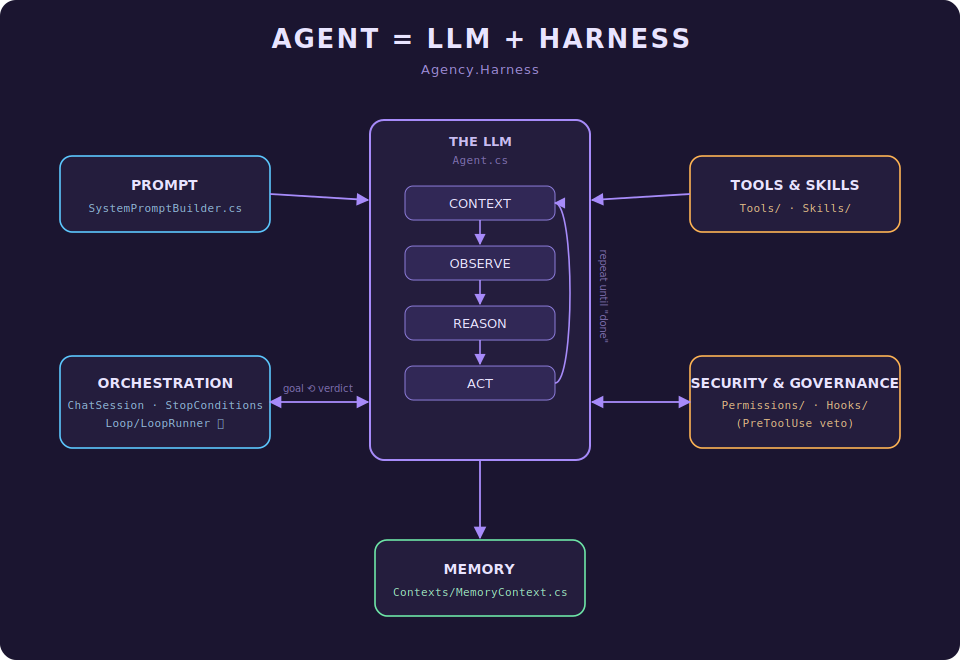

# Agency.Harness — Architecture

> **Mental model:** `AGENT = LLM + HARNESS`.
> The **LLM** is the thinking loop (Context → Observe → Reason → Act). The **harness** is everything the
> model can't do for itself: how it's prompted, what it may touch, what it remembers, who drives the turns,
> and what's fenced off. This document maps that model onto the actual `Agency.Harness` codebase.

This page covers the **harness** specifically (`src/Harness/Agency.Harness`). For the solution-wide RAG
pipeline (embeddings → pgvector → query → LLM) and the full documentation map, see the [Documentation Home](Home.md).

> **Looking for a specific project?** The [`docs/Projects/`](Projects/) folder has a per-project reference
> page for every assembly in the solution (one `Agency.*.md` per project) — a starting point for developers
> and LLMs orienting in an unfamiliar part of the codebase.

---

## The picture

*(Each box is relabelled to the code that implements it.)*

---

## The model in one paragraph

The **centre** is the LLM running a `Reason → Act → Observe` cycle — what `Agent.cs` calls the *agent
loop* — fed by **Context**. One pass: the model reasons about what to do, calls a tool (Act), the result
is fed back (Observe), repeat until a stop condition fires. Everything around it is the **harness**: the
five satellite boxes are the capabilities and guardrails the model is wrapped in. The harness is also
*where the hard guarantees live* — anything that must not be skippable (permissions, governance, loop
caps) is code in a satellite, not an instruction in the prompt.

---

## Component map — diagram box → code

| Box | Where it lives | What it does | Deep dive |
|---|---|---|---|
| **The LLM** (Context/Observe/Reason/Act) | `Agent.cs` | The Reason→Act→Observe loop; runs one *turn* per `ChatSession.SendAsync`, many LLM *iterations* inside a turn. | [How the Agent Loop and Context Work Together](How%20the%20Agent%20Loop%20and%20Context%20Work%20Together.md) |
| **CONTEXT** | `Contexts/` — `Context.cs`, `SessionContext`, `FocusContext`, `KnowledgeContext`, `TemporalContext`, `EnvironmentalContext`… | The composed, harness-owned state injected into the model each turn. | [How the Agent Loop and Context Work Together](How%20the%20Agent%20Loop%20and%20Context%20Work%20Together.md) |
| **PROMPT** | `SystemPromptBuilder.cs` | Assembles the system prompt (instructions, tool catalog, skill descriptions). | — |
| **TOOLS & SKILLS** | `Tools/` + `Skills/` | `ITool` implementations (read/write file, PowerShell, MCP proxy…) and the `SKILL.md` progressive-disclosure system surfaced through the `skill` meta-tool (`SkillTool.cs`). | [The Capability Layer — Tools, MCP & Progressive Disclosure](The%20Capability%20Layer%20-%20Tools%2C%20MCP%2C%20and%20Progressive%20Disclosure.md) · [How Agency's Skills Model Works](How%20Agency%27s%20Skills%20Model%20Works.md) |
| **MEMORY** | `Contexts/MemoryContext.cs`, `MemoryRecord.cs` | Recall/persist facts across turns. | [How Agency Gives AI Agents Memory](How%20Agency%20Gives%20AI%20Agents%20Memory.md) |
| **SECURITY & GOVERNANCE** | `Permissions/` (`PermissionEvaluator`, rules, file store) + the `OnPreToolUse` veto and shipped `BlockListHooks` / `AuditHooks` | Deterministic veto/audit *around* the model — enforced, not requested. | [Consent at the Tool Boundary — The Permission Model](Consent%20at%20the%20Tool%20Boundary%20-%20The%20Permission%20Model.md) · [How Hooks Work](How%20Hooks%20Work.md) · [Governance & Actionable Insights through Observability](Governance%20%26%20Actionable%20Insights%20through%20Observability.md) |
| **ORCHESTRATION** | `ChatSession.cs`, `StopConditions.cs`, and `Loop/LoopRunner` (Loop Kit) | Drives turns, accumulates history, decides whether to loop again. | [Loop Kit — Spec](Planned/Loop%20Kit%20-%20Spec.md) |

> **Note on Hooks.** Hooks are a general 9-point lifecycle mechanism (`AgentHooks`), not a security
> construct — only `OnPreToolUse` (the allow/block/rewrite veto) plus the shipped `BlockListHooks` /
> `AuditHooks` land in Security & Governance. The rest of the spine serves other boxes: `OnPreIteration`
> injects retrieval into **Context** / **Memory**; `OnStop` / `OnPostToolUse` / `OnAssistantTurn` feed
> **observability**; `OnSessionStarted` / `OnUserPromptSubmit` / `OnPostToolBatch` / `OnSessionEnd` are
> **orchestration**. Hooks are best read as a cross-cutting *extension spine* that runs through every box,
> filed here under their most safety-critical use.

---

## The agent loop & turns

- **Turn** = one `ChatSession.SendAsync(...)` call: a message in, a final `AgentResultEvent` out. A turn
  may run many internal LLM iterations (each a Reason→Act→Observe pass) before it settles.
- **`ChatSession`** is the multi-turn driver and holds conversation state across turns via a lazily-created
  `Context`. It is **not thread-safe** — turns run strictly sequentially.
- **`StopConditions`** end a turn on *structural* signals (model stopped requesting tools; iteration ceiling).
  These are cheap and reliable, but they answer "did the model stop talking?", **not** "is the job actually
  done?".
- The event stream (`AgentEvents.cs`) is how hosts render progress without polling — `AssistantTurnEvent`,
  `ToolInvokedEvent`, `AgentResultEvent`, etc.

---

## Orchestration is the box that's growing teeth — Loop Kit

In the diagram *Orchestration* is a single box, but in this codebase it's the area under active
development, because structural stop conditions don't guarantee a task is **finished to a checkable bar**.
That gap is what **Loop Kit** (`src/Harness/Agency.Harness/Loop/`, see
[`docs/Planned/Loop Kit - Spec.md`](../docs/Planned/Loop%20Kit%20-%20Spec.md)) closes.

The core idea is the **soft/hard split**:

- **Soft (model-driven):** behaviour you *ask* for in a prompt. The model usually complies but *can* skip
  it. Right for reasoning-shaped work — **Plan** and **Work** are authored as **Skills**.
- **Hard (code-enforced):** behaviour the model *cannot* route around. Right for gates and caps — the
  **done-check** and the **turn/budget ceiling** are code in the `LoopRunner`.

Loop Kit adds, without forking the agent loop:

| Piece | Role | Soft/Hard |
|---|---|---|
| `plan` / loop skills | decompose + drive the work | soft (Skills) |
| `GoalState` + `enable_goalkeeper` / `disable_goalkeeper` tools | arm/disarm a per-session done-check | — |
| **Goalkeeper** (`Goalkeeper.cs`, cheap separate `IChatClient`) | after every turn, read the transcript and return `Verdict.Continue(reason)` / `Done(reason)` | **hard gate** |
| **`LoopRunner`** | re-issue turns carrying the verdict's reason as the next directive; enforce `MaxTurns`/`Budget`/`TokenBudget`; auto-clear the goal on terminal outcomes | **hard cap** |

It sits **above `ChatSession`, below the host** — composing existing primitives (Skills, `subagent_tool`,
`Models`) plus one tool and one thin driver. When no goal is armed, `LoopRunner` runs exactly one
pass-through turn — behaviour identical to a plain `ChatSession` (zero tax when unused).

> Why not a Stop hook? `AgentHooks.OnStop` is **observe-only** — it sees the finished result but cannot
> veto termination or restart the loop. So the *decision to continue* must live where it can re-issue a
> turn: the session-level `LoopRunner`, not inside the agent loop.

---

## Nuances — where the diagram simplifies the code

- **Loop order.** The diagram reads `Observe → Reason → Act`; `Agent.cs` describes the cycle as
  `Reason → Act → Observe`. Same cycle, different entry point (the diagram starts where a turn starts — you
  observe the incoming result first).
- **Where Context sits.** The diagram places **Context** *inside* the loop. In code it's a harness-owned bundle
  (`Contexts/Context.cs`) that the harness *composes and injects* into the loop each turn — closer to a
  satellite than an inner step. Both framings are defensible; the diagram keeps Context inside the loop.
- **Tools & Skills as one box** matches a real design choice: skills are surfaced through the same
  tool-calling channel (`SkillTool.cs`), not a separate subsystem.
- **Security & Governance is a peer of the loop, not a step inside it** — enforced *around* the model
  (`Permissions/` + `Hooks/` `PreToolUse` veto), which is the same "hard, not soft" principle Loop Kit
  applies to its done-check.
