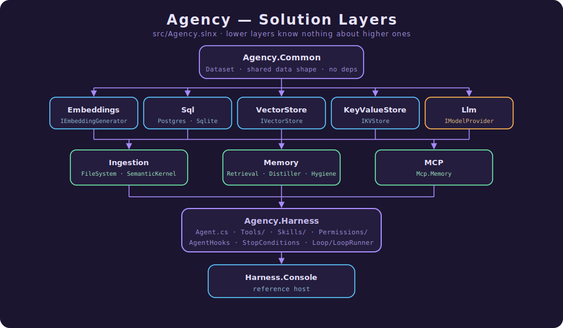

# Agency — Documentation Home

**Agency is a .NET 10 toolkit for building AI agents.** It has two halves that meet at the LLM:

- **A data plane** — a RAG pipeline: ingest content → generate embeddings → store in PostgreSQL/pgvector (or SQLite) → query → format results for a prompt.
- **An agent harness** — everything the model can't do for itself: how it's prompted, what tools it may call, what it remembers, who drives the turns, and what's fenced off. Mental model: **`AGENT = LLM + HARNESS`**.

This page is the **portal**. It is deliberately not comprehensive — it gives you the layers and the map so you (human or LLM) can jump straight to the right place without reading every file.

> **Two levels of detail below this page:**
> - **Narrative deep-dives** (this folder) explain *how* a subsystem works and *why*.
> - **[`Projects/`](Projects/)** has one terse reference page per assembly — the fastest way to orient inside an unfamiliar project.

> 🧭 **Prefer to read the code as a story?** The interactive [**Code Walkthrough**](walkthrough/code-walkthrough.html) traces one full agent turn through `Agency.Harness.Console` — `Program.Main` → DI wiring → the REPL wait → `LoopRunner` → `Agent`'s ReAct loop → streamed events — top to bottom, with a source excerpt and a `project · class · method` pointer at each step. A fast way to see the whole control flow before diving into the deep-dives below.

---

## Explore by topic — narrative deep-dives

| If you want to understand…                                                         | Read                                                                                                                                                  |
| ---------------------------------------------------------------------------------- | ----------------------------------------------------------------------------------------------------------------------------------------------------- |
| The agent loop, turns, and how context is composed each turn                       | [How the Agent Loop and Context Work Together](How%20the%20Agent%20Loop%20and%20Context%20Work%20Together.md)                                         |
| The harness architecture (the `AGENT = LLM + HARNESS` map onto code)               | [Harness Architecture](Harness%20Architecture.md)                                                                                                     |
| Tools, MCP, and progressive tool/skill disclosure                                  | [The Capability Layer — Tools, MCP, and Progressive Disclosure](The%20Capability%20Layer%20-%20Tools%2C%20MCP%2C%20and%20Progressive%20Disclosure.md) |
| The `SKILL.md` progressive-disclosure model                                        | [How Agency's Skills Model Works](How%20Agency%27s%20Skills%20Model%20Works.md)                                                                       |
| The 9-point lifecycle hook spine                                                   | [How Hooks Work](How%20Hooks%20Work.md)                                                                                                               |
| Permissions — the allow/block/rewrite veto at the tool boundary                    | [Consent at the Tool Boundary — The Permission Model](Consent%20at%20the%20Tool%20Boundary%20-%20The%20Permission%20Model.md)                         |
| Agent memory — recall and persistence across turns                                 | [How Agency Gives AI Agents Memory](How%20Agency%20Gives%20AI%20Agents%20Memory.md)                                                                   |
| Ingesting your own documents and retrieving them by meaning (the data plane / RAG) | [Ingestion and Semantic Search for Agents](Projects%20-%20Ingestion%20and%20Semantic%20Search%20for%20Agent.md)                                       |
| Observability, tracing, and governance metrics                                     | [[Governance and Actionable Insights through Observability]]                                                                                          |
| Driving an agent until the job is verifiably done (Loop Kit)                       | [Loop Kit — Driving an Agent Until the Job Is Actually Done](Loop%20Kit%20-%20Driving%20an%20Agent%20Until%20the%20Job%20Is%20Actually%20Done.md)     |

## Explore by project

Every assembly has a one-page reference under [`Projects/`](Projects/). Start there when you're about to touch a specific project.

---

## The layers

The solution (`src/Agency.slnx`) is grouped into subsystems. Each row links to that project's reference page; arrows show the main dependency direction (lower layers know nothing about higher ones).

### Foundation
| Project | Role |
|---|---|
| [Agency.Common](Projects/Agency.Common.md) | The `Dataset` type — the tabular shape query results flow through. No dependencies. |
| [Agency.RagFormatter](Projects/Agency.RagFormatter.md) | Renders a `Dataset` as a Markdown table ready to drop into a prompt. |
| [Agency.Configuration](Projects/Agency.Configuration.md) | `AddSharedConfiguration()` and `AddPlaceholderResolver()` — shared `appsettings` merging and `${Section:Key}` token resolution. |

### Embeddings
| Project | Role |
|---|---|
| [Agency.Embeddings.Common](Projects/Agency.Embeddings.Common.md) | `IEmbeddingGenerator` abstraction + batching. |
| [Agency.Embeddings.OpenAI](Projects/Agency.Embeddings.OpenAI.md) | OpenAI-compatible embedding implementation. |

### Storage
| Project | Role |
|---|---|
| [Agency.Sql.Common](Projects/Agency.Sql.Common.md) | Shared SQL plumbing. |
| [Agency.Sql.Postgres](Projects/Agency.Sql.Postgres.md) · [Agency.Sql.Sqlite](Projects/Agency.Sql.Sqlite.md) | Provider implementations. Each ships a `SQLQueryEmbedder` that rewrites `vectorize('<text>')` placeholders in a query into a pgvector literal using the injected `IEmbeddingGenerator`. |
| [Agency.VectorStore.Common](Projects/Agency.VectorStore.Common.md) → [Postgres](Projects/Agency.VectorStore.Sql.Postgres.md) · [Sqlite](Projects/Agency.VectorStore.Sql.Sqlite.md) | `IVectorStore` — similarity search over embeddings. |
| [Agency.KeyValueStore.Common](Projects/Agency.KeyValueStore.Common.md) → [Postgres](Projects/Agency.KeyValueStore.Sql.Postgres.md) · [Sqlite](Projects/Agency.KeyValueStore.Sql.Sqlite.md) | `IKVStore` — keyed storage with metadata search. |

### Ingestion
| Project | Role |
|---|---|
| [Agency.Ingestion](Projects/Agency.Ingestion.md) | Core ingestion pipeline into a vector store. |
| [Agency.Ingestion.FileSystem](Projects/Agency.Ingestion.FileSystem.md) · [Agency.Ingestion.SemanticKernel](Projects/Agency.Ingestion.SemanticKernel.md) | Source adapters (filesystem; Semantic Kernel chunking). |

### LLM
| Project | Role |
|---|---|
| [Agency.Llm.Common](Projects/Agency.Llm.Common.md) | `IModelProvider`, the `Model` descriptor, options, and tool types. |
| [Agency.Llm.Claude](Projects/Agency.Llm.Claude.md) · [Agency.Llm.OpenAI](Projects/Agency.Llm.OpenAI.md) | Provider factories. Each implements `IModelProvider` and produces a `Microsoft.Extensions.AI.IChatClient` wired with OpenTelemetry + logging middleware. |

### Memory
| Project | Role |
|---|---|
| [Agency.Memory.Common](Projects/Agency.Memory.Common.md) | Memory records, storage abstractions, ranking, and the hook surface. |
| [Agency.Memory.Retrieval](Projects/Agency.Memory.Retrieval.md) | Recall — surface relevant memories into context. |
| [Agency.Memory.Distiller](Projects/Agency.Memory.Distiller.md) · [Agency.Memory.Consolidator](Projects/Agency.Memory.Consolidator.md) · [Agency.Memory.Hygiene](Projects/Agency.Memory.Hygiene.md) | Write-side jobs: distil turns into facts, consolidate duplicates, prune. |
| [Agency.Memory.Sql.Postgres](Projects/Agency.Memory.Sql.Postgres.md) · [Agency.Memory.Sql.Sqlite](Projects/Agency.Memory.Sql.Sqlite.md) | Persistence backends. |

### MCP
| Project | Role |
|---|---|
| [Agency.Mcp.Memory](Projects/Agency.Mcp.Memory.md) | A standalone MCP server exposing a memory tool over the key-value store. |

### Harness
| Project | Role |
|---|---|
| [Agency.Harness](Projects/Agency.Harness.md) | The agent itself: the `Agent` loop, `ChatSession` turn driver, tools, skills, permissions, the hook spine, and Loop Kit. See [Harness Architecture](Harness%20Architecture.md). |
| [Agency.Harness.Console](Projects/Agency.Harness.Console.md) | A reference console host wiring the harness to LLM providers and memory. |

---

## Working in the repo

| Topic | Doc |
|---|---|
| Build, test, and run infrastructure | [`../Agents/BuildAndTest.md`](../Agents/BuildAndTest.md) |
| C# conventions and design principles | [`../Agents/CSharpPrinciples.md`](../Agents/CSharpPrinciples.md) |
| CI pipeline (Gitea Actions, offline functional-test cache) | [`../Agents/CIPipeline.md`](../Agents/CIPipeline.md) |
| Bug/task trackers | [`../Agents/Trackers.md`](../Agents/Trackers.md) |

### Infrastructure at a glance

- **PostgreSQL 18 + pgvector** via Docker (`src/docker-compose.yml`). Dev credentials: `dev_user` / `dev_password`, database `dev_db`, port `5432`.
- **SQLite** is the zero-infrastructure alternative for the same storage abstractions.
- **Functional LLM tests** target LM Studio at `http://llm.test:1234` (recorded responses make CI runs offline-deterministic).
