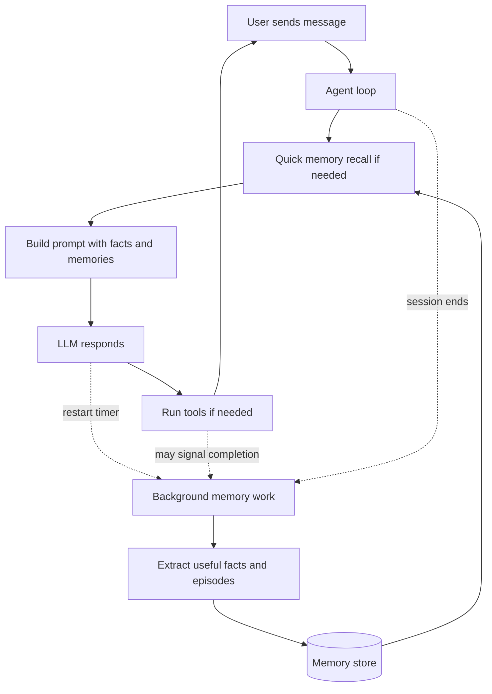

# How Agency Gives AI Agents Memory

> **Which memory doc is this?** This is the **gentle overview** — a code-free introduction to how
> Agency's memory system works and why it's designed that way, written for newcomers and non-specialists.
> Ready for the implementation, with real symbols and `file:line` references? See the companion
> [How Agency Gives AI Agents Memory: Implementation Deep Dive](How%20Agency%20Gives%20AI%20Agents%20Memory%20-%20Deep%20Dive.md).

## What Makes Agency Different

Agency is an open-source .NET framework for building AI agents that can do more than answer one prompt at a time.

The short version is this: it gives an agent a memory system without stuffing memory logic directly into the main agent loop.

If you only remember four ideas from this document, remember these:

### 1. Memory is attached, not baked in

The main loop of the agent does not "know" about memory.

Instead, memory plugs in through hooks (small callback points where extra behavior can run).

Why that matters:

- If memory is off, the loop stays lean.
- If memory is on, the agent gets recall and learning without rewriting the whole harness.
- The harness stays reusable for other agent scenarios.

### 2. The fast path stays fast

The hot path (the code running while the user is waiting) does as little memory work as possible.

The expensive work happens later in the cold path (background work that can run after the user already has a response).

That means:

- Recall is quick and selective.
- Writing new memories happens in the background.
- The user does not sit around waiting for memory cleanup jobs.

### 3. The agent only re-reads memory when something changed

Before running a meaningful search, Agency checks a simple timestamp called `LastWrittenAt`.

Plain-English meaning: "Did anything new get saved since the last time I looked?"

If the answer is no, the agent skips the retrieval work.

This avoids wasted compute and helps prevent "context rot" (when prompts get bloated with repeated or stale context).

### 4. Memory cleanup is treated as a real job

Agency has a dedicated cleanup layer called the Consolidator.

Its job is to tidy memory by merging duplicates, updating stale facts, and deleting records that no longer make sense.

Important detail: it can clean memory, but it cannot invent new memories out of thin air.

---

## Why These Design Choices Matter in a Real System

- They save tokens and time. The system avoids repeatedly searching or rewriting what it already knows.
- They reduce risk. Memory is scoped by user, so one user's memories are not visible to another.
- They recover cleanly from failures. Background jobs can restart without duplicating work.
- They keep retrieval useful. Search is not just "most similar text"; it also considers freshness, importance, and session relevance.
- They stay auditable. When memory is reorganized, the system can emit events so developers know what changed.

> Note: In a toy demo, you can get away with stuffing chat history into the prompt. In a real product, that becomes slow, expensive, and messy. Agency is designed for the real-product version.

---

## 1. The Core Problem: Why Do Agents Need Memory?

Most LLMs are stateless (they do not remember earlier interactions unless you pass that context back in).

So without a memory system, an agent is like a capable engineer who loses their notebook after every meeting.

That causes predictable problems:

- The agent keeps rediscovering the same facts.
- The user has to repeat preferences, goals, and background.
- The system wastes tokens rebuilding context it already had before.
- The agent cannot really "learn" from experience.

Memory changes that.

Instead of saying, "Please remember that I prefer Python," every time, the user can say it once and the agent can bring it back when it matters.

---

## 2. The Four Pillars of Agent Memory

Agency borrows the CoALA memory model. That name sounds academic, but the ideas are straightforward.

Think of the four pillars like this:

### Working Memory: the scratch pad

This is the current context window.

It holds what the agent is actively thinking about right now.

It is fast, but temporary.

(Like RAM in a computer, or notes on a whiteboard during a meeting.)

### Semantic Memory: the fact book

This is long-term factual knowledge.

Examples:

- "The user prefers Python."
- "This project uses PostgreSQL."
- "This deployment job must run after migrations."

(Think of it as the agent's textbook or wiki.)

### Procedural Memory: the how-to guide

This is knowledge about how to do something.

Examples:

- how to run a code review
- how to reset a password
- how to set up a dev environment

(Think of this as a playbook or skills library.)

### Episodic Memory: the story of what happened

This is memory about past experiences.

Examples:

- "Last time we used tool X here, it timed out."
- "This bug was caused by stale cache state."
- "The last successful fix involved restarting the background worker before rerunning the job."

(This is the closest thing to lived experience.)

> Simple summary:
> Working memory is what the agent is holding.
> Semantic memory is what the agent knows.
> Procedural memory is what the agent knows how to do.
> Episodic memory is what the agent remembers happening.

---

## 3. The "Bootup Ritual" and the Distillation Pipeline

There are really two memory jobs in a good agent system:

1. Bring the right memories back at the right time.
2. Turn raw interactions into cleaner long-term memory.

Agency handles those jobs in two phases.

### The Bootup Ritual

Before the agent acts, it tries to reground itself.

("Reground" here just means "get its bearings again before doing work.")

It searches memory for facts and past experiences that seem relevant to the current task, then places those into the agent's context.

That way, the model starts the turn already informed.

### The Distillation Pipeline

Agency does not treat raw chat logs as memory.

That would be noisy and expensive.

Instead, it distills them in the background into more useful records.

The rough flow looks like this:

1. Turn extraction
   The system looks at a single exchange and identifies what happened.
   (Observation-Action-Outcome means: what was seen, what the agent did, and what happened next.)

2. Episode extraction
   The system groups related work into a higher-level summary.
   (Think: not every line of the meeting transcript, but the useful meeting summary.)

3. Consolidation
   The system compares new memory with old memory and decides whether to merge, update, or delete records.

> Note: This is why the memory system does not slowly turn into a giant trash heap of chat transcripts.

---

## 4. Engineering Challenges: Scope and Hygiene

When you build memory for production software, two concerns show up quickly.

### Memory scoping

You must stop cross-user memory bleed.

In simple terms: Alice must never see Bob's memories.

Agency enforces a hard boundary with `UserId`.

That means:

- records are stored per user
- searches filter by user
- one user's memory is structurally invisible to another's

Sessions are different.

`SessionId` is not a hard wall. It is a soft ranking signal (a gentle preference in search results).

That means memories from the current session may rank a little higher, but older sessions are still reachable.

That is intentional.

Cross-session reach is useful.
Cross-user reach is unacceptable.

### Memory hygiene

Not every memory deserves to live forever.

Agency uses ideas like:

- importance scoring (how useful is this memory?)
- TTL, or time-to-live (when should this expire?)
- cleanup passes for stale or low-value records

That keeps the memory store focused instead of bloated.

---

## 5. Why Bother? The Business Case

Without memory, many agents are just polished chatbots.

With memory, they start acting more like collaborators.

Why that matters:

- They repeat less work.
- They make fewer unnecessary tool calls.
- They carry lessons from one session into the next.
- They get better over time instead of resetting every day.

In practical terms, this can mean faster incident response, more personalized help, and lower operating cost.

The more useful work the agent does, the more useful memory it can build.

That creates a flywheel: work creates memory, memory improves future work, better work creates better memory.

---

## 6. How Agency Implements It

Everything so far was the idea.

This section is the implementation story.

Here is the one sentence worth remembering:

> In Agency, memory is attached to the agent loop through hooks and context updates. The loop itself does not contain memory logic.

That design choice is what keeps memory optional and keeps the core harness clean.

---

## 6.0 The Map: Which Project Does What?

The memory feature is split across several projects. That may sound complicated, but the split is deliberate.

Each project has a focused job.

| Project | Main job | Plain-English description |
| --- | --- | --- |
| `Agency.Harness` | Hosts the loop | The engine that runs the agent |
| `Agency.Memory.Common` | Shared contracts | The common types, options, interfaces, and ranking rules |
| `Agency.Memory.Sql.Postgres` | Durable storage | The PostgreSQL-backed memory store |
| `Agency.Memory.Retrieval` | Read path | Finds useful memories and injects them into context |
| `Agency.Memory.Distiller` | Write path | Turns conversation history into stored memory |
| `Agency.Memory.Consolidator` | Cleanup reasoning | Merges or updates overlapping memory |
| `Agency.Memory.Hygiene` | Scheduled cleanup | Removes stale or low-value memory |

> Teaching note: if you are looking for retrieval code, do not start in `Agent.cs` and expect to find it there. The main loop is intentionally memory-agnostic.

---

## 6.1 The Spine: The Core Agent Loop

The loop is the heart of the harness.

In simplified form, it behaves like this:

```csharp
while (conversationIsStillGoing)
{
    maybeLoadRelevantMemory();
    buildPromptFromContext();
    askTheModelWhatToDo();
    runAnyRequestedTools();
    appendToolResultsToConversation();
}
```

Memory touches this loop through hooks.

That means the loop stays generic, and memory can be switched on or off.

Three surfaces matter most:

- `RunAsync` drives the think-act-observe loop.
- `ChatAsync` wraps a user turn.
- `ChatSession.DisposeAsync` signals that a session is ending.

Those are the main places where memory-related hooks can attach.

### 6.1.1 The Big Picture at a Glance

The easiest way to understand the design is to separate the user-facing work from the background work.

- Hot path: the user is waiting, so keep it quick.
- Cold path: the user already has an answer, so background services can do heavier work.



The dashed arrows are important.

They show that most memory writing happens later, outside the main interaction loop.

That is the performance story in one diagram.

---

## 6.2 The Integration Seam: `AgentHooks`

Agency uses hooks to connect memory behavior to the loop.

A hook is just a callback that fires at a known point.

Important memory-related hooks include:

| Hook | When it runs | Why memory cares |
| --- | --- | --- |
| `OnSessionStarted` | At the start of a session | Registers session state and tools |
| `OnPreIteration` | Before each loop iteration | Retrieves memory when needed |
| `OnAssistantTurn` | After the model responds | Restarts the inactivity timer |
| `OnSessionEnd` | When the session ends | Queues the final distillation job |

Some other hooks exist too, but those are the key ones for memory.

Two design details matter here:

### Hooks compose

Memory hooks do not replace host hooks.

They compose together.

That means a host application can still add its own behavior without losing the built-in memory behavior.

### Baseline hooks run first

Memory is treated as baseline behavior.

So by the time later hooks run, the context may already contain retrieved facts and memories.

That makes the system more predictable.

---

## 6.3 The Blackboard: `Context`

Hooks need somewhere to read from and write to.

That shared space is the `Context` object.

This is a classic blackboard pattern (many parts of the system writing useful state into one shared place).

Some important fields are:

- `Knowledge`
  Holds factual records the agent should know.

- `Memory`
  Holds episodic records the agent should remember.

- `Focus`
  Holds the current task focus so retrieval can be biased toward what matters now.

- `Session`
  Holds stable session identity.

- `MemoryLastRetrievedAt`
  Records when memory was last fetched, so the system can decide whether it needs to look again.

The key design point is this:

Retrieval writes into `Context`, and later prompt-building reads from `Context`.

Those systems do not need to call each other directly.

---

## 6.4 Wiring It Together: `AddAgencyMemory`

Now the practical question:

If memory lives in separate projects, how does it get connected to the harness?

Answer: through dependency injection and callbacks.

`MemoryHookFactory` does not directly construct the retrieval engine itself.

Instead, it accepts callback functions such as:

- "run retrieval now"
- "restart the inactivity timer now"
- "do session-start work"
- "do session-end work"

That may sound indirect, but the indirection solves an important problem.

It keeps lower-level shared projects from depending on higher-level feature projects, which avoids dependency cycles.

(Plain-English version: the architecture stays layered and does not tie itself in knots.)

`AddAgencyMemory` supplies the real callbacks and registers the background services, timers, event bus, and related infrastructure.

Then `AgentFactory` combines:

- baseline hooks from memory
- user hooks from the host

If memory is disabled, those baseline hooks are simply absent.

That is why memory can truly be optional.

---

## 6.5 The Read Path: How Recall Works

The read path is how the agent remembers something useful at the right time.

It happens in two stages.

### Stage 1: The gate

Before doing an embedding search, Agency asks a cheap question:

"Has memory changed since the last time I checked?"

It answers that using `LastWrittenAt` and `MemoryLastRetrievedAt`.

If nothing changed, retrieval is skipped.

That is a small detail with a big payoff.

It means later loop iterations do not keep paying for the same retrieval work.

> Important invariant: every write path must update `LastWrittenAt`. If a write forgets to do that, retrieval can go stale without obvious errors.

### Stage 2: Search, rerank, inject

When the gate says retrieval should happen, the engine does roughly this:

1. Build a query from the latest user message and current focus.
2. Generate an embedding.
3. Search the memory store.
4. Rerank the results.
5. Split the results by type.
6. Put facts into `ctx.Knowledge` and experiences into `ctx.Memory`.
7. Record the retrieval timestamp so the gate can work next time.

The reranking step matters.

Agency does not rank only by similarity.

It also considers:

- recency
- importance
- session match

That way, a very important older fact can still outrank a newer but trivial one.

Once these records are in `Context`, `SystemPromptBuilder` can render them into the prompt in a readable form.

From the model's point of view, they simply appear as useful context.

---

## 6.6 The Write Path: How Learning Works

This is where new memory gets created.

A key design choice in Agency is that the agent does not directly write memory records itself.

Instead, it can signal that the timing is right, and the system handles the actual capture.

That keeps memory creation system-owned rather than model-owned.

Three events can queue a distillation job:

1. The agent calls `MarkGoalComplete`.
2. The session goes idle long enough for the inactivity timer to fire.
3. The session ends.

Those events create a `DistillationJob` and place it onto a per-session channel.

(A channel here is just a safe queue for background work.)

### What the timer does

The timer's job is intentionally small.

After each assistant turn, it is restarted.

It does not do heavy memory work right there on the hot path.

It only sets up a future background trigger.

### What the distiller does

The background distiller consumes jobs from those channels.

For each job, it roughly does this:

1. Find the conversation turns that have not been distilled yet.
2. If there are no new turns, do nothing.
3. Ask its own LLM client to extract facts or episodes.
4. Embed those extracted records.
5. Save them to the store.
6. Advance the watermark.

The watermark is a saved "last processed turn" value.

That gives the system idempotency (safe reprocessing without duplicate writes).

In plain language, if the process crashes halfway through, it can restart and continue cleanly without double-saving the same memory.

### Why the distiller uses its own client settings

The distiller is not doing open-ended reasoning.

It is doing structured extraction.

So Agency suppresses extra thinking here to save cost and time.

That is a practical production choice: use rich reasoning where it helps, and turn it down where it does not.

---

## 6.7 The Two Agent-Facing Memory Tools

Agency gives the agent exactly two tools related to memory.

That is deliberate.

The tools are:

### `MarkGoalComplete(summary?)`

This tells the system, "A useful chunk of work may have just finished."

It queues a distillation job.

It does not end the loop by itself.

That means the agent can keep helping after signaling goal completion.

### `SetFocus(title?, domain?, tags?)`

This updates the agent's current focus.

That focus is then used to bias retrieval toward the current task.

In plain language, it helps the agent search memory with a better sense of what it is working on right now.

This tool also encourages vocabulary reuse by showing known domains from the user's existing records.

That reduces fragmentation.

(For example, it nudges the model toward reusing "Debugging" instead of inventing a near-duplicate label like "BugFixing".)

---

## 6.8 Maintenance: Consolidator and Hygiene Sweeper

Long-term memory needs maintenance.

Agency has two background services for that.

### The Consolidator

The Consolidator is itself a sub-agent.

That is one of the more interesting design choices in the whole system.

It reads a user's records and decides whether some should be merged, updated, or deleted.

Its tool set is intentionally narrow:

- merge memory
- update memory
- delete memory
- mark completion

It does not get a "create memory" tool.

That prevents it from inventing new facts while trying to tidy existing ones.

It is basically a cleanup specialist, not a note-taker.

### The Hygiene Sweeper

The Hygiene Sweeper is simpler and more mechanical.

It runs on a schedule and deletes:

- expired records
- low-importance records that have gone stale

This part is intentionally LLM-free.

The database handles the bulk delete work efficiently.

That gives you a nice balance:

- the Consolidator handles language-shaped cleanup decisions
- the Hygiene Sweeper handles predictable routine cleanup

---

## 6.9 The Durable Substrate: PostgreSQL and pgvector

Under all of this is a storage layer backed by PostgreSQL and pgvector.

Agency stores different memory types in one `records` table, distinguished by `content_type`.

That single-table design keeps the storage model simpler.

Other important pieces include:

- a unique upsert key so records can be updated safely
- a vector index for similarity search
- a `watermarks` table for distillation progress
- a `dead_letter` table for failed background jobs
- a `user_state` table for persisted gate state like `LastWrittenAt`

One subtle but important detail is how global-scope records handle `NULL` session values in uniqueness checks.

That is the kind of database detail that sounds small but prevents duplicate records from quietly piling up.

---

## 6.10 Turning It On

The entire memory stack is opt-in.

If `Memory:Enabled` is false, the harness runs without these services.

If it is true, the host wires up:

- embeddings
- memory storage
- the distiller client
- memory hooks and services
- the consolidator
- hygiene services

That is a strong design choice.

It means memory is not tangled into the core runtime as a permanent assumption.

It is a feature you can enable intentionally.

---

## 6.11 One Example From Start to Finish

Here is the simplest way to picture the whole system.

### Session 1

The user says:

"I prefer Python."

At that moment, the agent may respond normally, but the real memory work happens later.

After the session goes idle, the distiller turns that conversation into a stored fact such as:

- Domain: Preferences
- Key: Language
- Value: User prefers Python

That record gets embedded and stored.

### Session 2, weeks later

Now the user says:

"Write me a script to deduplicate this list."

The retrieval path checks memory, finds the earlier Python preference, and places it into the prompt as a fact.

So the model may produce Python without the user having to restate the preference.

That is the whole point of the system.

The agent looks smarter not because the model changed, but because the harness helped it remember.

---

## Final Takeaway

If you want the shortest possible summary, it is this:

Agency gives AI agents memory without polluting the main agent loop.

It does that by:

- recalling useful memory through hooks before a turn
- writing new memory in the background after a turn
- using ranking, cleanup, and scoping rules to keep memory useful
- keeping the whole feature optional and modular

Or, in one sentence:

Agency turns an AI agent from "smart but forgetful" into "smart, useful, and able to learn from experience."
