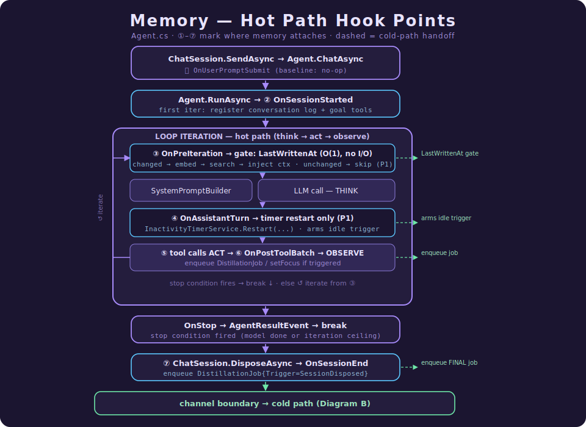
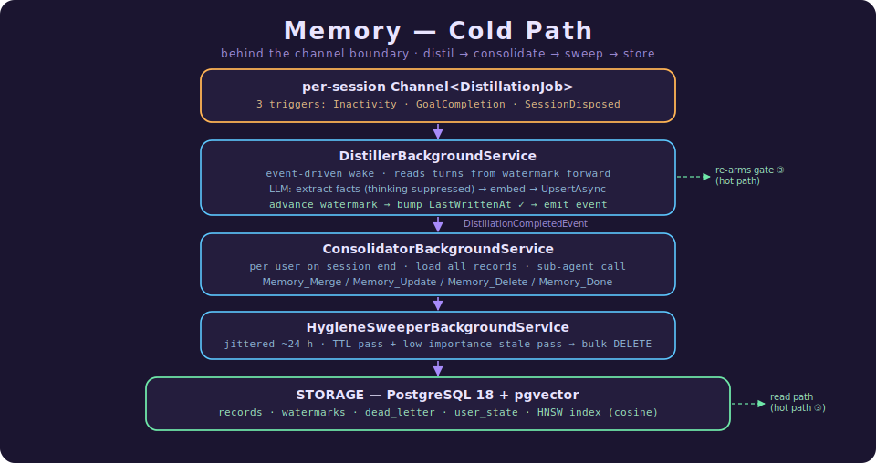
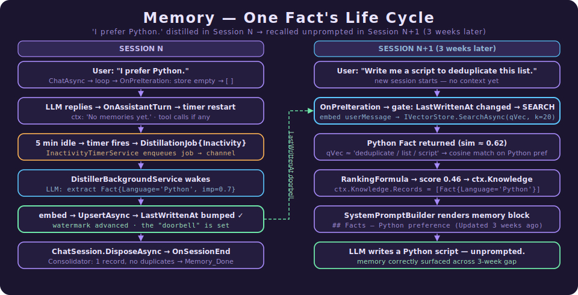

# How Agency Gives AI Agents Memory

For software engineers entering the world of AI agents, the most important shift in mindset is moving from **stateless inference** to **stateful persistence**. This document explains how Agency gives "brains" to these systems so they stop acting like *amnesiacs with a tool belt* and start behaving like senior engineers.

It is written to be read in two passes. **Part I** is a code-free introduction to the ideas and why they're designed the way they are — read it and you'll have a complete mental model. **Part II** is the implementation: the same system traced through real C# symbols, `file:line` references, and the design principles that hold it together. Stop after Part I for the concepts; continue into Part II when you're about to read or change the code.

---

## What Makes Agency Different

**Agency** is an open-source .NET framework that turns AI agents from *"amnesiacs with a tool belt"* into stateful, senior-level collaborators. It moves agents from **stateless inference to stateful persistence** by implementing the **CoALA** four-pillar memory model — Working, Semantic, Procedural, and Episodic — over a production-grade agent harness.

If you only remember four ideas from this document, remember these:

### 1. Memory is attached, not baked in

The core agent loop (`Agent.RunAsync`) is completely unaware that memory exists. Memory plugs in through **hooks** — small callback points where extra behavior can run — as an opt-in set of background services.

Why that matters:

- If memory is off, the loop stays lean — **zero hot-path overhead**.
- If memory is on, the agent gets recall and learning without rewriting the harness.
- The harness stays reusable for any agentic scenario.

### 2. The hot path is sacred; the cold path does the heavy lifting

The **hot path** (the code running while the user is waiting) does as little memory work as possible. All the expensive work — turn extraction, episode synthesis, consolidation — is pushed to the **cold path**, background services that run after the user already has a response.

That means recall is quick and selective, new memories are written in the background, and the user never sits around waiting for memory cleanup jobs.

### 3. The agent only re-reads memory when something changed

Before paying for a vector search, Agency checks a simple local timestamp called `LastWrittenAt` — plain English: *"Did anything new get saved since the last time I looked?"* If the answer is no, retrieval is skipped.

The agent only pays the "retrieval tax" when new memory has actually been written. This avoids wasted compute and helps prevent **"context rot"** (when prompts get bloated with repeated or stale context).

### 4. Memory hygiene is a first-class job

Agency has a dedicated cleanup layer called the **Consolidator** — itself a sub-agent. It reasons over long-term storage in natural language, reconciling contradictions and duplicates through **Merge, Update, and Delete** operations (and signals completion with **Done**).

Important detail: by design it has *no create tool*. It can tidy the brain but never invent new "facts" into it.

### Why these choices matter in a real system

- **Token economics via deterministic extraction.** Background distillation (e.g. episode extraction) is deterministic JSON authoring, so Agency suppresses chain-of-thought — through both a dedicated client policy and a `/no_think` prompt directive — cutting cost and latency without losing fidelity.
- **Security via user-partitioned memory.** The hard boundary is the **`UserId`**: every record is partitioned by user and retrieval filters on it, so one user's store is structurally invisible to another. Sessions are deliberately *not* hard-isolated — a `SessionId` is a **soft ranking signal** that lets the agent recall its own earlier work. Cross-session reach is a feature; cross-user reach is impossible.
- **Crash-safe idempotency via watermarking.** The distiller persists a `LastDistilledTurnIndex` watermark and checks it *before* spending any LLM tokens. An interrupted job re-derives the exact turn window on restart and resumes without duplicating records or skipping turns.
- **Retrieval is more than cosine similarity.** A two-stage **over-fetch + re-rank** pipeline fetches candidates by similarity, then scores them on a weighted blend of **similarity, recency, importance, and session match** — so a high-importance fact from last month can correctly outrank a fresh-but-trivial one.
- **Auditable by design.** Every time the Consolidator reorganizes memory it emits a `MemoryMutatedEvent`, giving developers and users a clear audit trail of how the agent's model of the world evolves.

> In a toy demo, you can get away with stuffing chat history into the prompt. In a real product, that becomes slow, expensive, and messy. Agency is designed for the real-product version.

---

# Part I — The Ideas

## 1. The Core Problem: Why Do Agents Need Memory?

Standard Large Language Models are **stateless**. They have no prior recollection beyond what you provide in the current request. So without a memory system in the surrounding **harness** (the code that manages the LLM), an agent is like a capable engineer who loses their notebook after every meeting — it "starts at zero" every time it wakes up, spending expensive tokens rediscovering facts it should already know.

That causes predictable problems:

- The agent keeps rediscovering the same facts.
- The user has to repeat preferences, goals, and background.
- The system wastes tokens rebuilding context it already had.
- The agent cannot really "learn" from experience.

Memory changes that. Instead of saying *"Please remember that I prefer Python"* every time, the user can say it once and the agent can bring it back when it matters.

## 2. The Four Pillars of Agent Memory

Agency borrows the **CoALA (Cognitive Architectures for Language Agents)** memory model. The name sounds academic, but the ideas are straightforward.

### Working Memory: the scratch pad

This is the agent's **context window** — what it's actively thinking about right now. Fast, immediate, but volatile: once the session ends, it's gone. (Like RAM in a computer, or notes on a whiteboard during a meeting.)

### Semantic Memory: the fact book

This is long-term, persistent **factual knowledge** — general facts, rules, and world knowledge:

- "The user prefers Python."
- "This project uses PostgreSQL."
- "This deployment job must run after migrations."

In production this is often a **vector database** or even simple **Markdown files** like `claude.md`. (Think of it as the agent's textbook or wiki.)

### Procedural Memory: the how-to guide

This is the "how-to" knowledge — instructions for specific tasks:

- how to run a code review
- how to reset a password
- how to set up a dev environment

We often implement this with a **skills library** where the agent only "loads" the full instructions when it needs them. (Think of it as a playbook.)

### Episodic Memory: the story of what happened

This is the most advanced type — memory about **past experiences and what was learned**:

- "Last time we used tool X here, it timed out; I should try tool Y instead."
- "This bug was caused by stale cache state."
- "The last successful fix involved restarting the background worker before rerunning the job."

This is the closest thing to lived experience.

> **In one line each:**
> Working memory is what the agent is *holding*.
> Semantic memory is what the agent *knows*.
> Procedural memory is what the agent *knows how to do*.
> Episodic memory is what the agent *remembers happening*.

## 3. The "Bootup Ritual" and the Distillation Pipeline

There are really two memory jobs in a good agent system:

1. Bring the right memories back at the right time.
2. Turn raw interactions into cleaner long-term memory.

Agency handles those in two phases.

### The Bootup Ritual

Before the agent is allowed to act, the harness runs a "regrounding" step. ("Reground" just means "get its bearings again before doing work.") It performs a **semantic search** against its memory stores to retrieve relevant facts and past episodes, then injects them into the system prompt — so the model starts the turn already informed.

### The Distillation Pipeline

Memory shouldn't be a dump of raw chat logs — that causes **"context rot,"** where performance degrades as the prompt gets cluttered. Instead, Agency uses an **asynchronous background process** to "distill" raw data:

1. **Turn extraction** — analyzing a single exchange to capture the **Observation-Action-Outcome (OAO)** pattern: what was seen, what the agent did, and whether it worked.
2. **Episode extraction** — once a goal is met, synthesizing those turns into a coherent "meeting summary" of the journey (not the whole transcript, just the useful summary).
3. **Consolidation** — comparing new insights to old ones to **Merge, Update, or Delete** information, keeping memory fresh and non-redundant.

> This is why the memory system does not slowly turn into a giant trash heap of chat transcripts.

## 4. Engineering Challenges: Scope and Hygiene

Building memory for production software surfaces two concerns quickly.

### Memory Scoping (Security)

You must prevent **cross-user bleed** — Alice must never see Bob's memories. The hard boundary is the **user id**: every record is partitioned by `UserId`, and retrieval filters on it at the SQL level, so one user's store is structurally invisible to another.

*Sessions* are deliberately **not** hard-isolated. A `SessionId` is only a **soft ranking signal** — records from the same session rank slightly higher — so the agent can reach back across its own earlier sessions.

> Cross-session reach is useful.
> Cross-user reach is unacceptable.

### Memory Hygiene (Garbage Collection)

Not everything is worth keeping. Agency uses:

- **importance scoring** (how useful is this memory?)
- **TTL / time-based decay** (when should this expire?)
- **cleanup passes** for stale or low-value records

That keeps the store focused instead of bloated.

## 5. Why Bother? The Business Case

Without memory, many agents are just polished chatbots. With memory, they start acting like **senior collaborators**.

In **IT incident response**, for example, an agent with episodic memory can resolve a system spike with ~40% fewer tool calls because it remembers the root cause from a similar incident last month. More broadly, memory-augmented agents:

- repeat less work,
- make fewer unnecessary tool calls,
- carry lessons from one session into the next,
- get better over time instead of resetting every day.

This creates a **flywheel**: work creates memory, memory improves future work, and better work creates better memory.

---

# Part II — How Agency Implements It

Everything above is the *theory*. This part is the *practice*: a tour of how the abstract pillars become C# classes, how they plug into `Agency.Harness` without ever editing the agent loop, and how a sentence the user typed in March is recalled in June.

If you only remember one thing from this part, make it this:

> **The memory system is a set of background services and `Context` mutations that attach to the agent loop through *hooks*. The loop itself — `Agent.RunAsync` — has no idea memory exists.**

That single design choice (decoupling via hooks) is what lets memory be an *opt-in* package you can switch off with one config flag, rather than a fork of the harness.

### The five design principles (referenced throughout as P1–P5)

The implementation keeps coming back to five rules. Worth holding them in mind:

- **P1 — The hot path is sacred.** Anything the user waits on does the minimum; everything expensive moves to the cold path.
- **P2 — Capture is system-owned.** The agent never has a "save this memory" tool. It can only signal *timing*; what to remember is decided afterward by the distiller.
- **P3 — Soft signals over hard isolation.** The only hard partition is `user_id`. Session relevance is a ranking nudge, not a wall.
- **P4 — Some decisions are language-shaped.** Reconciling duplicates and contradictions is given to an LLM (the Consolidator) — but never on the hot path.
- **P5 — One source of truth.** One `Record` type, one store, one conversation manager that owns the turns. No data is copied where it could drift.

### 6.0 The map: which project does what

The memory feature is split across one harness project and several `Agency.Memory.*` projects. The split is not arbitrary — it follows the dependency arrows so the shared contract (`Agency.Memory.Common`) sits at the bottom and depends on nothing.

| Project | Role in the four-pillar model | Path / detail |
|---|---|---|
| `Agency.Harness` | The host. Owns the loop, the hooks, and the `Context` blackboard. | `src/Harness/Agency.Harness` |
| `Agency.Memory.Common` | The contract. `Record`, `ContentType`, `IMemoryStore`, ranking, options, events, `MemoryHookFactory`. Zero dependencies on the other memory projects. | `src/Memory/Agency.Memory.Common` |
| `Agency.Memory.Sql.Postgres` | Semantic + episodic store (durable substrate). pgvector + HNSW. | `…/Agency.Memory.Sql.Postgres` |
| `Agency.Memory.Retrieval` | **Read path.** Gate + over-fetch + composite re-rank → `Context`. | `…/Agency.Memory.Retrieval` |
| `Agency.Memory.Distiller` | **Write path** + the DI wiring (`AddAgencyMemory`) that ties memory to the harness. | `…/Agency.Memory.Distiller` |
| `Agency.Memory.Consolidator` | Maintenance — the "is this the same thing said twice?" sub-agent. | `…/Agency.Memory.Consolidator` |
| `Agency.Memory.Hygiene` | Maintenance — TTL + low-importance garbage collection. | `…/Agency.Memory.Hygiene` |

**Why this matters to you as a reader:** when you go looking for "where does retrieval happen," you will not find it in `Agent.cs`. You will find a *callback* registered into the loop. The rest of this part is the trail of breadcrumbs that connects the two.

---

### 6.1 The spine: the core agentic loop

Memory plugs into a loop that already existed. Let's start with that loop, because every memory touch-point is defined relative to it. The loop lives in `Agent.RunAsync` (`src/Harness/Agency.Harness/Agent.cs:244`). Stripped to its skeleton, it is the classic **think → act → observe** cycle:

```csharp
while (true)                                  // until a StopCondition fires
{
    ctx.IterationCount++;

    //  ┌─ OnPreIteration hook  ◄────────────── RETRIEVAL injects here
    string systemPrompt = SystemPromptBuilder.Build(ctx);   // reads ctx.Knowledge / ctx.Memory
    var response = await _llm.GetResponseAsync(ctx.Conversation.Messages, options, ct);  // THINK
    ctx.Conversation.Append(lastAssistant);

    //  └─ OnAssistantTurn hook ◄────────────── TIMER RESTART fires here
    if (_stop(ctx, lastAssistant)) { yield return result; yield break; }

    var toolCalls = lastAssistant.Contents.OfType<FunctionCallContent>().ToList();  // ACT
    var toolEvents = await Task.WhenAll(toolTasks);          // tools run in parallel

    //  └─ OnPostToolBatch hook ◄────────────── batch audit fires here
    foreach (var r in resultMessages) ctx.Conversation.Append(new ChatMessage(ChatRole.Tool, [r]));  // OBSERVE
}
```

Notice what is *not* here: there is no `if (memoryEnabled)`, no call to a store, no embedding. The loop only calls hook delegates **if they are non-null**. When memory is disabled, those delegates are null and the branches are skipped — true zero-overhead (**P1**).

A second entry point, `Agent.ChatAsync` (`Agent.cs:120`), wraps `RunAsync` per user turn. It is where `OnUserPromptSubmit` fires (`Agent.cs:151`) and where per-turn telemetry and timeouts are applied. And `ChatSession.DisposeAsync` (`ChatSession.cs:113`) calls `Agent.RaiseSessionEndAsync` (`Agent.cs:86`), which fires `OnSessionEnd`. These three methods — `RunAsync`, `ChatAsync`, `DisposeAsync` — are the only surfaces memory ever attaches to.

### 6.1.1 The loop at a glance: where memory attaches

Before we dissect the individual hooks, here is the whole picture in one view. The agent loop runs on the **hot path** (synchronous, latency-critical, user is waiting). Memory attaches to it at six labelled points — but only *two* of those points do real work on the hot path (retrieval reads; the timer restarts), and even retrieval is gated to run at most once per turn. Everything expensive is pushed *across the channel boundary* onto the **cold path**, where the user is not waiting.

**Diagram A — one user turn (the hot path), with every memory touch-point marked:**



The three dashed arrows leaving the box (from ⑤, ⑦, and `OnSessionEnd`) are the **only** ways work crosses onto the cold path. They correspond one-to-one with the three distillation triggers from §6.6 — `Inactivity`, `GoalCompletion`, `SessionDisposed`. Each drops a `DistillationJob` into a per-session `Channel<DistillationJob>` and returns *immediately*. The user-facing turn never blocks on memory being written.

**Diagram B — what happens behind the channel (the cold path):**



Read the two diagrams together and the **feedback loop** becomes visible: the cold path *writes* to storage (Diagram B) and bumps `LastWrittenAt`; that bump is exactly what the hot-path *gate* checks at step ② (Diagram A) to decide whether to re-read. Storage is the shared medium; `LastWrittenAt` is the doorbell that tells the read path "something changed, look again." Nothing on the hot path ever calls the cold path directly, and nothing on the cold path ever touches the live `Context` — they communicate only through the store.

| Pillar (from §2) | Where it lives in the diagrams |
|---|---|
| **Working memory** (RAM / context window) | the live `Context` + `ctx.Conversation` inside the loop box (Diagram A) |
| **Semantic memory** (facts) | `ContentType.Fact` records → injected at ② into `ctx.Knowledge` → rendered as `## Facts` |
| **Episodic memory** (lived experience) | `ContentType.Memory` records → injected at ② into `ctx.Memory` → rendered as `## Memories` |
| **Procedural memory** (skills) | *out of scope for v1* — the only agent tools at ⑦ are `MarkGoalComplete` (a timing signal) and `SetFocus` (biases retrieval); neither stores a skill |

`★ How to read these diagrams:` the boxed ` … ` markers are the *only* places memory does anything; everything else is the pre-existing agent loop. Of those markers, just two sit on the hot path (② retrieval, ⑤ timer) — and ② is gated to near-zero cost on repeat iterations. That visual sparseness on the hot path *is* the design goal **P1 (hot path is sacred)**, drawn out.

### 6.2 The integration seam: `AgentHooks`

A **hook** here is just a nullable delegate field on a record. The full set lives in `AgentHooks` (`src/Harness/Agency.Harness/Hooks/AgentHooks.cs`):

| Hook delegate | Fires at | Memory uses it for |
|---|---|---|
| `OnSessionStarted` | first iteration of a session (`Agent.cs:255`) | register the conversation log + the two agent tools |
| `OnUserPromptSubmit` | every `ChatAsync` (`Agent.cs:151`) | (reserved; baseline leaves it null) |
| `OnPreIteration` | top of every loop iteration (`Agent.cs:274`) | **retrieval** (read path) |
| `OnPreToolUse` | before each tool call (`Agent.cs:391`) | (not used by memory) |
| `OnPostToolUse` | after each tool call (`Agent.cs:432`) | (not used by memory) |
| `OnPostToolBatch` | after `Task.WhenAll` of tools (`Agent.cs:460`) | (reserved) |
| `OnAssistantTurn` | after the LLM responds (`Agent.cs:314`) | **restart the inactivity timer** (write-path trigger) |
| `OnStop` | just before the turn ends (`Agent.cs:345/359/375`) | (not used by memory) |
| `OnSessionEnd` | once, on `ChatSession` dispose (`Agent.cs:86`) | **enqueue the final distillation job** |

Two design properties make this seam robust:

1. **Composition over inheritance.** Two `AgentHooks` instances combine via `AgentHooksExtensions.Compose` (`Hooks/AgentHooksExtensions.cs:11`): for each delegate slot it builds `async (ctx, ct) => { await a(...); await b(...); }`. So memory's hooks and a host's own hooks both run, in a defined order. `OnPreToolUse` is special-cased — the *most restrictive* decision wins (Deny > Rewrite > Allow), because you never want a permissive hook to silently override a security veto.

2. **Baseline-first ordering, with an escape hatch.** Memory's hooks are the *baseline*; user hooks compose *after*. So by the time a host's `OnPreIteration` runs, retrieval has already enriched the `Context`. A host that genuinely needs the *un-enriched* view calls `ComposeBefore` (`AgentHooksExtensions.cs:33`) — an explicit opt-out, not a default foot-gun.

> **Why drop `OnPostToolUseFailure`?** An earlier design had a failure-specific hook. But the loop already converts every non-cancellation tool exception into a `ToolResult(IsError: true)` (`Agent.cs:419-429`), so a "tool threw" hook would be dead code. It was removed; consumers check `result.IsError` in `OnPostToolUse` instead.

### 6.3 The blackboard: the `Context` object

Hooks need somewhere to *put* what they retrieve. That place is `Context` (`src/Harness/Agency.Harness/Contexts/Context.cs`) — a single record passed by reference through the whole loop. Most of it is `init`-only (immutable after construction), but a handful of properties are deliberately **settable** so hooks can mutate them mid-session:

```csharp
public KnowledgeContext Knowledge { get; set; }   // ← retrieval writes Facts here
public MemoryContext    Memory    { get; set; }   // ← retrieval writes episodic Memories here
public FocusContext     Focus     { get; set; }   // ← SetFocus tool writes here
public SessionContext   Session   { get; set; }   // ← loop stamps a stable session id
public DateTimeOffset?  MemoryLastRetrievedAt { get; set; }  // ← the retrieval gate's bookmark
```

This is the **blackboard pattern**: the retrieval engine and `SystemPromptBuilder` never call each other. Retrieval writes `ctx.Knowledge`; on the next iteration `SystemPromptBuilder.Build(ctx)` reads it. The `Context` is the only thing they share. `MemoryLastRetrievedAt` is the one piece of bookkeeping that makes the read path cheap — we'll see it power the *gate* in §6.5.

`★ The two "knowledge" shapes — a subtlety worth flagging.` `KnowledgeContext` carries *two* collections: a legacy `Facts` (list of strings) **and** a newer `Records` (list of `MemoryRecord`). Long-term retrieval populates `Records`; `SystemPromptBuilder` renders them under a `## Facts` heading with a humanised "Updated 3 weeks ago" suffix (`SystemPromptBuilder.cs:51`). Episodic memories land in `Memory.Records` and render under `## Memories`. When both are empty the builder writes the literal line `"No relevant memories yet."` — so the model is never left guessing whether retrieval ran.

---

### 6.4 Wiring it together: `AddAgencyMemory` and the callback dance

If memory lives in separate projects, how does it get connected to the harness? And here's the puzzle the wiring has to solve. `Agency.Memory.Common` defines `MemoryHookFactory`, but **it cannot reference `Agency.Memory.Retrieval`** — Retrieval already depends on Common, and the reverse reference would be a dependency cycle (the compiler rejects it). So how does a factory in *Common* wire up a retrieval engine that lives *above* it?

The answer (documented as constraint **IQ-1** in the code) is **dependency inversion via callbacks**. `MemoryHookFactory.Build` (`Agency.Memory.Common/Hooks/MemoryHookFactory.cs:56`) does not take a `RetrievalEngine`. It takes *functions*:

```csharp
public static AgentHooks Build(
    Func<Context, CancellationToken, Task> retrievalCallback,   // "run retrieval"
    Func<AssistantTurnHookContext, CancellationToken, Task> timerRestartCallback,
    Func<SessionStartedHookContext, CancellationToken, Task>? sessionStartedCallback = null,
    Func<SessionEndedHookContext,  CancellationToken, Task>? sessionEndCallback = null)
    => new AgentHooks
    {
        OnSessionStarted = sessionStartedCallback,
        OnPreIteration   = retrievalCallback,        // ← read path
        OnAssistantTurn  = timerRestartCallback,     // ← write-path trigger
        OnSessionEnd     = sessionEndCallback,        // ← write-path trigger
    };
```

The *real* callbacks are supplied one layer up, in `Agency.Memory.Distiller` — which is allowed to reference both Common and Retrieval. That's `AddAgencyMemory` (`Agency.Memory.Distiller/DependencyInjection/MemoryServiceCollectionExtensions.cs:47`). It registers the event bus, the per-session channel registry, the conversation registry, the inactivity timer, and the distiller background service — and then performs the critical step: it uses `IPostConfigureOptions<AgentOptions>` to **inject the baseline hooks after the host has finished configuring the agent**:

```csharp
services.AddSingleton<IPostConfigureOptions<AgentOptions>>(sp =>
  new PostConfigureOptions<AgentOptions>(name: null, action: agentOpts =>
  {
      var engine = new RetrievalEngine(store, embedder, memoryOptions);

      // OnPreIteration: gate, then (maybe) search + inject into Context.
      Func<Context, CancellationToken, Task> retrievalCallback = async (ctx, ct) =>
      {
          if (await RetrievalGate.ShouldRetrieveAsync(ctx, store, ct))
              await engine.RetrieveAsync(ctx, ct);
      };

      // OnAssistantTurn: ONLY restart the timer. Nothing else. (Spec §14.9)
      Func<AssistantTurnHookContext, CancellationToken, Task> timerCallback = (hookCtx, _) =>
      {
          timerService.Restart(userId, sessionId, turnIndex, hookCtx.AgentContext.Focus);
          return Task.CompletedTask;
      };

      // OnSessionStarted: register the live conversation log + the two agent tools.
      // OnSessionEnd:     enqueue a terminal SessionDisposed distillation job.
      agentOpts.BaselineHooks = MemoryHookFactory.Build(
          retrievalCallback, timerCallback, sessionStartedCallback, sessionEndCallback);
  }));
```

Why `PostConfigure` and not plain `Configure`? Ordering. The host binds its own `AgentOptions` (including any `UserHooks`) via `Configure`. `PostConfigure` always runs *after* all `Configure` callbacks, so memory can set `BaselineHooks` without clobbering the host's `UserHooks`. The two are merged later, at agent-construction time.

That merge happens in `AgentFactory.CreateAgent` (`src/Harness/Agency.Harness.Console/AgentFactory.cs:41`):

```csharp
AgentHooks? hooks = (options.BaselineHooks, options.UserHooks) switch
{
    (AgentHooks baseline, AgentHooks user) => baseline.Compose(user),  // baseline FIRST
    (AgentHooks baseline, null)            => baseline,
    (null, AgentHooks user)                => user,
    _                                      => null,                     // memory off → no hooks
};
```

That four-arm switch is the *entire* integration contract between memory and the harness. Memory off? `BaselineHooks` is null, the last arm hits, the agent runs hook-free.

`★ Insight — the indirection is a feature, not friction.` Because `MemoryHookFactory` speaks in `Func<…>` rather than concrete services, the `Agency.Harness` project never has to reference any `Agency.Memory.*` project. The harness ships standalone; memory is a *consumer* of the harness's extension points, never the other way around. That is what keeps the harness reusable for agents that don't want long-term memory at all.

---

### 6.5 The read path, end to end (recall)

This is the **Bootup Ritual / regrounding** from §3, made concrete. It runs inside `OnPreIteration`, once per iteration, and it has two stages: a cheap *gate* and an expensive *search*.

**Stage 1 — the gate (`RetrievalGate.ShouldRetrieveAsync`).** A vector search is wasteful if nothing in the store changed since we last looked. The gate (`Agency.Memory.Retrieval/RetrievalGate.cs`) is O(1):

```csharp
DateTimeOffset? lastWritten = await store.LastWrittenAtAsync(userId, ct);  // in-memory cache hit
if (lastWritten is null)                 return true;   // store empty → search (returns [] fast)
if (ctx.MemoryLastRetrievedAt is null)   return true;   // first retrieval this session
return lastWritten > ctx.MemoryLastRetrievedAt;          // changed since last look?
```

`LastWrittenAtAsync` reads a per-user timestamp held in a `ConcurrentDictionary` on the store — no SQL round-trip. Within a single multi-iteration user turn the async distiller almost never writes, so the gate skips the search on **every iteration after the first**. That is how the system honours **P1 (hot path is sacred)**: the only iteration that pays for retrieval is the one where it could actually surface something new.

> **The load-bearing invariant.** *Every* write path must bump `LastWrittenAt`: `UpsertAsync`, `ForgetAsync`, `ForgetMeAsync`, and every Consolidator mutation. Forget to bump it and retrieval goes stale silently — the nastiest kind of bug. The store tests assert the bump on each path precisely because the failure is invisible at runtime.

**Stage 2 — search and rank (`RetrievalEngine.RetrieveAsync`).** When the gate passes (`Agency.Memory.Retrieval/RetrievalEngine.cs:47`):

```
1. query   = lastUserMessage + Focus.Title + Focus.Domain + Focus.Tags      (BuildQueryText)
2. qVec    = embedder.GenerateEmbeddingAsync(query)
3. hits    = store.SearchAsync(userId, qVec, topK = RetrievalTopK × OverFetchFactor)
4. scored  = hits.Select(h => RankingFormula.Score(...)).OrderByDescending(...).Take(RetrievalTopK)
5. partition scored by ContentType:  Fact → ctx.Knowledge.Records ;  Memory → ctx.Memory.Records
6. ctx.MemoryLastRetrievedAt = now                                          (arm the gate)
```

Two implementation details deserve a callout:

- **Over-fetch lives in the engine, not the store.** `SearchAsync` honours its `topK` *verbatim* — pure cosine similarity, no re-ranking (`Spec §6.1`). The engine asks for `TopK × OverFetchFactor` (default 3×) candidates, then re-scores the wider pool with the composite formula and trims to `TopK`. The reason: similarity alone is *not* the final ranking signal. A 3-week-old high-importance fact should be able to beat a fresh trivial one. If the store cut to TopK by similarity first, the engine would never see the contenders. Over-fetch and re-rank are a pair; neither makes sense alone.

- **The partition switch fails fast on an unknown `ContentType`** (`RetrievalEngine.cs`). `ContentType` is matched with explicit `Fact`/`Memory` arms plus a throwing discard arm (`_ => throw new InvalidOperationException(...)`). So if someone adds a third `ContentType` later, a record carrying it raises a clear exception at *runtime* rather than being silently routed into the wrong bucket. (The throw is a deliberate fail-fast guard, not a compile-time check — because the discard arm makes the switch exhaustive, the C# CS8509 exhaustiveness warning does not fire.)

**The ranking formula** (`Agency.Memory.Common/Ranking/RankingFormula.cs`, spec §8.3) is a weighted sum — this is where the four pillars literally turn into numbers:

```
score = wₛ·similarity + wᵣ·recency + wᵢ·importance + wₘ·sessionMatch
      = 0.5·sim       + 0.3·e^(−ageDays/7) + 0.2·imp + 0.1·(sameSession ? 1 : 0)
```

`sessionMatch` is the concrete expression of **P3 (soft signals over hard isolation)**: a record from *this* session gets a +0.1 nudge, but a record from another session is still fully visible — it just ranks slightly lower. There is no SQL-level session filter; the only hard partition is `user_id`.

**Stage 3 — rendering.** Next iteration, `SystemPromptBuilder.Build` (`src/Harness/Agency.Harness/SystemPromptBuilder.cs`) walks `ctx.Knowledge.Records` and `ctx.Memory.Records` and emits Markdown:

```
## Facts
- **Python preference** (Updated 3 weeks ago)
  User prefers Python.
```

The model never sees a similarity score, a UUID, or a raw timestamp — only a human sentence and a humanised recency string (`Humanize`, `SystemPromptBuilder.cs:123`). From the agent's point of view, "the user prefers Python" is simply a fact that was always true. The entire retrieval machinery is invisible to it.

---

### 6.6 The write path, end to end (learning)

This is the **Distillation Pipeline** from §3. Its defining property comes straight from **P2 (capture is system-owned)**: the agent has *no* "save this" tool. It can only signal *timing*. Everything else — what's worth remembering, how to phrase it, how important it is — is decided after the fact by the Distiller, off the hot path.

**The three triggers.** Exactly three events enqueue a `DistillationJob`. Nothing else:

| # | Trigger | Source in code | `DistillationTrigger` |
|---|---|---|---|
| 1 | Agent calls `MarkGoalComplete` | `MarkGoalCompleteTool.InvokeAsync` (`Tools/MarkGoalCompleteTool.cs:72`) | `GoalCompletion` |
| 2 | Session idle past timeout | `InactivityTimerService.OnTimerExpired` (`Services/InactivityTimerService.cs:109`) | `Inactivity` |
| 3 | `ChatSession` disposed | `SessionEndHook.Create` (`Services/SessionEndHook.cs`) via `OnSessionEnd` | `SessionDisposed` |

All three write a `DistillationJob` into a **per-session bounded `Channel`** obtained from `ChannelSessionRegistry.GetOrCreateWriter(userId, sessionId)`. The job carries only *intent* — `UserId, SessionId, Trigger, UpToTurnIndex, Focus` — never the transcript itself (**P5**: the conversation manager is the single source of truth for turns; copying them into the channel would be redundant data motion that could drift out of sync).

**The timer's single job.** Look closely at the `OnAssistantTurn` callback in §6.4: it calls `timerService.Restart(...)` and returns. That's *all* it does — no enqueue, no read, no LLM call. This is **§14.9** enforced in code: per-turn work on the hot path is forbidden (**P1**). `Restart` disposes any existing per-session timer and starts a fresh one via `TimeProvider.CreateTimer` (`InactivityTimerService.cs:77`). Using `TimeProvider` rather than a raw `System.Threading.Timer` is what lets tests drive expiry deterministically with a `FakeTimeProvider` instead of really sleeping for five minutes.

**The background service.** `DistillerBackgroundService` (an `IHostedService`, so it participates in host startup/shutdown) is the single consumer. It drains every per-session channel in a sweep, then suspends on a semaphore that any enqueue releases — an *event-driven wake*, not a polling loop, so a freshly queued job is picked up on the next scheduler tick with no latency floor. For each job it:

```
1. turns = conversationRegistry.Get(sessionId).MessagesBetween(watermark, job.UpToTurnIndex)
2. if empty → no-op (watermark already passed this window — idempotent)
3. payload = llm.SendAsync(EpisodeExtractionPrompt(turns, focus, knownDomains, recentFacts))
4. records = ParseExtraction(payload)            // 0..N records — "nothing memorable" is valid
5. foreach r: r.Embedding = embedder.Generate(r.Title + "\n\n" + r.Value); store.UpsertAsync(r)
6. advance watermark to job.UpToTurnIndex
7. emit DistillationCompletedEvent (or, on permanent failure, dead-letter + DistillationFailedEvent)
```

Step 2 is the **idempotency guarantee**. The watermark (`LastDistilledTurnIndex`, persisted in the `watermarks` table) makes re-running a job a no-op. So a process crash mid-distill is harmless: the watermark wasn't advanced, the next run re-derives the same window and re-processes it. This is why the distiller is "incremental" while the consolidator is "full-scan" (spec §9) — different consistency needs, different strategies.

**Where do the turns come from?** The distiller runs *outside* the agent's object graph, so it can't reach into the live `Context`. The bridge is `OnSessionStarted`: the baseline hook calls `ConversationRegistrationHook` (`Services/ConversationRegistrationHook.cs`), which registers the session's *live* `IConversationManager` into a shared `IConversationManagerRegistry` keyed by session id. The distiller later looks it up by id. Registration is idempotent because both the session id and the manager instance are stable for the session's lifetime.

`★ Insight — "suppress thinking" on the cold path.` The distiller is given its *own* `IChatClient` built with `SuppressThinking = true` (`Program.cs:102`), and its prompt opens with a `/no_think` directive. Episode extraction is deterministic JSON authoring — there's nothing to reason about — so chain-of-thought tokens would be pure latency tax on an already-large prompt. The user-facing agent keeps thinking on; the background scribe turns it off. Same model, two clients, two policies.

---

### 6.7 The two agent-facing tools

Per **P2**, the agent gets *exactly two* memory tools — and neither writes a memory directly. They are registered per-session by `MemorySessionTools.RegisterInto` (`Services/MemorySessionTools.cs`), called from the same `OnSessionStarted` hook that registers the conversation log:

- **`MarkGoalComplete(summary?)`** — enqueues a `GoalCompletion` distillation job and returns immediately. Crucially, it **does not stop the loop** (`MarkGoalCompleteTool.cs`): the agent can keep helping; the watermark prevents the eventual second distillation from reprocessing. It's a *timing signal*, not a commit.

- **`SetFocus(title?, domain?, tags?)`** — sets `ctx.Focus`, which the retrieval engine appends to its query (§6.5, step 1) to bias recall toward the current task. Its tool *description is generated dynamically* (`SetFocusTool.GetDefinitionAsync:68`): it queries the store for the user's existing `Domain` values and lists them, so the model reuses established vocabulary ("Debugging") instead of coining a synonym ("BugFixing") that would fragment retrieval. Setting the same focus twice is a no-op that returns the prior values.

Both tools are baked per-session with `userId`/`sessionId` captured at registration, so there is never ambiguity about *which* session is being marked complete or focused.

---

### 6.8 Maintenance: Consolidator and Hygiene

Two background services keep the store from rotting — they are the **Memory Hygiene** of §4.

**The Consolidator** (`Agency.Memory.Consolidator`) is the most conceptually interesting piece, because *it is itself an agent built on `Agency.Harness`*. In its default `OnSessionEnd` mode it subscribes to the distiller's `DistillationCompletedEvent` and runs automatically after a session's distillation completes; an alternative `Manual` mode is also available, where nothing auto-fires and the host triggers a pass by calling `IConsolidationTrigger.RequestAsync`. When it runs, it loads **all** of that user's records, spins up a sub-agent (via `ConsolidatorSubAgentFactory`) whose tool registry contains only four tools — `Memory_Merge`, `Memory_Update`, `Memory_Delete`, `Memory_Done` — and lets it run until it calls `Memory_Done` (or hits an iteration / cost ceiling). The sub-agent reasons in natural language about duplication and contradiction ("these two records both say the user prefers Postgres; merge them") — the **P4** bet that some decisions are intrinsically language-shaped and belong to an LLM, just never on the hot path. Each successful mutation emits a user-facing `MemoryMutatedEvent`, an intentional transparency feature: the user can be told when the agent has silently reorganised its own memory.

> The fact that the consolidator reuses the *same* harness primitives (Context, tool registry, stop conditions, hooks) as a user-facing agent — just with a different tool set and prompt — is a nice demonstration that `Agency.Harness` is a general agent runtime, not a chat-specific one.

**The Hygiene Sweeper** (`Agency.Memory.Hygiene`) is the dumb, reliable counterpart. On a jittered ~24h schedule it runs two bulk SQL deletes: a **TTL pass** (per content type) and an **importance-pruning pass** (low-importance records not accessed in a long time). It is LLM-free and set-based — Postgres does the heavy lifting in one `DELETE` per pass. The staleness clock is the service's injected `TimeProvider`, passed explicitly into `IMemoryStore.DeleteWhere…Async`, so a `FakeTimeProvider` can fast-forward expiry in tests. Note that retrieval *resets* a record's `LastAccessedAt` — so actively used memories keep dodging the sweeper, and only the genuinely-forgotten get collected.

That gives a nice balance: the Consolidator handles language-shaped cleanup decisions; the Hygiene Sweeper handles predictable, routine cleanup.

### 6.9 The durable substrate

Underneath all of it is `Agency.Memory.Sql.Postgres` — PostgreSQL 18 + pgvector, the **Semantic + Episodic** stores from §2 unified into one table. The whole system uses a **single `records` table** with a `content_type` discriminator (**P5**: one `Record` type, one collection, one `IMemoryStore`). Highlights:

- **One upsert key**, `UNIQUE (user_id, COALESCE(session_id, ''), domain, key)`. The `COALESCE` is a real gotcha worth understanding: in Postgres `NULL != NULL`, so a plain unique constraint would treat every global-scope (`session_id IS NULL`) record as distinct and allow unbounded duplicates. Mapping `NULL → ''` in a *functional* unique index collapses them to one row per key.
- **HNSW index** (`vector_cosine_ops`) for approximate-nearest-neighbour search — cosine, because all our distances are cosine-derived.
- Side tables: `watermarks` (distiller idempotency), `dead_letter` (failed jobs, for operators — never read by the live system), and `user_state` (the persisted backup of the `LastWrittenAt` gate cache, hydrated lazily on restart).

The `IMemoryStore` interface (`Agency.Memory.Common/Storage/IMemoryStore.cs`) is backend-neutral, so a future SQLite or in-memory implementation can drop in without touching retrieval, distillation, or consolidation.

---

### 6.10 Turning it on

All of this is **opt-in**. In the console host (`Agency.Harness.Console/Program.cs:56`) the entire stack is gated behind one flag:

```csharp
bool memoryEnabled = builder.Configuration.GetValue<bool>("Memory:Enabled");
if (memoryEnabled)
{
    builder.Services.AddAgencyEmbeddingsOpenAI(...);    // embeddings
    builder.Services.AddAgencyMemoryPostgres(connectionString);  // store + schema init
    builder.Services.AddAgencyDistillerLlm(distillerClient, model);  // scribe LLM (no-think)
    builder.Services.AddAgencyMemory();                 // hooks + distiller + timer + channels
    builder.Services.AddAgencyConsolidator(o => o.Model = model);
    builder.Services.AddAgencyHygiene();
}
```

When the flag is `false`, **none** of these services are registered, `BaselineHooks` stays null, the `AgentFactory` switch returns null hooks, and the console behaves byte-for-byte as if memory never existed. When it's `true`, schema init runs at startup and *fails fast* with a human-readable message if Postgres or the embedding endpoint is unreachable — better a clear crash at boot than silent amnesia at runtime.

---

### 6.11 The whole story in one trace

To tie Part II back to the four pillars, here is one fact's life cycle through the actual code:



The user never re-stated the preference. The agent never called a "remember" tool. The recall happened because a background scribe distilled a fact in March, and a gated search re-grounded the agent in June — exactly the stateless-to-stateful shift this document opened with.

---

## Final Takeaway

If you want the shortest possible summary, it is this:

> **Agency gives AI agents memory without polluting the main agent loop.**

It does that by:

- recalling useful memory through hooks before a turn (the read path, gated so it only pays when something changed),
- writing new memory in the background after a turn (the write path, system-owned and crash-safe),
- ranking on more than similarity, and cleaning up with a language-aware Consolidator and a mechanical Hygiene Sweeper,
- and keeping the whole feature optional and modular — one flag turns it off and the harness behaves as if memory never existed.

Or, in one sentence:

**Agency turns an AI agent from "smart but forgetful" into "smart, useful, and able to learn from experience."**
