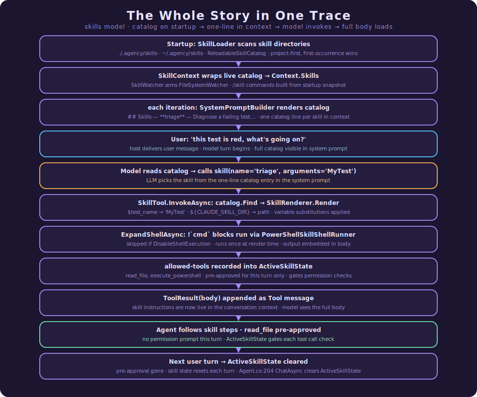

# How Agency's Skills Model Works

> **What this document is.** The single, self-contained reference for Agency's **skills** subsystem —
> the feature that lets you drop a folder of Markdown instructions on disk and have the agent discover
> it, advertise it cheaply, and load its full instructions only when they're actually needed. It is
> written in **two parts**: **Part I** is a gentle, code-free tour for newcomers (plain English,
> analogies, no symbols); **Part II** is the implementation deep dive for engineers about to read or
> change the code (real types, `file:line` references, the six core design principles). The two cover
> the same system at different depths — read Part I for *what* and *why*, Part II for *how*. For the
> permission layer that skills hook into (`allowed-tools`), see
> [Consent at the Tool Boundary](Consent%20at%20the%20Tool%20Boundary%20-%20The%20Permission%20Model.md);
> for the operator-policy layer beside it, see [How Hooks Work](How%20Hooks%20Work.md).

An agent is only as good as the instructions it carries. But instructions are expensive: every word of
"here is how to run a code review," "here is our deployment checklist," "here is how to triage a flaky
test" costs context-window budget on *every single turn* — whether the agent needs it this turn or
not. Stuff enough playbooks into the system prompt and you drown the model in guidance it isn't using,
crowding out the conversation that actually matters. Skills are Agency's answer to that tension: keep
the *table of contents* in context always, and pull the *chapter* only on demand.

---

# Part I · The Gentle Tour

> **Which part is this?** The code-free introduction. No C#, no file paths — just the ideas and why
> they're shaped the way they are. If you're evaluating Agency, onboarding, or explaining the feature
> to someone, start here. Ready for the implementation? Skip to [Part II](#part-ii--the-implementation-deep-dive).

Agency is an open-source .NET framework for building AI agents — programs that call a language model in
a loop, let it use tools, and feed the results back until the job is done. A **skill** is a reusable
chunk of expertise you give that agent: a folder with a `SKILL.md` file inside, holding a short
description plus a body of instructions written in plain Markdown.

The whole feature exists to solve one problem: **how do you give an agent a hundred playbooks without
making it read all hundred on every turn?**

### The core trick: progressive disclosure

Imagine a reference library. You don't photocopy every book and carry the stack around — you carry the
*catalog card*. A card is one line: a title and a sentence about what's inside. When you actually need a
book, you walk to the shelf and pull it.

Skills work exactly like that:

- **Always in view: the catalog.** Each skill contributes one line to the agent's context — its name
  and a one-sentence description. Cheap. A hundred skills cost a hundred lines, not a hundred chapters.
- **Loaded on demand: the body.** When the agent decides a skill is relevant, it "pulls the book" — it
  asks for that skill by name, and only *then* do the full instructions enter the conversation.

This is the same idea Agency already uses to keep verbose *tool* descriptions out of the prompt until
asked for. Skills apply it to *instructions*.

### If you only remember four ideas

**1. A skill is just a folder with a `SKILL.md` in it.**
No registration ceremony, no database. Drop a directory on disk, the agent finds it at startup. The
folder's *name* is the skill's name — that's the handle the agent uses to invoke it.

**2. Only the description costs context up front; the body is free until used.**
The agent sees a tidy list of "here's what I can pull up." The expensive part — the actual step-by-step
instructions — stays on disk until the moment it's invoked.

**3. Skills aren't a new kind of machinery — they're a recombination of parts the harness already had.**
The catalog is "a section of the prompt." Loading a skill is "calling a tool that returns text."
Running a skill in isolation is "spinning up a sub-agent." Pre-approving a skill's tools is "a
permission grant." Nothing here is a special new engine; it's familiar pieces snapped together.

**4. Skills can do more than print instructions.**
A skill can take arguments (`/review src/Foo.cs`), run shell commands and fold the output into its
text, pre-approve the specific tools it needs so the agent isn't interrupted mid-task, and even run as
an isolated sub-agent. These are opt-in; the simplest skill is just a Markdown file.

### Who invokes a skill?

Two callers, same skills:

- **The model.** Seeing the catalog line and deciding "this task calls for the code-review skill," the
  agent pulls it itself, mid-conversation.
- **The person.** In the console you can type `/code-review` to invoke a skill directly, as if you'd
  pasted its instructions yourself. A skill can opt out of either audience.

### Two extra powers worth knowing

- **Arguments.** A skill body can have blanks like "review the file the user named." When you invoke
  `/review src/Foo.cs`, the `src/Foo.cs` slots into the blank. Skills feel like little commands, not
  just static notes.
- **Live editing.** Edit a `SKILL.md` while the agent is running and the change is picked up
  automatically — no restart needed for the agent to see the new instructions. (One small caveat,
  covered in Part II: the console's `/`-menu shortcuts are fixed at startup.)

### One example, start to finish

You keep a skill folder called `triage` with a `SKILL.md` that says, in effect: "To triage a failing
test: 1) read the test output, 2) find the assertion that failed, 3) check recent changes to that file,
4) summarise the likely cause."

- At startup, Agency finds the folder and adds one line to the agent's catalog:
  *"**triage** — Diagnose a failing test and summarise the likely cause."*
- You ask the agent, "this test is red, what's going on?" The agent recognises the catalog line and
  **invokes the triage skill** — pulling those four steps into the conversation.
- Now armed with the playbook, it follows the steps, reads the output, inspects the file, and answers.

You wrote the playbook once. It cost one line of context until the moment it was useful — and then it
was right there. That's the whole point: **the agent carries the index of everything it knows how to
do, and pays for the details only when it reaches for them.**

### Why it matters

- **Scales with your knowledge, not against it.** Add the fiftieth skill and you've added one catalog
  line, not fifty chapters of prompt bloat.
- **Keeps the model focused.** The conversation isn't buried under playbooks it isn't using this turn.
- **Editable like documents, because they are documents.** Skills are Markdown files your whole team
  can read, diff, and improve in a pull request — no code change to teach the agent something new.
- **Reuses what already works.** Because skills lean on the harness's existing prompt, tool,
  permission, and sub-agent machinery, they inherit its reliability instead of reinventing it.

In one sentence: **skills turn an agent's know-how into a browsable library it reads on demand, instead
of a pile of notes it must carry all at once.**

---

# Part II · The Implementation Deep Dive

> **Which part is this?** The code-anchored companion — real types, `file:line` references, and the
> precise mechanics. It is a strict superset of Part I: same system, full depth. Everything Part I
> described in plain English is grounded here in the actual implementation. All types live in namespace
> `Agency.Harness.Skills` unless noted.

## What Makes Agency's Skills Different

**Agency** brings the [Claude Code Skills](https://code.claude.com/docs/en/skills) model (an instance of
the [Agent Skills](https://agentskills.io) open standard) to a general .NET agent harness — and does it
*without adding a single new concept to the agent loop*. The headline ideas, each unpacked below:

**1. Progressive disclosure at the prompt level.**
A skill's `name` + `description` cost context up front; its body loads into the conversation **only on
invocation**. This is the same philosophy `ProgressiveDiscoveryToolRegistry` + `ToolHelpTool` apply to
*tool schemas*, lifted to *instructions*.

**2. Skills are a composition, not a new loop primitive (P1).**
Every aspect of a skill decomposes into machinery the harness already has — a `SystemPromptBuilder`
section, a meta-tool returning a `ToolResult`, the permission evaluator, `AgentTool`. The one
unavoidable `Agent.cs` touch was a single optional `skills` parameter on `CreateContext`.

**3. The directory name is the contract (P2).**
A skill's canonical name — the invocation key — is **always the directory name**, never the frontmatter
`name` field (which is cosmetic). One unambiguous handle, resolved case-insensitively.

**4. Rendering is a pure transform; shell execution is a bolted-on, gated step (P3).**
`SkillRenderer.Render` is a pure string substitution with no I/O. The dangerous part — running `!`-shell
directives — is a *separate*, single-pass, runner-injected step that can be disabled wholesale. The
security surface is isolated by construction.

**5. The catalog is live (P4).**
`SkillContext` holds a *reference* to a reloadable catalog, so edits to `SKILL.md` files are picked up
on the next iteration with no `Context` rebuild. A failed re-scan keeps the prior catalog intact.

**6. Pre-approval is bounded to one turn (P5).**
A skill's `allowed-tools` are pre-approved only while that skill is "active" — a window cleared at the
start of the next user turn. Loading a skill never silently widens permissions across the session.

### Why these choices matter for a production harness

* **The harness stays standalone.** Because skills are a *consumer* of existing extension points
  (`ITool`, `SystemPromptBuilder`, `IPermissionEvaluator`), `Agency.Harness` ships without skills baked
  into its core — the feature is additive, opt-in, and removable.
* **Testability is structural.** The renderer is a pure function (no I/O), the parser has no
  third-party dependency, the catalog is an interface, and the shell runner is injected — every piece
  is unit-testable in isolation.
* **Security is fail-safe.** Shell directives are inert when no runner is wired or execution is
  disabled; a malformed `SKILL.md` is skipped rather than crashing discovery; pre-approval can't escape
  a single turn; and a deny rule always outranks a skill's pre-approval.

---

## 1. Skills Are a Composition, Not a New Loop Concept

This is the load-bearing design decision, and it's worth seeing in full. A skill *looks* like a new
feature, but every part of it maps onto a mechanism the harness already had:

| Skill aspect | Existing mechanism it reuses |
| :--- | :--- |
| Description in context | A `SystemPromptBuilder` section (like `## Knowledge`, like the progressive-discovery hint) |
| Body loaded on invoke | A meta-tool returning a `ToolResult` (exactly like `ToolHelpTool` / `tool_help`) |
| "Enters the conversation as one message" | The `Tool`-role result message appended in `Agent.RunIterationsAsync` |
| `!`-shell injection | The same PowerShell runspace path as `ExecutePowershellTool` |
| `context: fork` | `AgentTool` (sub-agent delegation) |
| `allowed-tools` | The `Permissions` evaluator's active-skill pre-approval + park/resume |

> If you remember one sentence from this document, make it this:
>
> **A skill decomposes into a prompt section plus a tool that returns text — everything else is
> argument substitution, file watching, and host wiring.**

The consequence: the entire core-loop footprint of skills is a single optional parameter,
`SkillContext? skills = null`, on `Agent.CreateContext` (`Agent.cs`) — mirroring the existing
`tools`/`environment`/`user` parameters exactly and defaulting to `SkillContext.Empty`. Backward
compatible by construction; when no skills are wired, the loop behaves byte-for-byte as before.

---

## 2. Anatomy of a Skill

A skill is a **directory** containing a `SKILL.md` file: YAML frontmatter followed by a Markdown body.

```markdown
---
description: Diagnose a failing test and summarise the likely cause.
when_to_use: when a test is red and the cause is unclear
arguments: test_name
allowed-tools: read_file, execute_powershell
argument-hint: <test-name>
---

# Triage Playbook

Investigate the failing test **$test_name**:

1. Read the test output.
2. Find the failing assertion.
3. Check recent changes to that file.
4. Summarise the likely cause.
```

The parsed shape is the internal `Skill` record (`Skill.cs`):

| Property | Source | Notes |
| :--- | :--- | :--- |
| `Name` | **directory name** | The canonical invocation key. A frontmatter `name`, if present, is *ignored* for resolution. |
| `Description` | `description` | Drives model selection; falls back to the first body paragraph when absent. |
| `WhenToUse` | `when_to_use` | Appended to the catalog listing in parentheses. |
| `Body` | everything after frontmatter | The instructions loaded on invoke. |
| `SkillDir` | filesystem | Absolute path; substituted for `${CLAUDE_SKILL_DIR}`. |
| `DisableModelInvocation` | `disable-model-invocation` | `true` → hidden from the model catalog and refused by the `skill` tool. |
| `UserInvocable` | `user-invocable` | `false` → hidden from the Console `/` menu (default `true`). |
| `Arguments` | `arguments` | Named positional args for `$name` substitution. |
| `ArgumentHint` | `argument-hint` | Console `/`-autocomplete hint only. |
| `Shell` | `shell` | Interpreter hint for `!`-injection (e.g. `powershell`). |
| `AllowedTools` | `allowed-tools` | Tools pre-approved while the skill is active (§10). |
| `Context` | `context` | `"fork"` → run as a sub-agent (§9); `null` → return body inline. |
| `Agent` | `agent` | Sub-agent type hint when `Context == "fork"`. |

### The frontmatter parser

`SkillParser.Parse(text, skillDir, dirName)` (`SkillParser.cs:23`) is a deliberately narrow,
hand-rolled shallow-YAML reader — *no third-party YAML dependency*. It:

- Splits on the `---` delimiter, which must be on the very first line; a missing or unclosed delimiter
  means "no frontmatter, treat the whole file as body" (`SkillParser.cs:65`).
- Parses scalars (`key: value`), booleans (case-insensitive `true`/`false`, `SkillParser.cs:177`), and
  **lists in three syntaxes** (`SkillParser.cs:207`): YAML block lists (`- item`), comma-separated
  (`a, b, c`), and space-separated (`a b c`).
- Falls back to the **first non-empty body paragraph** (heading markers stripped) when `description` is
  absent (`SkillParser.cs:246`) — so even a frontmatter-less `SKILL.md` gets a usable catalog line.

`★ Insight — the hand-rolled parser is a Simplicity-First call.` Skill frontmatter is shallow (scalars
+ simple lists), so a ~60-line purpose-built parser avoids a NuGet dependency and keeps the surface
trivially testable, at the cost of not supporting exotic nested YAML. If a real skill ever needs nested
structures, that's the moment to revisit — not before.

---

## 3. Discovery: Roots, Precedence, and the Catalog

Skills are discovered from disk at startup by `SkillLoader.Load(roots)` (`SkillLoader.cs:22`), which
scans each root for immediate `*/SKILL.md` subdirectories.

**Discovery roots** (Console defaults, highest precedence first):

| Scope | Path |
| :--- | :--- |
| Project | `<cwd>/.agency/skills/<name>/SKILL.md` |
| Personal | `~/.agency/skills/<name>/SKILL.md` |

Both are configurable via `Skills:Directories` in `appsettings.json`. When two roots hold a skill with
the same directory name, **the earlier root wins** — `SkillLoader` keeps the first occurrence of each
name (`SkillLoader.cs:37`). Precedence is therefore enforced by *the order the caller passes roots*; the
Console passes project-first so project skills override personal ones. (An enterprise scope, when added,
slots in as the highest-precedence root.)

Discovery is tolerant by design: a root that doesn't exist is silently skipped, a subdirectory with no
`SKILL.md` is ignored, and a malformed or unreadable `SKILL.md` is caught and skipped rather than
aborting the whole scan (`SkillLoader.cs:49-58`).

The result is an `ISkillCatalog` (`ISkillCatalog.cs`) — a two-method read surface:

```csharp
internal interface ISkillCatalog
{
    IReadOnlyList<Skill> List();
    Skill? Find(string name);   // canonical name = directory name; null when absent
}
```

`SkillCatalog` (`SkillCatalog.cs`) is the immutable in-memory implementation; name lookup is
`OrdinalIgnoreCase` (`SkillCatalog.cs:19`), so invocation is case-insensitive. `SkillCatalog.Empty` is
the shared no-skills singleton.

---

## 4. The Catalog in Context: `SkillContext`

The one externally-visible type besides the `skill` tool is `SkillContext` (`Contexts/SkillContext.cs`)
— a **public record whose members are `internal`**. It does one thing: wrap a *live* `ISkillCatalog`
reference.

```csharp
public sealed record SkillContext
{
    internal static SkillContext Empty { get; } = new();
    internal ISkillCatalog Catalog { get; init; } = SkillCatalog.Empty;
    internal IReadOnlyList<Skill> List() => this.Catalog.List();
    internal Skill? Find(string name) => this.Catalog.Find(name);
}
```

It hangs off `Context.Skills` (`init`-only, defaulting to `SkillContext.Empty`). Holding a *reference*
to the catalog rather than a snapshot is what makes live reload (§11) free: the catalog can mutate
behind the reference and both the system prompt and the `skill` tool see the change without anyone
rebuilding the `Context`.

---

## 5. The System-Prompt Catalog

`SystemPromptBuilder.Build(ctx)` renders the model-facing catalog (`SystemPromptBuilder.cs:36-53`).
Only **model-invocable** skills appear (those with `DisableModelInvocation == false`):

```text
## Skills
- **triage** — Diagnose a failing test… (when a test is red and the cause is unclear)
- **code-review** — Run a structured code review.
To use a skill, call the `skill` tool with its name.
```

Each line is `- **<dir-name>** — <description>`, with `(when_to_use)` appended when present. The
rendered name is always the canonical directory name — i.e. the exact string to pass to the `skill`
tool. When the catalog has no model-invocable skills, the entire `## Skills` section is omitted (no
empty heading). Because `SystemPromptBuilder` is a pure function rebuilt every iteration, the listing is
always current with the live catalog.

---

## 6. The `skill` Meta-Tool

Loading a skill body on demand is just a tool call. `SkillTool` (`SkillTool.cs`, tool name `"skill"`,
`SkillTool.cs:24`) implements `ITool` with the schema `{ name (required), arguments? }`:

```csharp
public async Task<ToolResult> InvokeAsync(JsonElement input, CancellationToken ct)
{
    // 1. validate 'name'; 2. read optional 'arguments'
    Skill? skill = this._catalog.Find(name);

    if (skill is null)                       // unknown → error listing available skills (mirrors ToolHelpTool)
        return new ToolResult($"No skill named '{name}'. Available skills: {available}", IsError: true);

    if (skill.DisableModelInvocation)        // model tried to invoke a hidden skill → refuse
        return new ToolResult($"Skill '{name}' cannot be invoked by the model …", IsError: true);

    string rendered = SkillRenderer.Render(skill, arguments, this._sessionId);              // §7
    string body = await SkillRenderer.ExpandShellAsync(rendered, _shellRunner, _disableShellExecution, ct);  // §8

    if (string.Equals(skill.Context, "fork", …) && _forkRunner is not null)                 // §9
        return new ToolResult(await _forkRunner(body, skill.Agent, ct), IsError: false);

    return new ToolResult(body, IsError: false);
}
```

The returned `ToolResult` is appended as a `Tool`-role message by the loop — which is exactly how the
skill "enters the conversation as a single message." Three guard behaviors are worth noting: an unknown
name returns a helpful error *listing the available skills* (`SkillTool.cs:110`, mirroring
`ToolHelpTool`'s self-documenting error); a `disable-model-invocation` skill is refused even if the
model guesses its name (`SkillTool.cs:120`); and the input is validated before any work.

---

## 7. Rendering: Argument Substitution

`SkillRenderer.Render(skill, arguments, sessionId)` (`SkillRenderer.cs:24`) is a **pure string
transform** — no I/O, no shell, trivially unit-testable. It substitutes these placeholders via one
compiled regex (`SkillRenderer.cs:249`):

| Placeholder | Expands to |
| :--- | :--- |
| `$ARGUMENTS` | the full raw argument string |
| `$ARGUMENTS[N]` / `$N` | the Nth whitespace token (1-based); `$0` / `$ARGUMENTS[0]` = the full string |
| `$name` | the positional arg matching a name declared in `arguments` frontmatter |
| `${CLAUDE_SKILL_DIR}` | the skill's absolute directory path |
| `${CLAUDE_SESSION_ID}` | the current session id |
| `\$` | a literal `$` (escape) |

Two refinements matter:

- **Quote-aware tokenisation** (`SkillRenderer.cs:166`): `"foo bar" baz` yields `["foo bar", "baz"]`, so
  multi-word positional arguments survive. Indexing is 1-based (shell convention); index 0 is the whole
  string; out-of-range yields empty.
- **The `ARGUMENTS:` fallback** (`SkillRenderer.cs:35`): if the body has *no* argument-consuming
  placeholder but arguments were nonetheless passed, the renderer appends `ARGUMENTS: <value>` on a new
  line — so a skill that forgot a `$ARGUMENTS` placeholder still receives what the user typed.

---

## 8. Shell Injection (`!`-Directives)

A skill body can embed shell commands whose *output* is folded into the text before it reaches the
model. This is the one genuinely dangerous capability, so it is deliberately quarantined: a **separate**
method, `SkillRenderer.ExpandShellAsync(renderedBody, runner, disabled, ct)` (`SkillRenderer.cs:77`),
layered on *after* the pure `Render`.

It expands two forms:

- Fenced blocks — ```` ```! ```` … ```` ``` ```` — expanded first (`SkillRenderer.cs:101`).
- Inline directives — `` !`command` `` — expanded second (`SkillRenderer.cs:131`).

Three security properties are baked in:

1. **Single-pass.** Command *output is never re-scanned* for further `!`-directives — fenced blocks
   first, inline second, over the same string, with no recursion. This prevents injection escalation
   where a command prints another directive.
2. **Inert by default when unwired.** When `disabled` is true or no `runner` is supplied, the directives
   are left **verbatim and inert** in the output (`SkillRenderer.cs:83`) — visible to the model as text,
   but not executed.
3. **Injected runner.** Execution goes through `ISkillShellRunner` (`ISkillShellRunner.cs`); the Console
   wires `PowerShellSkillShellRunner`, which runs commands in a fresh PowerShell runspace — the same
   execution path as `ExecutePowershellTool` (`ISkillShellRunner.cs:25`).

> **⚠ Security note — shell injection is ON by default in the Console.** The Console constructs
> `SkillTool` with a real `PowerShellSkillShellRunner` and `disableShellExecution` bound to
> `Skills:DisableShellExecution`, which defaults to **`false`** (`Program.cs:241`, `appsettings.json`).
> So a `SKILL.md` containing `` !`Get-ChildItem` `` *will execute* on skill invocation. Treat skill
> directories as trusted, executable input — anyone who can write a `SKILL.md` under a discovery root
> can run shell commands. Set `Skills:DisableShellExecution: true` to render directives inert.

---

## 9. `context: fork` — Skills as Sub-Agents

A skill that declares `context: fork` runs as an **isolated sub-agent** rather than returning its body
inline. `SkillTool` delegates to an injected `SkillForkRunner` (`SkillTool.cs:14`):

```csharp
internal delegate Task<string> SkillForkRunner(string prompt, string? agentType, CancellationToken ct);
```

When a fork skill is invoked and a runner is wired, the rendered+expanded body becomes the sub-agent's
prompt; the sub-agent's final text is returned as the tool result (`SkillTool.cs:132`). The Console
wires the runner to spawn a fresh `ChatSession` over the *same outward tool registry* and drain it for
its `AgentResultEvent.FinalText` (`Program.cs:261-274`).

`★ Insight — safe degradation when no runner is wired.` If a skill declares `context: fork` but no
`SkillForkRunner` is available, `SkillTool` falls back to returning the body inline rather than throwing
(`SkillTool.cs:132-139`). A misconfigured fork never crashes a turn — it just behaves like an ordinary
inline skill. (Note also: sub-agents auto-deny permission prompts, so a forked skill runs on rules
only — see the permission reference, §9.)

---

## 10. `allowed-tools` — Permission Pre-Approval

This is where skills meet the permission model. A skill's `allowed-tools` are the tools it needs to do
its job — and while the skill is "active," those tools are **pre-approved**, so the agent isn't
interrupted with a permission prompt mid-task. The user choosing to load the skill *is* the grant.

The mechanism lives in the agent loop and the permission gate:

- When the `skill` tool returns successfully, the loop records the invoked skill's `AllowedTools` into
  `ctx.ActiveSkillState` (`Agent.cs:855-866`). `ActiveSkillState` (`ActiveSkillState.cs`) tracks the
  current pre-approved set with `Set`/`Clear`/`IsAllowed`.
- The permission gate consults it: a tool in the active skill's list is executed immediately, **clearing
  even a hook `Ask`** — but only *after* deny rules are checked, so a deny rule still wins
  (`Agent.cs:761`). The full precedence is *deny rule > active-skill pre-approval > hook Ask > allow
  rule > unresolved*.
- The window is **bounded to one turn**: `ChatAsync` clears `ActiveSkillState` at the start of every new
  user message (`Agent.cs:204`).

`★ Insight — pre-approval is ephemeral state, not a persisted rule (P5).` Unlike an "allow always"
answer, a skill's pre-approval is never written to `permissions.local.json`. It's turn-scoped state
checked inline. So "load skill X, which is allowed to run these three tools" can never silently widen
your standing permissions — the grant evaporates at the next user turn. Two different lifetimes (one
turn vs. forever) stay in two different places. Full mechanics in
[Consent at the Tool Boundary §11](Consent%20at%20the%20Tool%20Boundary%20-%20The%20Permission%20Model.md).

---

## 11. Live Reload: Reloadable Catalog + Watcher

Edits to `SKILL.md` files are picked up *without a restart*, via two cooperating pieces.

**`ReloadableSkillCatalog`** (`ReloadableSkillCatalog.cs`) is an `ISkillCatalog` wrapping a `volatile`
inner catalog reference (`ReloadableSkillCatalog.cs:18`). `Reload()` re-scans the roots and swaps the
inner catalog atomically (`ReloadableSkillCatalog.cs:50`). Crucially, **a failed re-scan keeps the prior
catalog intact** (`ReloadableSkillCatalog.cs:57`) — a half-written `SKILL.md` mid-save never corrupts
the running set. The `volatile` field matters because the watcher fires on a background thread while the
agent loop reads on the request thread.

**`SkillWatcher`** (`SkillWatcher.cs`) puts a `FileSystemWatcher` over each existing root (filter
`SKILL.md`, `IncludeSubdirectories = true`, `SkillWatcher.cs:56`) and **debounces** bursts: editors fire
several events per save, so a timer coalesces them into one `Reload()` call after a quiet window
(default 300 ms, `SkillWatcher.cs:80`).

Because `SkillContext` holds the *live* reference (§4), a reload is immediately visible to both the
`## Skills` listing and the `skill` tool on the next iteration — no `Context` rebuild. This is the P4
"the catalog is live" principle made concrete.

---

## 12. Console Integration

The Console host (`Agency.Harness.Console`) is where skills are wired into a running agent
(`Program.cs:200-229`):

1. Read `Skills:Directories` (defaulting to project-then-personal `.agency/skills` roots).
2. Build a `ReloadableSkillCatalog` over those roots and register it, plus a `SkillContext` wrapping it,
   plus a `SkillWatcher` (all singletons for the app lifetime).
3. Register the `skill` tool in the inner `ToolRegistry`, wired with `PowerShellSkillShellRunner`, the
   `DisableShellExecution` flag, and a `SkillForkRunner` (`Program.cs:257-274`).
4. Register `/skill-name` commands from the **startup catalog snapshot**.

### User-invocable `/skill` commands

`CommandRegistry.RegisterSkillCommands(catalog)` (`CommandRegistry.cs:42`) registers each
`UserInvocable` skill as a `/<name>` command (skipping `user-invocable: false` skills,
`CommandRegistry.cs:46`). Invoking `/review src/Foo.cs` strips the `/review ` prefix, renders the body
with the remainder as arguments (`CommandRegistry.cs:57-66`), and submits it through
`ConsoleChatSession.SubmitSkillTurnAsync` — the **same streaming pipeline as a typed message**,
including the permission park/resume loop. A user-invoked skill is, in effect, the user pasting the
rendered instructions as their turn.

`★ Insight — three real, shipped limitations worth stating plainly.`
- **`/skill` commands are a startup snapshot.** They're built once from the initial catalog
  (`Program.cs:208-211`). A newly-*added* skill appears in the model's `## Skills` catalog and is
  invocable via the `skill` tool immediately after a live reload — but it **won't appear as a
  `/command`** until the next restart. (Edits to *existing* skills' bodies reload fine for both paths.)
- **`${CLAUDE_SESSION_ID}` is effectively empty in the Console.** `SkillTool` is constructed without a
  session id (defaulting to `""`, `SkillTool.cs:52`), and `/`-command rendering passes `sessionId: ""`
  too (`CommandRegistry.cs:64`). A skill that references `${CLAUDE_SESSION_ID}` substitutes to an empty
  string today. `${CLAUDE_SKILL_DIR}` and the argument placeholders work as documented.
- **Shell injection defaults on** (§8) — restated here because it's a wiring decision, not a library
  default.

---

## 13. Configuration

```json
"Skills": {
  "Directories": [],
  "DisableShellExecution": false
}
```

- `Directories` (`string[]`) — discovery roots in precedence order (first wins). Empty → the Console
  default of `["./.agency/skills", "~/.agency/skills"]`, project-first (`Program.cs:212-221`).
- `DisableShellExecution` (`bool`, default `false`) — when `true`, `!`-directives are rendered inert
  (§8). **Default `false` means shell execution is enabled.**

There is no `Skills:Enabled` flag: skills are inert-by-absence. With no skill directories on disk the
catalog is empty, the `## Skills` section is omitted, and the `skill` tool simply has nothing to
resolve.

---

## 14. Behavioral Guarantees (What the Tests Lock Down)

The subsystem's contract is pinned by unit tests in `Agency.Harness.Test` (internals visible via
`InternalsVisibleTo`). Treat each bullet as a promised property:

**Parsing (`SkillParserTests`).** Frontmatter present and absent; list fields in all three syntaxes
(block / comma / space); a missing `description` falls back to the first body paragraph; boolean
defaults (`disable-model-invocation` false, `user-invocable` true); the canonical `Name` is always the
directory name regardless of any frontmatter `name`.

**Discovery (`SkillLoaderTests`).** Skills found across a temp directory tree; precedence (project
overrides personal when the project root is passed first); subdirectories without a `SKILL.md` and
malformed/unreadable files are skipped without aborting the scan; non-existent roots ignored.

**Catalog rendering (`SystemPromptBuilderTests`).** The `## Skills` section is present with skills,
absent when the catalog is empty, and excludes `disable-model-invocation` skills.

**Rendering (`SkillRendererTests`).** Each placeholder (`$ARGUMENTS`, `$ARGUMENTS[N]`, `$N`, `$name`,
`${CLAUDE_SKILL_DIR}`, `${CLAUDE_SESSION_ID}`); `\$` escaping; quoted multi-word indexed args; the
no-placeholder `ARGUMENTS:` append fallback. Shell expansion is tested with a fake runner (fenced and
inline directives; single-pass; inert when disabled/unwired).

**The `skill` tool (`SkillToolTests`).** Happy path returns the rendered body; an unknown name errors
listing available skills; a `disable-model-invocation` skill is refused; arguments are forwarded to the
renderer; a `context: fork` skill delegates to a fake fork runner.

**Live reload (watcher test).** A `SKILL.md` change triggers a debounced `Reload()`; a failed re-scan
keeps the prior catalog.

---

## 15. Risks, Limitations & Future Work

1. **Skill directories are trusted, executable input.** With shell execution on by default (§8), anyone
   who can write a `SKILL.md` under a discovery root can run shell commands on invocation. Treat
   `.agency/skills` like a scripts folder; set `DisableShellExecution: true` where that trust doesn't
   hold.
2. **`/skill` commands are a startup snapshot (§12).** Newly-added skills need a restart to appear as
   `/commands`, though they're immediately usable by the model and editable live for existing skills.
3. **`${CLAUDE_SESSION_ID}` resolves to empty in the Console (§12).** The placeholder is implemented in
   the renderer but the Console doesn't thread a real session id into `SkillTool`. A skill relying on it
   gets an empty string today.
4. **Shallow YAML only.** The hand-rolled parser handles scalars, booleans, and simple lists — not
   nested structures. Exotic frontmatter is silently ignored, not errored.
5. **`name` precedence can surprise.** The directory name wins; a mismatched frontmatter `name` is
   cosmetic and ignored for resolution. Keep them in sync to avoid confusion.
6. **Fork skills inherit the sub-agent permission limitation.** A `context: fork` skill runs as a
   sub-agent, which auto-denies any permission prompt — so it operates on rules only (permission
   reference, §9).
7. **First-write-wins precedence is order-dependent.** Discovery precedence is entirely a function of
   the order roots are passed; a host that orders them wrong silently inverts override behavior.

**Out of scope / future:** enterprise-scope discovery root (highest precedence), live-reloading the
Console `/`-command list, threading a real session id into skill rendering, richer YAML, and
`argument-hint` autocomplete beyond the current `/`-picker display.

---

## 16. The Whole Story in One Trace



The playbook was written once, on disk. It cost one catalog line until the model reached for it — then
its full instructions, with the user's argument substituted and its required tools pre-approved, dropped
into the conversation as a single message. That is the entire point: **the agent carries the index of
what it knows how to do, and pays for the details only when it acts on them.**

---

## Final Takeaway

If you want the shortest possible summary:

> A skill is a folder with a `SKILL.md`. Its one-line description lives in the prompt always; its full
> body loads only when the `skill` tool is invoked. Skills add nothing to the agent loop — they
> recombine the prompt builder, a meta-tool, the permission evaluator, and `AgentTool` — and they layer
> on arguments, gated shell injection, sub-agent forking, turn-scoped tool pre-approval, and live
> reload, all from plain Markdown on disk.

Or, in one sentence:

**Skills turn an agent's know-how into a browsable library it reads on demand — progressive disclosure
for instructions, built entirely from machinery the harness already had.**
