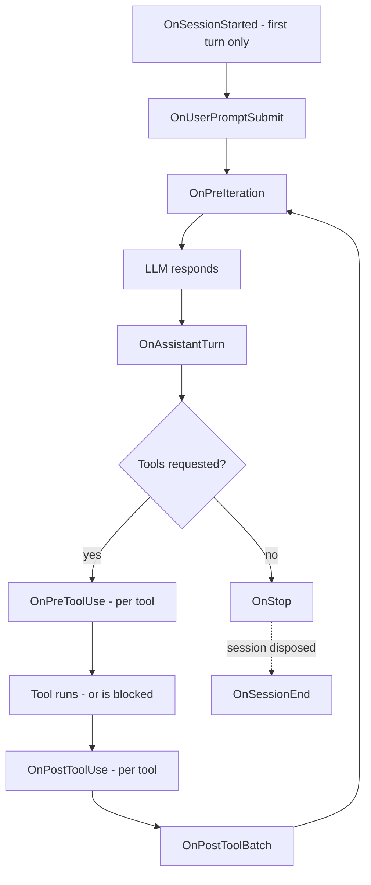

# How Hooks Work

## What This Document Covers

Agency is an open-source .NET framework for building AI agents — programs that call an LLM in a loop, let it use tools, and feed the results back until the job is done.

Hooks are how you attach extra behavior to that loop without editing it.

This document is both an explanation of the architecture and a reference for the contracts (events, decisions, payloads, exit codes) you need when writing a hook.

If you only remember five ideas from this document, remember these:

### 1. A hook is a callback at a known point in the agent loop

The loop fires hooks at nine fixed lifecycle points (session start, before a tool runs, after the model responds, and so on).

The loop itself does not know *why* a hook exists. It just fires them.

That is what keeps the core engine reusable: memory, security guards, and audit logging are all "just hooks" from the loop's point of view.

### 2. Only one hook can make a decision

Eight of the nine hooks are observers — they can watch, log, or update shared state, but they cannot change what the agent does.

The ninth, `OnPreToolUse`, is special. It runs *before* a tool executes and returns a verdict: allow the call, deny it, or rewrite its input.

This is the single control point where outside policy can stop the agent from doing something.

### 3. Hooks compose, and deny wins

Multiple hook sets can be merged into one. When two `OnPreToolUse` hooks disagree, the most restrictive decision wins:

**Deny > Rewrite > Allow**

That precedence holds everywhere — across hooks, across configuration entries, and across sources. Nothing downstream can weaken an upstream deny.

### 4. Hooks come from three sources

The effective hooks for an agent are folded together from:

1. **Baseline hooks** — first-party features compiled into Agency (memory uses these).
2. **Configured hooks** — declared in JSON by an operator, no rebuild needed.
3. **User hooks** — ad-hoc C# written by the host application.

They run in that order, and deny-wins applies across all three.

### 5. External hooks fail open

A configured hook runs an external script or webhook — and external things break.

A handler that crashes, times out, or returns garbage is logged and treated as "allow". Only an explicit, intentional deny blocks a tool.

A broken audit webhook must never wedge the agent.

---

## 1. The Problem Hooks Solve

Picture the agent loop in its simplest form:

```csharp
while (conversationIsStillGoing)
{
    buildPromptFromContext();
    askTheModelWhatToDo();
    runAnyRequestedTools();
    appendToolResultsToConversation();
}
```

Now imagine the features a real product needs around that loop:

- Block dangerous shell commands before they run.
- Log every tool call for auditing.
- Retrieve relevant memories before each turn.
- Notify a security service when a session ends.

The naive approach is to write all of that *into* the loop. That works once, then turns the loop into a tangle where every feature knows about every other feature.

Agency's answer is the classic one: **inversion of control**. The loop exposes fixed extension points (hooks), and features plug into them from the outside.

> Teaching note: if you have used ASP.NET middleware, git hooks, or webhooks, you already know this shape. The only new part is *where* the extension points sit — at the lifecycle moments of an AI agent's think-act-observe loop.

---

## 2. The Nine Lifecycle Events

The loop in `Agent.cs` fires hooks at nine points. Together they trace the life of a session from first message to disposal.

| Event | When it fires | Can it decide anything? |
| --- | --- | --- |
| `OnSessionStarted` | Once, before the first loop iteration | No |
| `OnUserPromptSubmit` | Every user turn, before the loop starts | No |
| `OnPreIteration` | At the start of every loop iteration, before the system prompt is rebuilt | No |
| `OnPreToolUse` | Before each tool invocation | **Yes** — allow / deny / rewrite |
| `OnPostToolUse` | After each tool invocation (success or error) | No |
| `OnPostToolBatch` | After all parallel tool calls in one batch settle | No |
| `OnAssistantTurn` | After the model responds and the response is recorded | No |
| `OnStop` | Just before the agent emits its final result for a turn | No |
| `OnSessionEnd` | Once, when the whole session is disposed | No |

A useful mental model for the ordering within one user turn:



Two distinctions trip people up:

- **`OnStop` vs `OnSessionEnd`.** `OnStop` fires at the end of every *turn*. `OnSessionEnd` fires exactly once, when the `ChatSession` is disposed.
- **`OnPostToolUse` vs `OnPostToolBatch`.** The model can request several tools at once; they run in parallel. `OnPostToolUse` fires per tool; `OnPostToolBatch` fires once after the whole batch settles.

---

## 3. The Contract: `AgentHooks`

All nine events live on a single record, `AgentHooks` (in `src/Harness/Agency.Harness/Hooks/AgentHooks.cs`):

```csharp
public sealed record AgentHooks
{
    public Func<SessionStartedHookContext, CancellationToken, Task>? OnSessionStarted { get; init; }
    public Func<PreToolUseHookContext, CancellationToken, Task<PreToolUseDecision>>? OnPreToolUse { get; init; }
    public Func<PostToolUseHookContext, CancellationToken, Task>? OnPostToolUse { get; init; }
    // ... six more delegates, one per lifecycle event ...

    public static AgentHooks None { get; } = new();
}
```

Three design details carry most of the weight:

### Every delegate is nullable, and null means skip

The loop checks each delegate before firing it:

```csharp
if (this._hooks.OnPreToolUse is { } onPreToolUse)
{
    PreToolUseDecision decision = await onPreToolUse(...);
}
```

If a delegate is `null`, the loop pays nothing — no allocation, no await, no branch beyond the null check. An agent with no hooks behaves exactly like an agent built before hooks existed.

### Each event gets a context record

Hooks receive small, purpose-built records (in `HookContexts.cs`) rather than the whole world:

```csharp
public sealed record PreToolUseHookContext(
    string ToolName,
    JsonElement Input,
    Context AgentContext);
```

Every context carries the shared `Context` object — the agent's "blackboard" where features read and write state (conversation, knowledge, session identity). A hook that wants to influence the next prompt writes into `Context`; it never calls the prompt builder directly.

### Only `OnPreToolUse` returns a value

All other delegates return plain `Task`. They can observe and mutate `Context`, but they have no channel to alter control flow. This is deliberate: one decision point is easy to reason about; nine would be a maze.

---

## 4. The Decision Type: `PreToolUseDecision`

When `OnPreToolUse` fires, it must answer: what should happen to this tool call?

```csharp
public abstract record PreToolUseDecision
{
    public sealed record Allow : PreToolUseDecision;
    public sealed record Deny(string Reason) : PreToolUseDecision;
    public sealed record Rewrite(JsonElement NewInput) : PreToolUseDecision;
}
```

- **Allow** — the tool runs with its original input.
- **Deny** — the tool never runs. The agent instead receives a tool error reading `[Blocked] {reason}`, observes the block, and can replan. (The model is told *why*, which usually produces better behavior than a silent failure.)
- **Rewrite** — the tool runs, but with substituted input. Useful for normalizing arguments (for example, forcing a `--no-color` flag) without blocking the call.

> Teaching note: a deny does not crash or end the conversation. It becomes an error *result* that the model sees, the same way a tool that genuinely failed would. The agent stays in control of what to do next; it just cannot do the blocked thing.

---

## 5. Composition: Many Hooks, One Record

A real deployment has several hook sets at once — memory, a block-list, audit logging, custom host behavior. The loop only accepts one `AgentHooks`. So hook sets must merge.

`AgentHooksExtensions.Compose` does the merging:

```csharp
AgentHooks effective = memoryHooks
    .Compose(BlockListHooks.Dangerous)
    .Compose(AuditHooks.ForLogger(logger));
```

The rules are simple:

- **Observer hooks run sequentially** — first's delegate, then second's.
- **`OnPreToolUse` hooks run concurrently, and the most restrictive decision wins**: Deny > Rewrite > Allow. If both sides deny, the first one's reason is used.
- **Null stays cheap** — composing a null delegate with a non-null one just keeps the non-null one; composing two nulls stays null, preserving the loop's skip path.

### The three sources, folded in order

At startup, `AgentFactory` folds the three hook sources into the final record:

```csharp
AgentHooks? hooks = AgentHooksExtensions.Fold(
    this.options.BaselineHooks,    // 1. first-party (memory)
    this.options.ConfiguredHooks,  // 2. operator JSON
    this.options.UserHooks);       // 3. host application code
```

The ordering is not arbitrary:

1. **Baseline first** — memory's `OnPreIteration` retrieval mutates `Context.Knowledge` and `Context.Memory`, so later hooks get to read the enriched context.
2. **Configured second** — operator policy sits in the middle.
3. **User last** — the host's code gets the final word.

But "final word" has a limit: because deny-wins applies across the fold, a later source can *add* restrictions but can never *remove* one. A config file cannot un-block what compiled C# policy blocked, and user code cannot un-block either of them. That is a security property, not a convenience.

---

## 6. Hooks Written in C# 

The original — and still simplest — way to author a hook is plain C#. Agency ships two small examples worth reading:

### `BlockListHooks.Dangerous`

A pre-built guard that denies shell tool calls containing known-dangerous patterns (`rm -rf`, `drop table`, ...). The whole thing is about forty lines: check the tool name, inspect the `command` argument, return `Deny` or `Allowed`. It is a good template for any policy hook.

### `AuditHooks.ForLogger`

Logs every tool call before and after execution via `ILogger`, always returning `Allow`. A good template for any observer hook.

### Memory — the biggest hook consumer

Agency's entire memory feature attaches to the loop through these same hooks: `OnSessionStarted` registers session state, `OnPreIteration` retrieves relevant memories into `Context`, `OnAssistantTurn` restarts an inactivity timer, and `OnSessionEnd` queues the final background distillation job.

The loop contains no memory logic at all — memory is delivered as a baseline `AgentHooks` instance, composed in like everything else.

How retrieval, distillation, and consolidation actually work is its own story, told in [How Agency Gives AI Agents Memory](How%20Agency%20Gives%20AI%20Agents%20Memory.md). For this document, the takeaway is simpler: **the hook system is load-bearing enough that the framework's flagship feature is built entirely on top of it.**

---

## 7. Configured Hooks: Policy Without a Rebuild

C# hooks are powerful but closed: changing one means recompiling and redeploying the host.

The `Hooks/Configuration/` subsystem (under `src/Harness/Agency.Harness/Hooks/Configuration/`) opens that up. An operator can declare hooks in the `appsettings.json` `"Hooks"` section, and at startup Agency turns those declarations into a regular `AgentHooks` instance.

The shape is modeled on the Claude Code hook contract: **event → matcher → external handler**, expressed in JSON.

Here is the one sentence worth remembering:

> Configured hooks are not a new firing mechanism. They are a *producer* of `AgentHooks` that happens to be driven by JSON instead of a compiler.

`Agent.cs` did not change at all for this feature. By the time the loop runs, a config-declared deny is indistinguishable from a compiled C# deny — same `[Blocked]` surface, same precedence.

### 7.1 The configuration schema

```json
"Hooks": {
  "PreToolUse": [
    {
      "matcher": "Bash|ExecutePowershell",
      "hooks": [
        { "type": "Command", "command": "pwsh",
          "args": ["-File", "./hooks/guard.ps1"], "timeout": 30 }
      ]
    }
  ],
  "PostToolUse": [
    {
      "matcher": "*",
      "hooks": [
        { "type": "Http", "url": "http://localhost:8080/audit",
          "headers": { "X-Source": "agency" }, "timeout": 10 }
      ]
    }
  ]
}
```

Reading it from the outside in:

- The top-level keys are **event names** — the same nine lifecycle events from §2 (`SessionStart`, `UserPromptSubmit`, `PreIteration`, `PreToolUse`, `PostToolUse`, `PostToolBatch`, `AssistantTurn`, `Stop`, `SessionEnd`).
- Each event holds an array of **matcher groups** — "for tool calls matching X, run these handlers".
- Each group holds an array of **handlers** — the external thing to execute.

### 7.2 Matchers: which tool calls does this apply to?

The `matcher` string filters by tool name and supports three modes, resolved once at startup:

| You write | Mode | Meaning |
| --- | --- | --- |
| `null`, `""`, or `"*"` | match-all | Applies to every call |
| `"Bash"` or `"Bash\|ExecutePowershell"` | exact / pipe-list | Case-insensitive name match against the list |
| anything with regex characters, e.g. `".*Powershell.*"` | regex | Compiled once, with a 250 ms match timeout |

Details worth knowing:

- A malformed regex fails **at startup**, not three weeks later when the tool happens to fire. Operators learn about bad patterns when the host boots.
- The regex match timeout guards against catastrophic backtracking (a pathological pattern cannot stall the loop); a timed-out match counts as "no match" and is logged.
- Matchers only filter **tool events** (`PreToolUse`, `PostToolUse`). For the other events, any matcher is treated as match-all in V1.

### 7.3 Handlers: the external execution boundary

Two handler kinds ship in V1.

**Command handlers** spawn a real executable:

- The payload (§7.4) is written to the process's **stdin** as JSON, then stdin is closed.
- The verdict is read from **stdout** (JSON) and the **exit code**.
- On timeout, the entire process tree is killed — no orphaned grandchildren.
- Arguments are passed via `ProcessStartInfo.ArgumentList` with `UseShellExecute = false`. There is no shell involved, so the agent's tool input (which can contain attacker-influenced text) is never interpolated into a command line. Command injection is ruled out by construction, not by escaping.

> Windows note: a `.ps1` file is not directly executable. Configure `"command": "pwsh", "args": ["-File", "./hooks/guard.ps1"]`, not `"command": "./hooks/guard.ps1"`.

**HTTP handlers** POST the same payload to a fixed URL:

- A 2xx response is treated like exit code 0, and the response body is parsed for a verdict.
- A non-2xx response or transport error is a non-blocking error (fail open).
- The `HttpClient` comes from `IHttpClientFactory`, so sockets are pooled, not exhausted.

Rule of thumb: use Command for local guards and scripts; use HTTP for centralized policy or audit services you do not want to ship to every host.

### 7.4 The payload: what your handler receives

Handlers receive a snake_case JSON document (over stdin or as the POST body). Fields are omitted when null, and only event-relevant fields are populated:

| Field | Type | Present for |
| --- | --- | --- |
| `session_id` | string | all events |
| `hook_event_name` | string | all events |
| `cwd` | string | all events |
| `iteration_count` | int | all events |
| `total_cost_usd` | double | all events |
| `tool_name` | string | PreToolUse, PostToolUse |
| `tool_input` | object | PreToolUse, PostToolUse |
| `tool_response` | `{content, is_error}` | PostToolUse |
| `prompt` | string | UserPromptSubmit |
| `message` | string | AssistantTurn, Stop |

`tool_input` is passed through verbatim — byte-identical to what the tool would receive. That matters for the rewrite path: a handler that wants to modify the input echoes back an edited copy of exactly what it was given.

> Contract warning: these field names are a public contract for operator scripts. Adding fields is safe; renaming or removing one breaks every script that reads it.

### 7.5 The verdict: what your handler returns

| Channel | Meaning |
| --- | --- |
| Exit code `0` | Success; stdout is parsed as JSON if present |
| Exit code `2` | **Blocking deny** |
| Any other exit code | Non-blocking error → fail open (Allow) |
| `hookSpecificOutput.permissionDecision: "deny"` in stdout JSON | Deny |
| `hookSpecificOutput.permissionDecisionReason` | The reason shown as `[Blocked] {reason}` |
| A `tool_input` field in stdout JSON | Rewrite — the tool runs with this input instead |
| HTTP 2xx | Same as exit `0`; body parsed as above |
| HTTP non-2xx / transport error | Non-blocking error → fail open |

So the smallest possible deny script is: read stdin, decide, and either `exit 2` or print:

```json
{"hookSpecificOutput": {"permissionDecision": "deny",
                        "permissionDecisionReason": "rm -rf blocked"}}
```

One precedence rule inside a single handler: an exit code of `2` dominates whatever is in stdout. An explicit blocking exit beats document content.

### 7.6 Aggregation: many handlers, one decision

Several handlers can match one tool call (within a group, or across groups). They all run concurrently via `Task.WhenAll`, and then their outputs are folded into one decision:

1. If any output maps to **Deny**, return the first deny (in config-declared order).
2. Otherwise, if any maps to **Rewrite**, return the first rewrite.
3. Otherwise, **Allow**.

The phrase "config-declared order" is load-bearing. The fold iterates outputs in the order handlers were declared, never in the order they happened to finish. Without that, two runs of identical config could pick different denies depending on handler latency — a nondeterminism bug that only shows up under load. With it, the verdict is a pure function of config plus payload: reproducible and auditable.

### 7.7 Failure handling: fail open, on purpose

External handlers are operator-authored scripts and webhooks. They *will* break — a missing binary, a transient 503, a typo in the output JSON.

The error taxonomy draws one line:

| What happened | Effect |
| --- | --- |
| Malformed regex, unknown event name, reserved handler kind | **Startup failure** — host refuses to boot |
| Exit 2 or `permissionDecision: "deny"` | Tool blocked |
| Rewritten `tool_input` in output | Input substituted |
| Handler timeout, crash, missing binary, bad JSON, HTTP error | Logged; treated as **Allow** |

The principle: **only an intentional, explicit signal blocks; everything accidental fails open.** Configuration mistakes fail fast at startup, where the operator is watching. Runtime mishaps fail open, so a broken audit webhook never deadlocks a user-facing turn.

(The flip side is worth stating plainly: if your guard script has a typo in `permissionDecision`, it silently stops denying. Test your hook scripts.)

### 7.8 The registry: from JSON to delegates

The bridge between declaration and behavior is `HookRegistry`. At startup it:

1. Binds the `"Hooks"` section to plain option classes (`HooksOptions` and friends — inert data, no behavior).
2. **Compiles once**: every matcher is resolved (regex compiled, pipe-lists hashed) and every handler is constructed, in the registry constructor. Per-tool-call work is then just a dictionary lookup and a matcher test — cheap enough to sit on the path that gates every tool execution.
3. **Projects** the compiled map onto an `AgentHooks` instance via `ToAgentHooks()`. Events with no configuration get `null` delegates, preserving the loop's skip path.

The wiring in the composition root is three lines of intent:

```csharp
builder.Services.AddAgencyConfiguredHooks(builder.Configuration);
// → binds HooksOptions, builds the HookRegistry singleton,
// → post-configures AgentOptions.ConfiguredHooks = registry.ToAgentHooks()
```

`AgentFactory` then folds it in as the middle source (§5).

Zero-config neutrality is a hard requirement: with no `"Hooks"` section (the default — `appsettings.json` ships `"Hooks": {}`), the registry produces `AgentHooks.None`, every delegate is `null`, and the agent behaves identically to a build without the feature. No processes spawn, nothing allocates.

> Note on reload: configuration is read once at startup. Changing hook policy means restarting the host — the same operational model as the rest of `appsettings.json`. Hot reload is a planned V2 item.

### 7.9 What configured hooks deliberately do not do (V1)

A few boundaries, so the reference is honest:

- **Only `PreToolUse` can block.** For the other eight events, handler output is ignored for control flow — the handlers are awaited (so timeouts and cancellation are honored), but they cannot stop the loop.
- **Matchers filter by tool name only.** Matching on session id or file path is V2.
- **`ask` collapses to allow.** Claude Code's interactive `ask` decision has no UI to land in here, so it is documented as allow.
- **No shell-form commands.** Pipes, `&&`, and redirects are intentionally unsupported (see the injection-safety point in §7.3). Wrap them in a script.
- **Heavier handler kinds** (`mcp_tool`, `prompt`, `agent`) are reserved in the enum but throw `NotSupportedException` if configured.

---

## 8. One Example From Start to Finish

Here is the whole system in a single trace. An operator wants to block `rm -rf` in shell tools without rebuilding the host.

### At startup

The operator adds to `appsettings.json`:

```json
"Hooks": {
  "PreToolUse": [
    { "matcher": "Bash|ExecutePowershell",
      "hooks": [ { "type": "Command", "command": "pwsh",
                   "args": ["-File", "./hooks/guard.ps1"], "timeout": 30 } ] }
  ]
}
```

At boot, the registry compiles the matcher into a case-insensitive name set, constructs one command handler, and projects a single non-null `OnPreToolUse` delegate. `AgentFactory` folds it between the memory baseline and any user hooks.

### At runtime

1. The model decides to run `ExecutePowershell` with `{"command": "rm -rf /tmp/x"}`.
2. The loop fires `OnPreToolUse`.
3. The matcher matches; the payload is serialized and piped into `pwsh -File guard.ps1` on stdin.
4. The script sees `rm -rf` and prints a deny verdict, exiting 0:

   ```json
   {"hookSpecificOutput": {"permissionDecision": "deny",
                           "permissionDecisionReason": "rm -rf blocked"}}
   ```

5. Aggregation maps that to `Deny("rm -rf blocked")`. Composition with the other sources keeps it (deny wins).
6. The loop never executes the tool. Instead the model receives a tool error: `[Blocked] rm -rf blocked`.
7. The agent observes the block and replans.

The same block could have come from `BlockListHooks.Dangerous` in compiled C# — and the agent could not tell the difference. That equivalence is the design's central promise.

---

## 9. Quick Reference: Writing Your Own Hook

### As C# (host application)

```csharp
AgentHooks myHooks = new()
{
    OnPreToolUse = (ctx, ct) =>
    {
        if (ctx.ToolName == "DeleteDatabase")
        {
            return Task.FromResult<PreToolUseDecision>(
                new PreToolUseDecision.Deny("Not in this house."));
        }
        return Task.FromResult(PreToolUseDecision.Allowed);
    },
    OnSessionEnd = (ctx, ct) =>
    {
        Console.WriteLine($"Session {ctx.SessionId} ended.");
        return Task.CompletedTask;
    },
};
```

Hand it to the host as user hooks and it composes with everything else.

### As a command handler (operator, no rebuild)

A guard script's job in pseudocode:

```text
1. Read the JSON payload from stdin.
2. Inspect hook_event_name / tool_name / tool_input.
3. To deny:    print the hookSpecificOutput deny JSON (or exit 2).
4. To rewrite: print JSON containing a modified tool_input.
5. To allow:   print nothing and exit 0.
```

Then declare it under the right event in the `"Hooks"` section with a matcher.

### Rules of thumb

- Keep `PreToolUse` handlers fast — they gate every matched tool call, and the loop waits on them by design (a guard that returned early could not deny).
- A wildcard (`"*"`) handler on a tool event pays its latency on *every* call. Keep wildcards fast, or attach them to non-gating events.
- Prefer HTTP handlers to per-call process spawns if you need high tool-call throughput.
- Test your deny path. A typo in the output JSON fails open silently.

---

## Final Takeaway

If you want the shortest possible summary, it is this:

Agency's loop exposes nine fixed callback points and consumes exactly one type, `AgentHooks`. Everything else — memory, block-lists, audit logging, JSON-configured operator policy — is a producer of that type, merged by composition rules where the most restrictive decision always wins.

That one-record contract is what lets the framework grow new behaviors — including an entire memory system and an external hook layer — while `Agent.cs` stays untouched.

Or, in one sentence:

Hooks let you change what an agent is *allowed and encouraged* to do, without ever changing how it *runs*.
