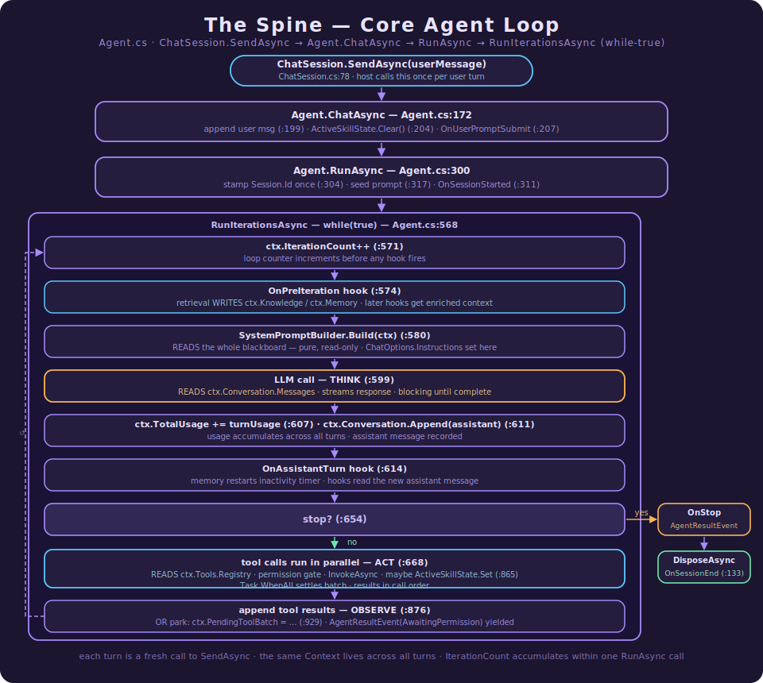
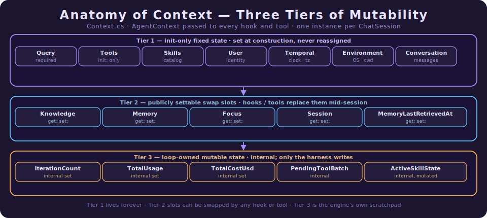
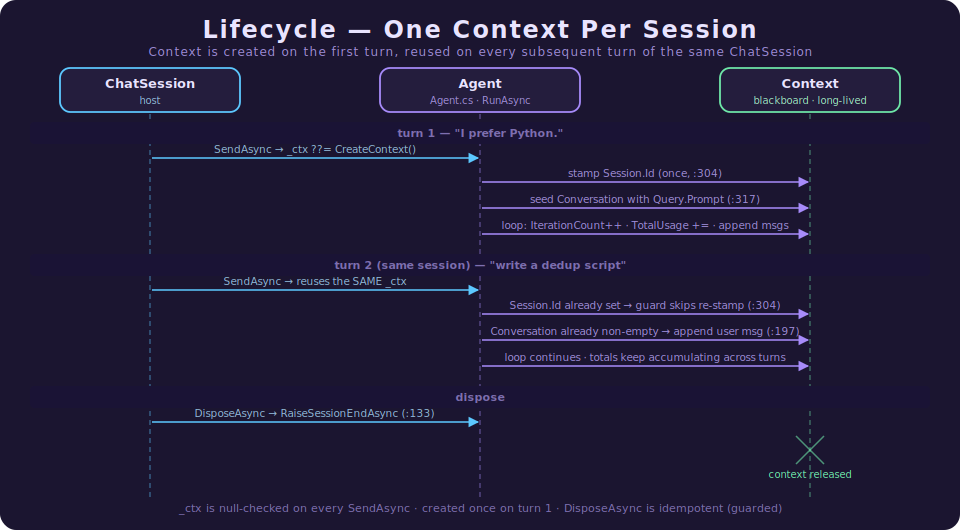
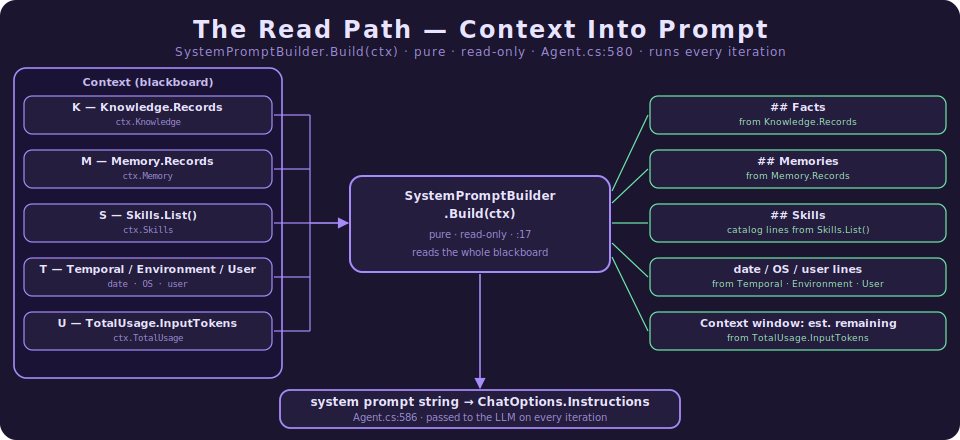

# How the Agent Loop and Context Work Together

> **Where this fits.** This is the grounding document for `Context` — the single object the
> Agency agent loop carries through every turn. The other deep-dives lean on it constantly:
> [How Agency Gives AI Agents Memory](How%20Agency%20Gives%20AI%20Agents%20Memory.md)
> talks about "retrieval writes `ctx.Knowledge`"; [How Agency's Skills Model Works](How%20Agency's%20Skills%20Model%20Works.md)
> talks about the active-skill window; [Consent at the Tool Boundary](Consent%20at%20the%20Tool%20Boundary%20-%20The%20Permission%20Model.md)
> talks about the parked tool batch. All three of those live *inside* `Context`. This document
> explains the object itself, and the loop that gives it meaning.
>
> It is written for engineers new to AI agents. No prior agent-framework experience is assumed.
> It opens gently, then descends into a code-anchored deep dive with real `file:line` references
> and an exhaustive reference appendix at the end.

---

## Part I — The gentle on-ramp

### 1. What `Context` is

An AI agent is, at its core, a loop: ask the model what to do, run the tools it asked for,
feed the results back, ask again. To run that loop you need somewhere to keep the state of the
conversation — the messages so far, the tools available, who the user is, what's been learned,
how many tokens you've spent.

In Agency, **all of that state lives in one object: `Context`**. A single `Context` instance is
created when a conversation starts, and it is passed *by reference* into every method of the
loop. Retrieval reads from it and writes to it. The system-prompt builder reads from it. The
tool dispatcher reads from it. The permission system parks state inside it. None of those parts
call each other directly — they meet on the shared object.

That design has a name: the **blackboard pattern**. Many independent components collaborate not
by calling one another, but by reading and writing a common, shared surface — the "blackboard."
`Context` is Agency's blackboard.

`★ The one-sentence model:` *`Context` is the canonical state of one conversation; the message
list sent to the model is **derived** from it every iteration — `Context` is the source of
truth, not the messages.* This is stated verbatim at the top of the type
(`Contexts/Context.cs:50-53`):

> "Canonical session state. The wire-format `messages[]` array is derived from this object on
> every loop iteration — it is never the source of truth."

### 2. Why a blackboard?

Consider the alternative. If the retrieval engine had to *call* the system-prompt builder to
hand it facts, the two would be welded together — you couldn't run the agent without retrieval,
and you couldn't change one without risking the other. By routing through `Context` instead,
each side only needs to know the shape of the shared object:

- Retrieval, running in the `OnPreIteration` hook, **writes** `ctx.Knowledge`.
- One step later, `SystemPromptBuilder.Build(ctx)` **reads** `ctx.Knowledge` and renders it.

They never reference each other. The blackboard decouples them. This is exactly what lets the
memory system attach as an *optional* set of hooks (see the memory deep-dive): the loop doesn't
know retrieval exists — it just rebuilds the prompt from whatever is on the blackboard.

### 3. The headline ideas

If you remember four things about `Context`, remember these.

1. **One object per *session*, reused across every turn and every loop iteration.** It is built
   once, lazily, on the first message, and then handed to each subsequent turn. Reusing it is
   how the conversation accumulates: history, token totals, the session id, and learned focus
   all persist because they live on the same instance.

2. **The message array is derived, not stored as truth.** Every iteration rebuilds the
   system prompt from `Context` and sends `ctx.Conversation.Messages` to the model. If you want
   to change what the model sees next turn, you change `Context` — you don't edit a prompt
   string.

3. **Mostly immutable, with four deliberate exceptions.** Most of `Context` is fixed at
   construction (`init`-only). Only four slots are designed to be swapped mid-session —
   `Knowledge`, `Memory`, `Focus`, and `Session` — because hooks and tools genuinely need to
   update them between iterations. Everything else is locked down on purpose.

4. **Identity is how memory stays safe.** `Context.User` and `Context.Session` carry the stable
   user and session ids. The memory system partitions every record by `User.Id` (a hard wall
   between users) and ranks by `Session.Id` (a soft preference for your own earlier work). The
   blackboard is where that identity is stamped and read.

---

## Part II — The deep dive

### 4. The spine: the core agent loop

`Context` is meaningless without the loop that drives it, so we start there. The loop is the
classic **think → act → observe** cycle, and `Context` (`ctx`) is the single argument threaded
through all of it — never copied, never recreated mid-session.

Three methods form the spine, all in `src/Harness/Agency.Harness/Agent.cs`:

- **`ChatAsync`** (`Agent.cs:172`) wraps **one user turn**. It appends the new user message,
  clears the per-turn skill window, fires `OnUserPromptSubmit`, applies the optional turn
  timeout, and then drives `RunAsync`.
- **`RunAsync`** (`Agent.cs:300`) handles **session start**: it stamps the session id (once),
  emits `SessionStartedEvent`, fires `OnSessionStarted`, seeds the conversation on the very
  first turn, and then enters the iteration loop.
- **`RunIterationsAsync`** (`Agent.cs:563`) is the **`while (true)` heart** — the think → act →
  observe cycle itself.

Here is one iteration, stripped to where it touches `ctx` (line numbers exact):

```csharp
while (true)                                         // Agent.cs:568
{
    ct.ThrowIfCancellationRequested();
    ctx.IterationCount++;                            // :571  ── observe-counter

    if (this._hooks.OnPreIteration is { } pre)       // :574  ── RETRIEVAL mutates
        await pre(ctx, ct);                          //         ctx.Knowledge / ctx.Memory here

    string systemPrompt = SystemPromptBuilder.Build(ctx);  // :580  ── reads the whole ctx

    var response = await this._llm.GetResponseAsync(
        ctx.Conversation.Messages, options, ct);     // :599  ── THINK (reads messages)

    ctx.TotalUsage = new(                            // :607  ── accumulate usage
        ctx.TotalUsage.InputTokens  + turnUsage.InputTokens,
        ctx.TotalUsage.OutputTokens + turnUsage.OutputTokens);

    ctx.Conversation.Append(lastAssistant);          // :611  ── record the answer

    if (this._hooks.OnAssistantTurn is { } turn)     // :614  ── TIMER restart (memory)
        await turn(new AssistantTurnHookContext(lastAssistant, ctx), ct);

    if (this._stop(ctx, lastAssistant)) { ... yield break; }  // :654  ── stop?

    var toolCalls = lastAssistant.Contents.OfType<FunctionCallContent>().ToList();  // :668  ── ACT
    // ... tools run in parallel against ctx.Tools.Registry ...
    foreach (var r in resultMessages)
        ctx.Conversation.Append(...);                // OBSERVE: append tool results
}
```

Notice the rhythm: **every interesting thing the loop does is a read or a write of `ctx`.** The
hooks (`OnPreIteration`, `OnAssistantTurn`) are the seams where *other* subsystems get to touch
the blackboard. The loop itself owns only a few fields — the iteration counter and the usage
totals.



The two boundaries of this spine both belong to `ChatSession` (covered in §7): it **creates**
the `ctx` before the first turn and **disposes** it at session end. In between, the *same* `ctx`
is the lone argument passed into `ChatAsync` → `RunAsync` → `RunIterationsAsync` on every turn.
Everything that follows — the read path (§8), the write seams (§9), the park/resume detour
(§10) — is just a labelled point on this loop.

### 5. Anatomy of `Context`: three tiers of mutability

`Context` is a `sealed record` (`Contexts/Context.cs:54`). Its members fall into three tiers,
and the tier tells you *who* is allowed to change a field and *when*.



**Tier 1 — `init`-only fixed state.** Set once at construction, never reassigned:
`Query` (`:57`), `Tools` (`:78`), `Skills` (`:81`), `User` (`:97`), `Temporal` (`:100`),
`Environment` (`:103`), `Conversation` (`:106`). These define *who* and *what* the session is.
They cannot change because nothing about the loop should ever need to swap out the tool registry
or the user mid-conversation.

**Tier 2 — publicly settable swap slots.** Four sub-contexts plus one scalar are `get; set;`
specifically so a hook or tool can replace them between iterations:
`Knowledge` (`:67`), `Memory` (`:75`), `Focus` (`:87`), `Session` (`:94`), and
`MemoryLastRetrievedAt` (`:127`). The records they hold are themselves immutable — so "updating
knowledge" means *assigning a new instance*, which the source spells out (`:63`):

> "KnowledgeContext is immutable, so to update the knowledge facts you must assign a new instance
> to this property."

On the loop diagram, every Tier-2 write
happens at the `OnPreIteration` seam (`:574`) or via a tool — never by the loop body itself.

**Tier 3 — loop-owned mutable state.** `IterationCount` (`:111`), `TotalCostUsd` (`:114`), and
`TotalUsage` (`:117`) are `get; internal set;` — only code *inside* the harness assembly may
write them, and in practice only the loop does. `PendingToolBatch` (`:137`) is `internal get;
set;`. `ActiveSkillState` (`:146`) is the lone getter-only member: it is never reassigned, but
the object it points to is mutated in place.

`★ Why the tiers matter:` the accessor on each property is a contract. A host writing a custom
hook can freely swap `ctx.Knowledge` (Tier 2) but *cannot* fake `ctx.IterationCount` (Tier 3,
`internal set`) or reach `ctx.PendingToolBatch` (Tier 3, `internal`). The type system enforces
who owns what — the blackboard is shared, but not a free-for-all.

### 6. The eleven sub-contexts

`Context` is an aggregate: each concern gets its own small record. All of them are
`sealed record`s in `src/Harness/Agency.Harness/Contexts/`, and all but `QueryContext` and
`MemoryRecord` expose a shared static `Empty` singleton used as the default on `Context`. Group
them by job.

#### Identity & grounding

**`QueryContext`** (`QueryContext.cs`) — "The user's intent for this agent session." One member:
`public required string Prompt { get; init; }` (`:7`). This is the only `required` member in the
whole context graph (alongside `Context.Query` itself) — the user's first message is the one
mandatory input. No `Empty` singleton, because an empty query makes no sense.

**`UserSpecificContext`** (`UserSpecificContext.cs`) — "Caller identity and preferences injected
into the system prompt." `Id` (`:13`) is "the stable user identifier used to partition memory
records … Required by the retrieval engine and distillation pipeline (Spec §6.4)" — this is the
hard security boundary of the memory system. `Name` (`:16`) is rendered into the prompt as
`User: <name>`.

**`SessionContext`** (`SessionContext.cs`) — "Stable per-session identity used to tag and rank
memory records (Spec P3)." One member, `Id` (`:10`), "null until the agent loop assigns one."
The loop stamps it exactly once (see §7).

**`TemporalContext`** (`TemporalContext.cs`) — "Current date/time injected into the system prompt
as a grounding cue." `CurrentDateUtc` (`:14`) is stamped at construction from the agent's clock.
Telling the model the current date prevents it from guessing.

**`EnvironmentalContext`** (`EnvironmentalContext.cs`) — "Operating-environment facts." Carries
`OperatingSystem` (`:14`) and `ContextWindowSize` (`:17`). The window size feeds the prompt's
"Context window: N tokens (… est. remaining …)" line and the truncation-error message.

#### Recall (the memory surface)

**`KnowledgeContext`** (`KnowledgeContext.cs`) — "Domain facts re-injected into the system prompt
on every iteration (D3)." Two collections:
- `Facts` (`:10`) — a plain `IReadOnlyList<string>`, rendered under `## Knowledge`.
- `Records` (`:18`) — `IReadOnlyList<MemoryRecord>`, each with `ContentType == Fact`, "Set by
  `RetrievalEngine` in `OnPreIteration`; rendered as `## Facts`."

**`MemoryContext`** (`MemoryContext.cs`) — "Long-term memory items for the current session." The
mirror image of `KnowledgeContext`:
- `LongTermMemory` (`:12`) — strings summarized into the prompt.
- `Records` (`:20`) — `MemoryRecord`s with `ContentType == Memory`, "rendered as `## Memories`."

**`MemoryRecord`** (`MemoryRecord.cs`) — a positional record,
`MemoryRecord(string Title, string Value, DateTimeOffset UpdatedAt)` (`:11`). "A lightweight
projection of a memory store record … Carries only the fields that `SystemPromptBuilder` needs
to render the `## Facts` and `## Memories` sections." `UpdatedAt` drives the "Updated 3 weeks ago"
recency string.

`★ The two "knowledge" shapes:` both `Knowledge` and `Memory` carry a legacy string list **and**
a newer `Records` list. The string lists (`Facts`, `LongTermMemory`) render under
`## Knowledge` / `## Long-term memory`; the `Records` lists render under `## Facts` / `## Memories`
with humanised recency. The same `MemoryRecord` type lives in both — the *property it sits on*
decides whether it's a fact or an episode, not the record itself.

**`FocusContext`** (`FocusContext.cs`) — "Narrows the retrieval query toward a particular task
domain, as set by `SetFocusTool`. Focus terms are appended to the query text before embedding,
biasing retrieval without forcing exact-match filtering (Spec §6.4, §6.7.1)." Carries `Title`
(`:14`), `Domain` (`:17`), and `Tags` (`:20`). This is a Tier-2 swap slot: the `SetFocus` tool
replaces it mid-session.

#### Capabilities

**`ToolContext`** (`ToolContext.cs`) — "The tool registry available to the agent during this
session." One member, `Registry` (`:12`), defaulting to `ToolRegistry.Empty`. The loop reads
`ctx.Tools.Registry.ListDefinitions()` to advertise tools and `.InvokeAsync(...)` to run them.

**`SkillContext`** (`SkillContext.cs`) — the outlier. It "Wraps a live `ISkillCatalog` reference
so the system prompt always reflects the current catalog state (supports Phase-2 live reload
without needing to re-build the `Context`)." Unlike every other sub-context, it is a `public`
record whose members are **all `internal`**, and it is the only one that carries *behaviour*:
`List()` (`:19`) and `Find(name)` (`:26`) delegate to the wrapped catalog. Its `Empty` (`:13`)
is also the only non-public `Empty`. Wrapping a *live* catalog (rather than a snapshot) is what
lets skills hot-reload without rebuilding `Context`.

### 7. Lifecycle: one `Context` per session

A `Context` is **created once, lazily, on the first user message, and reused for the life of the
session.** It is not per-turn and not per-iteration. The evidence is concrete.

**Construction** goes through one factory, `Agent.CreateContext` (`Agent.cs:148-163`):

```csharp
public static Context CreateContext(
    string initialPrompt, ToolContext? tools = null, EnvironmentalContext? environment = null,
    UserSpecificContext? user = null, TimeProvider? timeProvider = null, SkillContext? skills = null) =>
    new()
    {
        Query    = new QueryContext { Prompt = initialPrompt },
        Temporal = new TemporalContext { CurrentDateUtc = (timeProvider ?? TimeProvider.System).GetUtcNow() },
        Tools    = tools ?? ToolContext.Empty,
        Environment = environment ?? EnvironmentalContext.Empty,
        User     = user ?? UserSpecificContext.Empty,
        Skills   = skills ?? SkillContext.Empty,
    };
```

In production there is **no other `new Context`** — every direct construction is in test code.
The single caller is `ChatSession`, and it uses `??=` so the object is built only on the first
send (`ChatSession.cs:100-106`):

```csharp
this._ctx ??= Agent.CreateContext(userMessage, this._toolContext,
    new EnvironmentalContext { ContextWindowSize = this._options.ContextWindowSize },
    user: this._user, timeProvider: this._agent.TimeProvider, skills: this._skills);
```

`ChatSession` is the **lifecycle owner** of the blackboard. Its class doc is explicit
(`ChatSession.cs:86-87`): "The underlying `Context` is created lazily on the first call and
reused on subsequent calls so conversation history is preserved." On every turn it passes the
*same* `_ctx` into `ChatAsync` (`:126`); `Reset()` (`:167`) drops it to `null` so the next send
starts fresh; `DisposeAsync()` (`:177`) fires `OnSessionEnd` once.



Two details make "one per session" airtight:

- **The session id is stamped idempotently** (`Agent.cs:304-307`): `if (ctx.Session.Id is null)
  ctx.Session = ctx.Session with { Id = Guid.NewGuid().ToString("N") };`. Because the same `ctx`
  survives into turn 2, the guard sees a non-null id and leaves it alone — the id is stable for
  the session's lifetime, which is exactly what the `Session` doc promises (Spec P3). A host may
  also pre-seed the id before the first run; the guard honours that too.
- **The first-turn seed vs. later appends** key off accumulated state. `RunAsync` seeds the
  conversation only when it is empty (`:317`); `ChatAsync` appends the new user message only when
  it is *not* empty (`:197-200`). Both branches only make sense because the conversation — living
  inside the reused `Context` — carries forward.

### 8. The read path: turning `Context` into a prompt

Once per iteration the loop calls `SystemPromptBuilder.Build(ctx)` (`Agent.cs:580`). This is a
**pure function** (`SystemPromptBuilder.cs:7-17`) — it reads `ctx` and returns a string, mutating
nothing. It is the consumer side of the blackboard: whatever the hooks wrote, this renders.

It walks the context in a fixed order and emits Markdown:

| `Context` source | Rendered section | Line |
|---|---|---|
| `ctx.Tools.Registry is IProgressiveDiscovery` | deferred-tools instruction | `:30-34` |
| `ctx.Skills.List()` where `!DisableModelInvocation` | `## Skills` | `:37-53` |
| `ctx.Knowledge.Facts` | `## Knowledge` | `:56-64` |
| `ctx.Memory.LongTermMemory` | `## Long-term memory` | `:67-75` |
| `ctx.Knowledge.Records` (`ContentType == Fact`) | `## Facts` | `:78-87` |
| `ctx.Memory.Records` (`ContentType == Memory`) | `## Memories` | `:90-99` |
| both `Records` lists empty | literal `No relevant memories yet.` | `:103-107` |
| `ctx.Temporal.CurrentDateUtc` | `Current date/time (UTC): …` | `:110-114` |
| `ctx.Environment.OperatingSystem` | `Operating system: …` | `:117-120` |
| `ctx.Environment.ContextWindowSize` + `ctx.TotalUsage.InputTokens` | `Context window: …` | `:122-133` |
| `ctx.User.Name` | `User: …` | `:136-139` |



Two things worth calling out. First, the `## Facts` vs `## Memories` split is *purely* a function
of which property a `MemoryRecord` sits on — `Knowledge.Records` → `## Facts`,
`Memory.Records` → `## Memories` — both rendered by identical code (`:82-86` and `:94-98`).
Second, the model never sees a score, a UUID, or a raw timestamp: ages are passed through
`Humanize` (`SystemPromptBuilder.cs:150-183`), which turns a `TimeSpan` into "just now",
"3 minutes ago", "2 hours ago", "5 days ago", "2 weeks ago", or "3 months ago". From the model's
side, "the user prefers Python (Updated 3 weeks ago)" is simply a fact.

`★ Why rebuild the prompt every iteration?` Because `Context` is the source of truth and the
prompt is derived from it (§1). If retrieval injects a new fact at iteration 4's `OnPreIteration`,
the rebuild at iteration 4's step `:580` picks it up automatically. Nobody has to "invalidate"
or "refresh" a cached prompt — there is no cached prompt.

### 9. The write seams: who mutates the blackboard

Reads are easy; the interesting question is *who is allowed to write, and where.* The loop hands
the **live `ctx`** to hooks through the `…HookContext` records — specifically as the property
`AgentContext` (`Hooks/HookContexts.cs`). Because it is the real instance (not a copy), a hook
can mutate any Tier-2 swap slot.

The hook contract lives in `AgentHooks` (`Hooks/AgentHooks.cs`), a record of nullable delegates.
The one explicitly designated for mutation is `OnPreIteration` (`:17-22`):

> "Fires at the start of every agent loop iteration, before the system prompt is rebuilt.
> Intended for retrieval-engine injection (mutate `Context.Knowledge` and `Context.Memory` here)."

The complete map of who writes what:

| Writer | `Context` target | Where |
|---|---|---|
| `OnPreIteration` hook (retrieval) | `Knowledge`, `Memory`, `MemoryLastRetrievedAt` | `Agent.cs:574-576` |
| `SetFocus` tool | `Focus` | via tool invocation (Tier 2) |
| Agent loop (first turn) | `Session.Id` | `Agent.cs:304-307` |
| Agent loop (every iteration) | `IterationCount`, `TotalUsage`, `Conversation` | `Agent.cs:571, 607, 611` |
| `skill` meta-tool success | `ActiveSkillState` (in place) | `Agent.cs:865` |
| New user message | `ActiveSkillState.Clear()` | `Agent.cs:204` |
| Permission park | `PendingToolBatch` | `Agent.cs:929` |

`★ Subtlety — three hook records that aren't used as wrappers.` `HookContexts.cs` defines six
*public* records that wrap `ctx` as `AgentContext` (`SessionStarted`, `PreToolUse`, `PostToolUse`,
`AssistantTurn`, `Stop`, `SessionEnded`). It also defines three *internal* ones —
`UserPromptSubmitHookContext`, `PreIterationHookContext`, `PostToolBatchHookContext` (`:32-38`) —
but the matching delegates in `AgentHooks` take `Context` (and friends) **directly**, not the
wrapper: `OnUserPromptSubmit : Func<Context, …>` (`:15`), `OnPreIteration : Func<Context, …>`
(`:22`), `OnPostToolBatch : Func<…, Context, …>` (`:37`). So those three wrapper records exist but
are effectively unused by the live loop — a small inconsistency worth knowing before you go
looking for where they're constructed (they aren't).

### 10. Advanced state: park and the active-skill window

Two members of `Context` are `internal` and easy to miss, but they are where two whole subsystems
keep their per-session state. Both get the full treatment here.

#### `PendingToolBatch` — the permission park

When a tool call needs user approval mid-batch, the loop cannot just block — it has to **park**
the turn and hand control back to the host. The parked state is stored on the blackboard as
`ctx.PendingToolBatch` (`Context.cs:137`), described as "the serialization target for the harness
state-persistence project (spec §6.6)." It is set at `Agent.cs:929-935`:

```csharp
ctx.PendingToolBatch = new PendingToolBatch
{
    Iteration = ctx.IterationCount,
    Results = resultMessages,        // completed siblings' results, by batch index
    Pending = pendingCalls,          // the calls awaiting user approval
    SiblingToolEvents = siblingEvents,
};
yield return new AgentResultEvent(AgentResultStatus.AwaitingPermission, null, ctx.TotalUsage, ctx.TotalCostUsd);
```

The two internal types it uses live at the top of `Context.cs`: `PendingToolBatch` (`:12-32`)
holds the half-finished batch — the completed siblings' results, the calls still waiting, and the
sibling events needed to reconstruct the full batch for `OnPostToolBatch` on resume. Each pending
call is a `PendingToolCall` record (`:37-46`) carrying everything needed to execute it *if*
approved: the post-rewrite `Input`, the proposed permission rule, the request source, and a
reason.

The field is cleared when the batch finally completes — on resume, or on abandonment. If the user
sends a *new* message while a turn is parked, `ChatSession.SendAsync` (`ChatSession.cs:112-124`)
implicitly denies every pending call, drains the batch, and proceeds with the new message. That
`PendingToolBatch` lives on `Context` (not in some side table) is precisely what will let the
state-persistence project snapshot and resume a parked turn by serialising one object. The full
mechanics are in [Consent at the Tool Boundary](Consent%20at%20the%20Tool%20Boundary%20-%20The%20Permission%20Model.md).

#### `ActiveSkillState` — the per-turn pre-approval window

`ctx.ActiveSkillState` (`Context.cs:146`) is the only getter-only member: never reassigned,
mutated in place. It tracks which tools the most-recently-invoked skill has pre-approved, so the
permission gate can wave them through *for the rest of the current turn only*.

Its lifecycle is a tight loop between the agent and the skill tool
(`Skills/ActiveSkillState.cs`):

- **Set** — when the `skill` meta-tool returns successfully, the loop records that skill's
  allowed-tools: `ctx.ActiveSkillState.Set(invokedSkill?.AllowedTools ?? [])` (`Agent.cs:855-865`).
  On a *failed* invocation it deliberately leaves any prior grant intact.
- **Check** — the permission gate calls `ctx.ActiveSkillState.IsAllowed(toolName)`
  (`ActiveSkillState.cs:45`, exact-match, case-insensitive) to pre-approve.
- **Clear** — the very next user message wipes it: `ctx.ActiveSkillState.Clear()`
  (`Agent.cs:204`). The doc is explicit that "the pre-approval window is bounded to the single
  turn in which the skill was invoked."

`★ Why in-place mutation here, but instance-swapping for Knowledge?` `ActiveSkillState` is a tiny
mutable class owned solely by the loop and the skill tool, mutated single-threaded within a turn —
so a plain `Set`/`Clear` is simpler and there is no immutability contract to uphold. The Tier-2
sub-contexts (`Knowledge`, etc.) are immutable records shared more widely, so they follow the
"assign a new instance" rule instead. Same blackboard, two mutation styles, each fit to its owner.
The skills side of this is detailed in [How Agency's Skills Model Works](How%20Agency's%20Skills%20Model%20Works.md).

---

## Part III — Reference appendix

### 11. Property matrix

#### `Context` (`Contexts/Context.cs`)

| Property | Type | Accessor | Default | Tier |
|---|---|---|---|---|
| `Query` | `QueryContext` | `required get; init;` | — (required) | 1 fixed |
| `Knowledge` | `KnowledgeContext` | `get; set;` | `KnowledgeContext.Empty` | 2 swap |
| `Memory` | `MemoryContext` | `get; set;` | `MemoryContext.Empty` | 2 swap |
| `Tools` | `ToolContext` | `get; init;` | `ToolContext.Empty` | 1 fixed |
| `Skills` | `SkillContext` | `get; init;` | `SkillContext.Empty` | 1 fixed |
| `Focus` | `FocusContext` | `get; set;` | `FocusContext.Empty` | 2 swap |
| `Session` | `SessionContext` | `get; set;` | `SessionContext.Empty` | 2 swap |
| `User` | `UserSpecificContext` | `get; init;` | `UserSpecificContext.Empty` | 1 fixed |
| `Temporal` | `TemporalContext` | `get; init;` | `TemporalContext.Empty` | 1 fixed |
| `Environment` | `EnvironmentalContext` | `get; init;` | `EnvironmentalContext.Empty` | 1 fixed |
| `Conversation` | `IConversationManager` | `get; init;` | `new InMemoryConversationManager()` | 1 fixed |
| `IterationCount` | `int` | `get; internal set;` | `0` | 3 loop-owned |
| `TotalCostUsd` | `decimal` | `get; internal set;` | `0` | 3 loop-owned |
| `TotalUsage` | `LlmTokenUsage` | `get; internal set;` | `new(0, 0)` | 3 loop-owned |
| `MemoryLastRetrievedAt` | `DateTimeOffset?` | `get; set;` | `null` | 2 swap |
| `PendingToolBatch` | `PendingToolBatch?` | `internal get; set;` | `null` | 3 loop-owned |
| `ActiveSkillState` | `ActiveSkillState` | `internal get;` (in-place) | `new()` | 3 loop-owned |

#### Sub-contexts

| Type | Member | Type | Accessor | Default |
|---|---|---|---|---|
| `QueryContext` | `Prompt` | `string` | `required get; init;` | — |
| `KnowledgeContext` | `Empty` | `KnowledgeContext` | `static get;` | `new()` |
| | `Facts` | `IReadOnlyList<string>` | `get; init;` | `[]` |
| | `Records` | `IReadOnlyList<MemoryRecord>` | `get; init;` | `[]` |
| `MemoryContext` | `Empty` | `MemoryContext` | `static get;` | `new()` |
| | `LongTermMemory` | `IReadOnlyList<string>` | `get; init;` | `[]` |
| | `Records` | `IReadOnlyList<MemoryRecord>` | `get; init;` | `[]` |
| `MemoryRecord` | `Title` / `Value` / `UpdatedAt` | `string` / `string` / `DateTimeOffset` | positional `init` | — |
| `FocusContext` | `Empty` | `FocusContext` | `static get;` | `new()` |
| | `Title` | `string?` | `get; init;` | `null` |
| | `Domain` | `string?` | `get; init;` | `null` |
| | `Tags` | `IReadOnlyList<string>` | `get; init;` | `[]` |
| `SessionContext` | `Empty` / `Id` | `SessionContext` / `string?` | `static get;` / `get; init;` | `new()` / `null` |
| `UserSpecificContext` | `Empty` / `Id` / `Name` | `…` / `string?` / `string?` | `static get;` / `get; init;` | `new()` / `null` / `null` |
| `TemporalContext` | `Empty` / `CurrentDateUtc` | `…` / `DateTimeOffset?` | `static get;` / `get; init;` | `new()` / `null` |
| `EnvironmentalContext` | `Empty` / `OperatingSystem` / `ContextWindowSize` | `…` / `string?` / `int?` | `static get;` / `get; init;` | `new()` / `null` / `null` |
| `ToolContext` | `Empty` / `Registry` | `…` / `IToolRegistry` | `static get;` / `get; init;` | `new()` / `ToolRegistry.Empty` |
| `SkillContext` | `Empty` / `Catalog` | `…` / `ISkillCatalog` | `internal static get;` / `internal get; init;` | `new()` / `SkillCatalog.Empty` |

Notes: `SkillContext` is the only sub-context with `internal` members and methods (`List`,
`Find`), and the only non-public `Empty`. `TemporalContext` and `EnvironmentalContext` are the
only two that declare an explicit (empty) parameterless constructor. `QueryContext` and
`MemoryRecord` are the only types without an `Empty` singleton.

### 12. Read / write matrix

For each property: where the loop (and friends) **read** it, and where it is **written** — with
the loop step from §4 in parentheses.

| Property | Read at | Written / mutated at |
|---|---|---|
| `Query.Prompt` | seed `Agent.cs:319` (RunAsync) | `CreateContext` `Agent.cs:157` |
| `Conversation` | LLM call `Agent.cs:599` (THINK); guards `:197, :317` | append `:199, :319, :611`, tool results post-batch; seed `:319` |
| `Session.Id` | `Agent.cs:308`; `RaiseSessionEndAsync :135` | stamped once `Agent.cs:304-307` |
| `IterationCount` | `IterationCompletedEvent :619`; `StepCountIs` stop cond. `StopConditions.cs:21` | `++` `Agent.cs:571` (top of loop) |
| `TotalUsage` | telemetry delta `:190, :264`; prompt window line `SystemPromptBuilder.cs:124`; `TokensExceeded` `StopConditions.cs:33`; result events | accumulate `Agent.cs:607-609` |
| `TotalCostUsd` | result events `:644, :658, :674, :941`; `BudgetExceeded` `StopConditions.cs:29`; hook payloads | **not written in `Agency.Harness` today** — see §13 |
| `Knowledge` / `Memory` | `SystemPromptBuilder.Build` `:56-99` (read path) | `OnPreIteration` hook `Agent.cs:574-576` |
| `Focus` | retrieval query build (memory subsystem) | `SetFocus` tool (Tier 2) |
| `Tools.Registry` | `ListDefinitions :322`; `InvokeAsync` `:818` (ACT) | init-only |
| `Skills` | `SystemPromptBuilder :37`; `Find` `:864` | init-only |
| `Environment.ContextWindowSize` | prompt `:122`; truncation msg `:633` | init-only (set in `CreateContext` caller) |
| `MemoryLastRetrievedAt` | retrieval gate (memory subsystem) | retrieval engine, `OnPreIteration` |
| `ActiveSkillState` | gate `IsAllowed` `Agent.cs` tool path | `Set :865`, `Clear :204` |
| `PendingToolBatch` | resume / abandonment `ChatSession.cs:112` | set `:929`, cleared on resume |

### 13. Accuracy footnotes

- **`TotalCostUsd` is currently a read-only slot.** It is declared `get; internal set;`
  (`Context.cs:114`), is read by the `BudgetExceeded` stop condition (`StopConditions.cs:29`),
  the hook payload factory, `ChatSession.TotalCostUsd` (`:52`), and three `AgentResultEvent`
  constructions — but **no production code in `Agency.Harness` ever writes it**; it stays at its
  default `0`. Only tests assign it. If/when a cost-tracking layer lands, this is the slot it
  will populate; until then, treat any cost-based budget as inert in the base harness.
- **Three unused hook-context wrappers.** `UserPromptSubmitHookContext`,
  `PreIterationHookContext`, and `PostToolBatchHookContext` (`HookContexts.cs:32-38`) are defined
  but never constructed by the loop, because the corresponding `AgentHooks` delegates pass
  `Context` directly (§9).
- **`required` members.** Exactly two members in the whole graph are `required`: `Context.Query`
  (`:57`) and `QueryContext.Prompt`. The user's first message is the one mandatory input.

---

## Final takeaway

`Context` is the blackboard at the centre of Agency's agent loop. It is **created once per
session, reused across every turn and iteration, and is the source of truth from which the
message array is derived each pass.** Most of it is locked down at construction; a deliberate
handful of slots (`Knowledge`, `Memory`, `Focus`, `Session`) are settable so hooks and tools can
update the agent's view between iterations without ever touching the loop's code. Retrieval
writes facts onto it; the prompt builder reads them off it; the permission and skill subsystems
park their per-session state inside it — and none of them call each other. That is the whole
point of a blackboard, and it is what lets memory, skills, and permissions all attach to the same
lean loop as optional, independent features.
