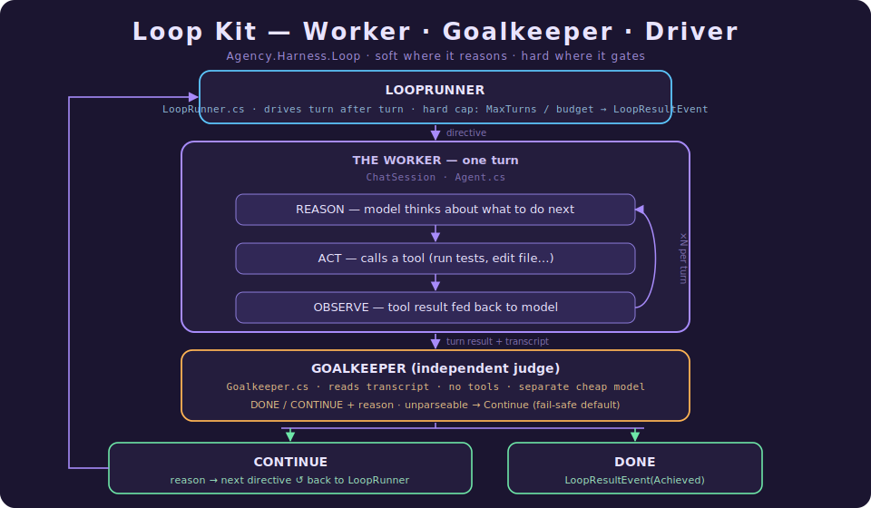

# Loop Kit: Driving an Agent Until the Job Is Actually Done

> **What this document is.** The single, self-contained reference for Agency's *Loop Kit* — the layer
> that drives an agent **turn after turn until the work is actually done**, where "done" is decided by
> an independent check the model cannot talk its way past. It is written in **two parts**: **Part I** is
> a gentle, code-free tour (plain English, analogies, no symbols, and a short primer for anyone new to
> agents); **Part II** is the implementation deep dive for engineers about to read or change the code
> (real types, `file:line` references, and the design principles behind them). The two cover the same
> system at different depths — read Part I for *what* and *why*, Part II for *how*.
>
> This doc is a close sibling of three others. [The Capability Layer](The%20Capability%20Layer%20-%20Tools%2C%20MCP%2C%20and%20Progressive%20Disclosure.md)
> explains **tools** — the functions the agent calls — and **Skills**, which Loop Kit reuses for its
> planning/working halves. [Consent at the Tool Boundary](Consent%20at%20the%20Tool%20Boundary%20-%20The%20Permission%20Model.md)
> explains **parking** — the clean pause Loop Kit must respect when a tool needs approval. Where those
> leave off, this picks up: not *what* the agent can do or *whether it's allowed*, but **when it gets to
> stop.**

A language model, left to its own judgement, is an unreliable judge of its own work. Ask it to "fix the
build" and it will cheerfully announce success while the compiler is still throwing errors — not out of
malice, but because the same mind doing the work is grading the work, and it grades generously. **Loop
Kit is the layer that takes the "are we done?" decision away from the worker and gives it to an
independent, deterministic check that runs after every turn.** This document is about how Agency builds
that check out of pieces it already had, and why the smallest possible design is the right one.

---

# Part I · The Gentle Tour

> **Which part is this?** The code-free introduction. No C#, no file paths — just the ideas and why
> they're shaped the way they are. It opens with a short primer so you need *no* prior agent background.
> Ready for the implementation? Skip to [Part II](#part-ii--the-implementation-deep-dive).

## A 90-second primer (read this if "agent loop" is new to you)

A plain call to a language model is **one-shot**: you send text, you get text back, the end. An **agent**
wraps that one-shot model in a loop and hands it **tools** — functions it can ask to run, like "read
this file," "run the tests," "search the web." One lap around the loop looks like this:



That **Reason → Act → Observe** cycle is "the agent loop," and Agency already has one. Two words you'll
see throughout:

- A **turn** is one request-and-response exchange with the agent. Internally a single turn may spin the
  Reason→Act→Observe wheel many times, but to the outside world it's "I sent a message, I got a final
  answer back."
- A **tool** is just a function the model can call by name. (The full story is in
  [The Capability Layer](The%20Capability%20Layer%20-%20Tools%2C%20MCP%2C%20and%20Progressive%20Disclosure.md).)

That's the whole vocabulary you need. Loop Kit is about what happens *between and after* turns.

## The problem Loop Kit solves: *who decides "done"?*

Today the agent loop stops on simple, mechanical conditions: "the model stopped asking for tools," or
"we've done 20 laps." Neither of those means **the task is finished**. The model can fall silent with
the build still broken and the loop will happily call it a day.

> **The core insight, in one sentence:** an agent loop is only as good as its *done-check*, and a
> done-check the model can skip is not a done-check.

There are exactly two ways an agent can decide it's finished:

| Who decides | How reliable | The catch |
|---|---|---|
| **The same model doing the work** | Weak | It rates its own homework generously and declares victory early. |
| **A separate check that always runs** | Strong | Costs one extra step — but the worker *cannot route around it*. |

Loop Kit makes the second kind **cheap, reusable, and impossible for the model to skip.**

## The single most important idea: *soft* vs *hard* control

Everything here hangs on one distinction. Read it twice.

- **Soft (model-driven):** behaviour you *ask* the model to follow by writing it into the model's
  instructions. The model *usually* obeys — but it *can* ignore you. Great for reasoning-shaped work
  ("break this into steps"). Useless as a guarantee.
- **Hard (code-driven):** behaviour the *program* enforces, outside the model's reach. The model
  *cannot* skip it. Great for gates and safety limits. The price is that it's code, not a prompt, so
  it's less flexible.

The rule that follows is the spine of the whole design:

> **A done-check must be hard. Planning can be soft.**

That single rule tells you where every piece lives: the *plan* and the *work* are prompts (Skills,
which the Capability Layer doc explains); the *done-check* and the *safety cap* are code.

## If you only remember five ideas

**1. A goal is "what done looks like," in plain language.**
You (or the model) arm the loop with a **condition** — e.g. *"`dotnet build` shows 0 errors and
`dotnet test` exits 0, with the output shown in the conversation."* That sentence is the finish line.

**2. After every turn, an independent referee checks the finish line.**
A small, cheap, *separate* model — nicknamed the **Goalkeeper** — reads the conversation so far and
answers one yes/no question: "Has the condition been met?" If **no**, its reason becomes the next turn's
instructions ("build still failing: 3 errors in Foo.cs"). If **yes**, the loop stops. The Goalkeeper
runs in code, after the worker's turn, so the worker has no way to skip it.

**3. The referee only *reads*; the worker produces the *evidence*.**
The Goalkeeper never runs tools. It judges what the worker put on the table. That's why a good loop tells
the worker to *actually run the tests and print the result* — the proof has to be in the transcript for
the referee to see it. Generating proof is expensive and stays with the worker; *reading* proof is cheap,
which is why the referee can be a small fast model and still run after every single turn.

**4. There is always a hard ceiling.**
Every loop has a code-enforced limit — a maximum number of turns (default 12), and optional money/token
budgets. The model cannot argue its way past these; they are counters in the driver, not sentences in a
prompt. This is the seatbelt that turns "keep going until done" from a runaway-bill risk into something
safe to leave running.

**5. When no goal is armed, nothing changes.**
Ask "what's the capital of France?" and no loop is triggered — it's a single ordinary turn, with zero
extra cost. The loop machinery only switches on when something arms a goal. Simple questions pay nothing.

## The three roles, in plain terms

Picture an assembly line with three stations:

- **Plan** — *decompose the objective into steps.* This is pure thinking, so it's a **soft** prompt (a
  Skill). If the plan is mediocre, the next turn just corrects it; no harm done.
- **Work** — *do the steps, and surface the evidence.* Mostly soft (a Skill telling the model how to
  work), riding on the agent's existing tools. The worker is where all the real action — editing files,
  running builds — happens.
- **Judge (the Goalkeeper)** — *is it really done?* This is the one **hard** station: a deterministic
  check that runs after every turn and cannot be skipped.

Why is only the Judge hard? Because the failure modes differ. A bad *plan* costs you one slightly worse
turn. A skipped *done-check* produces a **false "I'm finished"** — silent, wrong, and exactly what users
hate. Hardness is expensive (it's inflexible code), so you spend it only where skipping is catastrophic.

## What "the referee can't be skipped" really means

Here's the mechanical heart of it, in plain language. The worker finishes its turn and goes quiet. At
that exact moment, *the driver* — not the model — takes over:

1. It reads the goal. (Still armed? The model may have turned it on or off mid-turn.)
2. It calls the Goalkeeper to check the finish line.
3. If "not done," it bumps the turn counter, checks it against the ceiling, and — if there's room — sends
   the Goalkeeper's reason back in as the next turn's instructions.
4. If "done," or the ceiling is hit, it stops and reports why.

The worker never sees steps 1–4. It can't decline them, can't reorder them, can't reach them. That's the
whole trick: the decision to continue lives in a layer **above** the model, so the model has no lever on
it.

## One example, start to finish

> "Rename `IEmbeddingGenerator.Generate` to `GenerateAsync` everywhere; don't stop until the solution
> builds clean and the tests pass."

- A "refactor loop" Skill loads. It tells the worker how to tackle the rename, and it **arms the goal**:
  *"`dotnet build` shows 0 errors AND `dotnet test` exits 0, both shown in the transcript."*
- **Turn 0:** the worker edits files, runs the build itself, and the output — *"build failed, 4
  errors"* — lands in the conversation. The worker falls silent.
- The driver calls the Goalkeeper. It reads the transcript, sees the 4 errors, and returns **Continue:
  "build still failing — 4 errors in the embedder call sites."**
- That reason becomes **turn 1's** instructions. The worker fixes the call sites, re-runs the build (now
  green), runs the tests (all pass), and prints both.
- The driver calls the Goalkeeper again. It sees the green build and passing tests and returns **Done.**
- The loop stops and reports **Achieved.** The goal auto-disarms, so the next ordinary message to this
  session is just a normal turn again.

The worker was checked after *every* turn, by a different model, in code it never touched — and the whole
thing was guaranteed to stop within 12 turns no matter what. That is Loop Kit in one trace: **a worker
that produces evidence, a referee that reads it, and a driver that loops until the referee says yes or
the ceiling says stop.**

## Why it matters

- **It actually finishes.** The harness could already *do tasks with tools*; Loop Kit lets it *finish a
  job to a checkable bar* — the difference between "I edited some files" and "the build is green."
- **You can trust it to run unattended.** The hard cap means "keep going until done" can't become a
  runaway bill or an infinite loop.
- **It's honest about cost.** Nothing loops unless a goal is armed, so the common, trivial case stays a
  single cheap turn.
- **It's hackable.** The plan, the working style, and the strictness of the referee all live in Markdown
  (Skills and a rubric) you can edit without recompiling. The behaviour you most want to tune is the
  behaviour that *isn't* baked into code.

In one sentence: **Loop Kit turns an agent from "a worker that stops when it feels finished" into "a
worker that keeps going until an independent referee — running in code it can't skip — confirms the job
is actually done, or a hard ceiling says stop."**

---

# Part II · The Implementation Deep Dive

> **Which part is this?** The code-anchored companion — real types, `file:line` references, and the
> precise contracts. It is a strict superset of Part I: same system, full depth. Everything Part I
> described in plain English is grounded here in the actual implementation.

## What makes Loop Kit's shape deliberate

Three decisions define the feature, and each is a refusal to build something bigger:

**1. Compose, don't fork.** Loop Kit adds **one tool pair, one driver, and a small verdict model** —
nothing else. It reuses `ChatSession`, the Skills system, the agent's existing tools, and the model
resolver verbatim. `Agent.cs` — the Reason→Act→Observe loop — **does not change at all.** The driver
sits *above* the session, the same way MCP and progressive disclosure sit *beside* the tool registry in
the Capability Layer.

**2. Soft where it reasons, hard where it gates.** Plan and Work are Skills (prompts). The done-check
and the cap are code. The split is not stylistic — it's a security boundary (Part I, "soft vs hard").

**3. The worker produces evidence; the judge only reads it.** The expensive part (running the build,
doing the diff) stays in the worker turn. *Judging* that evidence is cheap, so the Goalkeeper is a small
model that can afford to run after **every** turn.

### Why not just put the judge in a Stop hook?

The natural first sketch is "the Goalkeeper is a Stop hook" — fire it when a turn ends. We checked the
harness: **`AgentHooks.OnStop` is observe-only.** It receives the finished result but cannot veto
termination or restart the loop — `Agent.cs` yields the same result regardless of what `OnStop` returns.
So the *decision to continue* has to live somewhere that can actually **re-issue a turn**: the session
layer. That place is the new `LoopRunner`. The Goalkeeper still fires deterministically after every
turn — exactly the Stop-hook guarantee the design wanted — it's just driven from the runner, not from
inside the agent loop. (`OnStop` keeps one job here: attaching the verdict to the turn's telemetry span,
§7.)

---

## 1. The Core Types

All Loop Kit types live in the `Agency.Harness.Loop` namespace
(`src/Harness/Agency.Harness/Loop/`). The split by audience mirrors the repo convention: **public** types
are what a host consumes; the runtime machinery is **internal** with
`[InternalsVisibleTo("Agency.Harness.Test")]`.

| File | Type(s) | Visibility |
|---|---|---|
| `Loop/GoalSpec.cs` | `GoalSpec` — what "done" means + the hard ceilings | public |
| `Loop/Verdict.cs` | `Verdict` + nested `Continue`/`Done` | public |
| `Loop/LoopOutcome.cs` | `LoopOutcome` enum | public |
| `Loop/LoopOptions.cs` | `LoopOptions` — config defaults | public |
| `AgentEvents.cs` | `GoalSetEvent`, `TurnStartedEvent`, `VerdictEvent`, `LoopResultEvent` | public |
| `Loop/GoalState.cs` | `GoalState` — the session-scoped goal holder | internal |
| `Loop/IGoalkeeper.cs` / `Loop/Goalkeeper.cs` | the Judge gate | internal |
| `Loop/GoalkeeperPromptBuilder.cs` | pure prompt construction | internal |
| `Loop/EnableGoalkeeperTool.cs` / `Loop/DisableGoalkeeperTool.cs` | the arm/disarm tools | internal |
| `Loop/LoopRunner.cs` | the driver | internal sealed |
| `Loop/LoopInstrumentation.cs` | OpenTelemetry instruments | internal static |
| `Loop/LoopServiceCollectionExtensions.cs` | `AddAgencyLoop` | public static |

### 1.1 The goal and the verdict

A `GoalSpec` (`GoalSpec.cs:7`) is the finish line plus the safety ceilings — a plain immutable record:

```csharp
public sealed record GoalSpec
{
    public required string Condition { get; init; }   // the verifiable end state, plain language
    public int   MaxTurns    { get; init; } = 12;     // hard ceiling — not prompt-skippable
    public decimal? Budget   { get; init; }            // USD; null = off
    public long? TokenBudget { get; init; }            // total tokens; null = off
    public int?  WallClockSeconds { get; init; }       // per-loop timeout; null = off
}
```

The Goalkeeper answers with a closed `Verdict` union (`Verdict.cs:8`), in the nested-record style Agency
uses for `PermissionDecision` and `PreToolUseDecision`:

```csharp
public abstract record Verdict
{
    public sealed record Continue(string Reason) : Verdict;  // not done — Reason guides the next turn
    public sealed record Done(string Reason)     : Verdict;  // condition satisfied — stop
}
```

Both variants carry a `Reason` on purpose. For `Continue` it is **fed back as the next turn's
directive** — the loop self-corrects. For `Done` it is recorded on the result event for observability.
The union is `[JsonDerivedType]`-annotated (`Verdict.cs:6-7`) so it round-trips through `System.Text.Json`
with a `"continue"`/`"done"` discriminator — the seam the planned state-persistence project will use.

`LoopOutcome` (`LoopOutcome.cs:4`) is the five-way "why did the run end": `Achieved`, `CapReached`,
`BudgetExceeded`, `Error`, `Cancelled`.

### 1.2 The new events

Loop Kit extends the existing `AgentEvent` hierarchy in `AgentEvents.cs:91-110` rather than inventing a
parallel stream — a host that already loops over `AgentEvent`s gets the loop events for free:

```csharp
public sealed record GoalSetEvent(GoalSpec Goal)                       : AgentEvent;   // :94
public sealed record TurnStartedEvent(int TurnIndex, string Directive) : AgentEvent;   // :97
public sealed record VerdictEvent(int TurnIndex, Verdict Verdict)      : AgentEvent;   // :100
public sealed record LoopResultEvent(LoopOutcome Outcome, string? FinalText,
                                     LlmTokenUsage TotalUsage, decimal TotalCostUsd) : AgentEvent;  // :106
```

The existing `AgentResultEvent` still closes each **inner** turn; `LoopResultEvent` closes the **outer**
loop and is always the last event `RunAsync` emits.

`★ Insight — the loop is just more cases in the host's existing event switch.` This is the same
integration philosophy as the Permission Model: the harness is a *producer of structured events*, and
the host renders whatever it recognises. Loop Kit added zero new harness-facing *channels* — only new
event subtypes flowing down the one that already existed.

---

## 2. `GoalState` — the goal is session state, not a call argument

The single most important ownership decision: **the goal belongs to the session, not to a `RunAsync`
parameter.** A tiny internal holder owns it (`GoalState.cs:8`):

```csharp
internal sealed class GoalState
{
    public GoalSpec? Active { get; private set; }
    public bool IsArmed => this.Active is not null;
    public void Arm(GoalSpec spec) => this.Active = spec;   // enable_goalkeeper / host
    public void Clear() => this.Active = null;              // disable / auto-clear on terminal
}
```

This is what makes "zero tax when unused" (Part I, idea 5) concrete: when `Active` is `null`, the runner
runs exactly one turn and returns — **behaviourally identical to a plain `ChatSession`**. The goal merely
*toggles* whether the runner loops. The same instance is shared by the runner and the two tools, which is
how a model arming a goal *mid-turn* becomes visible to the driver the moment that turn ends (§5).

---

## 3. The Goalkeeper — a cheap, transcript-only judge

`IGoalkeeper` (`IGoalkeeper.cs:8`) is deliberately one method:

```csharp
internal interface IGoalkeeper
{
    Task<Verdict> EvaluateAsync(string condition, IReadOnlyList<ChatMessage> transcript, CancellationToken ct);
}
```

`Goalkeeper` (`Goalkeeper.cs:21`) is the implementation. Three properties of it carry the whole "hard but
cheap judge" idea:

**It runs on its own client, with an explicit model id.** The constructor (`Goalkeeper.cs:48`) takes an
`IChatClient`, a `model` string, a `clientType` (for telemetry), and an optional `rubric`. The model id
is passed explicitly because of a harness fact: `Models.CreateChatClient(name)` returns the
client and its provider type but **not** the model id — model selection is applied a layer up. So the
Goalkeeper sets its own `ChatOptions { ModelId = this._model }` (`Goalkeeper.cs:69-71`). Independence from
the worker is therefore a *configuration* property, asserted by tests that hand the worker and the
Goalkeeper two separate fake clients.

**It never calls tools.** The `ChatOptions` it builds has no `Tools` set (`Goalkeeper.cs:69-74`,
comment: *"Tools intentionally omitted — the Goalkeeper is transcript-only"*). It judges what the worker
surfaced; it does not go gather its own evidence. This is the line that keeps the judge cheap.

**It parses a dead-simple format.** The prompt (built by `GoalkeeperPromptBuilder`, §3.1) asks the cheap
model for exactly two lines:

```
VERDICT: done            (or: continue)
REASON: <one short sentence>
```

`ParseVerdict` (`Goalkeeper.cs:106`) scans for those two prefixes case-insensitively. If either line is
missing, or the keyword is neither `done` nor `continue`, it returns `Continue("verdict unparseable")`
(`Goalkeeper.cs:130-137`) — **fail-toward-continue**, the safe default (a misread referee makes you do
one more turn; it never makes you stop early).

### 3.1 The prompt builder

`GoalkeeperPromptBuilder` (`GoalkeeperPromptBuilder.cs:7`) is pure static functions — no I/O, no state, so
it's trivially testable. `BuildSystemPrompt` (`:21`) opens with a built-in strictness rubric
(`:9-11`, *"only answer DONE when the transcript contains clear, explicit evidence … When in doubt,
answer CONTINUE"*) and appends the operator's optional `GoalkeeperRubric` after it. `BuildUserMessage`
(`:56`) flattens the transcript into a `[ROLE] text` block and pairs it with the goal condition.

`★ Insight — strictness is bimodal by design.` The default rubric biases the judge toward `Continue`, and
unparseable output *also* resolves to `Continue`. Both choices point the same way: the cheap default is to
keep working. A false "not done" wastes one turn; a false "done" ships broken work. The system spends its
errors on the harmless side.

---

## 4. Arming and disarming — `GoalState` + two tools

A goal can be armed two ways and disarmed three ways. All of them mutate the one shared `GoalState`.

**Arming.**

1. **Model-armed (V1 primary):** `EnableGoalkeeperTool` (`EnableGoalkeeperTool.cs:10`), tool name
   `enable_goalkeeper`. Its schema (`:17-36`) takes a required `condition` and optional `maxTurns` /
   `tokenBudget`. A missing or blank `condition` returns `ToolResult(IsError: true)` and leaves the state
   untouched (`:64-69`); otherwise it builds a `GoalSpec` and calls `GoalState.Arm` (`:96`). A second call
   simply replaces the first — newest goal wins, inherited from `GoalState.Arm`'s last-write
   semantics.
2. **Host-armed:** the host calls `GoalState.Arm(spec)` directly before driving the loop — the
   programmatic equivalent of typing `/goal …`, for non-interactive runs.

A loop Skill lists `enable_goalkeeper` in its `AllowedTools`, so the model can arm the goal **without a
permission prompt**: a Skill's allowed tools are pre-approved for that turn (the active-skill
pre-approval mechanism documented in [Consent at the Tool Boundary §11](Consent%20at%20the%20Tool%20Boundary%20-%20The%20Permission%20Model.md)).
The user loading the Skill *is* the consent.

**Disarming.**

3. **Model-disarmed:** `DisableGoalkeeperTool` (`DisableGoalkeeperTool.cs:9`), tool name
   `disable_goalkeeper`, no input — calls `GoalState.Clear()` (`:41`). Lets the model abandon a goal it
   judges no longer relevant.
4. **Host-disarmed:** `LoopRunner.ClearGoal()` (`LoopRunner.cs:340`), and `ChatSession.Reset()` drops
   `GoalState` with the rest of session state.
5. **Automatic clear on every terminal outcome** — owned by the runner's `finally` (§5). This is the
   load-bearing safety rule.

> **A park is *not* a disable.** When an inner turn parks for permission (`AwaitingPermission`), the
> runner hands control back to the host **without** running the Goalkeeper and **without** clearing the
> goal — so after `ResumeWithPermissionsAsync`, re-entering the loop continues toward the same goal. The
> goal must **survive a park** but **never survive a terminal outcome.** (The mechanism is §5's
> `parked` flag.)

> **Why arm via a tool call instead of as a side effect of Skill activation?** Skill activation today has
> three side effects — shell expansion, subagent fork, and `AllowedTools` pre-approval — but no "register
> a goal" hook. Adding one is new plumbing in the Skills system. V1 takes the cheaper path: the Skill
> *pre-approves and instructs* the `enable_goalkeeper` call. Promoting arming to a first-class
> skill-activation side effect is a clean V2 item.

---

## 5. The `LoopRunner` — the driver (and the whole algorithm)

`LoopRunner` (`LoopRunner.cs:24`) is the heart of the feature: a thin, single-in-flight, session-scoped
driver. It is constructed with the `ChatSession`, the `IGoalkeeper`, the shared `GoalState`, the
`LoopOptions` caps, and a `TimeProvider` (injected so tests control the clock). Its one real method,
`RunAsync` (`:59`), takes **only the objective** — the goal comes from `GoalState`, which may be armed
before the call (host) or *during* a turn (the model). It returns the existing `AgentEvent` stream with
the loop subtypes folded in.

Here is the loop body (`RunCoreAsync`, `LoopRunner.cs:64`), distilled to its decision points with line
anchors. Read it as the authoritative algorithm:

```text
turn = 0;  directive = objective;  parked = false
START SPAN "Loop.RunAsync"
try:
  while true:                                                          # LoopRunner.cs:93
    ct.ThrowIfCancellationRequested()
    yield TurnStartedEvent(turn, directive)                           # :97

    # ── one ordinary agent turn — Agent loop UNTOUCHED ──
    result = null
    for evt in session.SendAsync(directive, loopCt):                  # :111
        yield evt                                                     # pass through to the host
        if evt is AgentResultEvent r: result = r
    emit worker token counters; loop.turns++                         # :126-127

    if result is null:  yield LoopResultEvent(Error); break          # :131  defensive guard

    # ── park? hand back to host; NO judge, NO clear ──
    if result.Status == AwaitingPermission:                          # :146
        parked = true; break                                         # goal SURVIVES

    # ── read goal AFTER the turn (model may have armed/disarmed) ──
    activeGoal = goalState.Active                                    # :155
    if activeGoal is null:                                           # :157
        yield LoopResultEvent(Achieved, result.FinalText); break     # plain single turn

    if first time we see a goal:                                     # :171
        warn if goalkeeper model/client == worker                  # :176-192
        wire wall-clock timeout if configured                       # :194-201
        yield GoalSetEvent(activeGoal)                              # :203

    if result.Status == Error:  yield LoopResultEvent(Error); break  # :207

    # ── HARD GATE: the Goalkeeper. Code, after the turn, unskippable ──
    verdict = goalkeeper.EvaluateAsync(                              # :224
        activeGoal.Condition, session.PreviewContext()...Messages, loopCt)
    record verdict on spans + loop.verdicts counter                 # :234-253
    yield VerdictEvent(turn, verdict)                               # :257
    if verdict is Done:  yield LoopResultEvent(Achieved); break      # :259

    # ── HARD CAP: bounded by construction ──
    turn++                                                           # :273  strictly increases
    if turn >= activeGoal.MaxTurns:    yield LoopResultEvent(CapReached); break       # :275
    if budget set and cost >= budget:  yield LoopResultEvent(BudgetExceeded); break   # :287
    if tokens set and used >= tokens:  yield LoopResultEvent(BudgetExceeded); break   # :299

    # ── Continue: the reason becomes the next directive (self-correction) ──
    directive = ((Verdict.Continue)verdict).Reason                  # :312
finally:
    emit run metrics                                                # :320-324
    if !parked:  goalState.Clear()                                  # :329  terminal clears; park preserves
```

Five correctness properties fall out of that structure:

**1. Termination (guaranteed).** `turn` increments at `:273` on every continuation and the loop exits
when `turn >= MaxTurns` (`:275`). There is no path that loops without advancing a bounded counter, so the
loop provably terminates — even if the Goalkeeper is broken and always says `Continue`. Budgets give
independent exits. (Guarded by a dedicated termination test.)

**2. The gate is unskippable.** The Goalkeeper call at `:224` runs after *every* completed, non-parked,
non-errored turn, in driver code the worker never reaches. There is no branch the model can take to avoid
it. (Guarded by a test that asserts the gate fires after a turn the worker tried to end.)

**3. Independence.** The Goalkeeper uses a different `IChatClient`/model than the worker by configuration;
the runner even logs a warning at first-goal observation when they match (`:176-192`).

**4. Park preserves, terminal clears.** The `parked` flag (`:79`, set only at `:148`) gates the
`finally` clear (`:329`). A park `break`s with `parked = true` so the goal survives for re-entry; every
other exit — terminal outcome, cancellation, or exception — leaves `parked = false`, so the `finally`
clears the goal. This is why a cancelled or errored run can't leave a "zombie goal" that makes the next
ordinary `SendAsync` silently start looping.

**5. Self-correction.** On `Continue`, the verdict's reason becomes the next `directive` (`:312`) — the
worker is told *specifically* what's still missing, rather than re-reading the whole objective.

`★ Insight — "read the goal AFTER the turn" is what makes mid-turn arming work.` The runner reads
`goalState.Active` at `:155`, *after* `SendAsync` returns — not before. That ordering is deliberate: the
model arms the goal by calling `enable_goalkeeper` *during* turn 0, and because the read happens after the
turn, the very first turn the runner observes already carries the goal. The shared `GoalState` instance
(§2) is the channel; the post-turn read is the timing that makes it land.

`★ Insight — the worker turn is verbatim `ChatSession.SendAsync`.` Line `:111` is the entire coupling to
the agent. The runner forwards every inner event straight to the host (`yield return evt`) and only
*peeks* for the closing `AgentResultEvent`. It adds telemetry around the call and decisions after it, but
it neither wraps nor reaches into the agent loop. That is the "compose, don't fork" principle made
literal — and it's why `Agent.cs` has no Loop-Kit-shaped branch anywhere in it.

### 5.1 The park interaction, precisely

Loop Kit must respect the permission model's **parking** contract (see
[Consent at the Tool Boundary §6](Consent%20at%20the%20Tool%20Boundary%20-%20The%20Permission%20Model.md)).
Three harness facts, verified, shape the park branch (`:146`):

- **`AwaitingPermission` does not fire `OnStop`.** A parked turn pauses without a stop event, so the
  runner must detect the status itself.
- **Calling `SendAsync` while parked auto-denies the pending batch.** So the runner must *not* start a
  new directive while a permission batch is outstanding — it `break`s and returns, letting the host
  resume first.
- **The goal must survive.** Hence `parked = true` before the `break`, suppressing the `finally` clear.

The flow: runner returns → host renders the request and calls `ResumeWithPermissionsAsync` → host
re-enters `RunAsync` → the goal is still armed → the loop continues toward it.

---

## 6. Configuration & Wiring

`LoopOptions` (`LoopOptions.cs:9`) holds the defaults; an armed `GoalSpec` overrides the per-cap values
for its run:

| Property | Default | Meaning |
|---|---|---|
| `GoalkeeperClientName` | `null` | Client for the Goalkeeper; should differ from the worker (warned if identical). |
| `GoalkeeperModel` | `null` | Model id passed via `ChatOptions.ModelId`. |
| `MaxTurns` | `12` | Default hard ceiling; the armed goal always wins. |
| `Budget` / `TokenBudget` | `null` (off) | USD / total-token ceilings. |
| `WallClockSeconds` | `null` (off) | Per-loop timeout (linked-CTS, mirroring `AgentOptions.TurnTimeoutSeconds`). |
| `GoalkeeperRubric` | `null` | Extra strictness text appended to the judge's system prompt. |

DI wiring is one call: `AddAgencyLoop(config)` (`LoopServiceCollectionExtensions.cs:23`) binds the
`"Loop"` section, mirroring the `AddOptions<AgentOptions>().Bind("Agent")` pattern. If it is never called,
nothing about the harness changes — Loop Kit is opt-in by construction, exactly like permissions.

---

## 7. Observability

Loop Kit mirrors `Agent`'s OpenTelemetry approach — one `ActivitySource` and one `Meter`, both named
`Agency.Harness.Loop` (`LoopInstrumentation.cs:14,17`) — and adds a `role` tag to separate worker spend
from goalkeeper spend.

| Signal | Name | Key tags |
|---|---|---|
| Counter | `loop.runs` | `outcome` |
| Counter | `loop.turns` | — |
| Counter | `loop.verdicts` | `verdict` (`continue`/`done`) |
| Counter | `loop.tokens` | `role` (`worker`/`goalkeeper`), `model`, `client_type`, `token.type` |
| Histogram | `loop.run.duration` (ms) | `outcome` |
| Histogram | `loop.turn.duration` (ms) | — |

Spans: `Loop.RunAsync` (root, `LoopRunner.cs:88`) with child `loop.turn` (`:101`) and `loop.goalkeeper`
(`:220`). The verdict + reason are attached as span events on **both** the goalkeeper span and the inner
turn span (`:234-247`).

`★ Insight — worker tokens are measured as a *delta*, goalkeeper tokens at the source.` Worker spend is
computed by snapshotting `session.TotalUsage` before the turn and subtracting after (`:107-126`) —
because the worker's tokens flow through `ChatSession`, which Loop Kit doesn't own. Goalkeeper spend is
emitted directly from `Goalkeeper.EvaluateAsync` via `LoopRunner.EmitGoalkeeperTokens` (`Goalkeeper.cs:84-91`,
`LoopRunner.cs:377`) — because the Goalkeeper owns its own client call. Two ownership boundaries, two
measurement strategies, one `role`-tagged counter. And recall §2's note: the `OnStop` hook's *only*
productive role in Loop Kit is exactly this kind of telemetry attachment — it can observe, but it can't
steer.

---

## 8. Edge Cases (the contract the tests lock down)

| Scenario | Behaviour |
|---|---|
| Goalkeeper returns unparseable text | `Continue("verdict unparseable")` — fail toward continue (`Goalkeeper.cs:130`). |
| Goalkeeper model/client == worker | Allowed but **logged as a warning** (`LoopRunner.cs:184-191`). |
| Goalkeeper says `Done` on turn 0 | Single turn, immediate `Achieved` — the fast path, no wasted turns. |
| Two `enable_goalkeeper` calls in one run | Idempotent replace — newest wins (`GoalState.Arm`). |
| Model never arms a goal | `Active` is null after the turn → exactly one pass-through turn (`LoopRunner.cs:157`). |
| Goal achieved | `LoopResult(Achieved)` then auto-clear in `finally` (`:329`). |
| Non-achieve terminal (cap/budget/error/cancel) | Auto-clear so the next plain `SendAsync` doesn't resume looping. |
| Model calls `disable_goalkeeper` mid-run | `GoalState.Clear()`; the run ends as a plain turn at the next post-turn read. |
| Inner turn parks while a goal is armed | Runner returns **without** the Goalkeeper and **without** clearing — goal survives (`:146-151`). |
| `ChatSession.Reset()` with a goal armed | `GoalState` dropped with session state — full disarm. |

These are pinned by unit tests in `Agency.Harness.Test/Loop/` driven by `FakeChatClient` (worker and
Goalkeeper get **separate** fake instances, to assert independence), plus one `Category=Functional` E2E
against LM Studio.

---

## 9. Accuracy Footnotes

A few precise points worth stating so the reference is honest:

- **`Agent.cs` is genuinely untouched by Loop Kit.** The driver lives entirely above `ChatSession`; the
  only call into the agent is `SendAsync` (`LoopRunner.cs:111`). There is no Loop-Kit branch inside the
  agent loop.
- **The Goalkeeper does not call tools — ever.** Its `ChatOptions` deliberately omit `Tools`
  (`Goalkeeper.cs:69-74`). A tool-using judge is explicitly out of scope; that's a
  Planner-Worker-Judge concern.
- **The hard cap is code, not prompt.** `turn >= MaxTurns` (`LoopRunner.cs:275`) holds even if the
  Goalkeeper is wrong — the one place Loop Kit is deliberately *stricter* than Anthropic's `/goal`, which
  judges its turn-limit softly from the conversation.
- **The goal is in-memory in V1.** `GoalState` is session-scoped and not persisted. A goal armed
  at process exit is gone — restoring a still-armed goal across `--resume` is a V2 item, unlocked by the
  same `[JsonDerivedType]` annotations already on `Verdict`.
- **Loop Kit is sequential.** Workers run one turn at a time; guaranteed parallel fan-out is
  Planner-Worker-Judge's job, not Loop Kit's. Loop Kit is the default; PWJ is the escalation for jobs
  that genuinely need deterministic concurrency.

---

## Final Takeaway

If you want the shortest possible summary:

> Loop Kit drives a `ChatSession` turn after turn toward a plain-language **goal condition**. After every
> turn, a cheap **independent** model — the Goalkeeper — reads the transcript and answers Done/Continue in
> driver code the worker can't skip; on Continue, its reason becomes the next directive. A **hard,
> code-enforced cap** guarantees the loop stops. The goal lives in session state, survives a permission
> park, and auto-clears on every terminal outcome — and because the whole thing is a driver *above* the
> loop, `Agent.cs` never changed.

Or, in one sentence:

**Loop Kit turns an agent from "a worker that stops when it feels finished" into "a worker that keeps
going until an independent referee confirms the job is done — or a ceiling it can't argue with says
stop."**
