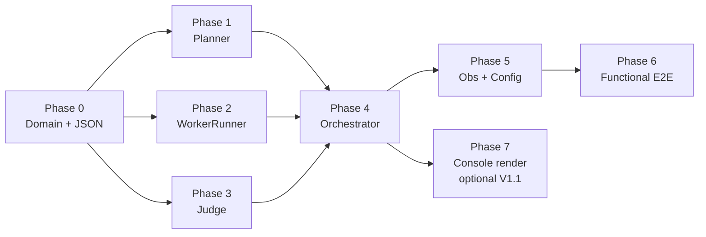

# Planner-Worker-Judge — Task Breakdown

> Board-ready decomposition of the PWJ feature (AAT-26). Derived from the §9 TDD plan in
> [Planner-Worker-Judge - Implementation Guide](Planner-Worker-Judge%20-%20Implementation%20Guide.md);
> read that first for the code anchors and the §0 traps. Every implementation task is **preceded by its
> test task** (red → green → refactor). Tasks are ordered so each is unblocked when you reach it.
>
> **Sizing:** S ≈ ≤½ day · M ≈ ~1 day · L ≈ ~2 days. **Type:** `test` / `impl` / `chore`.
> Check boxes as you land them.

## Critical path (at a glance)

Phases 1, 2, 3 are **independent** once Phase 0 lands — parallelize across developers if you have them.
Phase 4 is the join point and the riskiest task. Phase 2 (WorkerRunner extraction) is the lowest-risk
and a good warm-up; do it early to de-risk the `subagent_tool` refactor.

---

## Phase 0 — Domain model & contracts  *(blocks everything)*

- [ ] **PWJ-0.1 `test`** (S) — Round-trip `Plan`, `PlanStep`, `StepResult`, `Verdict` and the five new
  `AgentEvent` subtypes through `System.Text.Json` using a source-gen `PlanJsonContext`. Assert **no
  reflection fallback** (AOT/trim-safe).
- [ ] **PWJ-0.2 `impl`** (S) — Add records (Impl Guide §4) under `src/Harness/Agency.Harness/Hierarchy/`
  + `PlanJsonContext` / `VerdictJsonContext`. Build warning-free (`TreatWarningsAsErrors`).
  *Note:* there is **no** existing parser to reuse (`AgentJsonContext` is dictionary-only). Build fresh.
- [ ] **PWJ-0.3 `chore`** (S) — Create the `Hierarchy/` folder + test folder; confirm
  `InternalsVisibleTo("Agency.Harness.Test")` already covers them (it does). Decide public vs internal
  surface per Impl Guide §1.

## Phase 1 — Planner  *(needs P0)*

- [ ] **PWJ-1.1 `test`** (S) — Valid JSON plan → N steps in order, `ParallelGroup` preserved.
- [ ] **PWJ-1.2 `test`** (S) — Malformed JSON → exactly **one** re-prompt, then surfaces parse failure.
- [ ] **PWJ-1.3 `test`** (S) — Trivial-objective response sets `Plan.IsTrivial = true`.
- [ ] **PWJ-1.4 `test`** (S) — `PlannerPromptBuilder.Build` (pure fn) includes the tool catalogue from
  `ToolContext.Registry.ListDefinitions()`.
- [ ] **PWJ-1.5 `impl`** (M) — `IPlanner` / `Planner` (+ `RevisePlanAsync`) + `PlannerPromptBuilder`.
  One strong-tier call, **`Tools = null`**, `MaxSteps` cap.

## Phase 2 — Worker runner (extract from `AgentTool`)  *(needs P0; lowest risk — do early)*

- [ ] **PWJ-2.1 `test`** (S) — `WorkerRunner.RunStepAsync` collapses a `ChatSession` event stream into
  a `StepResult` with correct `Status` + `Output`.
- [ ] **PWJ-2.2 `test`** (S) — Failed/truncated worker run → `StepResult.Status = Error` (no throw).
- [ ] **PWJ-2.3 `test`** (S) — **Regression:** `subagent_tool` (refactored `AgentTool`) still passes its
  existing tests after delegating to `WorkerRunner` — including the permission **auto-deny/resume** loop.
- [ ] **PWJ-2.4 `impl`** (M) — Extract `AgentTool.InvokeAsync` body (`AgentTool.cs:45-120`) into
  `WorkerRunner`; repoint `AgentTool` at it. One delegation code path.

## Phase 3 — Judge  *(needs P0)*

- [ ] **PWJ-3.1 `test`** (S) — Valid `Accept` verdict parsed from `FakeChatClient`.
- [ ] **PWJ-3.2 `test`** (S) — `Revise` verdict carries `Feedback` + optional `TargetStepId`.
- [ ] **PWJ-3.3 `test`** (S) — Unparseable verdict → treated as `Revise` once.
- [ ] **PWJ-3.4 `test`** (S) — Gate adapter maps `Accept→Allow`, `Revise/Escalate→Deny` as a
  `PreToolUseDecision`.
- [ ] **PWJ-3.5 `impl`** (M) — `IJudge` / `Judge` + `JudgePromptBuilder` + `JudgeGateAdapter`.
  Warn when `JudgeModel == WorkerModel` (will fire in default local config — expected).

## Phase 4 — Orchestrator  *(needs P1 + P2 + P3 — the join point, highest risk)*

- [ ] **PWJ-4.1 `test`** (M) — Happy path: plan(2 steps)→workers→`Accept`→`Success`; assert event order
  `SessionStarted, PlanCreated, StepDispatched×2, StepCompleted×2, Verdict, AgentResult`.
- [ ] **PWJ-4.2 `test`** (S) — Trivial fast path: single LLM call, **no** judge events.
- [ ] **PWJ-4.3 `test`** (M) — **Termination** (core correctness, Impl Guide §5): judge always `Revise`
  → exits at `MaxRevisions` with `MaxStepsReached`. *Do not skip this one.*
- [ ] **PWJ-4.4 `test`** (M) — Parallel group: two steps in one group dispatched concurrently; results
  aggregated; `SemaphoreSlim(MaxConcurrency)` honored.
- [ ] **PWJ-4.5 `test`** (S) — Budget guard: `TokenBudget` exceeded → `BudgetExceeded` + partial output.
- [ ] **PWJ-4.6 `test`** (S) — Escalation: empty plan → `EscalationEvent` + `Error`.
- [ ] **PWJ-4.7 `test`** (S) — Cancellation mid-run propagates `OperationCanceledException`; prior events
  already emitted.
- [ ] **PWJ-4.8 `impl`** (L) — `PlannerWorkerJudge` orchestrator + new events: fast path, parallel-group
  dispatch, revision budget, synthesis (`PlannerMerge`/`Concatenate`), usage aggregation, terminal status.
  **Must compile with no dependency on `Agency.Harness.Console`** (construct role agents via the
  in-library `IAgentFactory` / `Models.CreateChatClient`).

## Phase 5 — Observability & config  *(needs P4)*

- [ ] **PWJ-5.1 `test`** (S) — Run emits `hierarchy.runs`, `hierarchy.verdicts`, `hierarchy.revisions`
  with expected tags (use a `MeterListener`, as existing telemetry tests do).
- [ ] **PWJ-5.2 `impl`** (M) — Wire `ActivitySource`/`Meter` `Agency.Harness.Hierarchy` (Impl Guide §8,
  mirror `Agent.cs:22-47`); bind `HierarchyOptions` from the `"Hierarchy"` config section +
  `HierarchyOptionsValidator` (fail-fast, like `PermissionsOptionsValidator`).

## Phase 6 — Functional E2E  *(needs P5)*

- [ ] **PWJ-6.1 `test`** (M, `Category=Functional`) — Against LM Studio, a real 3-step objective
  completes with `Success`, `MaxConcurrency=2` honored, total cost recorded. Keep the prompt
  deterministic (pinned clock, fixed ids) for HTTP-cache replay stability in CI.

## Phase 7 — Console integration  *(optional, V1.1 — needs P4)*

- [ ] **PWJ-7.1 `test`** (S) — `Agency.Harness.Console` renders `PlanCreatedEvent` / `VerdictEvent`.
- [ ] **PWJ-7.2 `impl`** (S) — Add render cases for the new event types; resolve the orchestrator with
  the DI-registered `IAgentFactory` (now a library service).

---

## Dependency table

| Task | Type | Size | Depends on |
|---|---|---|---|
| PWJ-0.1 / 0.2 / 0.3 | test/impl/chore | S | — |
| PWJ-1.1–1.4 | test | S | 0.2 |
| PWJ-1.5 | impl | M | 1.1–1.4 |
| PWJ-2.1–2.3 | test | S | 0.2 |
| PWJ-2.4 | impl | M | 2.1–2.3 |
| PWJ-3.1–3.4 | test | S | 0.2 |
| PWJ-3.5 | impl | M | 3.1–3.4 |
| PWJ-4.1–4.7 | test | S–M | 1.5, 2.4, 3.5 |
| PWJ-4.8 | impl | L | 4.1–4.7 |
| PWJ-5.1 | test | S | 4.8 |
| PWJ-5.2 | impl | M | 5.1 |
| PWJ-6.1 | test (func) | M | 5.2 |
| PWJ-7.1 / 7.2 | test/impl | S | 4.8 |

**Rough total:** ~9–12 focused days for one developer (Phases 0–6); Phase 7 adds ~½ day. With two
developers, Phases 1/2/3 parallelize after Phase 0, compressing to ~6–8 days. The long pole is **PWJ-4.8**.

## Definition of Done (gate for closing the epic)

Mirror Impl Guide §10: orchestrator runs plan→execute→verify→revise with a trivial fast path; three
roles independently tiered; bounded + provable termination; typed event stream; OTel parity with `role`
tag; `subagent_tool` unchanged; **zero `Agency.Harness.Console` dependency in the library**; ≥90% line
coverage on orchestration logic; one `Category=Functional` E2E green.
