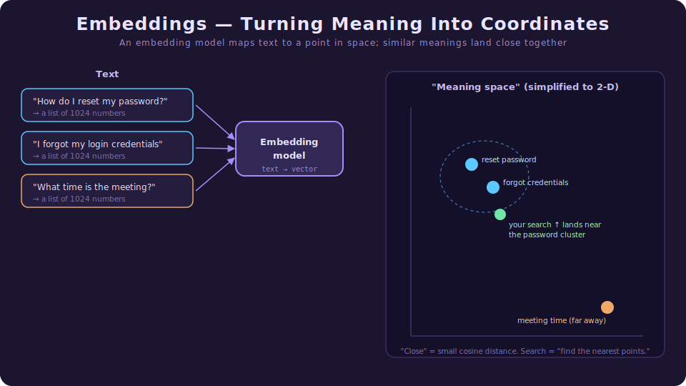
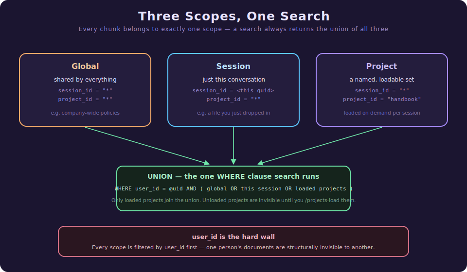
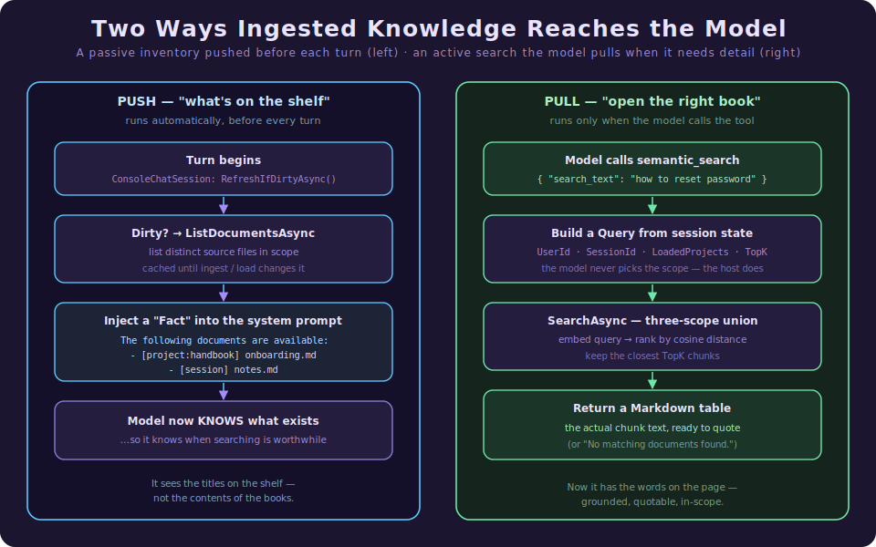
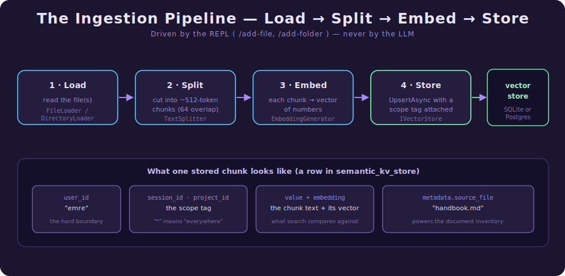
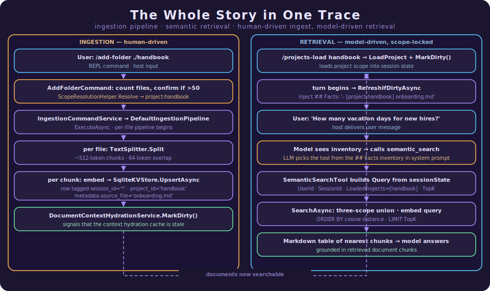

# Projects - Ingestion and Semantic Search for Agents

> **What this document is.** A gentle, self-contained guide to how Agency lets you feed your own
> documents to an AI agent and have the agent find the right passage at the right moment. It is
> written in **two parts**. **Part I** is a code-free tour for engineers who have never built an AI
> feature — plain English, analogies, no symbols. Read it and you will have a complete mental model.
> **Part II** is the implementation deep dive: the same system traced through real C# files, with
> `file:line` references, for when you are about to read or change the code. Stop after Part I for the
> concepts; continue into Part II for the *how*.

For an engineer new to AI development, the first surprise is how *little* a language model actually
knows about *your* world. It has read a large slice of the public internet, but it has never seen your
company handbook, your runbooks, last week's incident notes, or the design doc you wrote this morning.
You cannot fine-tune a new model every time a file changes, and you cannot paste a 400-page manual into
every message. So the practical question becomes:

> "How do I let an agent answer questions about *my* documents, pulling in only the few paragraphs that
> actually matter — and nothing else?"

This document is about Agency's answer to that question. The shape of the answer is a pattern the
industry calls **RAG — Retrieval-Augmented Generation** — but you do not need the jargon to follow
along. We will build the idea up from scratch.

---

# Part I · The Gentle Tour

> **Which part is this?** The code-free introduction. No C#, no file paths — just the ideas and why
> they are shaped the way they are. Ready for the implementation? Skip to
> [Part II](#part-ii--the-implementation-deep-dive).

Agency is an open-source .NET framework for building AI agents. An agent is a program that calls a
language model in a loop, lets it use **tools** (read a file, run a command, search something), and
feeds the results back until the job is done.

This feature adds two abilities to that agent:

1. **Ingestion** — you hand the agent files or folders, and it files them away in a searchable store.
2. **Semantic search** — when the agent needs to answer a question, it can look up the most relevant
   passages from everything you have given it.

## If you only remember five ideas

### 1. The model can't read your files — so we give it a librarian, not a bigger desk

You could try to stuff every document into the prompt. That is the "bigger desk" approach, and it
collapses quickly: it is slow, it is expensive (you pay per word every single message), and past a
point the model gets *worse*, not better, as the prompt fills with noise.

The librarian approach is different. We store your documents in a special kind of search index, and
when a question comes in, we fetch only the handful of paragraphs that are actually relevant. The model
gets a small, sharp set of facts instead of an entire library dumped on its desk.

### 2. "Semantic" search finds meaning, not just matching words

Ordinary search (think Ctrl-F) matches *letters*. If the document says "reset your credentials" and you
search for "forgot my password," plain text search finds nothing — no shared words.

Semantic search matches *meaning*. It knows "reset your credentials" and "forgot my password" are about
the same thing, even with zero words in common. The trick that makes this possible is called an
**embedding**, and it is worth understanding because everything else rests on it.



An **embedding model** is a small AI whose only job is to turn a piece of text into a long list of
numbers — a *vector*. You can picture that vector as **coordinates of a point in space**. The model is
trained so that texts with similar meanings get placed close together, and unrelated texts end up far
apart. "Reset password" and "forgot credentials" become neighbours; "what time is the meeting" sits on
the other side of the room.

Once your text is just points in space, **search becomes geometry**: embed the question into the same
space, then find the nearest stored points. "Nearest" is measured by a number called **cosine
distance** — you do not need the math, just the intuition: *smaller distance = more similar meaning.*

### 3. You load documents; the agent only searches them

There is a deliberate division of labour here, and it is a safety choice as much as a design one.

- **You** (the human, through simple typed commands) decide what gets ingested and how it is organised.
- **The agent** can only *read* what you have stored, through a single search tool. It can never ingest,
  delete, or reorganise documents on its own.

So the model cannot quietly hoover up your entire disk, and it cannot scribble into your knowledge
store. It gets exactly one verb — *search* — and nothing else. (If you have read the memory or
permission documents, this will feel familiar: in Agency, the human and the host own the dangerous
verbs; the model is handed the safe ones.)

### 4. Documents live in "scopes" so the right knowledge shows up at the right time

Not everything should be visible all the time. A snippet you dropped into today's chat shouldn't
suddenly surface in next month's unrelated conversation. So every stored piece of text belongs to one
of three **scopes**:



- **Global** — shared by everything, always available. Good for things that are always true (company
  policies, glossaries).
- **Session** — tied to *this one conversation*. Good for a file you paste in mid-chat that is only
  relevant right now.
- **Project** — a *named* bundle you can **load** and **unload** on demand. Think of a project as a
  labelled box of documents: "the handbook," "the Q3 report." You pull the box off the shelf when you
  need it (`/projects-load handbook`) and put it back when you don't.

Here is the elegant part: **a single search always looks across all three at once** — global, *plus*
your current session, *plus* whichever projects you have loaded. You never have to tell the search
"look in global and also in the handbook box"; it automatically unions everything you currently have
access to. Loading a project is simply the act of adding its box to that union for the rest of the
session.

And underneath all of it sits one unbreakable rule: **everything is partitioned by user first.** Scopes
organise *your own* knowledge; they are not security walls between scopes. The real wall is the user —
one person's documents are structurally invisible to another. Cross-scope reach is a feature;
cross-user reach is impossible.

### 5. The agent is told what exists *before* it has to go looking

A subtle problem: if the agent doesn't know a document exists, it won't think to search for it. So
Agency does something quietly clever. Before every turn, it slips a short note into the agent's
instructions — an *inventory* — that simply lists the titles of the documents currently in scope:

```text
The following documents have been ingested and are available for semantic_search:
- [project:handbook] onboarding.md
- [session] meeting-notes.md
```

This is the difference between a librarian who hands you a catalogue card ("we *have* a book on this")
versus one who silently hopes you'll ask. The agent sees the shelf labels for free on every turn, and
*then* decides whether it's worth pulling a book down and reading it. The listing is cheap; the full
search only happens when the model actually calls for it.



## One example, start to finish

You are chatting with the agent and want it to answer questions using your team handbook.

1. You type `/add-folder ./handbook`. The agent asks for a file pattern (default `*.md`), counts the
   files, asks which scope to file them under — you pick a project named `handbook` — and ingests them.
   Behind the scenes each file is chopped into bite-sized chunks, each chunk is embedded into a vector,
   and each is stored tagged with `project = handbook`.
2. Next time you start a conversation where you want the handbook, you type `/projects-load handbook`.
   That adds the handbook box to your search union for this session.
3. Before your next message even runs, the agent's instructions quietly gain a line:
   `- [project:handbook] onboarding.md` (and so on). The model now *knows* the handbook is on the shelf.
4. You ask: *"How many vacation days do new hires get?"* The model recognises this is a handbook
   question, and calls its `semantic_search` tool with the text of your question.
5. The search embeds your question, finds the three or four closest chunks across global + session +
   the loaded handbook, and hands them back as a small table of text.
6. The model reads those passages and answers — grounded in *your* handbook, quoting *your* policy,
   not a guess from its training data.

You organised the knowledge once. The model pulled exactly what it needed, exactly when it needed it,
and never saw a single document it wasn't supposed to.

## Why this matters

- **Grounded answers.** The agent stops guessing and starts citing *your* sources.
- **Cost and focus.** You pay to send a few relevant paragraphs, not an entire manual — and the model
  stays sharp because its prompt stays clean.
- **The right knowledge at the right time.** Scopes mean a throwaway file in one chat doesn't pollute
  the next, while a loaded project rides along exactly as long as you want it.
- **Safe by construction.** The human curates; the model only reads; users can never see each other's
  data.

In one sentence: **Agency turns an agent from "a model that only knows the public internet" into "a
colleague who has read your documents and can quote the relevant page on demand."**

---

# Part II · The Implementation Deep Dive

> **Which part is this?** The code-anchored companion — real types, `file:line` references, and the
> precise data flow. It is a strict superset of Part I: same system, full depth. Everything Part I
> described in plain English is grounded here in the actual implementation.

If you only remember one architectural sentence from this part, make it this:

> **The data plane (embeddings, chunking, the vector store) already existed as standalone libraries.
> This feature is mostly *wiring*: it bolts those libraries onto the interactive harness, owned by the
> REPL, and exposes exactly one read-only tool to the model.**

### The five design principles (referenced throughout as P1–P5)

The implementation keeps returning to five rules. Worth holding in mind:

- **P1 — The REPL drives writes; the model only reads.** Ingestion and project membership are
  host/human actions. The LLM gets a single read-only `semantic_search` tool and nothing else.
- **P2 — One scope per chunk; every search is a union.** A stored chunk lives in exactly one of
  global / session / project. A read always returns the union of all *accessible* scopes.
- **P3 — `user_id` is the only hard wall.** Scopes are an *organisational* convenience, not a security
  boundary. The single hard partition, enforced in SQL, is the user.
- **P4 — Tell the model what exists before it must ask.** A cheap document *inventory* is pushed into
  the system prompt each turn; the expensive *search* is pulled by the model only when needed.
- **P5 — Opt-in and decoupled.** The whole data plane is gated on one config key (`Embedding:BaseUrl`)
  and is independent of the memory subsystem.

### 6.0 The map: which project does what

The feature spans the vector-store layer, the ingestion layer, and the harness. The split follows the
dependency arrows, so the shared contracts sit at the bottom and depend on nothing.

| Project | Role | Path |
|---|---|---|
| `Agency.VectorStore.Common` | The contracts: `IVectorStore`, `Query`, `SearchHit`, `DocumentInfo`. | `src/VectorStore/Agency.VectorStore.Common` |
| `Agency.VectorStore.Sql.Sqlite` | The default store. JSON-array embeddings, cosine UDF, the three-scope union SQL. | `…/Agency.VectorStore.Sql.Sqlite` |
| `Agency.VectorStore.Sql.Postgres` | The production store. Same contract, pgvector-backed. | `…/Agency.VectorStore.Sql.Postgres` |
| `Agency.Ingestion` | The pipeline: load → split → embed → store. | `src/Ingestion/Agency.Ingestion` |
| `Agency.Ingestion.SemanticKernel` | The chunker (`ITextSplitter`) built on Semantic Kernel's `TextChunker`. | `…/Agency.Ingestion.SemanticKernel` |
| `Agency.Harness` | The host loop. Owns `IProjectSessionState` and the `SemanticSearchTool`. | `src/Harness/Agency.Harness` |
| `Agency.Harness.Console` | The REPL. Owns the `/add-*` and `/projects-*` commands, the services, and the DI wiring. | `src/Harness/Agency.Harness.Console` |

**Why this matters to you as a reader:** when you go looking for "where does a document get stored," you
will not find it in the LLM tool. You will find it in a REPL command that the *human* triggered. The
tool only ever reads.

---

### 6.1 The contracts: how a chunk is addressed

Everything hangs off four small types in `Agency.VectorStore.Common`.

A stored chunk is addressed by a composite key: `(user_id, session_id, project_id, key)`. The two
middle fields are the **scope tag**. The query that reads it back is the `Query` record
(`Query.cs:24`):

```csharp
public record class Query(
    string UserId, string? SessionId, string? Key, string? Value,
    IDictionary<string, object>? MetadataFilter = null,
    int? Limit = 10,
    bool? IncludeMetadataInResults = false,
    IReadOnlyList<string>? ProjectIds = null);   // ← the project dimension
```

`ProjectIds = null` disables the project clause entirely; passing a list of loaded project names
activates it. `Value` is the natural-language search text — it gets embedded and compared. `Limit` is
the *TopK*: how many nearest chunks to return.

The other key type is `DocumentInfo` (`DocumentInfo.cs:3`), a three-field record used only for the
inventory:

```csharp
public record DocumentInfo(string SourceFile, string SessionId, string ProjectId);
```

Both `SessionId` and `ProjectId` carry the **raw stored value**, where the sentinel `"*"` means
"global." Decoding `"*"` into a human label is the hydration service's job (§6.6).

`★ Insight — the sentinel, not null, is the cross-cutting design choice.` The store never uses SQL
`NULL` for "applies everywhere." It uses the literal string `"*"`. The reason is that `NULL` does not
compare equal to `NULL` in SQL, so a row tagged "global" would be invisible to a plain `=` match.
Mapping the absence of a scope to a concrete sentinel (`ResolveSessionId`/`ResolveProjectId`,
`SqliteKVStore.cs:44-45`) lets every clause stay a simple equality test. The whole three-scope union is
readable precisely *because* of this one decision.

---

### 6.2 The write path: ingestion, end to end

This is Part I's "you load documents," made concrete. It is a four-stage pipeline, and crucially it is
invoked by REPL commands, never by the model (**P1**).



**Stage 1–4 live in `DefaultIngestionPipeline.ExecuteAsync`** (`DefaultIngestionPipeline.cs:56`). It
takes a loader, a splitter, a store, and the scope (`userId, sessionId, projectId`), then runs every
document through the chunker and upserts each chunk in parallel (`DefaultIngestionPipeline.cs:77`):

```csharp
var chunks = splitter.Split(document).ToList();
for (int i = 0; i < chunks.Count; i++)
{
    string key = $"{document.SourceId}:chunk:{i}";
    var metadata = BuildChunkMetadata(chunks[i].Metadata, document.SourceId, i);
    await store.UpsertAsync<TValue>(userId, sessionId, key, this._chunkConverter(chunks[i]), metadata, projectId, token);
}
```

Two details deserve a callout:

- **The chunker is meaning-aware, not byte-aware.** `SemanticKernelTextSplitter.Split`
  (`SemanticKernelTextSplitter.cs:38`) checks whether the document is Markdown and routes to
  `SplitMarkdownParagraphs` or `SplitPlainTextParagraphs` accordingly. It cuts on paragraph and line
  boundaries up to a token budget (default 512) with a configurable overlap (default 64). The overlap
  matters: a sentence split across two chunks would otherwise lose its meaning at the seam, so adjacent
  chunks deliberately share a little text.

- **`source_file` is stamped into every chunk's metadata** (`BuildChunkMetadata`,
  `DefaultIngestionPipeline.cs:128`). This single metadata field is what later powers the document
  inventory (§6.6) — the store can answer "what files do I have?" with a `SELECT DISTINCT` over it.

**The store write itself** is `SqliteKVStore.UpsertAsync` (`SqliteKVStore.cs:272`). It serialises the
chunk, asks the embedding generator for its vector, and upserts a row whose conflict target is the full
four-part key:

```sql
INSERT INTO semantic_kv_store (user_id, session_id, project_id, key, value, embedding, metadata)
VALUES (@uid, @sid, @pid, @k, @v, @e, @m)
ON CONFLICT (user_id, session_id, project_id, key) DO UPDATE ...
```

Note `@pid` resolves through `ResolveProjectId(projectId)` (`SqliteKVStore.cs:307`) — so a `null`
project becomes the global sentinel `"*"`. The schema that backs this (`InitializeSchemaAsync`,
`SqliteKVStore.cs:92`) adds `project_id TEXT NOT NULL DEFAULT '*'` to the table and folds it into the
primary key.

> **A known gap worth stating plainly.** `InitializeSchemaAsync` **drops and recreates** the table on
> startup, and re-ingesting a file *appends* new chunks rather than replacing the old ones (there is no
> `DeleteBySourceFile` yet). Both are documented follow-ups, not surprises — see the handoff notes.

---

### 6.3 The read path: the three-scope union

This is the geometric heart of the feature, and it is one SQL statement. `SqliteKVStore.SearchAsync`
(`SqliteKVStore.cs:152`) builds the union dynamically (`SqliteKVStore.cs:191`):

```sql
SELECT user_id, session_id, key, value, metadata,
       vec_distance_cosine(embedding, @qVector) AS distance, updated_on
FROM semantic_kv_store
WHERE user_id = @uid
  AND (
      (session_id = '*' AND project_id = '*')              -- global
   OR (session_id = @sid AND project_id = '*')             -- this session
   OR (session_id = '*' AND project_id IN (@pid0, @pid1))  -- loaded projects
  )
ORDER BY distance ASC
LIMIT @l
```

Read it as the three scopes of Part I, line for line. The project clause is only appended when
`ProjectIds` is non-empty (`SqliteKVStore.cs:177-189`); otherwise it vanishes and project-scoped rows
simply never join the union. Postgres does the same thing with `= ANY(@pids)` over a typed array
instead of a built `IN` list.

The ranking is **pure cosine distance** computed by a SQLite user-defined function,
`vec_distance_cosine` (`SqliteKVStore.cs:71`), registered on every connection. SQLite has no native
vector type here, so embeddings are stored as JSON-array TEXT and the UDF parses and compares them in
process. `ORDER BY distance ASC LIMIT @l` is exactly "find the nearest TopK points."

`★ Insight — `user_id` is the first thing in the WHERE, and that is the whole security model.` The
three scopes are an `OR` *inside* a mandatory `AND user_id = @uid`. There is no code path that searches
across users — the partition is structural, not a filter someone could forget to apply (**P3**). Scopes
let you organise *your own* knowledge; the user clause makes another user's knowledge unreachable by
construction.

#### The breaking change hidden in `null`

Before this feature, `query.SessionId = null` meant "search across *all* sessions." It now resolves to
the global sentinel `"*"` (`SqliteKVStore.cs:175`), i.e. **global-only**. The three-scope union
activates only when you pass an explicit `sessionId`; passing `"*"` collapses the session clause into
the global clause. This is a deliberate semantic change — the store's functional tests were updated to
assert global-only behaviour on `null` and full-union behaviour on a concrete id.

---

### 6.4 The model's single verb: `SemanticSearchTool`

Everything the model can do with ingested knowledge lives in one small class,
`SemanticSearchTool` (`Tools/SemanticSearchTool.cs`), in `Agency.Harness`. Its entire input schema is a
single string:

```csharp
public ToolDefinition Definition =>
    new ToolDefinition(
        "semantic_search",
        "Searches ingested documents using semantic similarity. Searches across all accessible scopes: global, current session, and all loaded projects.",
        InputSchema);   // { "search_text": string }
```

`InvokeAsync` (`SemanticSearchTool.cs:24`) does the minimum: pull `search_text`, build a `Query` from
**session state** (not from anything the model said), search, and format:

```csharp
var query = new Query(
    UserId:     sessionState.UserId,
    SessionId:  sessionState.SessionId,
    Key:        null,
    Value:      searchText,
    Limit:      topK,
    ProjectIds: sessionState.LoadedProjects);

IReadOnlyList<SearchHit<string>> hits = await vectorStore.SearchAsync<string>(query, ct);
return hits.Count == 0
    ? new ToolResult("No matching documents found.")
    : new ToolResult(hits.ToDataset().ToMarkdownTable());
```

`★ Insight — the model chooses the *query*, never the *scope*.` Look at where `UserId`, `SessionId`,
and `ProjectIds` come from: `sessionState`, the host's own state object. The model supplies only the
natural-language `search_text`. It cannot widen its own scope, cannot search another user, cannot reach
an unloaded project — those are all decided by the host before the tool ever runs. This is **P1** at the
type level: the one tool the model holds is read-only *and* scope-locked.

The tool is registered into the agent's tool registry only when a vector store is actually configured
(`Program.cs:347-351`) — no embeddings, no tool, zero overhead (**P5**).

---

### 6.5 Where session identity comes from: `IProjectSessionState`

The tool needs to know *who* the user is and *which* projects are loaded. That state is
`IProjectSessionState` (`IProjectSessionState.cs`), a deliberately tiny interface:

```csharp
public interface IProjectSessionState
{
    string UserId { get; }
    string SessionId { get; }
    IReadOnlyList<string> LoadedProjects { get; }
    void LoadProject(string projectName);
    void UnloadProject(string projectName);
}
```

`★ Insight — this interface lives in `Agency.Harness`, not the Console app, on purpose.` The
`SemanticSearchTool` (in `Agency.Harness`) needs session identity, but it must not reference the
Console application — that would be a dependency cycle. So the *contract* sits in the harness and the
*implementation* sits in Console. This is the same dependency-inversion move the memory subsystem uses
to keep the harness free of references to its consumers.

The implementation, `ProjectSessionState` (`Services/ProjectSessionState.cs`), is a DI **scoped**
service. At construction it resolves the user id from options with an environment fallback, and mints a
stable session id once (`ProjectSessionState.cs:12-13`):

```csharp
this.UserId    = options.Value.UserId ?? System.Environment.UserName;
this.SessionId = Guid.NewGuid().ToString("N");
```

`LoadProject`/`UnloadProject` are case-insensitive list mutations — that single id and that single list
are the entire "what's loaded right now" state the search reads from.

---

### 6.6 The push half: the document inventory (`DocumentContextHydrationService`)

This is **P4** in code — telling the model what exists before it has to ask. The mechanism is a
dirty-flag cache, `DocumentContextHydrationService` (`Services/DocumentContextHydrationService.cs`).

It starts dirty. `RefreshIfDirtyAsync` (`DocumentContextHydrationService.cs:19`) returns the cached
fact string if nothing changed; otherwise it re-queries `ListDocumentsAsync` and rebuilds the string:

```csharp
public async Task<string?> RefreshIfDirtyAsync(CancellationToken ct = default)
{
    if (!this._isDirty) { return this._cachedFact; }
    IReadOnlyList<DocumentInfo> docs = await vectorStore.ListDocumentsAsync(
        sessionState.UserId, sessionState.SessionId, sessionState.LoadedProjects, ct);
    this._isDirty = false;
    if (docs.Count == 0) { this._cachedFact = null; return null; }
    this._cachedFact = BuildFact(docs, sessionState.SessionId);
    return this._cachedFact;
}
```

`BuildFact` (`DocumentContextHydrationService.cs:44`) decodes each `DocumentInfo`'s raw scope tag into a
human label via a switch on the `(SessionId, ProjectId)` pair (`DocumentContextHydrationService.cs:51`):
`("*","*") → global`, the current session id `→ session`, `("*", pid) → project:pid`. The result is the
inventory you saw in Part I.

**The query behind it**, `ListDocumentsAsync` (`SqliteKVStore.cs:404`), runs a `SELECT DISTINCT
json_extract(metadata,'$.source_file'), session_id, project_id` under the *exact same three-scope
WHERE* as `SearchAsync`. That symmetry is the point: the inventory lists precisely the documents a
search could actually return — never a file you can't reach.

**Who flips the dirty bit?** Every command that changes what is in scope calls `MarkDirty()`:
`AddFileCommand` after an ingest (`AddFileCommand.cs:58`), `AddFolderCommand` likewise
(`AddFolderCommand.cs:57`), and `ProjectsCommand` on every load/unload
(`ProjectsCommand.cs:26,58`). Ingest a file or load a project, and the *next* turn's inventory is
rebuilt; otherwise the cached string is reused for free.

**Where it gets injected.** Before every turn, `ConsoleChatSession`
(`ConsoleChatSession.cs:214-223`) resolves the service, refreshes, and pushes any non-null result into
the agent's knowledge:

```csharp
string? fact = await hydration.RefreshIfDirtyAsync(turnCts.Token);
if (fact is not null)
{
    this._chatSession!.SetKnowledge(new KnowledgeContext { Facts = [fact] });
}
```

`SetKnowledge` (`ChatSession.cs:100`) either applies the fact to the live context immediately or queues
it as `_pendingKnowledge` to be applied on the first send (`ChatSession.cs:137`). From there it renders
into the system prompt under `## Facts`, exactly like a memory fact — the model simply reads it.

---

### 6.7 The REPL commands: the human's side of the contract

Five commands make up the entire human interface, registered in the command registry. They are the only
things that *write* (**P1**).

| Command | File | What it does |
|---|---|---|
| `/add-file [path]` | `Commands/AddFileCommand.cs` | Checks for prior ingestion, resolves scope, ingests one file, marks the inventory dirty. |
| `/add-folder [path]` | `Commands/AddFolderCommand.cs` | Prompts for a glob (default `*.md`), counts files, gates ingestion of `>50` files behind a confirm, ingests, marks dirty. |
| `/projects-load [name]` | `Commands/ProjectsCommand.cs` | Adds a project to the session's loaded list; marks dirty. |
| `/projects-unload [name]` | `Commands/ProjectsCommand.cs` | Removes it (with a picker if no name given); marks dirty. |
| `/projects-list` | `Commands/ProjectsCommand.cs` | Renders every project in the store with a loaded/available badge. |

The shared bit of cleverness is **scope resolution**. `ScopeResolutionHelper.Resolve`
(`Commands/ScopeResolutionHelper.cs:8`) decides where an ingest lands. Its ergonomics are worth noting:

```csharp
if (projects.Count == 1)
{
    return (null, projects[0]);   // exactly one project loaded → auto-target it
}
// otherwise show a Spectre.Console picker: Global / Session / Project: <each> / new
```

If you have exactly one project loaded, ingestion silently targets it — the common case needs no
prompt. Otherwise you get a menu: Global, Session, one row per loaded project, or "new name." The
helper returns a `(sessionId?, projectId?)` pair that flows straight into the pipeline's scope
parameters — `("*", "*")` for global, your session id for session, or a project name for project.

`/add-file` also guards against silent duplication: it normalises the path and checks the existing
inventory before ingesting, asking to confirm a re-ingest (`AddFileCommand.cs:31-41`) — a partial
mitigation for the "re-ingest appends" gap noted in §6.2.

---

### 6.8 Turning it on: the DI gate

Like memory, the entire feature is **opt-in behind one config key** (**P5**). In `Program.cs`
(`Program.cs:105`):

```csharp
bool embeddingsConfigured = builder.Configuration["Embedding:BaseUrl"] is not null;
```

If `Embedding:BaseUrl` is absent, no embedding generator, no vector store, no tool — the harness behaves
as if the feature never existed. When it is present, the DI block (`Program.cs:199-232`) registers the
text splitter, the vector store (SQLite or Postgres, chosen from `VectorStore:Provider`), the ingestion
service, and the hydration service. Schema init runs in its own `if (embeddingsConfigured)` block
(`Program.cs:390-402`).

`★ Insight — this gate was deliberately *decoupled* from memory.` An earlier version coupled the vector
store to `Memory:Enabled`. It was split out so you can run ingestion + search **without** the full
memory stack, and vice versa. The session-state service (`IProjectSessionState`) is registered
*outside* the `embeddingsConfigured` block (`Program.cs:197`) because user/session identity is useful
regardless — only the data-plane pieces hide behind the flag.

The minimal config to switch the whole thing on:

```json
{
  "Embedding": { "BaseUrl": "http://your-embedding-server/v1", "ModelId": "your-model", "Dimensions": 1024 },
  "VectorStore": { "Provider": "sqlite" },
  "Ingestion": { "ChunkSize": 512, "ChunkOverlap": 64, "SearchPattern": "*.md" },
  "Retrieval": { "TopK": 5 },
  "ConnectionStrings": { "VectorStoreSqlite": "Data Source=agency-vectorstore.db" }
}
```

---

### 6.9 The whole story in one trace

To tie Part II back to the five principles, here is one document's life cycle through the actual code:



The human curated the knowledge and chose its scope. The model never ingested anything, never widened
its own reach, and saw another user's data at no point. It simply noticed the handbook on the shelf,
asked for the relevant page, and quoted it — exactly the "model that has read your documents" shift this
document opened with.

---

## Final Takeaway

If you want the shortest possible summary, it is this:

> **Agency lets you file your documents into a scoped vector store, and gives the agent one read-only
> search tool over them — so it answers from your sources, pulling only what's relevant, and only what
> it's allowed to see.**

It does that by:

- chunking and embedding documents so search matches *meaning*, not just words,
- tagging every chunk with one of three scopes (global / session / project) and unioning all
  accessible scopes on every read, behind a hard `user_id` partition,
- pushing a cheap *inventory* of available documents into the prompt each turn, while the expensive
  *search* is pulled by the model only when it decides it's worth it,
- and keeping the whole data plane opt-in behind one config key, with the human owning every write and
  the model holding exactly one safe verb.

Or, in one sentence:

**Agency turns an agent from "a model that only knows the public internet" into "a colleague who has
read your documents and can quote the relevant page on demand."**
