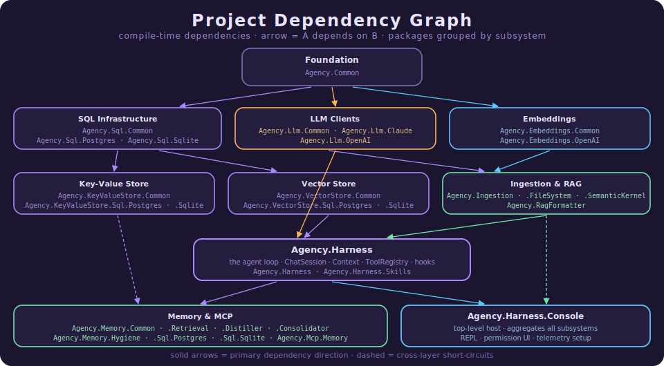

<!-- last-wiki-commit: 523c178d952a45fa36009bf39f0c564845e3097a -->
# Agency — Project Wiki Home
#index #architecture #wiki

This is the index for the per-project wiki pages of the **Agency** solution. Each page documents one
`src/` project: its public API surface, registration, runtime behavior, agent tools, observability, and
cross-project relationships.

> Maintenance note: the comment on line 1 records the commit this wiki was last synced to. The
> `Update-Wiki` workflow reads it to compute which projects changed since the last run.

## Architecture

Each node is a project; each arrow points from a project to a compile-time dependency it references.

## Project Pages

### Foundation
- [[Agency.Common]] — shared primitives and helpers.

### LLM Clients
- [[Agency.Llm.Common]] — the `ILlmClient` contract and shared LLM types.
- [[Agency.Llm.Claude]] — Anthropic Claude client.
- [[Agency.Llm.OpenAI]] — OpenAI-compatible client.

### Embeddings
- [[Agency.Embeddings.Common]] — the `IEmbeddingGenerator` contract.
- [[Agency.Embeddings.OpenAI]] — OpenAI-compatible embedding generator.

### SQL Infrastructure
- [[Agency.Sql.Common]] — shared SQL runner abstractions.
- [[Agency.Sql.Postgres]] — PostgreSQL runner.
- [[Agency.Sql.Sqlite]] — SQLite runner.

### Key-Value Store
- [[Agency.KeyValueStore.Common]] — key-value store contracts.
- [[Agency.KeyValueStore.Sql.Postgres]] — PostgreSQL-backed key-value store.
- [[Agency.KeyValueStore.Sql.Sqlite]] — SQLite-backed key-value store.

### Vector Store
- [[Agency.VectorStore.Common]] — `IVectorStore`, `Query`, `SearchHit`, `DocumentInfo` contracts.
- [[Agency.VectorStore.Sql.Postgres]] — pgvector-backed store with the three-scope union.
- [[Agency.VectorStore.Sql.Sqlite]] — SQLite-backed store with the three-scope union.

### Ingestion
- [[Agency.Ingestion]] — the load → split → store pipeline.
- [[Agency.Ingestion.FileSystem]] — file and directory loaders.
- [[Agency.Ingestion.SemanticKernel]] — Semantic Kernel text splitter.

### RAG
- [[Agency.RagFormatter]] — dataset / Markdown-table formatting for retrieval results.

### Harness
- [[Agency.Harness]] — the agent loop, hooks, permissions, tools (incl. `semantic_search`), and session state.
- [[Agency.Harness.Console]] — the interactive REPL host, ingestion commands, and DI wiring.

### Memory
- [[Agency.Memory.Common]] — memory record contracts and ranking.
- [[Agency.Memory.Retrieval]] — the gated read path.
- [[Agency.Memory.Distiller]] — the background write path and DI wiring.
- [[Agency.Memory.Consolidator]] — the merge/update/delete maintenance sub-agent.
- [[Agency.Memory.Hygiene]] — TTL and low-importance garbage collection.
- [[Agency.Memory.Sql.Postgres]] — PostgreSQL + pgvector memory store.
- [[Agency.Memory.Sql.Sqlite]] — SQLite memory store.

### MCP Servers
- [[Agency.Mcp.Memory]] — MCP server exposing the memory key-value store.
