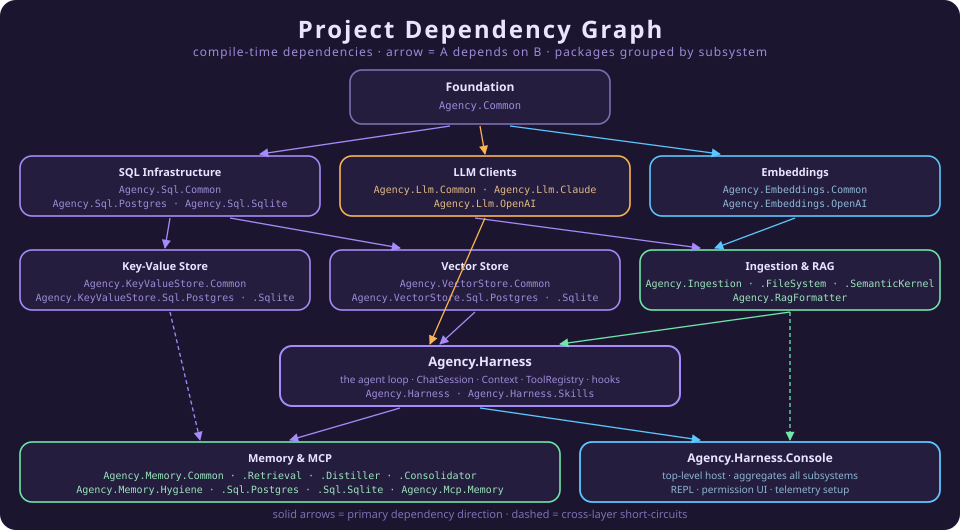

<!-- last-wiki-commit: 523c178d952a45fa36009bf39f0c564845e3097a -->
# Agency — Project Wiki Home

This is the index for the per-project wiki pages of the **Agency** solution. Each page documents one
`src/` project: its public API surface, registration, runtime behavior, agent tools, observability, and
cross-project relationships.

> Maintenance note: the comment on line 1 records the commit this wiki was last synced to. The
> `Update-Wiki` workflow reads it to compute which projects changed since the last run.

## Architecture

Each node is a project; each arrow points from a project to a compile-time dependency it references.

## Project Pages

### Foundation
- [Agency.Common](Agency.Common.md) — shared primitives and helpers.

### LLM Clients
- [Agency.Llm.Common](Agency.Llm.Common.md) — the `ILlmClient` contract and shared LLM types.
- [Agency.Llm.Claude](Agency.Llm.Claude.md) — Anthropic Claude client.
- [Agency.Llm.OpenAI](Agency.Llm.OpenAI.md) — OpenAI-compatible client.

### Embeddings
- [Agency.Embeddings.Common](Agency.Embeddings.Common.md) — the `IEmbeddingGenerator` contract.
- [Agency.Embeddings.OpenAI](Agency.Embeddings.OpenAI.md) — OpenAI-compatible embedding generator.

### SQL Infrastructure
- [Agency.Sql.Common](Agency.Sql.Common.md) — shared SQL runner abstractions.
- [Agency.Sql.Postgres](Agency.Sql.Postgres.md) — PostgreSQL runner.
- [Agency.Sql.Sqlite](Agency.Sql.Sqlite.md) — SQLite runner.

### Key-Value Store
- [Agency.KeyValueStore.Common](Agency.KeyValueStore.Common.md) — key-value store contracts.
- [Agency.KeyValueStore.Sql.Postgres](Agency.KeyValueStore.Sql.Postgres.md) — PostgreSQL-backed key-value store.
- [Agency.KeyValueStore.Sql.Sqlite](Agency.KeyValueStore.Sql.Sqlite.md) — SQLite-backed key-value store.

### Vector Store
- [Agency.VectorStore.Common](Agency.VectorStore.Common.md) — `IVectorStore`, `Query`, `SearchHit`, `DocumentInfo` contracts.
- [Agency.VectorStore.Sql.Postgres](Agency.VectorStore.Sql.Postgres.md) — pgvector-backed store with the three-scope union.
- [Agency.VectorStore.Sql.Sqlite](Agency.VectorStore.Sql.Sqlite.md) — SQLite-backed store with the three-scope union.

### Ingestion
- [Agency.Ingestion](Agency.Ingestion.md) — the load → split → store pipeline.
- [Agency.Ingestion.FileSystem](Agency.Ingestion.FileSystem.md) — file and directory loaders.
- [Agency.Ingestion.SemanticKernel](Agency.Ingestion.SemanticKernel.md) — Semantic Kernel text splitter.

### RAG
- [Agency.RagFormatter](Agency.RagFormatter.md) — dataset / Markdown-table formatting for retrieval results.

### Harness
- [Agency.Harness](Agency.Harness.md) — the agent loop, hooks, permissions, tools (incl. `semantic_search`), and session state.
- [Agency.Harness.Console](Agency.Harness.Console.md) — the interactive REPL host, ingestion commands, and DI wiring.

### Memory
- [Agency.Memory.Common](Agency.Memory.Common.md) — memory record contracts and ranking.
- [Agency.Memory.Retrieval](Agency.Memory.Retrieval.md) — the gated read path.
- [Agency.Memory.Distiller](Agency.Memory.Distiller.md) — the background write path and DI wiring.
- [Agency.Memory.Consolidator](Agency.Memory.Consolidator.md) — the merge/update/delete maintenance sub-agent.
- [Agency.Memory.Hygiene](Agency.Memory.Hygiene.md) — TTL and low-importance garbage collection.
- [Agency.Memory.Sql.Postgres](Agency.Memory.Sql.Postgres.md) — PostgreSQL + pgvector memory store.
- [Agency.Memory.Sql.Sqlite](Agency.Memory.Sql.Sqlite.md) — SQLite memory store.

### MCP Servers
- [Agency.Mcp.Memory](Agency.Mcp.Memory.md) — MCP server exposing the memory key-value store.
