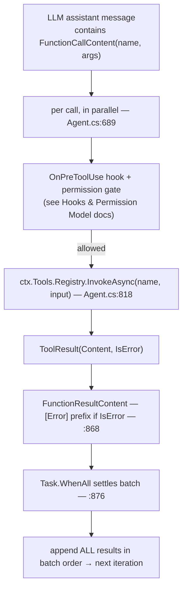
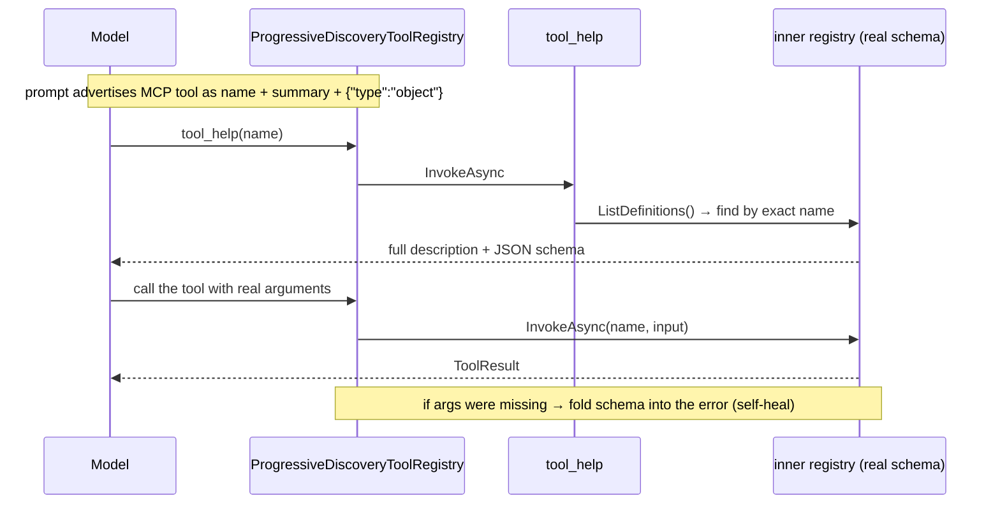

# The Capability Layer: Tools, MCP, and Progressive Disclosure

> **What this document is.** The single, self-contained reference for Agency's *tool* layer — the
> seam where a model's request ("please run this") becomes a real effect on a real machine. It is
> written in **two parts**: **Part I** is a gentle, code-free tour (plain English, analogies, no
> symbols); **Part II** is the implementation deep dive for engineers about to read or change the
> code (real types, `file:line` references, and the design principles behind them). The two cover the
> same system at different depths — read Part I for *what* and *why*, Part II for *how*.
>
> This doc is the close sibling of two others. [Consent at the Tool Boundary](Consent%20at%20the%20Tool%20Boundary%20-%20The%20Permission%20Model.md)
> gates this boundary; this document *is* the boundary. [How the Agent Loop and Context Work Together](How%20the%20Agent%20Loop%20and%20Context%20Work%20Together.md)
> explains `Context`, of which the tool registry (`ctx.Tools`) is one slot. Where those leave off,
> this picks up.

A language model cannot actually *do* anything. It reads text and writes text — and one of the
things it can write is "I would like to call `write_file` with these arguments." It then stops. The
harness around it is what turns that written request into an effect: a file appears on disk, a shell
command runs, an API is called. **Tools are the functions on the harness side of that seam.** This
document is about how Agency defines them, dispatches them, adapts external ones in (MCP), and keeps
their schemas from drowning the model's context (progressive disclosure).

---

# Part I · The Gentle Tour

> **Which part is this?** The code-free introduction. No C#, no file paths — just the ideas and why
> they're shaped the way they are. Ready for the implementation? Skip to
> [Part II](#part-ii--the-implementation-deep-dive).

Agency is an open-source .NET framework for building AI agents. An agent is a program that calls a
language model in a loop, lets it use **tools**, and feeds the results back until the job is done.
The tool layer answers one question, every time the model asks for an action:

> "The model wants to call something named `X` with these arguments. What runs, and what comes back?"

### If you only remember five ideas

**1. A tool is just a name, a schema, and a function.**
Nothing more. A name the model can call, a JSON schema describing the arguments, and a piece of code
that takes those arguments and returns text. Every tool in Agency — reading a file, running
PowerShell, calling a remote API — fits that one shape.

**2. The loop dispatches purely by name.**
When the model says "call `read_file`," the loop looks up `read_file` in a registry and runs it.
That single by-name lookup is the *only* coupling between the model and the actual code. Everything
else that cares about a tool call — the permission gate, audit hooks, metrics, the event stream —
keys off that same name.

**3. MCP servers are just more tools.**
The Model Context Protocol (MCP) is an open standard that lets external programs expose tools. Agency
connects to those servers, asks each one for its tool list, and **wraps every external tool so it
looks exactly like a native one.** Once wrapped, the loop can't tell the difference — an MCP tool and
a built-in tool live in the same registry and dispatch the same way.

**4. Progressive disclosure trades a round-trip for context.**
MCP servers can advertise dozens of tools, each with a large schema. Dumping all of that into every
prompt is expensive. So Agency can **withhold** the heavy schemas: the model sees each tool's *name*
and a one-line summary, and only when it decides to use a tool does it ask for the full schema. Less
context spent, no capability lost.

**5. The loop never changed for any of this.**
MCP support and progressive disclosure are an *adapter* and a *decorator* wrapped around the tool
registry. The core agent loop has no branch for either one. That is the recurring theme of Agency's
design — new capabilities attach at the edges, and the engine stays lean.

### The two add-on layers, in plain terms

Picture the tool registry as a switchboard: the model names a line, the switchboard connects it.

- **MCP is how you plug an *outside* line into that switchboard.** An external server speaks the MCP
  protocol; Agency wraps each of its tools in an adapter so the switchboard sees an ordinary local
  line. Dial it and the call quietly travels out to the server and back.
- **Progressive disclosure is a receptionist standing in front of the switchboard.** Instead of
  handing you a thick binder with every line's full details, the receptionist gives you a one-line
  description of each and says: "Before you dial one, ask me for its full instructions." You ask only
  about the line you actually want.

Both sit *in front of* the registry without changing it — and both are invisible to the model, which
just sees tools it can call.

### One example, start to finish

The model is connected to a Notion MCP server and wants to fetch a page.

- In its prompt it sees a tool advertised with a one-line summary — `Notion | Fetch a page or
  database by id` — and a note: *the full parameters are withheld; ask for them first.*
- The model calls the help tool: "give me the real schema for that Notion tool."
- It gets back the complete parameter schema and now knows exactly which fields to fill.
- It calls the tool for real. Behind the scenes the adapter forwards the call to the Notion server
  over MCP, gets the result, and flattens it to text.
- That text flows back into the conversation as the tool's result, and the loop continues.

The model never knew the tool lived on a remote server, never saw the heavy schema until it needed
it, and called the tool by the same mechanism it uses for `read_file`. That is the whole design in
one trace: **uniform tools, external capability, schemas on demand.**

### Why it matters

- **Reuse.** One tiny contract (name + schema + function) means every capability — local or remote —
  is built and dispatched the same way.
- **Context economy.** Withholding schemas keeps prompts lean, which is faster and cheaper, and
  leaves more room for the actual conversation.
- **An open ecosystem.** Because MCP is a standard, an Agency agent can use any MCP server anyone
  publishes — filesystem access, GitHub, Notion, a database — without bespoke integration code.
- **Extensibility without risk.** New tool sources drop in at the registry edge. The core loop, and
  everything verified about it, stays untouched.

In one sentence: **Agency turns "a flat list of functions" into a uniform, extensible capability
layer — where remote tools look local and heavy schemas appear only when asked for.**

---

# Part II · The Implementation Deep Dive

> **Which part is this?** The code-anchored companion — real types, `file:line` references, and the
> precise contracts. It is a strict superset of Part I: same system, full depth.

## 1. The Core Abstraction

The entire tool contract is four types, and they live **outside** the harness — in the shared
`Agency.Llm.Common` assembly (`src/Llm/Agency.Llm.Common/Tools/ToolTypes.cs`), pulled into the
harness via global usings. That placement is deliberate: the LLM-client layer and the harness both
speak the same tool vocabulary without one depending on the other.

```csharp
// ToolTypes.cs
public sealed record ToolDefinition(string Name, string Description, JsonElement InputSchema);   // :6
public sealed record ToolResult(string Content, bool IsError = false);                            // :12

public interface ITool                                                                            // :15
{
    ToolDefinition Definition { get; }
    ValueTask<ToolDefinition> GetDefinitionAsync(CancellationToken ct = default) => new(this.Definition);
    Task<ToolResult> InvokeAsync(JsonElement input, CancellationToken ct);
}

public interface IToolRegistry { /* register · list · dispatch-by-name · enable/disable */ }       // :32
```

Three things to notice:

- **There are no attributes and no reflection.** A tool is a plain class implementing `ITool`, and it
  carries its own JSON schema as a parsed `JsonElement`. Compare that to SDKs that derive schemas
  from method signatures — Agency keeps the schema explicit and hand-authored, so what the model sees
  is exactly what the author wrote.
- **`GetDefinitionAsync` defaults to the synchronous `Definition`** (`ToolTypes.cs:25`). Most tools
  have a static definition; the async override exists only for tools whose description needs I/O to
  build (e.g. one that lists live options from a store).
- **`InvokeAsync` is the whole runtime contract** — `JsonElement` in, `ToolResult` out. `IsError` on
  the result is a *soft* failure channel: a tool can fail without throwing (an MCP server returning an
  error block, say), and the loop treats that distinctly from an exception (§3).

The registry (`IToolRegistry`, `ToolTypes.cs:32`) is a catalogue plus a by-name dispatcher. Its one
surprising surface is a two-axis enable/disable API — `DisableToolByUser` / `DisabledToolBySystem`
and their `Enable` counterparts — letting a tool be suppressed independently by the user or by the
system. `ListDefinitions()` returns only enabled tools; `ListAllDefinitions()` returns every tool
paired with an `Enabled` flag. This is orthogonal to progressive disclosure (§6) — disabling hides a
tool entirely; disclosure merely withholds its schema.

### 1.1 The default registry

`ToolRegistry` (`src/Harness/Agency.Harness/Tools/ToolRegistry.cs:39`) is the in-memory
implementation: a `Dictionary<string, (ITool, ToolDefinition)>` keyed by tool name. Two details
carry weight:

- **Registration is last-write-wins** (`ToolRegistry.cs:70`): `this._tools[def.Name] = (tool, def)`.
  There is no collision guard. A registered tool whose name matches an existing one silently
  overwrites it — which matters once MCP tools share this namespace (§5).
- **`Register` is synchronous and strict** (`ToolRegistry.cs:61-71`): it calls `GetDefinitionAsync`
  and throws if the result isn't already completed, steering tools that need async definition
  resolution to `RegisterAsync`. The schema is resolved *once*, at registration, and cached.

`ToolRegistry.Empty` (`:41`) is a shared no-op `EmptyToolRegistry` that errors on any invocation — the
default for `ToolContext.Empty`, so an agent with no tools wired is well-defined rather than null.

## 2. The Bridge to the SDK

Agency talks to models through `Microsoft.Extensions.AI`, which has its own tool type. The harness
converts each `ToolDefinition` into an `AIFunctionDeclaration` at the top of every iteration
(`src/Harness/Agency.Harness/Tools/ToolDefinitionFunction.cs`):

```csharp
internal static AIFunctionDeclaration Create(ToolDefinition def) =>
    AIFunctionFactory.CreateDeclaration(def.Name, def.Description, def.InputSchema, null);   // :11
```

The fourth argument — the invocation callback — is `null` **on purpose**. The declaration is
*advertised* to the model but is **non-invocable**: the SDK will never call back into it.

`★ Insight — the SDK advertises; the harness invokes.` By making the declaration non-invocable,
Agency keeps tool execution entirely in its own hands. The SDK's job ends at "tell the model these
tools exist"; the harness owns "actually run the named tool." That split is what lets a *single*
dispatch point govern permissions, hooks, metrics, and the event stream — none of which the SDK's
auto-invocation path would route through.

## 3. Dispatch in the Loop

Inside `RunIterationsAsync` (`src/Harness/Agency.Harness/Agent.cs`), one iteration advertises tools,
calls the model, then runs whatever it asked for:

```csharp
options.Tools = toolDefs                                          // :592
    .Select(static t => (AITool)ToolDefinitionFunction.Create(t))
    .ToList();
// ... LLM call ...
var toolCalls = lastAssistant.Contents.OfType<FunctionCallContent>().ToList();   // :668
```

The requested calls run **in parallel** — `toolCalls.Select(async (call, index) => …)` over a
pre-sized result array, joined by `Task.WhenAll` (`Agent.cs:689`, `:876`). Each task passes through
the `OnPreToolUse` hook and the permission gate (both covered in their own docs) and then reaches the
one and only dispatch point:

```csharp
result = await ctx.Tools.Registry.InvokeAsync(call.Name, input, ct);   // :818
```

Everything downstream keys off `call.Name`: the `agent.tool.invoke` activity (`:811`), the
`agent.tool.calls` counter tagged with `agent.tool.name` (`:843`), and the `ToolInvokedEvent`
yielded to the host (`:873`). The result becomes a `FunctionResultContent` — prefixed `[Error]` when
`IsError` (`:868-870`) — and is appended to the conversation **all-or-nothing, in batch order**, once
the whole batch settles. (That ordering invariant is what makes permission *parking* safe; the full
argument lives in [Consent at the Tool Boundary §6.2](Consent%20at%20the%20Tool%20Boundary%20-%20The%20Permission%20Model.md).)

Two failure channels converge here: a tool that *throws* is caught and turned into
`ToolResult($"Tool error: {ex.Message}", IsError: true)` (`Agent.cs:840`), while a tool that returns
`IsError` without throwing is logged but passed through (`:824-829`). Both reach the model as an error
result, so it can replan rather than crash.



## 4. The Built-in Tools

The Console host registers the native tool set in its `ToolContext` factory
(`src/Harness/Agency.Harness.Console/Program.cs:248-274`). They are listed here for reference; the
*system* around them is the subject of this doc, not each tool's internals.

| Tool name (exact string) | Type | Shown to the model | Key parameters |
|---|---|---|---|
| `execute_powershell` | `ExecutePowershellTool` | Runs a PowerShell command in a fresh runspace; formats multi-object output as Markdown tables | `command` |
| `read_file` | `ReadFileTool` | Reads and returns a file's contents | `path` |
| `write_file` | `WriteFileTool` | Writes content to a file | `path`, `content` |
| `subagent_tool` | `AgentTool` | Delegates a focused task to a child agent with its own registry; the child auto-denies any permission request | `prompt`, `clientName`, `model` |
| `skill` | `SkillTool` (internal) | Invokes a skill by name, loading its rendered instructions into the conversation | `name`, `arguments` |
| `tool_help` | `ToolHelpTool` (internal) | Added only under progressive discovery; reveals a named tool's full schema (§6) | `name` |
| *(per server)* | `McpProxyTool` (internal) | One per tool per connected MCP server; name and schema come from the server (§5) | varies |

Note the input-key convention: the file tools use `path`, not `file_path` — the same fact the
permission model's key-extraction relies on.

## 5. MCP Integration

[MCP](https://modelcontextprotocol.io) is an open protocol for exposing tools from an external
process. Agency's support is three small pieces plus host wiring.

### 5.1 Configuration

The harness reads MCP servers from the `Mcp` section of `appsettings.json`, bound to `McpClientOptions`
(`src/Harness/Agency.Harness/Tools/McpClientOptions.cs`). Each server declares a transport and the
details for it:

```json
"Mcp": {
  "Servers": [
    { "Name": "memory", "Transport": "Stdio", "Command": "dotnet",
      "Arguments": [ "${RepoRoot}/src/Mcp/Agency.Mcp.Memory/bin/${Configuration}/net10.0/Agency.Mcp.Memory.dll" ],
      "EnvironmentVariables": { "Memory__Provider": "sqlite", "Memory__ConnectionString": "Data Source=agency-mcp-memory.db" } },
    { "Name": "notion", "Transport": "Stdio", "Command": "npx",
      "Arguments": [ "-y", "@notionhq/notion-mcp-server" ] }
  ]
}
```

Two transports exist (`McpTransportKind`): **`Stdio`** (spawn a local process, talk over its stdin/
stdout) and **`Http`** (the SDK's streamable-HTTP transport, pointed at a `Url`). There is no
separate SSE transport.

### 5.2 Connecting and adapting

`McpClientPool.CreateAsync` (`src/Harness/Agency.Harness/Tools/McpClientPool.cs:39`) loops over the
configured servers; for each it builds a transport (`CreateTransport`, `:65`), connects an
`McpClient`, calls `ListToolsAsync`, and wraps every discovered tool:

```csharp
foreach (McpClientTool tool in serverTools)
{
    tools.Add(new McpProxyTool(tool));   // McpClientPool.cs:55
    names.Add(tool.Name);
}
```

The wrapper, `McpProxyTool` (`src/Harness/Agency.Harness/Tools/McpProxyTool.cs`), is the adapter that
makes a remote tool indistinguishable from a local one. Its definition takes the server-provided
name, description, and schema verbatim (`:19-22`), and `InvokeAsync` forwards the call and flattens
the reply to text:

```csharp
public async Task<ToolResult> InvokeAsync(JsonElement input, CancellationToken ct)   // :27
{
    var args = JsonSerializer.Deserialize<Dictionary<string, object?>>(input) ?? [];
    CallToolResult result = await this._mcpTool.CallAsync(args, cancellationToken: ct);
    string content = string.Concat(result.Content.OfType<TextContentBlock>().Select(c => c.Text));
    return new ToolResult(content, result.IsError is true);
}
```

`McpProxyTool` keeps only **text** content blocks — image and embedded-resource blocks from the
server are dropped. The pool itself is `IAsyncDisposable` (`:87`) and closes every `McpClient` on
disposal; hosts should `await using` it.

### 5.3 Portable paths, and the Test skip

Committed config can't hard-code absolute paths, so server `Command`/`Arguments`/`EnvironmentVariables`
may contain `${RepoRoot}` and `${Configuration}` tokens. `McpConfigResolver`
(`src/Harness/Agency.Harness.Console/McpConfigResolver.cs`) expands them at startup — `FindRepoRoot`
walks up to the `.git` directory, `ResolveConfiguration` derives `Debug`/`Release` from the bin path —
so the same `appsettings.json` works across machines, drives, and build configs.

MCP is also **skipped entirely under the `Test` environment** (`Program.cs:176-178`):

```csharp
McpClientOptions? mcpOptions = builder.Environment.IsEnvironment("Test")
    ? null
    : builder.Configuration.GetSection("Mcp").Get<McpClientOptions>();
```

The reason is the same guard the deterministic clock uses: MCP servers are external processes absent
in CI, and their discovered tools would change the LLM request body — breaking the offline
HTTP-cache replay the functional tests depend on. Startup is otherwise fail-fast: an unreachable
configured server throws (`Program.cs:193-197`).

### 5.4 One flat namespace — two honest nuances

In the Console's tool factory, every MCP tool is registered into the *same* `ToolRegistry` as the
native tools, and its name is collected into a set for later (`Program.cs:276-285`):

```csharp
foreach (ITool tool in mcpPool.Tools)
{
    inner.Register(tool);
    mcpToolNames.Add(tool.Definition.Name);
}
```

Two facts here are easy to get wrong:

- **The harness does *not* mint `mcp__server__tool` names.** `McpProxyTool` uses the server's raw
  tool name (`memorize`, `recall`, `API-get-self`, …). The `mcp__…` convention you see in permission
  rules and hook matchers is a string pattern *those* layers understand — it is not generated by the
  MCP adapter.
- **MCP and native tools share one flat, last-write-wins namespace.** Because `ToolRegistry.Register`
  overwrites by name (§1.1) with no collision guard, a server-supplied `read_file` would silently
  replace the built-in one. Name MCP servers' tools defensively.

## 6. Progressive Disclosure

MCP servers can expose many tools with large schemas; rendered into every prompt, that is a lot of
tokens spent before the model has done anything. Progressive disclosure withholds the heavy detail
until the model asks. It is opt-in via `AgentOptions.ProgressiveDiscovery` (the Console sets it
`true` in `appsettings.json`), and it is implemented as a **decorator** around the registry — the
loop is untouched.

### 6.1 The decorator

`ProgressiveDiscoveryToolRegistry` (`src/Harness/Agency.Harness/Tools/ProgressiveDiscoveryToolRegistry.cs`)
wraps an inner `IToolRegistry` and is constructed with the set of MCP tool names. Disclosure is
**by origin** — only MCP tools are withheld; native tools are revealed in full so the model can call
them with no round-trip:

```csharp
public IReadOnlyList<ToolDefinition> ListDefinitions()                 // :40
{
    foreach (ToolDefinition def in this._inner.ListDefinitions())
    {
        if (this._mcpToolNames.Contains(def.Name))                     // MCP → withhold
            result.Add(def with {
                Description = AppendToolHelpDirective(Summarize(def.Description), def.Name),
                InputSchema = EmptyObjectSchema });                    // {"type":"object"}
        else
            result.Add(def);                                           // native → full
    }
    result.Add(this._help.Definition);                                 // inject tool_help
    return result;
}
```

A withheld tool keeps its name but loses its schema (replaced by the bare `{"type":"object"}`
placeholder) and its description is reduced to one line. Two prompts steer the model to recover the
rest:

- A **global** system-prompt directive, emitted whenever the registry implements the
  `IProgressiveDiscovery` marker (`SystemPromptBuilder.cs:30-34`): *"a tool advertised with only a
  `{"type":"object"}` schema is a deferred tool. Always call `tool_help(name)` … before invoking
  it."*
- A **per-tool** inline directive appended to each withheld summary (`AppendToolHelpDirective`,
  `:94`): `[Schema withheld] Call tool_help(name: "<name>") … Do not call it with empty or guessed
  arguments.` The repetition is deliberate — a single global instruction is easy for a weaker model
  to overlook.

`Summarize` (`:76`) keeps the *first non-empty line* of the description — including any leading
`Vendor |` prefix. That prefix is preserved on purpose: for MCP tools whose names are
operationId-derived (`API-get-self`) and carry no server signal, the prefix is the model's only
inline cue to which server a tool belongs.

### 6.2 `tool_help` — the escape hatch

`ToolHelpTool` (`src/Harness/Agency.Harness/Tools/ToolHelpTool.cs`) is the meta-tool that turns a
name back into a full schema. It takes `{ name }` and looks it up against the **undecorated inner**
registry (`:47`), so it always sees the real schema even though the catalog hid it:

```csharp
string schemaJson = JsonSerializer.Serialize(found.InputSchema, new JsonSerializerOptions { WriteIndented = true });
return Task.FromResult(new ToolResult($"{found.Description}\n\n{schemaJson}", IsError: false));   // :66-68
```

It is an **exact-name lookup**, not a search — there is no query-ranked tool discovery in the
codebase. The model picks a tool from the always-visible name and one-line summary, then asks for its
schema by exact name.

### 6.3 Self-healing dispatch

The decorator's `InvokeAsync` does two things: it routes `tool_help` to the help tool, and it
**self-heals** a call that arrives with missing arguments — the classic symptom of the model invoking
a withheld tool without first reading its schema:

```csharp
ToolResult result = await this._inner.InvokeAsync(name, input, ct);                 // :105
if (result.IsError && this.MissingRequiredArguments(name, input))                   // :113
{
    ToolResult help = await this._help.InvokeAsync(JsonSerializer.SerializeToElement(new { name }), ct);
    if (!help.IsError)
        return result with { Content = $"{result.Content}\n\n{help.Content}" };     // fold schema into error
}
return result;
```

`MissingRequiredArguments` (`:131`) reads the real schema's `required` array and checks each key is
present and non-empty. When the shape is wrong, the full schema is folded straight into the error
result, so the model's next retry has what it needs **without a separate `tool_help` round-trip**. A
genuine runtime error on a well-formed call (file-not-found, say) is left untouched.



`★ Insight — a decorator, not an Agent change.` `ProgressiveDiscoveryToolRegistry` overrides only the
two members the loop actually touches — `ListDefinitions()` and `InvokeAsync` — and delegates the
rest. Because the loop calls nothing else, the feature drops in via the `ToolContext` registry with
**zero** loop changes (`Program.cs:289-291` chooses the decorator or the bare registry on the
`ProgressiveDiscovery` flag). And because every real tool keeps its own name as the dispatch key,
permissions, hooks, the `agent.tool.calls` metric, and `ToolInvokedEvent` are all unaffected — a
generic "proxy" dispatcher would have masked the real name and broken all four.

## 7. Accuracy Footnotes

A few precise points worth stating so the reference is honest:

- **The core types live in `Agency.Llm.Common`, not the harness.** `ITool`, `IToolRegistry`,
  `ToolDefinition`, and `ToolResult` are shared via global usings; everything that *consumes and
  extends* them is in `Agency.Harness`.
- **`.mcp.json` at the repo root is not read by solution code.** It is the host harness's own
  (Claude-Code-style) config. The harness's native MCP support is driven solely by the `Mcp` section
  of `appsettings.json`.
- **There is no tool *search*.** `tool_help` is an exact-name lookup. Query-to-tool ranking does not
  exist in this codebase.
- **Enable/disable is orthogonal to disclosure.** `IToolRegistry`'s two-axis enable/disable surface
  hides a tool *entirely* (it drops out of `ListDefinitions`), whereas progressive disclosure keeps
  the tool callable and only withholds its schema.
- **No `mcp__server__tool` prefixing happens in the adapter** (§5.4); the `mcp__` convention lives in
  the permission/hook matcher layer.

---

## Final Takeaway

If you want the shortest possible summary:

> A tool in Agency is a name, a JSON schema, and an `InvokeAsync`. The loop advertises them to the
> model and dispatches by name through one registry. MCP tools are *adapted into* that registry so
> remote capability looks local; progressive disclosure *decorates* the registry so heavy schemas
> appear only when the model asks. Both attach at the registry edge, so `Agent.cs` never changed —
> and because every tool keeps its real name, permissions, hooks, metrics, and events all keep
> working.

Or, in one sentence:

**Agency turns a flat list of functions into a uniform capability layer — where remote tools look
local, schemas arrive on demand, and the core loop stays untouched.**
